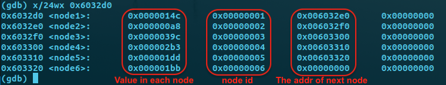

# Bomb Lab Report:

In this lab, we are required to defuse the bomb hide in the program. We need to use the disassemble way to find the bombs.

As the hint from the writeup, I firstly use gdb tool to print out the assemble code and figure out the position of bomb. Then use gdb tool to print the 'suspicious value'
to find out the key word to avoid the bomb

## Phase 1:
Bascally, this function is to compare input string with a keyword string, if the string is the keyword, do nothing. 

Explode the bomb otherwise.

**Thus, what we do is to find the key word and use it as the input string to aviod the bomb**

In this assemble code, we can see that `400ee4 <+4>: mov    $0x402400,%esi` is the one of the arguement that pass into the string compare function.

That must be the keyword, because the other arguement is the input string. Therefore, we just need to print the value the of 0x402400 to find out the key word string.

``` asm
(gdb) disas phase_1
Dump of assembler code for function phase_1:
   0x0000000000400ee0 <+0>:	sub    $0x8,%rsp  ; push the space for stack (decrease the stack pointer)
   0x0000000000400ee4 <+4>:	mov    $0x402400,%esi  ; pass the value to the temperate variable
   0x0000000000400ee9 <+9>:	callq  0x401338 <strings_not_equal> ; call the string compare function
   0x0000000000400eee <+14>:	test   %eax,%eax ; get the return value from strings_not_equal function
   0x0000000000400ef0 <+16>:	je     0x400ef7 <phase_1+23> ;  if the return value is one(same string), go to 0x400ef7
   0x0000000000400ef2 <+18>:	callq  0x40143a <explode_bomb>  ;  if the string is not same, explode the bomb
   0x0000000000400ef7 <+23>:	add    $0x8,%rsp ; pop the space for stack (increase the stack pointer)
   0x0000000000400efb <+27>:	retq   ;  return the value
End of assembler dump.
```

### The follow assembling code is from the function of `strings_not_equal`

Basically, this function firstly compare the string length between two strings(one in the %rbx, the other in the %rbp);
If the length is not equal, return false and function end.

Otherwise, compare character by character in a loop; if all the same, return true(1); return false(0) otherwise

```asm
(gdb) disas 0x401338
Dump of assembler code for function strings_not_equal:
   0x0000000000401338 <+0>:	push   %r12 ; push the current callee tempare variable
   0x000000000040133a <+2>:	push   %rbp ; %r12, %rbp, %rbx to the stack
   0x000000000040133b <+3>:	push   %rbx ; for keeping the old value
   0x000000000040133c <+4>:	mov    %rdi,%rbx ; record the pass variable 1 to the %rbx
   0x000000000040133f <+7>:	mov    %rsi,%rbp ; record the pass variable 2 to the %rbx
   0x0000000000401342 <+10>:	callq  0x40131b <string_length> ; call string_length function to get the string length(I guess)
   0x0000000000401347 <+15>:	mov    %eax,%r12d ; record the return value in the %r12: string 1
   0x000000000040134a <+18>:	mov    %rbp,%rdi
   0x000000000040134d <+21>:	callq  0x40131b <string_length> ; string 2
   0x0000000000401352 <+26>:	mov    $0x1,%edx ; %edx = 0x1
   0x0000000000401357 <+31>:	cmp    %eax,%r12d ; Compare the length with string 1 and string 2
   0x000000000040135a <+34>:	jne    0x40139b <strings_not_equal+99> ; length not equal, return
   0x000000000040135c <+36>:	movzbl (%rbx),%eax
   0x000000000040135f <+39>:	test   %al,%al ; a loop to compare string character by character
   0x0000000000401361 <+41>:	je     0x401388 <strings_not_equal+80> ; if condition
   0x0000000000401363 <+43>:	cmp    0x0(%rbp),%al # check whether %al is zero
   0x0000000000401366 <+46>:	je     0x401372 <strings_not_equal+58> ; yes jump to 0x401372
   0x0000000000401368 <+48>:	jmp    0x40138f <strings_not_equal+87> ; jump to 0x40138f other wise
   0x000000000040136a <+50>:	cmp    0x0(%rbp),%al ; Loop begin
   0x000000000040136d <+53>:	nopl   (%rax)
   0x0000000000401370 <+56>:	jne    0x401396 <strings_not_equal+94>
   0x0000000000401372 <+58>:	add    $0x1,%rbx ; variable 1++
   0x0000000000401376 <+62>:	add    $0x1,%rbp ; variable 2++
   0x000000000040137a <+66>:	movzbl (%rbx),%eax
   0x000000000040137d <+69>:	test   %al,%al
   0x000000000040137f <+71>:	jne    0x40136a <strings_not_equal+50> ; Back to loop if not equal
   0x0000000000401381 <+73>:	mov    $0x0,%edx
   0x0000000000401386 <+78>:	jmp    0x40139b <strings_not_equal+99>
   0x0000000000401388 <+80>:	mov    $0x0,%edx
   0x000000000040138d <+85>:	jmp    0x40139b <strings_not_equal+99>
   0x000000000040138f <+87>:	mov    $0x1,%edx
   0x0000000000401394 <+92>:	jmp    0x40139b <strings_not_equal+99>
   0x0000000000401396 <+94>:	mov    $0x1,%edx
   0x000000000040139b <+99>:	mov    %edx,%eax
   0x000000000040139d <+101>:	pop    %rbx ; get the % rbx
   0x000000000040139e <+102>:	pop    %rbp
   0x000000000040139f <+103>:	pop    %r12
   0x00000000004013a1 <+105>:	retq   ; return
End of assembler dump.
```
### We get the key string and use it as the input string to avoid bomb

```bash
(gdb) x/s 0x402400
0x402400:	"Border relations with Canada have never been better."
```

## Phase_2 :

Next, we move on the `Phase_2`: just like what we did in the phase 1, we first set the break point to the function of phase_2 and disassemble it.

```asm
(gdb) disas phase_2
Dump of assembler code for function phase_2:
   0x0000000000400efc <+0>:	push   %rbp
   0x0000000000400efd <+1>:	push   %rbx
   0x0000000000400efe <+2>:	sub    $0x28,%rsp
   0x0000000000400f02 <+6>:	mov    %rsp,%rsi
   0x0000000000400f05 <+9>:	callq  0x40145c <read_six_numbers> ; we guess the input number is six digits numbers
   0x0000000000400f0a <+14>:	cmpl   $0x1,(%rsp) ; compare *%rsp with 1
   0x0000000000400f0e <+18>:	je     0x400f30 <phase_2+52>
   0x0000000000400f10 <+20>:	callq  0x40143a <explode_bomb> ; trigger the bomb if not equal with one
   0x0000000000400f15 <+25>:	jmp    0x400f30 <phase_2+52>
   0x0000000000400f17 <+27>:	mov    -0x4(%rbx),%eax ;  start a loop
   0x0000000000400f1a <+30>:	add    %eax,%eax ; eax *=2
   0x0000000000400f1c <+32>:	cmp    %eax,(%rbx)
   0x0000000000400f1e <+34>:	je     0x400f25 <phase_2+41>
   0x0000000000400f20 <+36>:	callq  0x40143a <explode_bomb>
   0x0000000000400f25 <+41>:	add    $0x4,%rbx ; move to next input digit
   0x0000000000400f29 <+45>:	cmp    %rbp,%rbx ; check whether is jump out of the loop
   0x0000000000400f2c <+48>:	jne    0x400f17 <phase_2+27>
   0x0000000000400f2e <+50>:	jmp    0x400f3c <phase_2+64>
   0x0000000000400f30 <+52>:	lea    0x4(%rsp),%rbx ; move to the next input digit and save it to %rbx
   0x0000000000400f35 <+57>:	lea    0x18(%rsp),%rbp
   0x0000000000400f3a <+62>:	jmp    0x400f17 <phase_2+27> ; back to loop begin
   0x0000000000400f3c <+64>:	add    $0x28,%rsp
   0x0000000000400f40 <+68>:	pop    %rbx
   0x0000000000400f41 <+69>:	pop    %rbp
   0x0000000000400f42 <+70>:	retq   
End of assembler dump.

```

As we can see in the assemble code, it call a function called `read_six_numbers`(in 0x400f05), and thus we guess we need to input six numbers for this phase. Let's assume `1 2 3 4 5 6` and see what is going on.

```bash
(gdb) r solution.txt
Starting program: /home/mwfj/cmu-15-213-CSAPP3E-lab/2.BombLab/bomb/bomb solution.txt
Welcome to my fiendish little bomb. You have 6 phases with
which to blow yourself up. Have a nice day!
Phase 1 defused. How about the next one?
1 2 3 4 5 6

Breakpoint 1, 0x0000000000400efc in phase_2 ()
```
After calling the `read_six number`, I found that the return number is six, thus I guess this function is to make sure the number digit we input is 6 numbers, where is to check the input validation.

```bash
(gdb) i r rax
rax            0x6	6

```

Then, we find it compare with 1, if it is not equal with one, trigger the bomb. If so, jump to 0x400f30. Because the first input is 1, thus we jump to 0x400f30.
After jump to 0x400f30, we find a interesting instruction `0x0000000000400f1a <+30>: add    %eax,%eax`, where before running this instruction, we find that the value of eax is 1.

```bash
(gdb) i r eax
eax            0x1	1
```

After `0x0000000000400f1a <+30>: add    %eax,%eax` eax double itself compared with rbx, the new input digits. If they are same, skip the bomb, trigger the bomb otherwise.
Thus, our next input is 2, we are temperate safe. Then, the thing we need to to is repeat the stop above and check eax and compare it with *rbx every time

```bash
(gdb) i r
rax            0x4	4
rbx            0x7fffffffde28	140737488346664
rcx            0x0	0
rdx            0x7fffffffde34	140737488346676
rsi            0x0	0
rdi            0x7fffffffd790	140737488344976
rbp            0x7fffffffde38	0x7fffffffde38
rsp            0x7fffffffde20	0x7fffffffde20
r8             0x0	0
r9             0x0	0
r10            0x7ffff7b80c40	140737349422144
r11            0x4025d4	4203988
r12            0x400c90	4197520
r13            0x7fffffffdf40	140737488346944
r14            0x0	0
r15            0x0	0
rip            0x400f1c	0x400f1c <phase_2+32>
eflags         0x202	[ IF ]
cs             0x33	51
ss             0x2b	43
ds             0x0	0
es             0x0	0
fs             0x0	0
gs             0x0	0
(gdb) x/d $rbx
0x7fffffffde28:	3
```

As the gdb show to us, the third input(%rbx) is 3, but the compared value (eax) is 4(2*2), thus it will trigger the bomb. However, we have already discover the input rules, where **the input has six numbers at total, begin as 1, and the next digits is the double as before.**

### Thus the final answer is **1 2 4 8 16 32**

```bash
(gdb) r solution.txt 
Starting program: /home/mwfj/cmu-15-213-CSAPP3E-lab/2.BombLab/bomb/bomb solution.txt
Welcome to my fiendish little bomb. You have 6 phases with
which to blow yourself up. Have a nice day!
Phase 1 defused. How about the next one?
1 2 4 8 16 32
That's number 2.  Keep going!
```

## Phase_3
When we see the assemble code in the phase 3, we can see there has one indirect jump and six direct jumps, we can guess that there must be a switch structure in the code inside.
Also, in the assembly code, not every jump will trigger the bomb. Thus, we can guess that, only default case will trigger the bomb, where **trigger every case except default one will avoid this bomb**.

```asm
(gdb) disas phase_3
Dump of assembler code for function phase_3:
   0x0000000000400f43 <+0>:	sub    $0x18,%rsp
   0x0000000000400f47 <+4>:	lea    0xc(%rsp),%rcx
   0x0000000000400f4c <+9>:	lea    0x8(%rsp),%rdx
   0x0000000000400f51 <+14>:	mov    $0x4025cf,%esi ; the arguement that pass in to sscanf
   0x0000000000400f56 <+19>:	mov    $0x0,%eax
   0x0000000000400f5b <+24>:	callq  0x400bf0 <__isoc99_sscanf@plt> ;  call sscanf
   0x0000000000400f60 <+29>:	cmp    $0x1,%eax ; if the input case less or equal than one, trigger the bomb
   0x0000000000400f63 <+32>:	jg     0x400f6a <phase_3+39>
   0x0000000000400f65 <+34>:	callq  0x40143a <explode_bomb>
   0x0000000000400f6a <+39>:	cmpl   $0x7,0x8(%rsp) ; if the first input number higher or equal then 7, trigger the bomb
   0x0000000000400f6f <+44>:	ja     0x400fad <phase_3+106>
   0x0000000000400f71 <+46>:	mov    0x8(%rsp),%eax ; clear the eax register
   0x0000000000400f75 <+50>:	jmpq   *0x402470(,%rax,8)
   0x0000000000400f7c <+57>:	mov    $0xcf,%eax ; case 0 comparsion value
   0x0000000000400f81 <+62>:	jmp    0x400fbe <phase_3+123>
   0x0000000000400f83 <+64>:	mov    $0x2c3,%eax ; case 2
   0x0000000000400f88 <+69>:	jmp    0x400fbe <phase_3+123> 
   0x0000000000400f8a <+71>:	mov    $0x100,%eax ; case 3
   0x0000000000400f8f <+76>:	jmp    0x400fbe <phase_3+123>
   0x0000000000400f91 <+78>:	mov    $0x185,%eax ; case 4
   0x0000000000400f96 <+83>:	jmp    0x400fbe <phase_3+123>
   0x0000000000400f98 <+85>:	mov    $0xce,%eax ; case 5
   0x0000000000400f9d <+90>:	jmp    0x400fbe <phase_3+123>
   0x0000000000400f9f <+92>:	mov    $0x2aa,%eax ; case 6
   0x0000000000400fa4 <+97>:	jmp    0x400fbe <phase_3+123>
   0x0000000000400fa6 <+99>:	mov    $0x147,%eax
   0x0000000000400fab <+104>:	jmp    0x400fbe <phase_3+123> ; should be the default case
   0x0000000000400fad <+106>:	callq  0x40143a <explode_bomb>
   0x0000000000400fb2 <+111>:	mov    $0x0,%eax
   0x0000000000400fb7 <+116>:	jmp    0x400fbe <phase_3+123>
   0x0000000000400fb9 <+118>:	mov    $0x137,%eax # case 1
   0x0000000000400fbe <+123>:	cmp    0xc(%rsp),%eax ; compare with the number that equal to the number given in each case
   0x0000000000400fc2 <+127>:	je     0x400fc9 <phase_3+134>
   0x0000000000400fc4 <+129>:	callq  0x40143a <explode_bomb> ; if not, trigger the bomb
   0x0000000000400fc9 <+134>:	add    $0x18,%rsp
   0x0000000000400fcd <+138>:	retq   
End of assembler dump.
```
Then, we need to guess the number of input and the type of input. To solve this, we can check the arguement that pass into sscanf, which should be nearest resigester the reveiced the variable(`0x0000000000400f51 <+14>: mov    $0x4025cf,%esi`).

When we print the varible `$0x4025cf` by string, we can see that it is `0x4025cf: "%d %d"`, and thus we know that two digits should be input to the program in this phase. Furthermore, there has another way to guess the number of input, where it is `0x0000000000400f60 <+29>: cmp    $0x1,%eax`, we can know that the number of input should higher than one. 

```bash
(gdb) x/s 0x4025cf
0x4025cf:	"%d %d"
(gdb) i r eax # when run the address at 0x0000000000400f60
eax            0x2	2
```

As the analysis above, we can guess that the **first arguement should be the index to trigger each case(from 0 to 6) and the other arguement is used to do the comparison with key word** in each case.

Then what we need to do is to **check the first indirect jump and calculate the keyword in each case** as the comment show on the assemble code.

```bash
(gdb) p/x *(0x402470+8) # when index = 1 : 311
$7 = 0x400fb9
(gdb) p/d 0x137
$8 = 311
(gdb) p/x *(0x402470+16)  # when index = 2 : 707
$9 = 0x400f83
(gdb) p/d 0x2c3
$10 = 707
(gdb) p/x *(0x402470+24)  # when index = 3 : 256
$11 = 0x400f8a
(gdb) p/d 0x100
$12 = 256
(gdb) p/x *(0x402470+32)  # when index = 4 : 389
$13 = 0x400f91
(gdb) p/d 0x185
$14 = 389
(gdb) p/x *(0x402470+40)  # when index = 5 : 206
$15 = 0x400f98
(gdb) p/d 0xce
$16 = 206
(gdb) p/x *(0x402470+48)  # when index = 6 : 682
$17 = 0x400f9f
(gdb) p/d 0x2aa
$18 = 682
(gdb) p/x *0x402470 # when index = 0 : 207
$19 = 0x400f7c
(gdb) p/d 0xcf
$20 = 207
```

From now, we have already calculate each target address of each case and its relative keyword:

+ 0 207
+ 1 311
+ 2 707 
+ 3 256
+ 4 389
+ 5 206
+ 6 682

### Choose any one of the answers can avoid to trigger the bomb.

## Phase_4

```asm
(gdb) disas phase_4
Dump of assembler code for function phase_4:
   0x000000000040100c <+0>:	sub    $0x18,%rsp
   0x0000000000401010 <+4>:	lea    0xc(%rsp),%rcx
   0x0000000000401015 <+9>:	lea    0x8(%rsp),%rdx
   0x000000000040101a <+14>:	mov    $0x4025cf,%esi ; the input of scanf
   0x000000000040101f <+19>:	mov    $0x0,%eax
   0x0000000000401024 <+24>:	callq  0x400bf0 <__isoc99_sscanf@plt>
   0x0000000000401029 <+29>:	cmp    $0x2,%eax ; the arguement number should be 2
   0x000000000040102c <+32>:	jne    0x401035 <phase_4+41>
   0x000000000040102e <+34>:	cmpl   $0xe,0x8(%rsp)
   0x0000000000401033 <+39>:	jbe    0x40103a <phase_4+46>
   0x0000000000401035 <+41>:	callq  0x40143a <explode_bomb>
   0x000000000040103a <+46>:	mov    $0xe,%edx
   0x000000000040103f <+51>:	mov    $0x0,%esi
   0x0000000000401044 <+56>:	mov    0x8(%rsp),%edi
   0x0000000000401048 <+60>:	callq  0x400fce <func4>
   0x000000000040104d <+65>:	test   %eax,%eax
   0x000000000040104f <+67>:	jne    0x401058 <phase_4+76>; Jump if not zero
   0x0000000000401051 <+69>:	cmpl   $0x0,0xc(%rsp)
   0x0000000000401056 <+74>:	je     0x40105d <phase_4+81>
   0x0000000000401058 <+76>:	callq  0x40143a <explode_bomb>
   0x000000000040105d <+81>:	add    $0x18,%rsp
   0x0000000000401061 <+85>:	retq   
End of assembler dump.
```

Just like what we did above, the first thing is to find out the number of input, where there have two ways to find out it.

One is to print out the input arguement for sscanf: we will found it should be `"%d %d"`

The second way is to check the return variable for sscanf, we can see that in `0x401029 ` and `0x40102c`, where if the input arguement is not 2, the bomb will be triggered

**Thus, the input number should be 2.**

```bash
(gdb) x/s 0x4025cf
0x4025cf:	"%d %d"
(gdb) i r eax
eax            0x2	2
```

Then, we need to check what the arguement should be. In `0x40102e` and `0x401033`, we can see that **the first arguement should be less or equal than 8**; if not, the bomb will be triggered. 
 
 Next, when we see `0x401051`, we can see that **the second arguement should be 0**, otherwise the bomb will be triggered. (Note that, we can print the value in these address to see the `0x08(%rsp)` and `0xc(%rsp)` represent to the first and second arguement).
 
 ```bash
 # Take input "2 0" as example
 (gdb) i r rsp
rsp            0x7fffffffde40	0x7fffffffde40
(gdb) p *(0x7fffffffde40+0x08)
$1 = 2 # first arguement
(gdb) p *(0x7fffffffde40+0xc)
$2 = 0 # second arguement
 ```
 
 Thus, the one thing left is to find what the first arguement should be. Just like what we did above, we find that the first arguement should be less or equal than 8. We also find that the first arguement is determined by a function call `func4`.  If it return 0,then we can avoid the bomb; otherwise the bomb will be triggered. **Therefore our goal change to make the return value of `func4` to be 0.** Before we see the code, we can see that there has three arguement pass into the `func4`, where the first is `edx = 0xe(14)`, the second is `esi = 0` and the third is `edi = the first input arguement(in our case is 2)`.
 
 ```asm
 (gdb) disas
Dump of assembler code for function func4:
=> 0x0000000000400fce <+0>:	sub    $0x8,%rsp
   0x0000000000400fd2 <+4>:	mov    %edx,%eax
   0x0000000000400fd4 <+6>:	sub    %esi,%eax
   0x0000000000400fd6 <+8>:	mov    %eax,%ecx
   0x0000000000400fd8 <+10>:	shr    $0x1f,%ecx ; in here ecx is sign bit
   0x0000000000400fdb <+13>:	add    %ecx,%eax
   0x0000000000400fdd <+15>:	sar    %eax ; eax = (edx - esi + sign bit) >> 1
   0x0000000000400fdf <+17>:	lea    (%rax,%rsi,1),%ecx ; ecx = rax +1*rsi;
   0x0000000000400fe2 <+20>:	cmp    %edi,%ecx ; compare ecx and first arguement
   0x0000000000400fe4 <+22>:	jle    0x400ff2 <func4+36> ; jump if ecx <= edi
   0x0000000000400fe6 <+24>:	lea    -0x1(%rcx),%edx
   0x0000000000400fe9 <+27>:	callq  0x400fce <func4>
   0x0000000000400fee <+32>:	add    %eax,%eax ; eax *= 2
   0x0000000000400ff0 <+34>:	jmp    0x401007 <func4+57>
   0x0000000000400ff2 <+36>:	mov    $0x0,%eax ; eax = 0
   0x0000000000400ff7 <+41>:	cmp    %edi,%ecx 
   0x0000000000400ff9 <+43>:	jge    0x401007 <func4+57>; jump if ecx >= edi
   0x0000000000400ffb <+45>:	lea    0x1(%rcx),%esi
   0x0000000000400ffe <+48>:	callq  0x400fce <func4>
   0x0000000000401003 <+53>:	lea    0x1(%rax,%rax,1),%eax
   0x0000000000401007 <+57>:	add    $0x8,%rsp
   0x000000000040100b <+61>:	retq   
End of assembler dump.
 ``` 
 
 As the func4 asm code shown, the `eax = (edx-esi+ecx)>>1  = 7` and `ecx = (rax+1*rsi) = 7+1*0 = 7`, when the three arguement is the `edx = 0xe(14), esi = 0, edi = the first input arguement(in our case is 2)`.
 
 To make the return value `eax is zero`, we need to jump to `0x400ff2`, where we need to make `ecx <= edi` or `ecx - edi <=0`. Beside with that, we also need to make sure `ecx >= edi`. If all the condition is satisfied, eax will be become zero and we will avoid the bomb. ** Thus, edi should be equal to ecx.**
 
 However, **if the condition is not satisfied(just like my input, which is 2), the edx will become `rcx-1` instead, and new ecx will become half value of new edx.**
 
 I found that there only has four cases the edx might have : `7 3 1 0` and that is the options for first arguement.
 
 Thus, the final input is:
 
 + 7		0
 + 3		0
 + 1		0
 + 0		0

### Use any of these answers above can avoid the bomb.


## Phase_5

```asm
(gdb) disas phase_5
Dump of assembler code for function phase_5:
   0x0000000000401062 <+0>:	push   %rbx
   0x0000000000401063 <+1>:	sub    $0x20,%rsp
   0x0000000000401067 <+5>:	mov    %rdi,%rbx ; input string
   0x000000000040106a <+8>:	mov    %fs:0x28,%rax ; canary section
   0x0000000000401073 <+17>:	mov    %rax,0x18(%rsp)
   0x0000000000401078 <+22>:	xor    %eax,%eax ； eax = 0
   0x000000000040107a <+24>:	callq  0x40131b <string_length>
   0x000000000040107f <+29>:	cmp    $0x6,%eax ; the lens of input string should be equal to six
   0x0000000000401082 <+32>:	je     0x4010d2 <phase_5+112>
   0x0000000000401084 <+34>:	callq  0x40143a <explode_bomb>
   0x0000000000401089 <+39>:	jmp    0x4010d2 <phase_5+112>
   0x000000000040108b <+41>:	movzbl (%rbx,%rax,1),%ecx ; a char array, rax is index
   0x000000000040108f <+45>:	mov    %cl,(%rsp) ; rbx is the base address 
   0x0000000000401092 <+48>:	mov    (%rsp),%rdx ; rdx = cl, then get the low 8 bytes to rdx
   0x0000000000401096 <+52>:	and    $0xf,%edx ; each character & with 0xf (1111)
   0x0000000000401099 <+55>:	movzbl 0x4024b0(%rdx),%edx ; movezbl: move from 8 byte to 32 type and fill with zero
   0x00000000004010a0 <+62>:	mov    %dl,0x10(%rsp,%rax,1)
   0x00000000004010a4 <+66>:	add    $0x1,%rax
   0x00000000004010a8 <+70>:	cmp    $0x6,%rax
   0x00000000004010ac <+74>:	jne    0x40108b <phase_5+41>; same as for(i =0; i<6; i++)
   0x00000000004010ae <+76>:	movb   $0x0,0x16(%rsp) ; 0x10 + six chars
   0x00000000004010b3 <+81>:	mov    $0x40245e,%esi
   0x00000000004010b8 <+86>:	lea    0x10(%rsp),%rdi
   0x00000000004010bd <+91>:	callq  0x401338 <strings_not_equal>
   0x00000000004010c2 <+96>:	test   %eax,%eax ; if(eax == 0)
   0x00000000004010c4 <+98>:	je     0x4010d9 <phase_5+119>
   0x00000000004010c6 <+100>:	callq  0x40143a <explode_bomb>
   0x00000000004010cb <+105>:	nopl   0x0(%rax,%rax,1)
   0x00000000004010d0 <+110>:	jmp    0x4010d9 <phase_5+119>
   0x00000000004010d2 <+112>:	mov    $0x0,%eax ; eax = 0;
   0x00000000004010d7 <+117>:	jmp    0x40108b <phase_5+41>
   0x00000000004010d9 <+119>:	mov    0x18(%rsp),%rax
   0x00000000004010de <+124>:	xor    %fs:0x28,%rax ; canary secion
   0x00000000004010e7 <+133>:	je     0x4010ee <phase_5+140> ; canary secion
   0x00000000004010e9 <+135>:	callq  0x400b30 <__stack_chk_fail@plt> ; canary secion
   0x00000000004010ee <+140>:	add    $0x20,%rsp
   0x00000000004010f2 <+144>:	pop    %rbx
   0x00000000004010f3 <+145>:	retq   
End of assembler dump.
```
First, when we see `0x000000000040107a <+24>: callq  0x40131b <string_length>`, we can guess that the **input should a string**, where we can make sure it  in `040108b <+41>:	movzbl (%rbx,%rax,1),%ecx`. Then, after call `string_length` in `0040107a`, we find there has a comparsion between return value and six. Thus, we can make sure that the input should be **a string of length 6**, otherwise bomb triggered.

Second, we found it jump to `0x4010d2 <+112>:	mov    $0x0,%eax` and jump back to `0x40108b`. Then we enter the key section in this code:

```asm
   0x000000000040108b <+41>:	movzbl (%rbx,%rax,1),%ecx ; a char array, rax is index
   0x000000000040108f <+45>:	mov    %cl,(%rsp) ; rbx is the base address
   0x0000000000401092 <+48>:	mov    (%rsp),%rdx ; rdx = cl 
   0x0000000000401096 <+52>:	and    $0xf,%edx ; each character & with 0xf (1111)
   0x0000000000401099 <+55>:	movzbl 0x4024b0(%rdx),%edx ; movezbl: move from 8 byte to 32 type and fill with zero
   0x00000000004010a0 <+62>:	mov    %dl,0x10(%rsp,%rax,1) ; create another array to save the and result
   0x00000000004010a4 <+66>:	add    $0x1,%rax ; i++
   0x00000000004010a8 <+70>:	cmp    $0x6,%rax
   0x00000000004010ac <+74>:	jne    0x40108b <phase_5+41> ; same as for(i =0; i<6; i++)
   0x00000000004010ae <+76>:	movb   $0x0,0x16(%rsp) ; 0x10 + six chars
   0x00000000004010b3 <+81>:	mov    $0x40245e,%esi
   0x00000000004010b8 <+86>:	lea    0x10(%rsp),%rdi
   0x00000000004010bd <+91>:	callq  0x401338 <strings_not_equal>
   0x00000000004010c2 <+96>:	test   %eax,%eax ; if(eax == 0)
```

In this code section, we first can see that it create a char array `char [6]` then put the input char into `ecx`. Then we copy each char from %cl(lower 8 byte for ecx) to edx and do the `and    $0xf,%edx` operation for each character, where what that means is to only keep the lower 4 byte for each char. In `movzbl 0x4024b0(%rdx),%edx`,  we can see that the result char should be 0x4024b0+rdx, where rdx should be a number we calculate above.

Finally, create another array to save the result (`mov    %dl,0x10(%rsp,%rax,1)`) into `rsp+10 - rsp+16`.

For better understanding such process, we can name the input string as `char input[6] = input string;` and do the `and(&)` operation with 0xf for each string `index = input[i] & 0xf(1111)`. After that we use this index to find the result string in a given string and save it to a new string `char result[6] = dict[index]`, where dict is a string begin at `0x4024b0` `movzbl 0x4024b0(%rdx),%edx`.

Psudo C Code like below in key section:

```c
char input[6] = input_string;
char result[6];
int i = 0;
while(i<6){
	result[i] = dict[ input[i] & 0xf(1111) ];
	i++;
}
if(result != target){
	explodeBomb();
}
```

Then, we found it has stored two argument into `esi` and `rdi`, where rdi is the result string we got above. We guess that esi must be the target string, where the target string is `"flyers"` and the dict string is `"maduiersnfotvbyl"`. Those two string will make a comparsion, if it is not same, the bomb will be triggered.

```bash
(gdb) x/s 0x4024b0
0x4024b0 <array.3449>:	"maduiersnfotvbylSo you think you can stop the bomb with ctrl-c, do you?"
(gdb) x/s 0x40245e
0x40245e:	"flyers"
```
This table shows the character in dictionary array and its index in the array:

|       		    | 				  |		   |		       |
| :----------: |:-----------:| :------:|:--------:|
| dict[0] : m      | dict[1] : a   | dict[2] : d   | dict[3] : u   |
| dict[4] : i        | dict[5] : e   | dict[6] : r    | dict[7] : s   |
| dict[8] : n       | dict[9] : f    | dict[10] : o | dict[11] : t |
| dict[12] : v     | dict[13] : b  | dict[14] : y | dict[15] : l |

Therefore, to avoid the bomb, we need to make sure that the final string `rdi` should be same as "flyers". **In other words, we need to ensure that under the same position, the last four bits ASCII binary codes we input should be consistent with the index of the target character in dictionary array.** . For example, the index of first character is `'f' `is 9, and thus we need to input a character that its last four digits bits is 9 in hexadecimal and Decimal or 1001 in binary.


| target character        |  its last four bits in Decimal           |  the same character in ASCII table  |
| :------------:| :------------:| :------------:|
| f    			| 		9(0x9) 	|	 ) 9 I Y i y 	|
| l    			| 		15(0xf) 	|	/ ? O _ o DEL|
| y    			| 		14(0xe)	|	 . > N ^ n ~ 	|
| e    			| 		5(0x5) 	|	 % 5 E U e u 	|
| r    			| 		6(0x6) 	|	 & 6 F V f v 	|
| s    			| 		7(0x7) 	|	 ' 7 G W g w 	|

### Choose any one of the character displayed in the table, whose last four bits ASCII codes is the same as the index of the target character in the dictionary array, and combine them together can avoid the bomb.


## Phase_6

**Since the assembly code is too long, I will be divided into multiple sections of code to explain.**

### Section 1 : Input Validation Checking

```asm
  4010f4:	41 56                	push   %r14
  4010f6:	41 55                	push   %r13
  4010f8:	41 54                	push   %r12
  4010fa:	55                   	push   %rbp
  4010fb:	53                   	push   %rbx
  4010fc:	48 83 ec 50          	sub    $0x50,%rsp
  401100:	49 89 e5             	mov    %rsp,%r13
  401103:	48 89 e6             	mov    %rsp,%rsi
  401106:	e8 51 03 00 00       	callq  40145c <read_six_numbers> ; must input as six numbers
  40110b:	49 89 e6             	mov    %rsp,%r14
  ; Loop Begin:
  40110e:	41 bc 00 00 00 00    	mov    $0x0,%r12d ; index i = 0
  401114:	4c 89 ed             	mov    %r13,%rbp ; *input : the first addr of input array
  401117:	41 8b 45 00          	mov    0x0(%r13),%eax ; the value of current input[i]
  40111b:	83 e8 01             	sub    $0x1,%eax ; input[i]--
  40111e:	83 f8 05             	cmp    $0x5,%eax ; Each value should less or equal to 5
  401121:	76 05                	jbe    401128 <phase_6+0x34> ; value <= 5
  401123:	e8 12 03 00 00       	callq  40143a <explode_bomb>
  ; Section 1 : check the input validation
  401128:	41 83 c4 01          	add    $0x1,%r12d ; i = 1
  40112c:	41 83 fc 06          	cmp    $0x6,%r12d ; i < 6
  401130:	74 21                	je     401153 <phase_6+0x5f>
  401132:	44 89 e3             	mov    %r12d,%ebx
  ; Inner Loop Begin:
  401135:	48 63 c3             	movslq %ebx,%rax ; ebx = j
  401138:	8b 04 84             	mov    (%rsp,%rax,4),%eax ; move to next input
  40113b:	39 45 00             	cmp    %eax,0x0(%rbp) ; j = i+1
  40113e:	75 05                	jne    401145 <phase_6+0x51>
  401140:	e8 f5 02 00 00       	callq  40143a <explode_bomb> ; eax != first input
  401145:	83 c3 01             	add    $0x1,%ebx ; j++
  401148:	83 fb 05             	cmp    $0x5,%ebx ; j<=5
  40114b:	7e e8                	jle    401135 <phase_6+0x41>
  ; Inner Loop end
  40114d:	49 83 c5 04          	add    $0x4,%r13
  401151:	eb c1                	jmp    401114 <phase_6+0x20>
  ; Loop end
```
Before analysis the whole logic, we need to figure out the input first. Just like what we saw in the phase, there has a function call `read_six_number`, where we can make sure that the input is six digits numbers.
After more analysis, I found that it mainly used to check the input validation. Just like C code below, the outer loop is to get the value in the loop one by one and the check whether it larger than 5. If it is, trigger the bomb.

In the inner loop, it mainly to check whether the rest of value in the array is same as the current value `input[i]`. If it is, trigger the bomb.

Thus, we first assume the input is `6 3 2 1 4 5` and do the test to figure it out the right one.

**Psudo C code in this section:**

```c
// i = r12d; ebx : j = i+1; current_value = eax;
for( int i=0; i<6; i++ ){
	// minus 1 for every value
	int val = input[i]--;
	// Each value in the array should be less or equal to 5
	if( val > 5 ){
		explode_bomb();
	}
	// The input should be the six different numbers
	for( int j = i+1; j<=5; j++ ){
		int tmp = input[j];
		if(tmp == val){
			explode_bomb();
		}
	}
}
```

### Section 2 : Shuffling the array value.

```asm
  ; Second 2: 
  401153:	48 8d 74 24 18       	lea    0x18(%rsp),%rsi; move to the array end
  401158:	4c 89 f0             	mov    %r14,%rax ; the value of current index in the array
  40115b:	b9 07 00 00 00       	mov    $0x7,%ecx ; ecx = 7
  ; Loop Begin: minus -7 for every input value until reach the end
  401160:	89 ca                	mov    %ecx,%edx ; edx = 7
  401162:	2b 10                	sub    (%rax),%edx ; edx = *rax - 7
  401164:	89 10                	mov    %edx,(%rax); *rax = edx
  401166:	48 83 c0 04          	add    $0x4,%rax ; move to next array value
  40116a:	48 39 f0             	cmp    %rsi,%rax ; check whether reach the array end
  40116d:	75 f1                	jne    401160 <phase_6+0x6c>
  40116f:	be 00 00 00 00       	mov    $0x0,%esi ; clear the rsi
  ; Loop End:
```

In this section, the main logic is that it subtracts 7 from each element in the array, where esi is the pointer that point to the end of array and eax is the pointer that pointer to current element in the array. In the while loop, it iterators every element in the array and subtracts seven from each elements until eax reach the end of array(%esi).

**Psudo C Code:**

```c
/**
In this code, it subtracts 7 from each element in the array
**/
While(1){
	*esi = (int*)(&input+1); // Reach to the end of array
	ecx = 7
	edx = ecx;
	*rax -=edx; // rax is a pointer that point to the current value of array
	rax++; // Move the pointer
	
	// If the pointer rax reach the end of array, break the loop
	if(rax == rsi){
		break;
	}
}
```
After this operation, our input has become `1 4 5 6 3 2`.

```bash
# Take input of 6 3 2 1 4 5 as the example
# The result of that every element of input subtracts 7 shown below
(gdb) x/6w $rsp
0x7fffffffddb0:	1	4	5	6
0x7fffffffddc0:	3	2
```
### Section 3 : Get the link relation between nodes

```asm
  ; Second 3:
  ; Jump to next node
  ; Get the next node id
  401174:	eb 21                	jmp    401197 <phase_6+0xa3>
  401176:	48 8b 52 08          	mov    0x8(%rdx),%rdx ; rdx = node->next
  40117a:	83 c0 01             	add    $0x1,%eax
  40117d:	39 c8                	cmp    %ecx,%eax
  40117f:	75 f5                	jne    401176 <phase_6+0x82>
  401181:	eb 05                	jmp    401188 <phase_6+0x94>
  ; Initialize the Link list
  ; Loop Begin : Iterate the whole link list
  ; Get the next node address && Save the next node's address to its next section
  ; Jump to next node in the final
  ; Until reach the end of link list
  401183:	ba d0 32 60 00       	mov    $0x6032d0,%edx ; magic number
  401188:	48 89 54 74 20       	mov    %rdx,0x20(%rsp,%rsi,2) ; node = node->next
  40118d:	48 83 c6 04          	add    $0x4,%rsi
  401191:	48 83 fe 18          	cmp    $0x18,%rsi ; check whether reach the end of link list
  401195:	74 14                	je     4011ab <phase_6+0xb7>
  401197:	8b 0c 34             	mov    (%rsp,%rsi,1),%ecx ; Get the next node id
  40119a:	83 f9 01             	cmp    $0x1,%ecx ; Check whether next node is the head
  40119d:	7e e4                	jle    401183 <phase_6+0x8f>
  ; Loop End
  40119f:	b8 01 00 00 00       	mov    $0x1,%eax ; eax = 1
  4011a4:	ba d0 32 60 00       	mov    $0x6032d0,%edx ; magic number again
  4011a9:	eb cb                	jmp    401176 <phase_6+0x82>

  ; Reorder the link relationship between nodes
  ; The order is following the result from section 2
  4011ab:	48 8b 5c 24 20       	mov    0x20(%rsp),%rbx ; rbx = head;
  4011b0:	48 8d 44 24 28       	lea    0x28(%rsp),%rax ; rax = head->next;
  4011b5:	48 8d 74 24 50       	lea    0x50(%rsp),%rsi ; rsi = tail
  4011ba:	48 89 d9             	mov    %rbx,%rcx ; the addr of current node
  ; Loop Begin : make node = node->next, till the end
  4011bd:	48 8b 10             	mov    (%rax),%rdx ; rdx = node->next->value
  4011c0:	48 89 51 08          	mov    %rdx,0x8(%rcx) ; node->next->value
  4011c4:	48 83 c0 08          	add    $0x8,%rax ; node->next->next
  4011c8:	48 39 f0             	cmp    %rsi,%rax ; Check whether node->next->next reach the end of link list
  4011cb:	74 05                	je     4011d2 <phase_6+0xde>
  4011cd:	48 89 d1             	mov    %rdx,%rcx ; node->value = node->next->value
  4011d0:	eb eb                	jmp    4011bd <phase_6+0xc9>
  4011d2:	48 c7 42 08 00 00 00 	movq   $0x0,0x8(%rdx) ; node->next->value = 0
  4011d9:	00 
  ; Loop End
```

In this part, it mainly do two things: 1. Initialize the link list, where it fill out every part of each node; 2. Reorder the link relationship between nodes.

First time when I saw this code, it take me so long time to figure it out. I found that there has a magic code `$0x6032d0 ` in `0x 401183`, when I print it out, I find the strcture in below:



Just like what the picture is shown to us, there is a link list structure that exists inside the magic code, where it mainly consists of four parts: its address, its value, its id, and the next node address it points to.

 

In C code, the link list structure always present by a struct, and thus the structure of the link node just like this.

```c
struct node{
	int id;
	int value;
	node* next;
}
```
**The first thing that this part do is to initialize this link list.** Specifically, it first point to the first node, and then find the position that the first node points to by loop opertaion; repeat this step until reach the end of link list.

The second thing that this part do is to **reorder the node connection relationship** according to the order of section 2, in our case is `1 4 5 6 3 2`. Furthermore, I found that the pointer begin at `0x20($rsp)` and end at `0x50($rsp)`, where each takes 0x8 long.

After order, the structure beome `node1->node4->node5->node6->node3->node2`.


**Until now, I found that what we input actually is the node order in the link list. Of course, what we input is not the final order, because each input element will be subtracted by 7.**

### Section 4 : Find the right node order and avoid the bomb

```asm
  ; Section 4
  ; Check the node by the order above, 
  ; where the current node's value must be larger than its next node
  ; Loop Begin
  4011da:	bd 05 00 00 00       	mov    $0x5,%ebp
  4011df:	48 8b 43 08          	mov    0x8(%rbx),%rax ; rax = node->next
  4011e3:	8b 00                	mov    (%rax),%eax ; shifting the bit
  4011e5:	39 03                	cmp    %eax,(%rbx) ; (%rbx) = current node's value
  4011e7:	7d 05                	jge    4011ee <phase_6+0xfa> ; eax = next node's value
  ; 4011e9: next node > current node to trigger the bomb
  4011e9:	e8 4c 02 00 00       	callq  40143a <explode_bomb> 
  4011ee:	48 8b 5b 08          	mov    0x8(%rbx),%rbx ; node = node->next;
  4011f2:	83 ed 01             	sub    $0x1,%ebp
  4011f5:	75 e8                	jne    4011df <phase_6+0xeb>
  ; Loop End
  4011f7:	48 83 c4 50          	add    $0x50,%rsp
  4011fb:	5b                   	pop    %rbx
  4011fc:	5d                   	pop    %rbp
  4011fd:	41 5c                	pop    %r12
  4011ff:	41 5d                	pop    %r13
  401201:	41 5e                	pop    %r14
  401203:	c3                   	retq  
```

This part is the key part of the whole phase, cause it related to trigger the bomb. Specifically, it just check the node one by one and follow the relationship between nodes, where the order the original input that minus 7 for each input element. What's more, the value of the current node must be larger then the next node it points to, otherwise, the bomb will be triggered.

### Thus, by checking the value of each node, the node order should be `3,4,5,6,1,2`. Consider the condition that each input element has been subtracted by 7, to maintain the order above.

### Our final input should be `4 3 2 1 6 5`.

