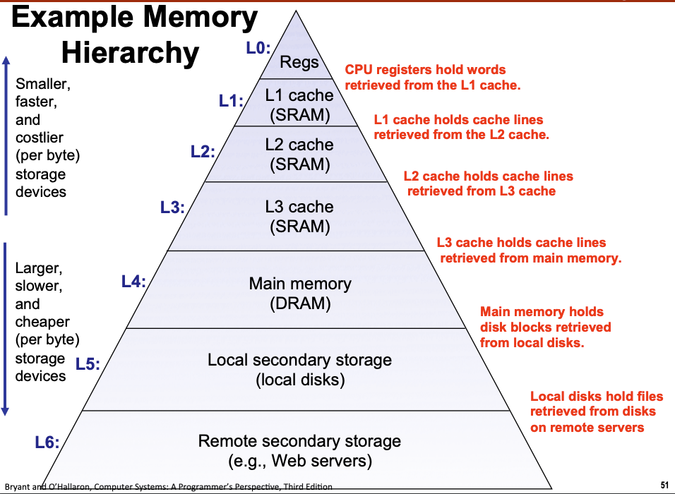
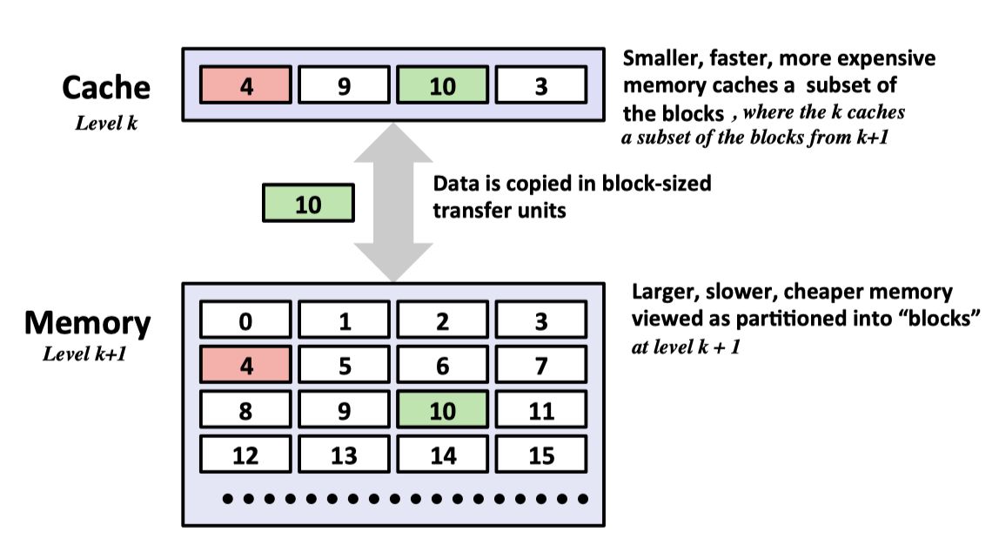
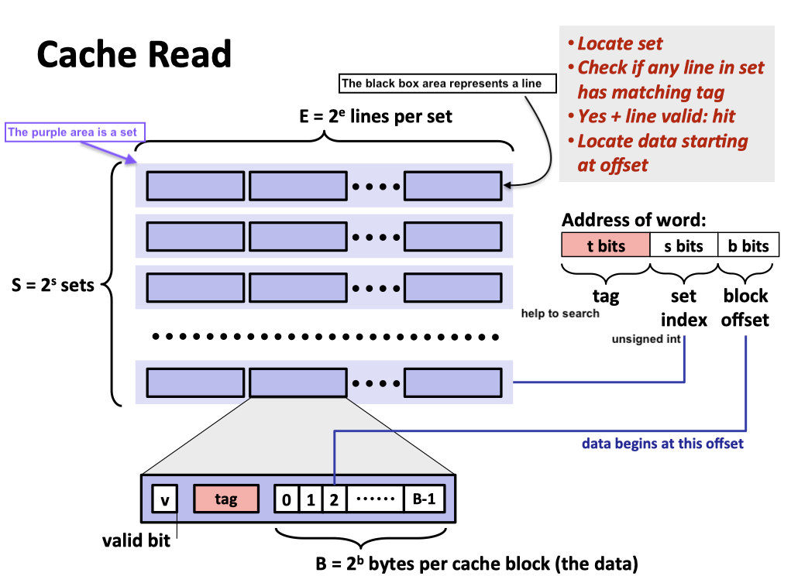
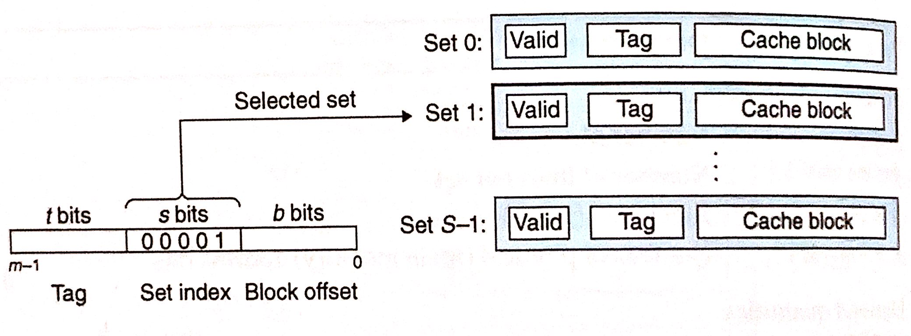
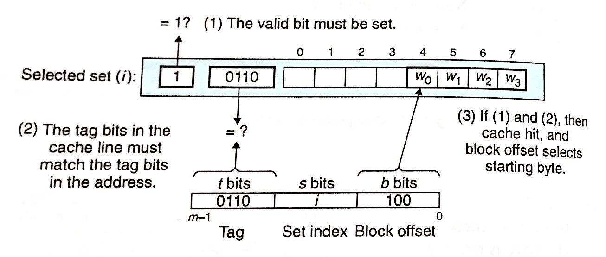
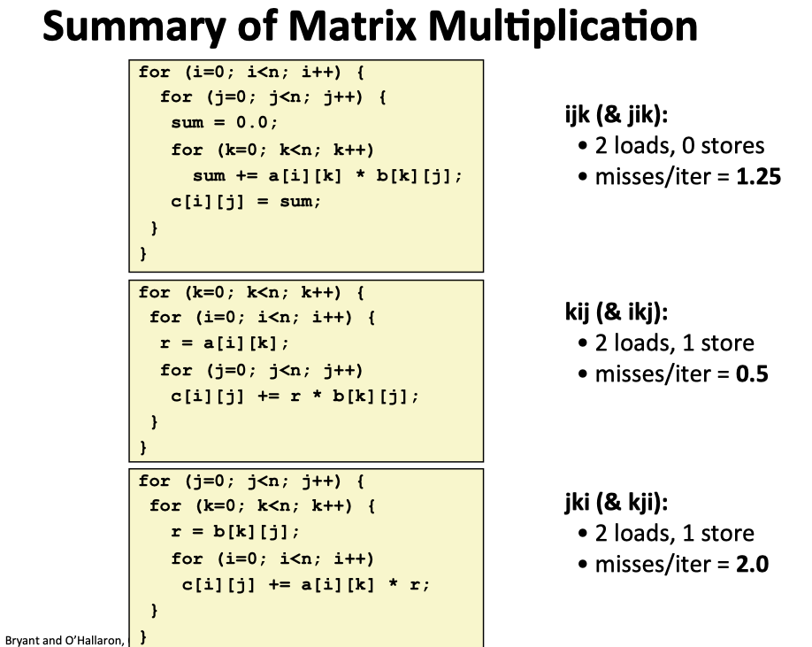
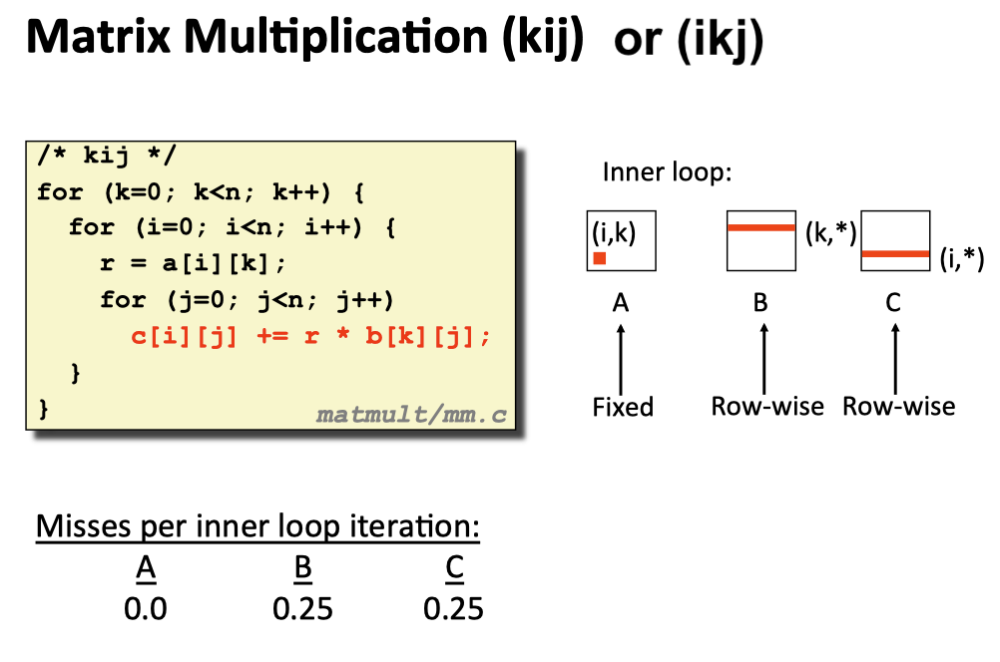
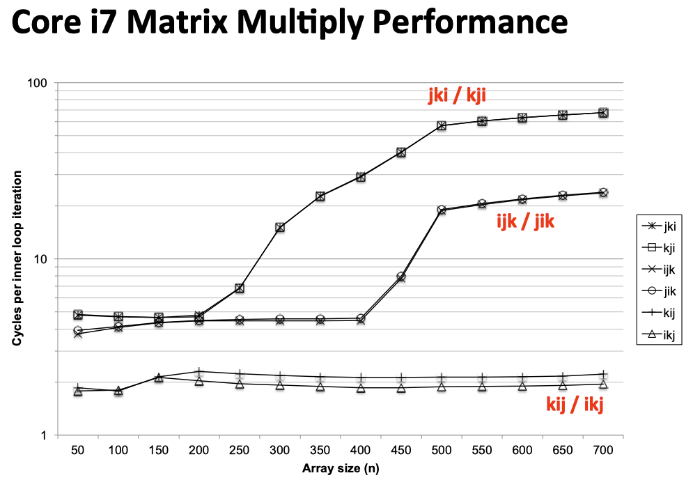
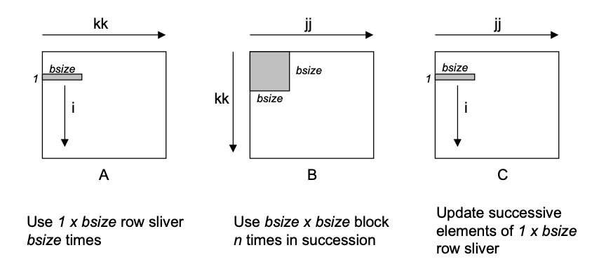

# Lab 4 Cache Lab

### Updating ...

## Little Background Review:

Basically, in the memory syetem, there have two types of chips from the memory system:  **Dynamic Random-Access Memory(DRAM)** and **Static Random-Access Memory(SRAM)**, where **main memory** is composed of DRAM and **cache memory** is composed of SRAM. The reason they use different types of chips is that SRAM is more stable by disturbance and faster but cannot make dense and expensive, whereas DRAM can be made more densive and cheaper but more sensitive by a noise like the light ray and need to refresh. Furthermore, various sources of leakage current cause a DRAM cell to lose its charge within a time period around 10 to 100 millisecond, and thus the memory system must periodically refresh every bit of memory by reading it out and then rewriting it. 

|          | Transistors per bit | Relative Access Time | Persistent? | Relative Cost | Sensitive? | Applications                  |
| :------: | :-----------------: | :------------------: | :---------: | :-----------: | :--------: | ----------------------------- |
| **SRAM** |          6          |          1x          |     Yes     |     1000x     |     No     | Cache Memory                  |
| **DRAM** |          2          |         10x          |     No      |      1x       |    Yes     | Main Memory, <br>frame buffer |

Due to the speed gap between CPU, SRAM (Cache line) and DRAM (Main Memory), and even persistent devices (such as disk drives), we use a principle called ***locality*** to try to bridge the process-memory gap.

At **hardware level**, the principle of locality allows computer designers to speed up main memory accesses by introducing small fast memories to hold blocks of **recently referenced instructions and data items.**

At **operating system level**, the principle of locality allows the system to use main memory as cache of the most recently referenced chunks of the virutal address space( same as locality between disk and main memory).

Due to the **memory hierarchy** conception, the storage devices get slower, cheaper, and larger as we move from higher to lower levels, where the highest level(L0) can be accesses by CPU in a single clock cycle, whereas the next level SRAM cache can be taken a few clock cycles(see the table below). Furthermore, the central idea of a memory hierarchy is that for each `k`, the faster and smaller storage device at level `k `serves **as a cache for the larger and slower storage device at the level** `k+1`. In other words, each level in the hierarchy caches data objects from the next lower level.



In general, devices lower in the hierarchy(further from the CPU) have **longer access times**, and thus tend to use larger block sizes in order to **amortize** these longer access times.



<p align="center">These figures are from <a href = "https://www.cs.cmu.edu/afs/cs/academic/class/15213-f15/www/lectures/11-memory-hierarchy.pdf">cmu-213 slide</a></p>

|      Type      |      What cached      |     where cached     | Latency(clock cycles) |     Managed by      |
| :------------: | :-------------------: | :------------------: | :-------------------: | :-----------------: |
|  CPU register  | 4-byte or 8-byte word | On-chip CPU register |           0           |      Compiler       |
|      TLB       |  Address translation  |     On-chip TLB      |           0           |    Hardware MMU     |
|    L1 Cache    |    64-byte blocks     |   On-chip L1 cache   |           4           |      Hardware       |
|    L2 Cache    |    64-byte blocks     |   On-chip L2 cache   |          10           |      Hardware       |
|    L3 Cache    |    64-byte blocks     |   On-chip L3 cache   |          50           |      Hardware       |
| Virtual Memory |      4-KB pages       |     Main memory      |          200          |    Hardware + OS    |
|  Buffer Cache  |    Parts of files     |     Main memory      |          200          |         OS          |
|   Disk Cache   |     Disk sectors      |   Disk controller    |        100,000        | Controller firmware |
| Network Cache  |    Parts of files     |      Local disk      |      10,000,000       |     NFS client      |
| Browser Cache  |       Web pages       |      Local disk      |      10,000,000       |     Web browser     |
|   Web Cache    |       Web pages       | Remote server disks  |     1,000,000,000     |  Web proxy server   |

<p align="center">This table is from the book <a href = "http://csapp.cs.cmu.edu/3e/home.html">CS:APP3e</a>  chapter 6</p>


### Cache Memory Read Background

Before staring to write the code, we need to figure out **the cache line structure** and how it works first, where it should from the Book([CSApp3E](https://csapp.cs.cmu.edu/)) or [slides](https://www.cs.cmu.edu/afs/cs/academic/class/15213-f15/www/schedule.html).

Just like the book talks about, the cache memory structure as figure show below:



<p align="center">Cache line structure from <a href = "https://www.cs.cmu.edu/afs/cs/academic/class/15213-f15/www/lectures/11-memory-hierarchy.pdf">cmu-213 slide</a></p>

Looking at the picture above now, we need to clearly distinguish two different types of address before we move on. The left side is `structure of cache memory`; whereas the right side the `structure of address of word`.  `s bits` is the index number of the whole cache memory, which help us to location the position of data we looking for by set sizze. Furthermore, if we look at these structures closely, we will find that there have one common section between these two structure : **tag bit**, where it help us to make sure whether the current cache line is the one we looking for. Actually, there also has a connection between **cache block** and **block offset**, where it is that block offset just like an index of an array to point out that position of the first byte of the data we looking for in cache block. In the final, `valid bit` is to tell us whether current cache line in the selected set is **meaningful**.

```
/**
 * Structure for block in Cache line:
 *      +-----------+----------+---------------+
 *      + Valid Bit +  Tag Bit +  Cache Block  + 
 *      +-----------+----------+---------------+    
 *
 *
 * Address of word that CPU send to Cache: 64bit 
 *      +-----------+------------+---------------+
 *      + Tag Bit   +  Set Index +  Block Offset +
 *      +-----------+------------+---------------+
**/ 
```


Then, we need to figure out how cache hardware implements read: 

1. Program executes instructions first, it reference some word to read in memory.
2. CPU will send the address to cache and asks the cache to return the word(the data it looking for) at that address
3. Cache will take that address and divides the address into a number of regions, which determined by the organization of the cache, where it characterized by tuple(S.E.B).

Generally, the size(capacity) of cache `C = S x E x B` **(valid bits and tag bits are not include)**

+ `s set index` bits form a index into the array of S sets, where the first is 0, the second is 1 and so on.

+ Once we know which set the word must be contained in, **tag bits** `t` tell us which line(if any) in the set contains the word.

+ A line in the set contains the word if and only if the `valid bit` is set and `the tag bit` in the line **match the tag bit** in the addresses.

+ Once we have **located the line** identified by **the tag** in the set identified by **the set index**, then the `b block offset bits` gives us the offset of the word in the **B-byte data block**. 

  

<p align="center"><strong>Fundamental Parameters Table</strong></p>

| Parameter   | Description                                       |
| ----------- | ------------------------------------------------- |
| S = 2ˢ      | Number of **sets**                                |
| E           | Number of **lines per set**                       |
| B = 2ᵇ      | Block size (bytes)                                |
| m = log₂(M) | Number of **physical (main memory) address bits** |

<p align="center">This table is from the book <a href = "http://csapp.cs.cmu.edu/3e/home.html">CS:APP3e</a>  chapter 6</p>


<p align="center"><strong>Derived quantities Table</strong></p>

| Parameter       | Description                                                  |
| --------------- | ------------------------------------------------------------ |
| M = 2ᵐ          | **Maxinum** number of **unique** memory addresses            |
| s = log₂(S)     | Number of **set index bits**                                 |
| b = log₂(B)     | Number of **block offset bits**                              |
| t = m - (s + b) | Number of **tag bits**                                       |
| C  = B x E x S  | **Cache size(bytes)**, not including overhead such as the valid and tag bits |

<p align="center">This table is from the book <a href = "http://csapp.cs.cmu.edu/3e/home.html">CS:APP3e</a>  chapter 6</p>


### Simple Example : Direct-Mapped Caches

A cache line with **exactly one line per set(E = 1)** is known as a direct-mapped caches. We use this simple structure of go through the process of cache read.


<p align="center">Direct-mapped cache from <a href = "https://www.cs.cmu.edu/afs/cs/academic/class/15213-f15/www/lectures/11-memory-hierarchy.pdf">cmu-213 slide</a></p>

The process that a cache goes through of determinging whether a request is a hit or miss and then extracting word consists of three steps

+ ***set selection***:

  In this section, the cache extracts that **s set** index bits from the middle of the address for `target word ω`, where these bits interprets as an **unsigned integer** that corresponds to a set number. In other words, if we think of the cache as a one-dimensional array of sets, then the set index bits form an index into this array.

  

  <p align="center">This figure is from the book <a href = "http://csapp.cs.cmu.edu/3e/home.html">CS:APP3e</a>  chapter 6</p>

+ ***line matching***:

  After making sure that the word ω we looking for is located at **set i**, we start to look for the exact position that the data located by comparing the `tag bit` and checking the `valid bit`. Specifically,  the valid bit indicate whether the current cache line in selected set  is meanning for or not and tag bit help to us to check whether the current cache line is right one.

  **The `cache hit` occurs only if the valid bit is 1 and the tag bit matches.** Otherwise, we would have a `cache miss`.

+ ***word extraction***

  Once we have a hit, we know that target word ω is somewhere in this block. All the things we need to do is to find the start poistion of the data we looking for in this block. To get this purpose, we need to use the `block offset` from the word address, where it provides us with the offset of the first byte in the desired word ω. Simliar to our view of a cache as an array of lines, we also can regards the data block as an array, and the block offset is the index number of that array.

  

<p align="center">This figure is from the book <a href = "http://csapp.cs.cmu.edu/3e/home.html">CS:APP3e</a>  chapter 6</p>

+ Unfortunately, if we encounter a cache miss, then we need to retrieve the requested block from the next level in the memory hierarchy and store the new block in one of the cache lines of the set indicated by the set index bits. In general, if the current set is full of valid cache line, then one of the existing lines must be evicted.


## Part A: Writing a Cache Simulator

### Problem Description

**This section mainly focus on the cache read.**

In Part A you will write a cache simulator in `csim.c `that takes a `valgrind `memory trace as input, simulates the hit/miss behavior of a cache memory on this trace, and outputs the total number of hits, misses, and evictions.

Valgrind memory traces have the following form:

```
I 0400d7d4,8
 M 0421c7f0,4
 L 04f6b868,8
 S 7ff0005c8,8
```

Each line denotes one or two memory accesses. The format of each line is `[space]operation address,size`

We have provided you with the binary executable of a reference cache simulator, called `csim-ref`, that simulates the behavior of a cache with arbitrary size and associativity on a valgrind trace file. It uses the **LRU (least-recently used)** replacement policy when choosing which cache line to evict.

Your job for Part A is to **fill in the `csim.c` file so that it takes the same command line arguments and produces the identical output as the reference simulator**. Notice that this file is almost completely empty. You’ll need to write it from scratch.

+ Your simulator must work correctly for arbitrary `s`, `E`, and `b`. This means that you will need to allocate storage for your simulator’s data structures using the malloc function. Type “man malloc” for information about this function.
+ For this lab, we are interested only in **data cache performance**, so your simulator should **ignore all instruction cache accesses** (lines starting with “I”). Recall that valgrind always puts “I” in the first column (with no preceding space), and “M”, “L”, and “S” in the second column (with a preceding space). This may help you parse the trace.

### My Solution

Just like the related content in the previous section, the cache line structure in our code should be like this :

```c
/**
 * Structure for block in Cache line:
 *      +-----------+----------+---------------+
 *      + Valid Bit +  Tag Bit +  Cache Block  + 
 *      +-----------+----------+---------------+    
 *
 *
 * Address of word that CPU send to Cache: 64bit 
 *      +-----------+------------+---------------+
 *      + Tag Bit   +  Set Index +  Block Offset +
 *      +-----------+------------+---------------+
**/ 

// the structure of word address in cache
typedef struct cache_line{
    uint64_t tag; // used for 64 bit
  	// Because we use LRU as the evict rules
    // we need to record the current cache create time
    uint64_t time;
    int valid; // valid bit
    // int block; // block offset(unused in this simulator)
}cache_line_t;

typedef cache_line_t *cache_line_ptr;
```

The first thing that our cache simulator need to do is to input the cache memory information and  parse that input file by line into our simulator and extract the useful information and fomred into the word address structure above. Furthermore, we will use the function `getopt()` to parse the input line,

```c
// Phase the command line by using getopt()
void phase_command(int argc, char **argv, int *verbose, uint64_t* s, uint64_t* E, uint64_t* b, char **t){
    int option;
    while( (option = getopt(argc,argv,"hvs:E:b:t:"))!=-1 ){
        switch (option)
        {
            // pop out the help flag
            case 'h':
                usage();
                exit(EXIT_SUCCESS);
            // Optional verbose flag that displays trace info
            case 'v':
                *verbose = 1;
                // usage();
                break;
            // Number of set index bits (S = 2^s is the number of sets)
            case 's':
                *s = atoi(optarg);
                if(*s<0){
                    printf("Error: Invalid input for <s>, exit program \n \n");
                    usage();
                    exit(EXIT_FAILURE);
                }
                break;
            // Specify the line per set(Associativity)
            case 'E':
                *E = atoi(optarg);
                if(*E<0){
                    printf("Error: Invalid input for <b>, exit program \n \n");
                    usage();
                    exit(EXIT_FAILURE);
                }
                break;
            // Number of block bits (B = 2^b bis the block size)
            case 'b':
                *b = atoi(optarg);
                if(*b<0){
                    printf("Error: Invalid input for <E>, exit program \n \n");
                    usage();
                    exit(EXIT_FAILURE);
                }
                break;
            // Name of the valgrind trace to replay
            case 't':
                *t = optarg;
                break;
            default:
                printf("\n----------------------------------\n");
                printf("Invalid option input!! Try again. \n");
                printf("----------------------------------\n");
                usage();
                exit(EXIT_FAILURE);
        }
    }
}
```

After get the information of the cache memory, we will "create a fake cache memory" by using the `calloc`, where `calloc` is to allocate the heap memory from the system by the specific size and initialize all the block in this allocated space as zero.

As you can see the code below,  we required two-dimensional layout memory, where we allocate the memory firstly by set size, and, in each set, we also allocate memory by cache line size.

```c
// Init the cache simulator structure
// Where the cache totally has s sets and E lines in each set
cache_line_ptr* cache_init(uint64_t sets, uint64_t E){
    cache_line_ptr* cache_tmp;
    // Initialize the set
    if( (cache_tmp = calloc(sets,sizeof(cache_line_ptr)))==NULL ){
        perror("Failed to allocate space for calloc\n");
        exit(EXIT_FAILURE);
    }
    // Initialize the lines in each set
    for(int i=0; i<sets;i++){
        if( (cache_tmp[i] =calloc(E,sizeof(cache_line_t))) == NULL){
            perror("Failed to allocate space for lines\n");
            printf("sets number %d\n",i);
            exit(EXIT_FAILURE);
        }
    }
    // Return by the cache line structure
    return cache_tmp;
}
```

Correspondingly, we also need to free up the heap space before the end of the program.:

```c
// Free Request Heap Space
void relese_space(cache_line_ptr* cache, uint64_t sets){
    for(uint64_t i=0; i<sets; i++)
        free(cache[i]);
    free(cache);
}
```

Then, we will parse the input file first, then parse the address, the instruction flag and the number of bytes accessd per operation by cache line structure. As the code shown, in the function `read_trace`, we just did two things basically

1. using the **bitwise operation** to prase the set index and tag index.
2. we do the different operation by using the `set` and `tag` bit according to the instruction flag.

```c
// phase trace
void read_trace(FILE* file, cache_line_ptr* cache, uint64_t s, 
                uint64_t sets, uint64_t E,uint64_t b, 
                int verbose,int *hit,int *miss, int *evictions)
{
    char flag;
    uint64_t addr;
    int len; 
    // Read the trace file line by line
    while(fscanf(file," %c %lx, %d",&flag,&addr,&len) != EOF){
        if(flag == 'I')
            continue; // skip when flag is 'I'
        /**
         * Structure for block in Cache line:
   
         *
         *
         * Address of word that CPU send to Cache: 64bit 
         *      +-----------+------------+---------------+
         *      + Tag Bit   +  Set Index +  Block Offset +
         *      +-----------+------------+---------------+
        **/ 
        // Extract Set index 
        uint64_t set_index_mask = ( 1 << s )-1;
        uint64_t set_index = ( addr >> b ) & set_index_mask;
        uint64_t tag_bit = ( addr >> b ) >> s;
        cache_line_ptr search_line = cache[set_index];

        // Load or Store will cause at most one cache miss
        // When both of valid bit is 1 and tag bit is matched, cache hit
        // Cache miss otherwise
        if(flag == 'L' || flag == 'S'){ 
            // Display trace info
            if(verbose)
                printf("Flag: %c, Address: %lx\n",flag,addr);
            load_in_cache(hit,miss,evictions,search_line,E,tag_bit,verbose);
          
        }else if(flag == 'M'){
            /*
                Due to Modify operation involved both load and store
                Thus, a modify operation may make two hit operation or one miss(might plus one eviction)+hit. 
            */
           if(verbose)  printf("Flag: %c, Address: %lx",flag,addr);
           // Load Operation: one miss or one miss + one eviction
           load_in_cache(hit,miss,evictions,search_line,E,tag_bit,verbose);
           // Store Operation: Must hit
           load_in_cache(hit,miss,evictions,search_line,E,tag_bit,verbose);
        }
    }
}
```

The main purpose of the function `load_in_cache` is to fetch the data into the cache memory by using both of **the valid bit** and **the tag bit**. If cache hit occur, then finished the program. Otherwise, we will use the **LRU strategy** to evict the old block and replace it with the new data. 

```c
// Using LRU strategy to calculate the miss, hit and evictions 
// Find the least recent used block and replace it with newly cache block.
void load_in_cache(int *hit, int *miss, int *evictions, 
                cache_line_ptr search_line,int E, int tag, int verbose){
  
    // Initialize time stamp
    uint64_t recent_time = 0;
    uint64_t oldest_time = UINT64_MAX;
    uint64_t oldest_block = UINT64_MAX;

    // Verify whether is hit in the current cache line
    for(uint64_t i=0; i<E;i++){
        if( (search_line[i].tag == tag) && (search_line[i].valid == 1) ){
            if(verbose)
                printf("Hit Occured\n");
            (*hit)++;
            search_line[i].time++;
            return ;
        }
    }
    // Hit Miss
    if(verbose) printf("Miss Occured\n");
    (*miss)++;

    // Find the Least Recent Used Block
    for(uint64_t i=0; i<E;i++){
        if(search_line[i].time < oldest_time){
            oldest_time = search_line[i].time;
            oldest_block = i;
        }
        // find the recent used block
        if(search_line[i].time > recent_time){
            recent_time = search_line[i].time;
        }
    }
    // Replace Block
    search_line[oldest_block].time = recent_time+1;
    search_line[oldest_block].tag = tag;

    // Check whether the target block has been filled
    if(search_line[oldest_block].valid){ // Was an filled block
        if(verbose) printf("Eviction Occured \n");
        (*evictions)++;
    }else{ // The target block was an empty block
        search_line[oldest_block].valid = 1;
    }
}
```

Simultaneously, we will count the number of cache hit and the cache miss.

```c
void printInfo(uint64_t* s, uint64_t* E, uint64_t* b,char** t){
    printf("s: %ld\n",*s);
    printf("E: %ld\n",*E);
    printf("b: %ld\n",*b);
    printf("t: %s\n",*t);
}
```

### Result

We pass all the test.

```bash
➜  ~ ./test-csim 
                        Your simulator     Reference simulator
Points (s,E,b)    Hits  Misses  Evicts    Hits  Misses  Evicts
     3 (1,1,1)       9       8       6       9       8       6  traces/yi2.trace
     3 (4,2,4)       4       5       2       4       5       2  traces/yi.trace
     3 (2,1,4)       2       3       1       2       3       1  traces/dave.trace
     3 (2,1,3)     167      71      67     167      71      67  traces/trans.trace
     3 (2,2,3)     201      37      29     201      37      29  traces/trans.trace
     3 (2,4,3)     212      26      10     212      26      10  traces/trans.trace
     3 (5,1,5)     231       7       0     231       7       0  traces/trans.trace
     6 (5,1,5)  265189   21775   21743  265189   21775   21743  traces/long.trace
    27

TEST_CSIM_RESULTS=27

➜  ~ ./csim-ref -v -s 4 -E 1 -b 4 -t traces/yi.trace
L 10,1 miss 
M 20,1 miss hit 
L 22,1 hit 
S 18,1 hit 
L 110,1 miss eviction 
L 210,1 miss eviction 
M 12,1 miss eviction hit 
hits:4 misses:5 evictions:3

```

## Part B: Optimizing Matrix Transpose

### Problem Description

In Part B you will write a transpose function in `trans.c` that causes as few cache misses as possible.

To make the cache friendly code, we need to follow these basic rules:

+ **Focus on the inner loops**, where bulk of computa;ons and memory accesses occur.

+ **Repeated references to local variable** are good because the compiler can cache them in the register file to maximize **temporal locality**.
+ **Stride-1 reference patterns** are good because caches at all levels of the memory hierarchy store data as contiguous blocks to maximize **spatial locality**.

For matrix multiplication, better use of spatial locality and reducing the cache miss rate for each data load would be a good way to improve the performance due to the reason that we cannot reduce the time complexity(`O(n³)`).

For example, if we think the problem of multiplying  a pair of `n x n` matrices : `C = AB`. Different access methods (by row or by column) of the inner loop iteration will result in completely different cache miss rates. Like the code below, using `i` or `j`  or `k` as the inner loop will result in totally different  cache miss rate.

```c
void ijk(array A, array B, array C, int n) 
{
    int i, j, k;
    double sum;

    /* $begin mm-ijk */
    for (i = 0; i < n; i++) 
        for (j = 0; j < n; j++) {
      sum = 0.0;
            for (k = 0; k < n; k++)
                sum += A[i][k]*B[k][j];
            C[i][j] += sum;
        }
    /* $end mm-ijk */
}
```

As we can see in the picture below, miss rates may vary due to the different ways to compose the matrix multiplication.



<p align="center">This picture is from <a href = "https://www.cs.cmu.edu/afs/cs/academic/class/15213-f15/www/lectures/11-memory-hierarchy.pdf">cmu-213 slide</a></p>



<p align="center">The best way to reduce the cache miss rate from <a href = "https://www.cs.cmu.edu/afs/cs/academic/class/15213-f15/www/lectures/11-memory-hierarchy.pdf">cmu-213 slide</a></p>



<p align="center">This picture is from <a href = "https://www.cs.cmu.edu/afs/cs/academic/class/15213-f15/www/lectures/11-memory-hierarchy.pdf">cmu-213 slide</a></p>

### Using `Blocking` technique to improve the locality of inner loops

The **general idea** of blocking is to origanize the data structures in a program into large chunks (In this context, **“block”** refers to an **application-level chunk of data**, not to a cache block). The program is structured so that it load chunk into L1 cache, does all reads and writes that it needs to on that chunk, then discard the chunk, loads the next chunk and so on. 

```c
/**
 * @param  n 		: Array size
 * @param bsize : the size of block
**/
void bijk(array A, array B, array C, int n, int bsize)
{
    int i, j, k, kk, jj;
    double sum;
    int en = bsize * (n / bsize); /* Amount that fits evenly into blocks */

    for (i = 0; i < n; i++)
        for (j = 0; j < n; j++)
            C[i][j] = 0.0;

    for (kk = 0; kk < en; kk += bsize)
    {
        for (jj = 0; jj < en; jj += bsize)
        {
            for (i = 0; i < n; i++)
            {
                for (j = jj; j < jj + bsize; j++)
                {
                    sum = C[i][j];
                    for (k = kk; k < kk + bsize; k++)
                    {
                        sum += A[i][k] * B[k][j];
                    }
                    C[i][j] = sum;
                }
            }
        }
    }
}

```



<p align="center">This figure is from <a href = "http://csapp.cs.cmu.edu/public/waside/waside-blocking.pdf">the extra content of CS:APP3e</a> in chapter 6</p>


For part B, what we need to do is that we need to transpose three different sizes of matrix : `32X32`, `64X64` and `61X67`. For each transpose operation, we need to make the miss rate as less as we could by using the block technique and what we learned in the cache memory. Specifically, to get the full score, we need to ensure the **miss rate** `m` of each size of the matrix should be as lower as follows:

+ 32 × 32: 8 points if `m `< 300, 0 points if `m `> 600
+ 64 × 64: 8 points if `m `< 1, 300, 0 points if `m `> 2, 000
+ 61 × 67: 10 points if `m `< 2, 000, 0 points if `m `> 3, 000

Furthermore, this part of lab give us some restricions:

+ Your code in `trans.c `must compile without warnings to receive credit.
+ You are allowed to define **at most 12 local variables of type int** per transpose function.
+ You are **not allowed** to side-step the previous rule by using any variables of **type long** or by using any bit tricks to **store more than one value to a single variable**.
+ If you choose to **use helper functions**, you **may not have more than 12 local variables on the stack** at a time between your helper functions and your top level transpose function.
+ Your transpose function may **not modify array A**. You may, however, do whatever you want with the contents of array B.
+ You are **NOT allowed to define any arrays** in your code or to **use any variant of malloc**.

The cache memory layout in this part should be like this:

```c
/**
 * 
 * Structure for block in Cache line:
 *      +-----------+----------+---------------+
 *      + Valid Bit +  Tag Bit +  Cache Block  + 
 *      +-----------+----------+---------------+    
 *
 *
 * Address of word that CPU send to Cache: 
 *      +-----------+------------+---------------+
 *      + Tag Bit   +  Set Index +  Block Offset +
 *      +-----------+------------+---------------+
 * 
 * The cache memory layout for this program: 
 * 
 *  
 *                                                2^5 = 32 bytes per cache block
 *                                                       4 bytes per block
 *                                                               /\
 *                                       /-----------------------  ----------------------\
 *              / +-----------+----------+-----------------------------------------------+
 *             |  + Valid Bit + Tag Bit  +  0  |  1  |  2  |  3  |  4  |  5  |  6  |  7  | 
 *             |  +-----------+----------+-----------------------------------------------+ 
 *             |  + Valid Bit + Tag Bit  +  8  |  9  |  10 |  11 |  12 |  13 |  14 |  15 |
 *             |  +-----------+----------+-----------------------------------------------+
 *             |  + Valid Bit + Tag Bit  +  16 |  17 |  18 |  19 |  20 |  21 |  22 |  23 |
 *             |  +-----------+----------+-----------------------------------------------+
 * 2^5 = 32   /   | ...         ...      26 lines omitted here     ...      ...      ... | 
 *   sets     \   +-----------+----------+-----------------------------------------------+
 *             |  + Valid Bit + Tag Bit  +  232|  233|  234|  235|  236|  237|  238|  239| 
 *             |  +-----------+----------+-----------------------------------------------+
 *             |  + Valid Bit + Tag Bit  +  240|  241|  242|  243|  244|  245|  246|  247|
 *             |  +-----------+----------+-----------------------------------------------+
 *             |  + Valid Bit + Tag Bit  +  248|  249|  250|  251|  252|  253|  254|  255|
 *              \ +-----------+----------+-----------------------------------------------+
 *                 \----------------------------------  ---------------------------------/
 *                                                    \/
 *                                             1 cache line per set
 * 
**/
```

## My Solution

