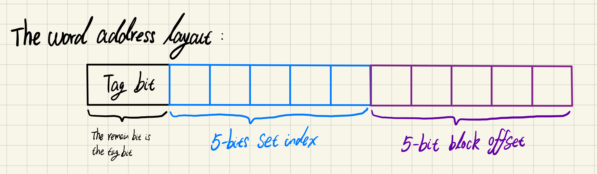
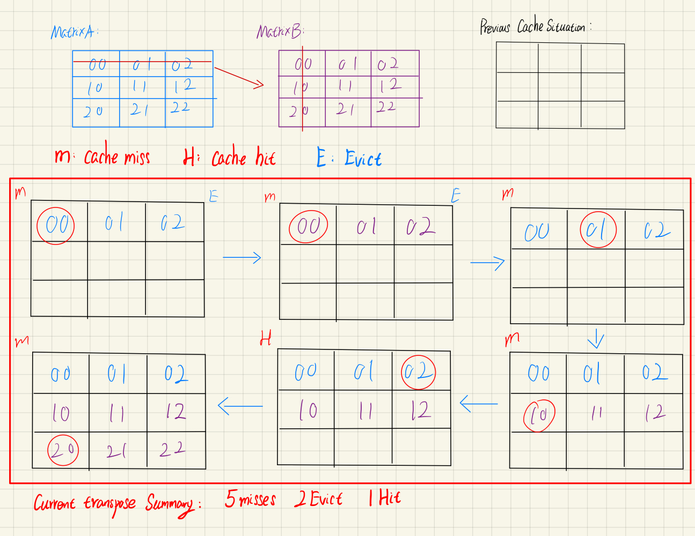
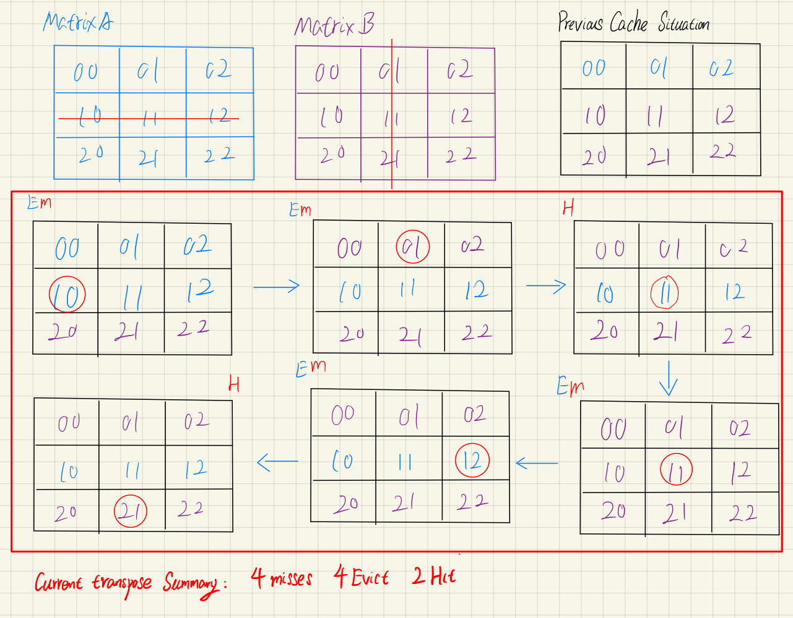
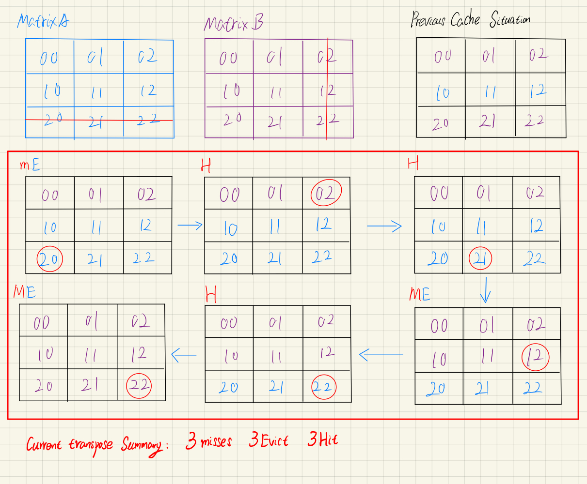
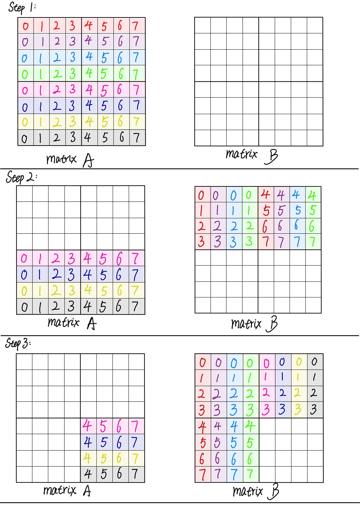
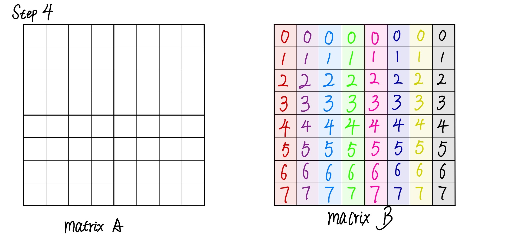
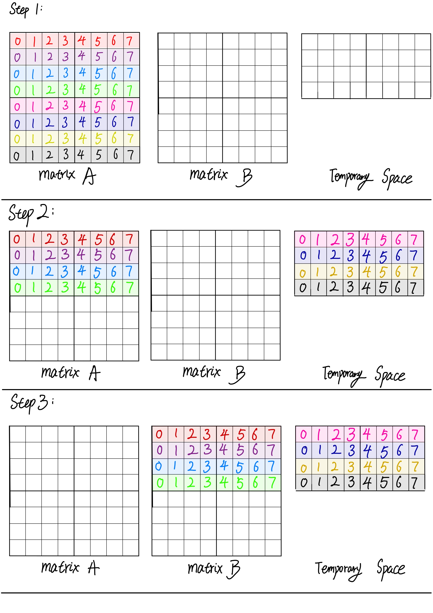
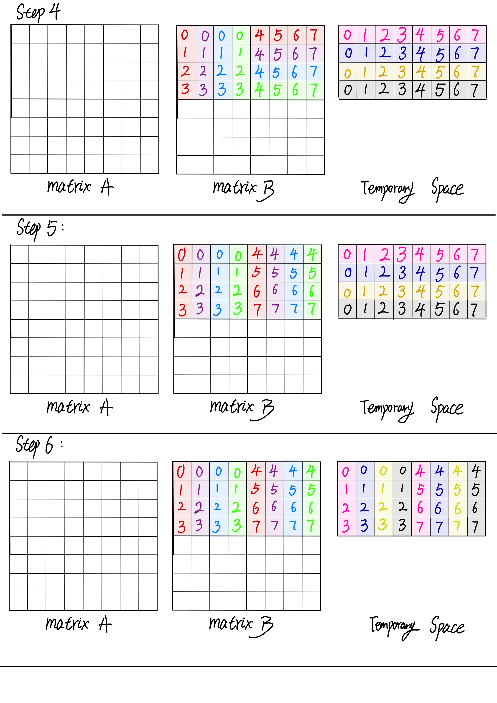
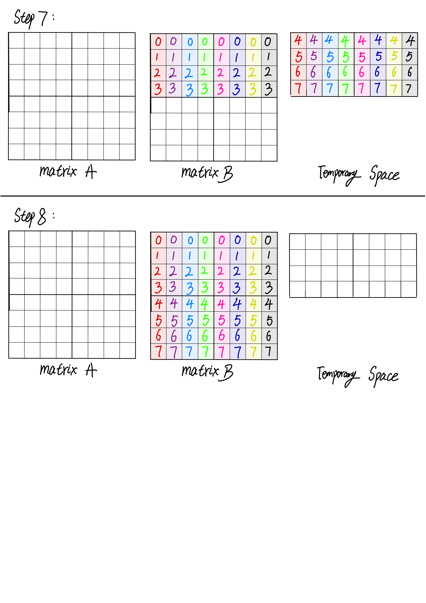

# Lab 4 Cache Lab Report

## <a name="index">Table Of Content: </a>

&emsp;&emsp;<a href="#1"></a>  
&emsp;<a href="#2">Little Background Review:</a>  
&emsp;&emsp;<a href="#3">- Cache Memory Read Background</a>  
&emsp;&emsp;<a href="#4">- Simple Example : Direct-Mapped Caches</a>  
&emsp;<a href="#5">Part A: Writing a Cache Simulator</a>  
&emsp;&emsp;<a href="#6">- Problem Description</a>  
&emsp;&emsp;<a href="#7">- My Solution</a>  
&emsp;&emsp;<a href="#8">- Result</a>  
&emsp;<a href="#9">Part B: Optimizing Matrix Transpose</a>  
&emsp;&emsp;<a href="#10">Problem Description</a>  
&emsp;&emsp;<a href="#11">Using `Blocking` technique to improve the locality of inner loops</a>  
&emsp;<a href="#12">My Solution</a>  
&emsp;&emsp;<a href="#13">32 X 32 Matrix Transposition</a>  
&emsp;&emsp;&emsp;<a href="#14">- Basic Solution</a>  
&emsp;&emsp;&emsp;<a href="#15">- Optimize Solution</a>  
&emsp;&emsp;<a href="#16">64x64 Matrix Transposition</a>  
&emsp;&emsp;<a href="#17">- The code would be like this: </a>  
&emsp;&emsp;&emsp;<a href="#18">- Running result</a>  
&emsp;&emsp;<a href="#19">- Reference Link in Part B</a>  
&emsp;&emsp;<a href="#20">61x67 Matrix Transposition</a>  
&emsp;&emsp;&emsp;<a href="#21">- The code</a>  
&emsp;&emsp;&emsp;<a href="#22">- The running result</a>  
&emsp;<a href="#23">The Final Result</a>  

## <a name="2">Little Background Review:</a><a style="float:right;text-decoration:none;" href="#index">[Top]</a>

Basically, in the memory syetem, there have two types of chips from the memory system:  **Dynamic Random-Access Memory(DRAM)** and **Static Random-Access Memory(SRAM)**, where **main memory** is composed of DRAM and **cache memory** is composed of SRAM. The reason they use different types of chips is that SRAM is more stable by disturbance and faster but cannot make dense and expensive, whereas DRAM can be made more densive and cheaper but more sensitive by a noise like the light ray and need to refresh. Furthermore, various sources of leakage current cause a DRAM cell to lose its charge within a time period around 10 to 100 millisecond, and thus the memory system must periodically refresh every bit of memory by reading it out and then rewriting it. 

|          | Transistors per bit | Relative Access Time | Persistent? | Relative Cost | Sensitive? | Applications                  |
| :------: | :-----------------: | :------------------: | :---------: | :-----------: | :--------: | ----------------------------- |
| **SRAM** |          6          |          1x          |     Yes     |     1000x     |     No     | Cache Memory                  |
| **DRAM** |          2          |         10x          |     No      |      1x       |    Yes     | Main Memory, <br>frame buffer |

Due to the speed gap between CPU, SRAM (Cache line) and DRAM (Main Memory), and even persistent devices (such as disk drives), we use a principle called ***locality*** to try to bridge the process-memory gap.

At **hardware level**, the principle of locality allows computer designers to speed up main memory accesses by introducing small fast memories to hold blocks of **recently referenced instructions and data items.**

At **operating system level**, the principle of locality allows the system to use main memory as cache of the most recently referenced chunks of the virutal address space( same as locality between disk and main memory).

Due to the **memory hierarchy** conception, the storage devices get slower, cheaper, and larger as we move from higher to lower levels, where the highest level(L0) can be accesses by CPU in a single clock cycle, whereas the next level SRAM cache can be taken a few clock cycles(see the table below). Furthermore, the central idea of a memory hierarchy is that for each `k`, the faster and smaller storage device at level `k `serves **as a cache for the larger and slower storage device at the level** `k+1`. In other words, each level in the hierarchy caches data objects from the next lower level.


In general, devices lower in the hierarchy(further from the CPU) have **longer access times**, and thus tend to use larger block sizes in order to **amortize** these longer access times.


<p align="center">These figures are from <a href = "https://www.cs.cmu.edu/afs/cs/academic/class/15213-f15/www/lectures/11-memory-hierarchy.pdf">cmu-213 slide</a></p>

|      Type      |      What cached      |     where cached     | Latency(clock cycles) |     Managed by      |
| :------------: | :-------------------: | :------------------: | :-------------------: | :-----------------: |
|  CPU register  | 4-byte or 8-byte word | On-chip CPU register |           0           |      Compiler       |
|      TLB       |  Address translation  |     On-chip TLB      |           0           |    Hardware MMU     |
|    L1 Cache    |    64-byte blocks     |   On-chip L1 cache   |           4           |      Hardware       |
|    L2 Cache    |    64-byte blocks     |   On-chip L2 cache   |          10           |      Hardware       |
|    L3 Cache    |    64-byte blocks     |   On-chip L3 cache   |          50           |      Hardware       |
| Virtual Memory |      4-KB pages       |     Main memory      |          200          |    Hardware + OS    |
|  Buffer Cache  |    Parts of files     |     Main memory      |          200          |         OS          |
|   Disk Cache   |     Disk sectors      |   Disk controller    |        100,000        | Controller firmware |
| Network Cache  |    Parts of files     |      Local disk      |      10,000,000       |     NFS client      |
| Browser Cache  |       Web pages       |      Local disk      |      10,000,000       |     Web browser     |
|   Web Cache    |       Web pages       | Remote server disks  |     1,000,000,000     |  Web proxy server   |

<p align="center">This table is from the book <a href = "http://csapp.cs.cmu.edu/3e/home.html">CS:APP3e</a>  chapter 6</p>


### <a name="3">Cache Memory Read Background</a><a style="float:right;text-decoration:none;" href="#index">[Top]</a>

Before staring to write the code, we need to figure out **the cache line structure** and how it works first, where it should from the Book([CSApp3E](https://csapp.cs.cmu.edu/)) or [slides](https://www.cs.cmu.edu/afs/cs/academic/class/15213-f15/www/schedule.html).

Just like the book talks about, the cache memory structure as figure show below:


<p align="center">Cache line structure from <a href = "https://www.cs.cmu.edu/afs/cs/academic/class/15213-f15/www/lectures/11-memory-hierarchy.pdf">cmu-213 slide</a></p>

Looking at the picture above now, we need to clearly distinguish two different types of address before we move on. The left side is `structure of cache memory`; whereas the right side the `structure of address of word`.  `s bits` is the index number of the whole cache memory, which help us to location the position of data we looking for by set sizze. Furthermore, if we look at these structures closely, we will find that there have one common section between these two structure : **tag bit**, where it help us to make sure whether the current cache line is the one we looking for. Actually, there also has a connection between **cache block** and **block offset**, where it is that block offset just like an index of an array to point out that position of the first byte of the data we looking for in cache block. In the final, `valid bit` is to tell us whether current cache line in the selected set is **meaningful**.

```
/**
 * Structure for block in Cache line:
 *      +-----------+----------+---------------+
 *      + Valid Bit +  Tag Bit +  Cache Block  + 
 *      +-----------+----------+---------------+    
 *
 *
 * Address of word that CPU send to Cache: 64bit 
 *      +-----------+------------+---------------+
 *      + Tag Bit   +  Set Index +  Block Offset +
 *      +-----------+------------+---------------+
**/ 
```


Then, we need to figure out how cache hardware implements read: 

1. Program executes instructions first, it reference some word to read in memory.
2. CPU will send the address to cache and asks the cache to return the word(the data it looking for) at that address
3. Cache will take that address and divides the address into a number of regions, which determined by the organization of the cache, where it characterized by tuple(S.E.B).

Generally, the size(capacity) of cache `C = S x E x B` **(valid bits and tag bits are not include)**

+ `s set index` bits form a index into the array of S sets, where the first is 0, the second is 1 and so on.

+ Once we know which set the word must be contained in, **tag bits** `t` tell us which line(if any) in the set contains the word.

+ A line in the set contains the word if and only if the `valid bit` is set and `the tag bit` in the line **match the tag bit** in the addresses.

+ Once we have **located the line** identified by **the tag** in the set identified by **the set index**, then the `b block offset bits` gives us the offset of the word in the **B-byte data block**. 

  

<p align="center"><strong>Fundamental Parameters Table</strong></p>

| Parameter   | Description                                       |
| ----------- | ------------------------------------------------- |
| S = 2ˢ      | Number of **sets**                                |
| E           | Number of **lines per set**                       |
| B = 2ᵇ      | Block size (bytes)                                |
| m = log₂(M) | Number of **physical (main memory) address bits** |

<p align="center">This table is from the book <a href = "http://csapp.cs.cmu.edu/3e/home.html">CS:APP3e</a>  chapter 6</p>


<p align="center"><strong>Derived quantities Table</strong></p>

| Parameter       | Description                                                  |
| --------------- | ------------------------------------------------------------ |
| M = 2ᵐ          | **Maxinum** number of **unique** memory addresses            |
| s = log₂(S)     | Number of **set index bits**                                 |
| b = log₂(B)     | Number of **block offset bits**                              |
| t = m - (s + b) | Number of **tag bits**                                       |
| C  = B x E x S  | **Cache size(bytes)**, not including overhead such as the valid and tag bits |

<p align="center">This table is from the book <a href = "http://csapp.cs.cmu.edu/3e/home.html">CS:APP3e</a>  chapter 6</p>


### <a name="4">Simple Example : Direct-Mapped Caches</a><a style="float:right;text-decoration:none;" href="#index">[Top]</a>

A cache line with **exactly one line per set(E = 1)** is known as a direct-mapped caches. We use this simple structure of go through the process of cache read.


<p align="center">Direct-mapped cache from <a href = "https://www.cs.cmu.edu/afs/cs/academic/class/15213-f15/www/lectures/11-memory-hierarchy.pdf">cmu-213 slide</a></p>

The process that a cache goes through of determinging whether a request is a hit or miss and then extracting word consists of three steps

+ ***set selection***:

  In this section, the cache extracts that **s set** index bits from the middle of the address for `target word ω`, where these bits interprets as an **unsigned integer** that corresponds to a set number. In other words, if we think of the cache as a one-dimensional array of sets, then the set index bits form an index into this array.

  

  <p align="center">This figure is from the book <a href = "http://csapp.cs.cmu.edu/3e/home.html">CS:APP3e</a>  chapter 6</p>

+ ***line matching***:

  After making sure that the word ω we looking for is located at **set i**, we start to look for the exact position that the data located by comparing the `tag bit` and checking the `valid bit`. Specifically,  the valid bit indicate whether the current cache line in selected set  is meanning for or not and tag bit help to us to check whether the current cache line is right one.

  **The `cache hit` occurs only if the valid bit is 1 and the tag bit matches.** Otherwise, we would have a `cache miss`.

+ ***word extraction***

  Once we have a hit, we know that target word ω is somewhere in this block. All the things we need to do is to find the start poistion of the data we looking for in this block. To get this purpose, we need to use the `block offset` from the word address, where it provides us with the offset of the first byte in the desired word ω. Simliar to our view of a cache as an array of lines, we also can regards the data block as an array, and the block offset is the index number of that array.

  

<p align="center">This figure is from the book <a href = "http://csapp.cs.cmu.edu/3e/home.html">CS:APP3e</a>  chapter 6</p>

+ Unfortunately, if we encounter a cache miss, then we need to retrieve the requested block from the next level in the memory hierarchy and store the new block in one of the cache lines of the set indicated by the set index bits. In general, if the current set is full of valid cache line, then one of the existing lines must be evicted.


## <a name="5">Part A: Writing a Cache Simulator</a><a style="float:right;text-decoration:none;" href="#index">[Top]</a>

### <a name="6">Problem Description</a><a style="float:right;text-decoration:none;" href="#index">[Top]</a>

**This section mainly focus on the cache read.**

In Part A you will write a cache simulator in `csim.c `that takes a `valgrind `memory trace as input, simulates the hit/miss behavior of a cache memory on this trace, and outputs the total number of hits, misses, and evictions.

Valgrind memory traces have the following form:

```
I 0400d7d4,8
 M 0421c7f0,4
 L 04f6b868,8
 S 7ff0005c8,8
```

Each line denotes one or two memory accesses. The format of each line is `[space]operation address,size`

We have provided you with the binary executable of a reference cache simulator, called `csim-ref`, that simulates the behavior of a cache with arbitrary size and associativity on a valgrind trace file. It uses the **LRU (least-recently used)** replacement policy when choosing which cache line to evict.

Your job for Part A is to **fill in the `csim.c` file so that it takes the same command line arguments and produces the identical output as the reference simulator**. Notice that this file is almost completely empty. You’ll need to write it from scratch.

+ Your simulator must work correctly for arbitrary `s`, `E`, and `b`. This means that you will need to allocate storage for your simulator’s data structures using the malloc function. Type “man malloc” for information about this function.
+ For this lab, we are interested only in **data cache performance**, so your simulator should **ignore all instruction cache accesses** (lines starting with “I”). Recall that valgrind always puts “I” in the first column (with no preceding space), and “M”, “L”, and “S” in the second column (with a preceding space). This may help you parse the trace.

### <a name="7">My Solution</a><a style="float:right;text-decoration:none;" href="#index">[Top]</a>

Just like the related content in the previous section, the cache line structure in our code should be like this :

```c
/**
 * Structure for block in Cache line:
 *      +-----------+----------+---------------+
 *      + Valid Bit +  Tag Bit +  Cache Block  + 
 *      +-----------+----------+---------------+    
 *
 *
 * Address of word that CPU send to Cache: 64bit 
 *      +-----------+------------+---------------+
 *      + Tag Bit   +  Set Index +  Block Offset +
 *      +-----------+------------+---------------+
**/ 

// the structure of word address in cache
typedef struct cache_line{
    uint64_t tag; // used for 64 bit
  	// Because we use LRU as the evict rules
    // we need to record the current cache create time
    uint64_t time;
    int valid; // valid bit
    // int block; // block offset(unused in this simulator)
}cache_line_t;

typedef cache_line_t *cache_line_ptr;
```

The first thing that our cache simulator need to do is to input the cache memory information and  parse that input file by line into our simulator and extract the useful information and fomred into the word address structure above. Furthermore, we will use the function `getopt()` to parse the input line,

```c
// Phase the command line by using getopt()
void phase_command(int argc, char **argv, int *verbose, uint64_t* s, uint64_t* E, uint64_t* b, char **t){
    int option;
    while( (option = getopt(argc,argv,"hvs:E:b:t:"))!=-1 ){
        switch (option)
        {
            // pop out the help flag
            case 'h':
                usage();
                exit(EXIT_SUCCESS);
            // Optional verbose flag that displays trace info
            case 'v':
                *verbose = 1;
                // usage();
                break;
            // Number of set index bits (S = 2^s is the number of sets)
            case 's':
                *s = atoi(optarg);
                if(*s<0){
                    printf("Error: Invalid input for <s>, exit program \n \n");
                    usage();
                    exit(EXIT_FAILURE);
                }
                break;
            // Specify the line per set(Associativity)
            case 'E':
                *E = atoi(optarg);
                if(*E<0){
                    printf("Error: Invalid input for <b>, exit program \n \n");
                    usage();
                    exit(EXIT_FAILURE);
                }
                break;
            // Number of block bits (B = 2^b bis the block size)
            case 'b':
                *b = atoi(optarg);
                if(*b<0){
                    printf("Error: Invalid input for <E>, exit program \n \n");
                    usage();
                    exit(EXIT_FAILURE);
                }
                break;
            // Name of the valgrind trace to replay
            case 't':
                *t = optarg;
                break;
            default:
                printf("\n----------------------------------\n");
                printf("Invalid option input!! Try again. \n");
                printf("----------------------------------\n");
                usage();
                exit(EXIT_FAILURE);
        }
    }
}
```

After get the information of the cache memory, we will "create a fake cache memory" by using the `calloc`, where `calloc` is to allocate the heap memory from the system by the specific size and initialize all the block in this allocated space as zero.

As you can see the code below,  we required two-dimensional layout memory, where we allocate the memory firstly by set size, and, in each set, we also allocate memory by cache line size.

```c
// Init the cache simulator structure
// Where the cache totally has s sets and E lines in each set
cache_line_ptr* cache_init(uint64_t sets, uint64_t E){
    cache_line_ptr* cache_tmp;
    // Initialize the set
    if( (cache_tmp = calloc(sets,sizeof(cache_line_ptr)))==NULL ){
        perror("Failed to allocate space for calloc\n");
        exit(EXIT_FAILURE);
    }
    // Initialize the lines in each set
    for(int i=0; i<sets;i++){
        if( (cache_tmp[i] =calloc(E,sizeof(cache_line_t))) == NULL){
            perror("Failed to allocate space for lines\n");
            printf("sets number %d\n",i);
            exit(EXIT_FAILURE);
        }
    }
    // Return by the cache line structure
    return cache_tmp;
}
```

Correspondingly, we also need to free up the heap space before the end of the program.:

```c
// Free Request Heap Space
void relese_space(cache_line_ptr* cache, uint64_t sets){
    for(uint64_t i=0; i<sets; i++)
        free(cache[i]);
    free(cache);
}
```

Then, we will parse the input file first, then parse the address, the instruction flag and the number of bytes accessd per operation by cache line structure. As the code shown, in the function `read_trace`, we just did two things basically

1. using the **bitwise operation** to prase the set index and tag index.
2. we do the different operation by using the `set` and `tag` bit according to the instruction flag.

```c
// phase trace
void read_trace(FILE* file, cache_line_ptr* cache, uint64_t s, 
                uint64_t sets, uint64_t E,uint64_t b, 
                int verbose,int *hit,int *miss, int *evictions)
{
    char flag;
    uint64_t addr;
    int len; 
    // Read the trace file line by line
    while(fscanf(file," %c %lx, %d",&flag,&addr,&len) != EOF){
        if(flag == 'I')
            continue; // skip when flag is 'I'
        /**
         * Structure for block in Cache line:
   
         *
         *
         * Address of word that CPU send to Cache: 64bit 
         *      +-----------+------------+---------------+
         *      + Tag Bit   +  Set Index +  Block Offset +
         *      +-----------+------------+---------------+
        **/ 
        // Extract Set index 
        uint64_t set_index_mask = ( 1 << s )-1;
        uint64_t set_index = ( addr >> b ) & set_index_mask;
        uint64_t tag_bit = ( addr >> b ) >> s;
        cache_line_ptr search_line = cache[set_index];

        // Load or Store will cause at most one cache miss
        // When both of valid bit is 1 and tag bit is matched, cache hit
        // Cache miss otherwise
        if(flag == 'L' || flag == 'S'){ 
            // Display trace info
            if(verbose)
                printf("Flag: %c, Address: %lx\n",flag,addr);
            load_in_cache(hit,miss,evictions,search_line,E,tag_bit,verbose);
          
        }else if(flag == 'M'){
            /*
                Due to Modify operation involved both load and store
                Thus, a modify operation may make two hit operation or one miss(might plus one eviction)+hit. 
            */
           if(verbose)  printf("Flag: %c, Address: %lx",flag,addr);
           // Load Operation: one miss or one miss + one eviction
           load_in_cache(hit,miss,evictions,search_line,E,tag_bit,verbose);
           // Store Operation: Must hit
           load_in_cache(hit,miss,evictions,search_line,E,tag_bit,verbose);
        }
    }
}
```

The main purpose of the function `load_in_cache` is to fetch the data into the cache memory by using both of **the valid bit** and **the tag bit**. If cache hit occur, then finished the program. Otherwise, we will use the **LRU strategy** to evict the old block and replace it with the new data. 

```c
// Using LRU strategy to calculate the miss, hit and evictions 
// Find the least recent used block and replace it with newly cache block.
void load_in_cache(int *hit, int *miss, int *evictions, 
                cache_line_ptr search_line,int E, int tag, int verbose){
  
    // Initialize time stamp
    uint64_t recent_time = 0;
    uint64_t oldest_time = UINT64_MAX;
    uint64_t oldest_block = UINT64_MAX;

    // Verify whether is hit in the current cache line
    for(uint64_t i=0; i<E;i++){
        if( (search_line[i].tag == tag) && (search_line[i].valid == 1) ){
            if(verbose)
                printf("Hit Occured\n");
            (*hit)++;
            search_line[i].time++;
            return ;
        }
    }
    // Hit Miss
    if(verbose) printf("Miss Occured\n");
    (*miss)++;

    // Find the Least Recent Used Block
    for(uint64_t i=0; i<E;i++){
        if(search_line[i].time < oldest_time){
            oldest_time = search_line[i].time;
            oldest_block = i;
        }
        // find the recent used block
        if(search_line[i].time > recent_time){
            recent_time = search_line[i].time;
        }
    }
    // Replace Block
    search_line[oldest_block].time = recent_time+1;
    search_line[oldest_block].tag = tag;

    // Check whether the target block has been filled
    if(search_line[oldest_block].valid){ // Was an filled block
        if(verbose) printf("Eviction Occured \n");
        (*evictions)++;
    }else{ // The target block was an empty block
        search_line[oldest_block].valid = 1;
    }
}
```

Simultaneously, we will count the number of cache hit and the cache miss.

```c
void printInfo(uint64_t* s, uint64_t* E, uint64_t* b,char** t){
    printf("s: %ld\n",*s);
    printf("E: %ld\n",*E);
    printf("b: %ld\n",*b);
    printf("t: %s\n",*t);
}
```

### <a name="8">Result</a><a style="float:right;text-decoration:none;" href="#index">[Top]</a>

We pass all the test.

```bash
➜  ~ ./test-csim 
                        Your simulator     Reference simulator
Points (s,E,b)    Hits  Misses  Evicts    Hits  Misses  Evicts
     3 (1,1,1)       9       8       6       9       8       6  traces/yi2.trace
     3 (4,2,4)       4       5       2       4       5       2  traces/yi.trace
     3 (2,1,4)       2       3       1       2       3       1  traces/dave.trace
     3 (2,1,3)     167      71      67     167      71      67  traces/trans.trace
     3 (2,2,3)     201      37      29     201      37      29  traces/trans.trace
     3 (2,4,3)     212      26      10     212      26      10  traces/trans.trace
     3 (5,1,5)     231       7       0     231       7       0  traces/trans.trace
     6 (5,1,5)  265189   21775   21743  265189   21775   21743  traces/long.trace
    27

TEST_CSIM_RESULTS=27

➜  ~ ./csim-ref -v -s 4 -E 1 -b 4 -t traces/yi.trace
L 10,1 miss 
M 20,1 miss hit 
L 22,1 hit 
S 18,1 hit 
L 110,1 miss eviction 
L 210,1 miss eviction 
M 12,1 miss eviction hit 
hits:4 misses:5 evictions:3
```

## <a name="9">Part B: Optimizing Matrix Transpose</a><a style="float:right;text-decoration:none;" href="#index">[Top]</a>

### <a name="10">Problem Description</a><a style="float:right;text-decoration:none;" href="#index">[Top]</a>

In Part B you will write a transpose function in `trans.c` that causes as few cache misses as possible.

To make the cache friendly code, we need to follow these basic rules:

+ **Focus on the inner loops**, where bulk of computa;ons and memory accesses occur.

+ **Repeated references to local variable** are good because the compiler can cache them in the register file to maximize **temporal locality**.
+ **Stride-1 reference patterns** are good because caches at all levels of the memory hierarchy store data as contiguous blocks to maximize **spatial locality**.

For matrix multiplication, better use of spatial locality and reducing the cache miss rate for each data load would be a good way to improve the performance due to the reason that we cannot reduce the time complexity(`O(n³)`).

For example, if we think the problem of multiplying  a pair of `n x n` matrices : `C = AB`. Different access methods (by row or by column) of the inner loop iteration will result in completely different cache miss rates. Like the code below, using `i` or `j`  or `k` as the inner loop will result in totally different  cache miss rate.

```c
void ijk(array A, array B, array C, int n) 
{
    int i, j, k;
    double sum;

    /* $begin mm-ijk */
    for (i = 0; i < n; i++) 
        for (j = 0; j < n; j++) {
      sum = 0.0;
            for (k = 0; k < n; k++)
                sum += A[i][k]*B[k][j];
            C[i][j] += sum;
        }
    /* $end mm-ijk */
}
```

As we can see in the picture below, miss rates may vary due to the different ways to compose the matrix multiplication.


<p align="center">This picture is from <a href = "https://www.cs.cmu.edu/afs/cs/academic/class/15213-f15/www/lectures/11-memory-hierarchy.pdf">cmu-213 slide</a></p>


<p align="center">The best way to reduce the cache miss rate from <a href = "https://www.cs.cmu.edu/afs/cs/academic/class/15213-f15/www/lectures/11-memory-hierarchy.pdf">cmu-213 slide</a></p>


<p align="center">This picture is from <a href = "https://www.cs.cmu.edu/afs/cs/academic/class/15213-f15/www/lectures/11-memory-hierarchy.pdf">cmu-213 slide</a></p>

### <a name="11">Using `Blocking` technique to improve the locality of inner loops</a><a style="float:right;text-decoration:none;" href="#index">[Top]</a>

The **general idea** of blocking is to origanize the data structures in a program into large chunks (In this context, **“block”** refers to an **application-level chunk of data**, not to a cache block). The program is structured so that it load chunk into L1 cache, does all reads and writes that it needs to on that chunk, then discard the chunk, loads the next chunk and so on. 

```c
/**
 * @param  n 		: Array size
 * @param bsize : the size of block
**/
void bijk(array A, array B, array C, int n, int bsize)
{
    int i, j, k, kk, jj;
    double sum;
    int en = bsize * (n / bsize); /* Amount that fits evenly into blocks */

    for (i = 0; i < n; i++)
        for (j = 0; j < n; j++)
            C[i][j] = 0.0;

    for (kk = 0; kk < en; kk += bsize)
    {
        for (jj = 0; jj < en; jj += bsize)
        {
            for (i = 0; i < n; i++)
            {
                for (j = jj; j < jj + bsize; j++)
                {
                    sum = C[i][j];
                    for (k = kk; k < kk + bsize; k++)
                    {
                        sum += A[i][k] * B[k][j];
                    }
                    C[i][j] = sum;
                }
            }
        }
    }
}

```


<p align="center">This figure is from <a href = "http://csapp.cs.cmu.edu/public/waside/waside-blocking.pdf">the extra content of CS:APP3e</a> in chapter 6</p>


For part B, what we need to do is that we need to transpose three different sizes of matrix : `32X32`, `64X64` and `61X67`. For each transpose operation, we need to make the miss rate as less as we could by using the block technique and what we learned in the cache memory. Specifically, to get the full score, we need to ensure the **miss rate** `m` of each size of the matrix should be as lower as follows:

+ 32 × 32: 8 points if `m `< 300, 0 points if `m `> 600
+ 64 × 64: 8 points if `m `< 1, 300, 0 points if `m `> 2, 000
+ 61 × 67: 10 points if `m `< 2, 000, 0 points if `m `> 3, 000

Furthermore, this part of lab give us some restricions:

+ Your code in `trans.c `must compile without warnings to receive credit.
+ You are allowed to define **at most 12 local variables of type int** per transpose function.
+ You are **not allowed** to side-step the previous rule by using any variables of **type long** or by using any bit tricks to **store more than one value to a single variable**.
+ If you choose to **use helper functions**, you **may not have more than 12 local variables on the stack** at a time between your helper functions and your top level transpose function.
+ Your transpose function may **not modify array A**. You may, however, do whatever you want with the contents of array B.
+ You are **NOT allowed to define any arrays** in your code or to **use any variant of malloc**.

The cache memory layout in this part should be like this:

```c
/**
 * 
 * Structure for block in Cache line:
 *      +-----------+----------+---------------+
 *      + Valid Bit +  Tag Bit +  Cache Block  + 
 *      +-----------+----------+---------------+    
 *
 *
 * Address of word that CPU send to Cache: 
 *      +-----------+------------+---------------+
 *      + Tag Bit   +  Set Index +  Block Offset +
 *      +-----------+------------+---------------+
 * 
 * The cache memory layout for this program: 
 * 
 *  
 *                                                2^5 = 32 bytes per cache block
 *                                                       4 bytes per block
 *                                                               /\
 *                                       /-----------------------  ----------------------\
 *              / +-----------+----------+-----------------------------------------------+
 *             |  + Valid Bit + Tag Bit  +  0  |  1  |  2  |  3  |  4  |  5  |  6  |  7  | 
 *             |  +-----------+----------+-----------------------------------------------+ 
 *             |  + Valid Bit + Tag Bit  +  8  |  9  |  10 |  11 |  12 |  13 |  14 |  15 |
 *             |  +-----------+----------+-----------------------------------------------+
 *             |  + Valid Bit + Tag Bit  +  16 |  17 |  18 |  19 |  20 |  21 |  22 |  23 |
 *             |  +-----------+----------+-----------------------------------------------+
 * 2^5 = 32   /   | ...         ...      26 lines omitted here     ...      ...      ... | 
 *   sets     \   +-----------+----------+-----------------------------------------------+
 *             |  + Valid Bit + Tag Bit  +  232|  233|  234|  235|  236|  237|  238|  239| 
 *             |  +-----------+----------+-----------------------------------------------+
 *             |  + Valid Bit + Tag Bit  +  240|  241|  242|  243|  244|  245|  246|  247|
 *             |  +-----------+----------+-----------------------------------------------+
 *             |  + Valid Bit + Tag Bit  +  248|  249|  250|  251|  252|  253|  254|  255|
 *              \ +-----------+----------+-----------------------------------------------+
 *                 \----------------------------------  ---------------------------------/
 *                                                    \/
 *                                             1 cache line per set
**/
```

## <a name="12">My Solution</a><a style="float:right;text-decoration:none;" href="#index">[Top]</a>

### <a name="13">32 X 32 Matrix Transposition</a><a style="float:right;text-decoration:none;" href="#index">[Top]</a>

The first thought that came to my mind is to use the block technique, where I will use `8x8` block. Actually, the size of the design block is an empirical value. In here, we find that one cache line can hold 8 elements of matrix and thus we use `8x8` as our block size.

The miss times I expected is `2x8x16 = 256`, where, in each block both of matrix A and matrix B, we will miss **8 times**, and also, the 32x32 matrix can be divided into **16 blocks**. Specifically, the 8 misses come from each time we read a new row of the matrix, which allows us to write the newly read data into a new set of cache line.

```txt
 	Each block represent 1 byte
 	Each line represent one element of the matrix
 			 +--+--+--+--+
 A[0]  | 0| 1| 2| 3|
       +--+--+--+--+
 A[1]  | 4| 5| 6| 7|
       +--+--+--+--+
 A[2]  | 8| 9|10|11|
       +--+--+--+--+
 A[3]  |12|13|14|15|
       +--+--+--+--+
 A[4]  |16|17|18|19|
       +--+--+--+--+
 A[5]  |20|21|22|23|
       +--+--+--+--+
 A[6]  |24|25|26|27|
       +--+--+--+--+
 A[7]  |28|29|30|31|
       +--+--+--+--+
 A[8]  | 0| 1| 2| 3| <--- Confilct here, cache miss occur
       +--+--+--+--+
    ...
```

Thus, I write a code block shown below, which just simple use the block technique:

```c
/**
 * A test program to transpose 8x8 matrix
 * by simply using block strategy.
 **/
char trans_naive_desc[] = "Matrix Transpose with block";
void trans_naive(int M, int N , int A[N][M], int B[M][N]){
    int i, j, bi, bj, tmp;
    for(i=0; i<N; i += 8)
        for(j=0; j<M; j+=8)
            // Iterate inside of block
            for(bi = i; bi < min(i + 8, N); bi++)
                for(bj = j; bj < min(j+8, M); bj++){
                    tmp = A[bi][bj];
                    B[bj][bi] = tmp;
                }

}
```

However, after I run with program with our block matrix transpose, **the result is 343** rather than 256.

```bash
➜  ~/cmu-15-213-CSAPP3E-lab/4.Cache_lab/cachelab-handout ./test-trans -M 32 -N 32

Function 0 (1 total)
Step 1: Validating and generating memory traces
Step 2: Evaluating performance (s=5, E=1, b=5)
func 0 (Transpose submission): hits:1710, misses:343, evictions:311

Summary for official submission (func 0): correctness=1 misses=343

TEST_TRANS_RESULTS=1:343

```

The reason resulting in such inconsistency is we missed counting some cache block conflicts.

Thus, we find that there has 87 times miss gap that we don't count in the previous analysis, where three of them are extra cache accesses in this program and we can ignore these three misses.

**We found that the diagonal lines in each matrix block will produce additional misses.** Actually, the write-up file gives us the hint:

> Since your transpose function is being evaluated on a direct-mapped cache, conflict misses are a potential problem. 
>
> Think about the potential for conflict misses in your code, especially along the diagonal.

So now the problem is: **why the diagonal will make the cache line conflicts between Matrix A and Matrix B that result in the cache miss?**

Firstly, as the word address layout shown in the last section,you need to understand that the last part of address is the block offset, and the middle part the set index.

Because the writeup file has already tell us the cache line structure is `s = 5, E = 1, b = 5`. That means our cache memory has 32 sets, and thus we can use 5-bits binary number to represent set index. Similarly, the block offset is 32 bytes and we also use the 5-bits to represent the block offset. The remain bits should be the tag bit. 



Because of the cache memory in this problem is the directly mapped cache(one line per set), the factors that determine whether the current cache line is missed or hit are **the valid bit** and **the pattern matches both of set index bit** and **tag bit**.

Furthermore, **the cache miss occurred** if we find that **the valid bit** of the current cache line is **false** or the **tag bit is unmatched** but **the set index bit the matched**, where it represents that the data we looking for is from a different location but will be stored in the same cache set. For the case of the valid bit is false and the part of case of set index bit is unmatched, we have explained in the text above, where it refers to the cache miss when we read a new row of matrix.

However, there are still some cache misses, which happen when matrices **A and B read their diagonal elements**. The reason is that, in this situation, the 8x8 block in Matrix A and Matrix B share the same cache memory, especially for the element in the same set. When we read elements from matrix B, the entire row of elements from matrix A in the same cache set (or relatively the same row position) will be evicted. Imagine that when the CPU required the data from `A[0][0]` , nothing in the cache line right now, so a cache miss occured. Then we will transfer this data into the `B[0][0]`, where `A[0][0]` and `B[0][0]` will be in the same cache set, because the set index bit from both of them are the same. In this case, the part of line of `A[0][0] ~ A[0][7]` will be evicted and  `B[0][0] ~ B[0][7]` will move into the same place. The same thing happened when we transfer the data from `B[0][0]` to `A[0][0]`. During those processes, one extra cache misses occurred in each transfer. The same thing happens when we transfer data from matrix A to matrix B at the other diagonal positions. However, If this not happened in the diagonal, such as `A[0][1]` to `B[1][0]`, there has no extra cache miss occurred, because `A[0][1]` to `B[1][0]` belong to totally different cache set, where the writing of data `A[0][1]` does not affect `B[1][[0]` in the cache memory. **Each diagonal date transfer will cause two extra cache misses** except the first element `A[0][0]/B[0][0]` and the last element `A[7][7]/B[7][7]`, where one of replacement from  `A[0][0]/B[0][0]` and `A[7][7]/B[7][7]` has already been counted in the normal eviction, and thus it just cause one extra cache miss.

For better explain the process of the cache line, the figures below show how the cache layout changes for `3x3` matrix. Note that, for convenience, the cache layout in the figure below only shows the cache block part, where one grid represents one cache block.

<p float="left">
  	
    
    
</p>

**If you still confused of the principle behind that, I highly recommend you to watch this [Youtube Video](https://www.youtube.com/watch?v=huz6hJPl_cU&ab_channel=TomNurkkala) from [Dr. Tom Nurkkala](https://www.taylor.edu/employees/faculty/tom-nurkkala).**

Back to `8x8` cache block, we have already know that diagonal position will cause 2 extra cache misses except the first position `mat[0][0]` and `mat[7][7]`, where they only cause extra miss. Furthermore, when we do the transpose condition of the last position, the cache miss count may be less than we thought, the reason is that most of the data at that time we want already in the cache, and Matrix A may just evict a few lines and cause a few cache misses.

Specifically, for `32x32` matrix transpose perspective, it can be divided into 16 `8x8` block, where 12 is the block that not involve the diagonal element, and 4 blocks contain the diagonal element. For each `8x8` **regular block**, we have `2x8=16`regular cache miss(8 times for filling each empty cache line and 8 times cache eviction per line). In the matrix transpose of `8x8` block that **contains the diagonal element**, one matrix line transpose, except the first one and the last one, will cause two extra cache misses, where that should be 4 in total(2 regular misses and 2 extra misses). For the **first diagonal** matrix transposition in the `8x8` block, the number of cache misses should be 8 empty rows to fill or cache line eviction from matrix B plus 1 single row replacement of matrix B to matrix A plus another replacement of matrix A to Matrix B due to the diagonal feature. For the last diagonal matrix transposition, only 3 times cache misses occur due to the most element of Matrix B has already in the cache(you can reference the `3x3` case above).

For the 12 regular block that total cache miss should be `12X16 = 192`. Whereas for the 4 block contain the diagonal element, each block will have `8+1+1(first line) + 3(last line) + 4*6(6 middle lines) = 37` cache misses. Therefore, the total cache miss for all blocks should be `192+ 4*37 = 340`, which is very close to the cache miss result from `test-tran.c`(as we mentioned before the 3 cache misses that differ from the analysis result should be the fixed 3 additional cache misses from the test program).

Now the question is how to reduce such cache miss as much as we could ?

**The answer is to use the local variable.** Most of cache miss we can reduce is the extra miss from the matrix diagonal. As the analysis before, the diagonal cache misses comes from multiple and repeated read and write operations between the corresponding rows of matrix A and matrix B. Thus, we can use the local variables to record the whole line of matrix A and when matrix B gets the data from matrix A, it can directly read these elements from the register rather than cache memory.

#### <a name="14">Basic Solution</a><a style="float:right;text-decoration:none;" href="#index">[Top]</a>

In short the key of this method is:

+ Utilize the local variables.(no more than 12)

```c
/**
 * Reduce the cache miss by using the local variable
**/
char trans_32_32_desc[] = "32X32 matrix transposition using local variable";
void trans_32_32(int M, int N, int A[N][M], int B[M][N]){
    int i,j,k;
    for(i=0; i<N; i+=BLOCK_SIZE_32)
        for(j=0; j<M; j+=BLOCK_SIZE_32)
            // Iterate inside of block
            for(k=i; k<i+BLOCK_SIZE_32; k++){
                // Save the elements from the current matrix row
                // to register
                int tmp0 = A[k][j];
                int tmp1 = A[k][j+1];
                int tmp2 = A[k][j+2];
                int tmp3 = A[k][j+3];
                int tmp4 = A[k][j+4];
                int tmp5 = A[k][j+5];
                int tmp6 = A[k][j+6];
                int tmp7 = A[k][j+7];

                // Get the element from A[k][*] from register
                // and copy it to Matrix B
                B[j][k] = tmp0;
                B[j+1][k] = tmp1;
                B[j+2][k] = tmp2;
                B[j+3][k] = tmp3;
                B[j+4][k] = tmp4;
                B[j+5][k] = tmp5;
                B[j+6][k] = tmp6;
                B[j+7][k] = tmp7;
            }
}
```

The cache miss of the code above is **287**, looks good.

```bash
➜  ~/cmu-15-213-CSAPP3E-lab/4.Cache_lab/cachelab-handout ./test-trans -M 32 -N 32

Function 0 (1 total)
Step 1: Validating and generating memory traces
Step 2: Evaluating performance (s=5, E=1, b=5)
func 0 (Transpose submission): hits:1766, misses:287, evictions:255

Summary for official submission (func 0): correctness=1 misses=287

TEST_TRANS_RESULTS=1:287
```

#### <a name="15">Optimize Solution</a><a style="float:right;text-decoration:none;" href="#index">[Top]</a>

In short the key of this method is:

+ Utilize the local variables.(no more than 12)
+ Copy the matrix element from Matrix A to Matrix B first, then do the transpose operation inside of Matrix B

But 287 cache misses still has a way to 256 cache miss. Is there a way to make cache misses even less?

Well, If we get the result is not "that close to 256", that means we are not perfectly resolving the diagonal cache conflict problem. Specifically, the root cause of the diagonal cache confilct is that Matrix A and Matrix B has the opposite way to access the matrix element, where Matrix A access by row, whereas Matrix B access by column. What's more if we repeatedly and alternately access matrix A and matrix B, so many unused elements in the same row of the target element will also be loaded/evicted from the cache line. For example, Matrix B will load all the elements in the same row into the cache line at a certain moment, and the access to matrix A at the next moment will cause the partial cache of matrix B to be swapped out. When the CPU needs it again, the data in matrix B, those elements will also be reloaded. Obviously, the previous solution does not solve this problem, and thus there still has diagonal conflict problem exist. 

**To perfectly solve the problem above, just using the local variable is not enough.** Instead, we need to copy the element from Matrix A to Matrix B first(**blocks-shifting**), then do the transpose operation inside of Matrix B at the same block position(**lazy-transposing**). **The reason of we doing this is that we should follow the access order of each matrix instead of going against it.** 

```c
/**
 * The optimize way to reduce the cache miss in 32 x 32 matrix
**/
char trans_32_32_opt_desc[] = "The optimize way to do the 32x32 matrix transposition";
void trans_32_32_opt(int M, int N, int A[N][M], int B[M][N]){

    int i,j,bi,bj;
    int tmp0, tmp1, tmp2, tmp3, tmp4, tmp5, tmp6, tmp7;
    for(i=0; i<N; i += BLOCK_SIZE_32)
        for(j=0; j<M;  j+= BLOCK_SIZE_32){

            // Iterate inside of block
            
            // Firstlt, copy the transpose elements from Matrix A to Matrix B
            for(bi = i, bj = j; bi < i + BLOCK_SIZE_32; bi++, bj++){
                // Save the elements from the current matrix row
                // to register
                tmp0 = A[bi][j];
                tmp1 = A[bi][j+1];
                tmp2 = A[bi][j+2];
                tmp3 = A[bi][j+3];
                tmp4 = A[bi][j+4];
                tmp5 = A[bi][j+5];
                tmp6 = A[bi][j+6];
                tmp7 = A[bi][j+7];
                // Copy the element to matrix by row(block-shifting)
                // which is the access order of matrix A
                B[bj][i] = tmp0;
                B[bj][i+1] = tmp1;
                B[bj][i+2] = tmp2;
                B[bj][i+3] = tmp3;
                B[bj][i+4] = tmp4;
                B[bj][i+5] = tmp5;
                B[bj][i+6] = tmp6;
                B[bj][i+7] = tmp7;
            }

            // Then do the transpose operation inside of matrix B
            // which also call lazy-transposing
            for(bi = 0; bi < BLOCK_SIZE_32; bi++)
                for(bj = bi+1; bj < BLOCK_SIZE_32; bj++){
                    tmp0 = B[bi + j][bj + i];
                    B[bi + j][bj + i] = B[bj + j][bi + i];
                    B[bj + j][bi + i] = tmp0;
                }
            
        }

}
```

Wow, the result is 259(always three extra cache misses by testing program), almost perfect!

```bash
➜  ~/cmu-15-213-CSAPP3E-lab/4.Cache_lab/cachelab-handout ./test-trans -M 32 -N 32

Function 0 (1 total)
Step 1: Validating and generating memory traces
Step 2: Evaluating performance (s=5, E=1, b=5)
func 0 (Transpose submission): hits:3586, misses:259, evictions:227

Summary for official submission (func 0): correctness=1 misses=259

TEST_TRANS_RESULTS=1:259

```

Using the official provided function to check the correctness of matrix transposition.

```c
// Check the correctness of the answer
if(is_transpose(M, N, A, B))
    printf("Transpose Succeed!!\n");
else{
    printf("Nah, wrong matrix transpose answer.\n.");
    printf("Double check your function.\n");
}
```

Transpose is correct!!

```bash
➜  ~/cmu-15-213-CSAPP3E-lab/4.Cache_lab/cachelab-handout ./tracegen
Address Matrix A : 0x5629fad01120 
Address Matrix B : 0x5629fad41120 
Transpose Succeed!!
```

### <a name="16">64x64 Matrix Transposition</a><a style="float:right;text-decoration:none;" href="#index">[Top]</a>

When we use the same method to run the `64x64` matrix transposition, we find that the cache miss the huge and far beyond with the requirment: `64 × 64: 8 points if m < 1, 300, 0 points if m > 2, 000`

```bash
➜  ~/cmu-15-213-CSAPP3E-lab/4.Cache_lab/cachelab-handout ./test-trans -M 64 -N 64

Function 0 (1 total)
Step 1: Validating and generating memory traces
Step 2: Evaluating performance (s=5, E=1, b=5)
func 0 (Transpose submission): hits:15659, misses:7939, evictions:7907

Summary for official submission (func 0): correctness=1 misses=7939

TEST_TRANS_RESULTS=1:7939
```

This means that in addition to diagonal cache line conflicts, it also have a lot of additional cache conflicts in the normal block.

First of all, we need to rethink arrangement of the block for caching the `64x64` matrix. In `64x64` matrix, each row will take 8 cache lines, where each cache line can take 8 integers. Thus,simply use the `8x8` block is not enough for `64x64` matrix transposition. The size of block should also be `8x8`, but we need to regrad this `8x8` block as four `4x4` block instead of treating the `8x8` block as a whole. The reason is that it is hard to avoid the most of confilct without change the arrangement inside of `8x8` block, where the cache blocks inside of the same matrix will also confilct with each other. Thus, we need to use the same method of the optimize solution of the previous solution: **1. Utilize the local variable;** **2. copy first then do the transposition**. However, unlike the code in the previous section, we need to **treat diagonal blocks and non-diagonal blocks differently** in the code. 

The reason is that the upper and lower sides of the cache block conflict with each other. In other words, each `8x8` block can load exactly one line for `64x64`, where the first half part of the matrix line will load the upper side of the `8x8` block whereas the second half load the downside of this block. The corresponding rows of the upper and lower parts are all mapped to the same cache set. That means the upper side will load exactly the same cache line that the downside loads, which is the extra conflict come from.

To eliminate the extra confilct from Matrix B cache read, our strategy is to load the first four elements in four matrix lines into the first `4x4` block to warm up the cache line. Then, we can load another four elements from the same matrix lines into the second `4x4` block, where this time our cache miss should be zero, because these cache sets have already held the data from the previous `4x4` block. That is the process we fill in the upper part of `8x8` block.

For the down part of the `8x8` block, to avoid the unnecessary cache miss and the reading order of Matrix B, we use the copy technique just like what we did in the previous section. But this time, we copy the data of the second `4x4` block to the third `4x4` block.

In the final, we will fill the rest of the data into the remaining `4x4` block.





Actually, the theoretical optimal solution of the second matrix is `2 x 64² x 1/8 = 1024`.

**For the diagonal block**, due to the diagonal extra miss and the one above conflict, we need to use a temporary space to store the down part of the `8x8` block. **Note that the order of data transfer must be processed the down part first and then the upper side**, where the reason is that if we do the upper side first and then down part, the upper part and the lower part of the copy will conflict in the cache when we copy the data from the temporary place to the actual block, and thus after the copy process of the next part is completed, the data of the upper part is in the cache has been covered.

To get the minimal cache miss, the transpose operation should be done inside of the current block rather than during the data transferring or copying.







### <a name="17">The code would be like this: </a><a style="float:right;text-decoration:none;" href="#index">[Top]</a>

```c
// without blocks-shifting and lazy-transposing, the expected cache miss is: 1176 = 35 * 8 + 16 * 56
// with block-shifting and lazy-transposing, it reaches theoratical limit: 1024 = 16 * 64
char trans_64_64_desc[] = "The 64x64 matrix transposition"; 
void trans_64_64(int M, int N, int A[N][M], int B[M][N]){
	// i = jj, j = ii, bi = i, bj = j
	// i and j are the outside loop index
	// whereas bi, bj are the inside loop index
    int i, j, bi, bj;
    int tmp0, tmp1, tmp2, tmp3, tmp4, tmp5, tmp6, tmp7;
    for(i = 0; i < N; i+= BLOCK_SIZE){
		// 1. Processing the block contains the diagonal element first

		// User the upper half to [ii,jj] to transpose the diagonal element [ii,ii]
		if(i == 0)
			j = BLOCK_SIZE;
		else
			j = 0;
		
		// Move the downside half 4x8 block from Matrix A to Matrix B
		// with the block-shifting
		for(bi = i; bi < i + SUB_BLOCK_SIZE; bi++){
			// Copy from Matrix A
			tmp0 = A[bi + SUB_BLOCK_SIZE][i+0];
			tmp1 = A[bi + SUB_BLOCK_SIZE][i+1];
			tmp2 = A[bi + SUB_BLOCK_SIZE][i+2];
			tmp3 = A[bi + SUB_BLOCK_SIZE][i+3];
			tmp4 = A[bi + SUB_BLOCK_SIZE][i+4];
			tmp5 = A[bi + SUB_BLOCK_SIZE][i+5];
			tmp6 = A[bi + SUB_BLOCK_SIZE][i+6];
			tmp7 = A[bi + SUB_BLOCK_SIZE][i+7];

			// Move to the matrix B from the local variables
			B[bi][j+0] = tmp0;
			B[bi][j+1] = tmp1;
			B[bi][j+2] = tmp2;
			B[bi][j+3] = tmp3;
			B[bi][j+4] = tmp4;
			B[bi][j+5] = tmp5;
			B[bi][j+6] = tmp6;
			B[bi][j+7] = tmp7;
		}

		
		// taking the transposition operation in the same position
		// for the 4x4 lower-left and lower-right blocks
		for(bi = 0; bi < SUB_BLOCK_SIZE; bi++)
			for(bj = bi+1; bj < SUB_BLOCK_SIZE; bj++){
				tmp0 = B[ i + bi ][ j + bj ];
				B[ i + bi ][ j + bj ] = B[ i + bj][ j + bi];
				B[ i + bj ][ j + bi ] = tmp0;

				tmp0 = B[ i + bi ][ j + bj + SUB_BLOCK_SIZE ];
				B[ i + bi ][ j + bj + SUB_BLOCK_SIZE ] = B[ i + bj ][ j + bi + SUB_BLOCK_SIZE];
				B[ i + bj ][ j + bi + SUB_BLOCK_SIZE] = tmp0;
			}

		// Move the upper-half 4x8 blocks from Matrix A to Matrix B
		for(bi = i; bi < i + SUB_BLOCK_SIZE; bi++){
			// Copy from the Matrix A 
			tmp0 = A[bi][ i + 0 ];
			tmp1 = A[bi][ i + 1 ];
			tmp2 = A[bi][ i + 2 ];
			tmp3 = A[bi][ i + 3 ];
			tmp4 = A[bi][ i + 4 ];
			tmp5 = A[bi][ i + 5 ];
			tmp6 = A[bi][ i + 6 ];
			tmp7 = A[bi][ i + 7 ];

			// Move to the Matrix B from the local variables
			B[bi][ i + 0 ] = tmp0;
			B[bi][ i + 1 ] = tmp1;
			B[bi][ i + 2 ] = tmp2;
			B[bi][ i + 3 ] = tmp3;
			B[bi][ i + 4 ] = tmp4;
			B[bi][ i + 5 ] = tmp5;
			B[bi][ i + 6 ] = tmp6;
			B[bi][ i + 7 ] = tmp7;
		}

		// taking the transposition operation in the same position
		// for the 4x4 upper-left and upper-right blocks
		for(bi = i; bi < i + SUB_BLOCK_SIZE; bi++)
			for(bj = bi+1; bj < i + SUB_BLOCK_SIZE; bj++){
				tmp0 = B[bi][bj];
				B[bi][bj] = B[bj][bi];
				B[bj][bi] =  tmp0;

				tmp0 = B[bi][ bj + SUB_BLOCK_SIZE ];
				B[bi][ bj + SUB_BLOCK_SIZE ] = B[bj][ bi + SUB_BLOCK_SIZE ];
				B[bj][ bi + SUB_BLOCK_SIZE ] = tmp0;
			}

		// swapping the lower-left block and the upper-right block
		for(bi = 0; bi < SUB_BLOCK_SIZE; bi++){
			// Lower-left
			tmp0 = B[i+bi][i+4];
			tmp1 = B[i+bi][i+5];
			tmp2 = B[i+bi][i+6];
			tmp3 = B[i+bi][i+7];

			// Transfer from Upper-right to Lower-left
			B[i+bi][i+4] = B[i+bi][j+0];
			B[i+bi][i+5] = B[i+bi][j+1];
			B[i+bi][i+6] = B[i+bi][j+2];
			B[i+bi][i+7] = B[i+bi][j+3];

			// Upper-right
			B[i+bi][j+0] = tmp0;
			B[i+bi][j+1] = tmp1;
			B[i+bi][j+2] = tmp2;
			B[i+bi][j+3] = tmp3;

		}

		// Filling the lower-part 4x8 block into its position in Matrix B
		for(bi = 0; bi < SUB_BLOCK_SIZE; bi++){
			B[i + bi + SUB_BLOCK_SIZE][i  + 0] = B[i + bi][j + 0];
			B[i + bi + SUB_BLOCK_SIZE][i  + 1] = B[i + bi][j + 1];
			B[i + bi + SUB_BLOCK_SIZE][i  + 2] = B[i + bi][j + 2];
			B[i + bi + SUB_BLOCK_SIZE][i  + 3] = B[i + bi][j + 3];
			B[i + bi + SUB_BLOCK_SIZE][i  + 4] = B[i + bi][j + 4];
			B[i + bi + SUB_BLOCK_SIZE][i  + 5] = B[i + bi][j + 5];
			B[i + bi + SUB_BLOCK_SIZE][i  + 6] = B[i + bi][j + 6];
			B[i + bi + SUB_BLOCK_SIZE][i  + 7] = B[i + bi][j + 7];
		}
		
		// 2.  we process the non-diagonal block

		for(j = 0; j < M; j+=BLOCK_SIZE){
		// iterator inside of the 8x8 blocks

			// skip the diagonal element
			if(i == j)
				continue;
			else{
				// Only process the non-diagonal one
				
				// Do the transpose operation at the same sub-block(4x4 block)
				// for upper-part(both of upper-left and upper-right)
				for(bi = j; bi < j + SUB_BLOCK_SIZE; bi++){
					tmp0 = A[bi][i + 0];
					tmp1 = A[bi][i + 1];
					tmp2 = A[bi][i + 2];
					tmp3 = A[bi][i + 3];

					tmp4 = A[bi][i + 4];
					tmp5 = A[bi][i + 5];
					tmp6 = A[bi][i + 6];
					tmp7 = A[bi][i + 7];

					B[i + 0][bi] = tmp0;
					B[i + 1][bi] = tmp1;
					B[i + 2][bi] = tmp2;
					B[i + 3][bi] = tmp3;

					B[i + 0][bi + SUB_BLOCK_SIZE ] = tmp4;
					B[i + 1][bi + SUB_BLOCK_SIZE ] = tmp5;
					B[i + 2][bi + SUB_BLOCK_SIZE ] = tmp6;
					B[i + 3][bi + SUB_BLOCK_SIZE ] = tmp7;
				}		

				// Do the transpose operation at the same sub-block(4x4 block)
				// for lower-part(both of lower-left and lower-right),
				// and also upper-right to the lower-left
				for(bj = i; bj < i + SUB_BLOCK_SIZE; bj++){
					// Lower-left in the Matrix A
					tmp0 = A[j+4][bj];
					tmp1 = A[j+5][bj];
					tmp2 = A[j+6][bj];
					tmp3 = A[j+7][bj];
					// Uppper-right block in the Matrix B
					tmp4 = B[bj][j+4];
					tmp5 = B[bj][j+5];
					tmp6 = B[bj][j+6];
					tmp7 = B[bj][j+7];

					B[bj][j+4] = tmp0;
					B[bj][j+5] = tmp1;
					B[bj][j+6] = tmp2;
					B[bj][j+7] = tmp3;

					B[bj + SUB_BLOCK_SIZE][j+0] = tmp4;
					B[bj + SUB_BLOCK_SIZE][j+1] = tmp5;
					B[bj + SUB_BLOCK_SIZE][j+2] = tmp6;
					B[bj + SUB_BLOCK_SIZE][j+3] = tmp7;
				}

				// Do the lazy-transposing operation in lower-right sub-block of the Matix B.
				for(bi = j + SUB_BLOCK_SIZE; bi < j + BLOCK_SIZE; bi++){
					tmp4 = A[bi][i + 4];
					tmp5 = A[bi][i + 5];
					tmp6 = A[bi][i + 6];
					tmp7 = A[bi][i + 7];

					B[i + 4][bi] = tmp4;
					B[i + 5][bi] = tmp5;
					B[i + 6][bi] = tmp6;
					B[i + 7][bi] = tmp7;
				}
			}
		}
	}
	
}
```

#### <a name="18">Running result</a><a style="float:right;text-decoration:none;" href="#index">[Top]</a>

```bash
➜  ~/cmu-15-213-CSAPP3E-lab/4.Cache_lab/cachelab-handout ./test-trans -M 64 -N 64

Function 0 (1 total)
Step 1: Validating and generating memory traces
Step 2: Evaluating performance (s=5, E=1, b=5)
func 0 (Transpose submission): hits:10754, misses:1027, evictions:995

Summary for official submission (func 0): correctness=1 misses=1027

TEST_TRANS_RESULTS=1:1027
```

### <a name="19">Reference Link in Part B</a><a style="float:right;text-decoration:none;" href="#index">[Top]</a>

[CSAPP Cache Lab 缓存实验(in Chinese)](https://yangtau.me/computer-system/csapp-cache.html#_17)

[Introduction to CSAPP（二十一）：这可能是你能找到的最详细的cachelab了(In Chinese)](https://zhuanlan.zhihu.com/p/138881600)

[CSAPP - Cache Lab的更(最)优秀的解法(In Chinese)](https://zhuanlan.zhihu.com/p/387662272)

### <a name="20">61x67 Matrix Transposition</a><a style="float:right;text-decoration:none;" href="#index">[Top]</a>

For this part of problem, we need to reduce the cache miss less than 2000 to get the full point.

For this irregular matrix, the best way I can do is to use the `8x23` block, the method is same as what we did in the `32x32` matrix part, although I think there should have a better way to optimize this matrix transposition. 

#### <a name="21">The code</a><a style="float:right;text-decoration:none;" href="#index">[Top]</a>

```c
/**
 * 61x67 matrix transposition
 */
char trans_61_67_desc[] = "The 61x67 matrix transposition";
void trans_61_67(int M, int N, int A[N][M], int B[M][N]){
	// use 8x23 as our block size
	#define B_COL_NUM 23
	#define B_ROW_NUM 8

	int i, j, bi, bj;
	int tmp0, tmp1, tmp2, tmp3, tmp4, tmp5, tmp6, tmp7;
	
	for(i=0; i < N; i += B_ROW_NUM){
		for(j=0; j < M; j+= B_COL_NUM){
			// Make sure the index will not of bound
			if(i + B_ROW_NUM <= N  && j + B_COL_NUM){
				for(bj = j; bj < j + B_COL_NUM; bj++){
					tmp0 = A[ i + 0 ][bj];
					tmp1 = A[ i + 1 ][bj];
					tmp2 = A[ i + 2 ][bj];
					tmp3 = A[ i + 3 ][bj];
					tmp4 = A[ i + 4 ][bj];
					tmp5 = A[ i + 5 ][bj];
					tmp6 = A[ i + 6 ][bj];
					tmp7 = A[ i + 7 ][bj];

					B[bj][ i + 0 ] = tmp0;
					B[bj][ i + 1 ] = tmp1;
					B[bj][ i + 2 ] = tmp2;
					B[bj][ i + 3 ] = tmp3;
					B[bj][ i + 4 ] = tmp4;
					B[bj][ i + 5 ] = tmp5;
					B[bj][ i + 6 ] = tmp6;
					B[bj][ i + 7 ] = tmp7;
				}
			}else{
				for(bi = i; bi < min( i + B_ROW_NUM, N); bi++)
					for(bj = j; bj < min(j + B_COL_NUM, M); bj++){
						B[bj][bi] = A[bi][bj];
					}
			}
		}
	}

	#undef B_COL_NUM
	#undef B_ROW_NUM
}
```

#### <a name="22">The running result</a><a style="float:right;text-decoration:none;" href="#index">[Top]</a>

```bash
➜  ~/cmu-15-213-CSAPP3E-lab/4.Cache_lab/cachelab-handout ./test-trans -M 61 -N 67

Function 0 (1 total)
Step 1: Validating and generating memory traces
Step 2: Evaluating performance (s=5, E=1, b=5)
func 0 (Transpose submission): hits:7232, misses:1971, evictions:1939

Summary for official submission (func 0): correctness=1 misses=1971

TEST_TRANS_RESULTS=1:1971

```

## <a name="23">The Final Result</a><a style="float:right;text-decoration:none;" href="#index">[Top]</a>

```bash
➜  ~/cmu-15-213-CSAPP3E-lab/4.Cache_lab/cachelab-handout ./driver.py             
Part A: Testing cache simulator
Running ./test-csim
                        Your simulator     Reference simulator
Points (s,E,b)    Hits  Misses  Evicts    Hits  Misses  Evicts
     3 (1,1,1)       9       8       6       9       8       6  traces/yi2.trace
     3 (4,2,4)       4       5       2       4       5       2  traces/yi.trace
     3 (2,1,4)       2       3       1       2       3       1  traces/dave.trace
     3 (2,1,3)     167      71      67     167      71      67  traces/trans.trace
     3 (2,2,3)     201      37      29     201      37      29  traces/trans.trace
     3 (2,4,3)     212      26      10     212      26      10  traces/trans.trace
     3 (5,1,5)     231       7       0     231       7       0  traces/trans.trace
     6 (5,1,5)  265189   21775   21743  265189   21775   21743  traces/long.trace
    27


Part B: Testing transpose function
Running ./test-trans -M 32 -N 32
Running ./test-trans -M 64 -N 64
Running ./test-trans -M 61 -N 67

Cache Lab summary:
                        Points   Max pts      Misses
Csim correctness          27.0        27
Trans perf 32x32           8.0         8         259
Trans perf 64x64           8.0         8        1027
Trans perf 61x67          10.0        10        1971
          Total points    53.0        53

```

Cache lab finished.
