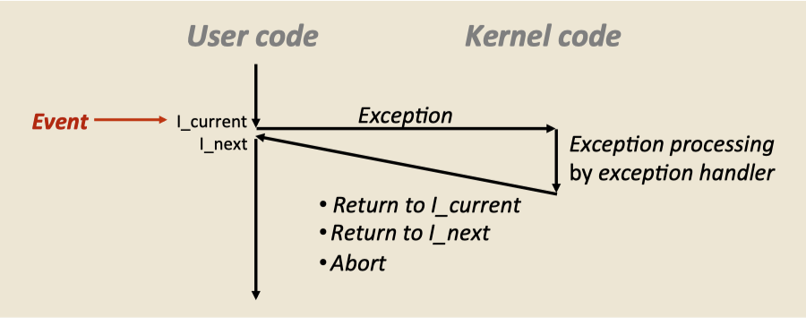
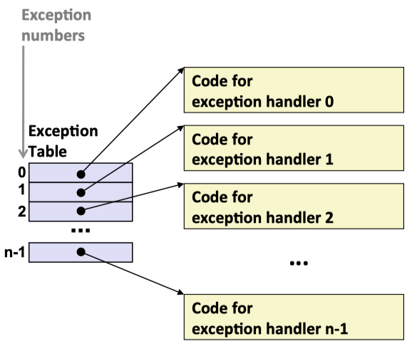
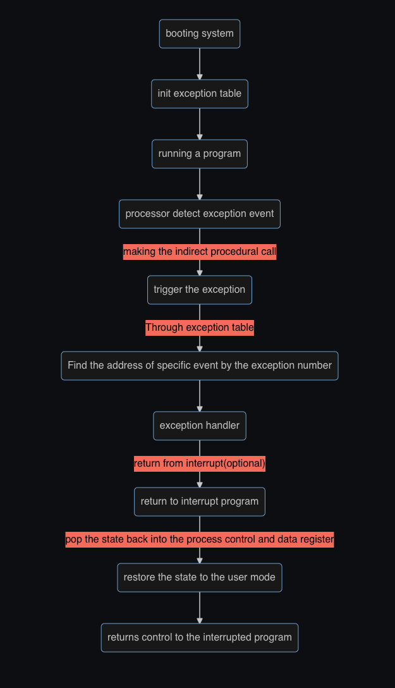
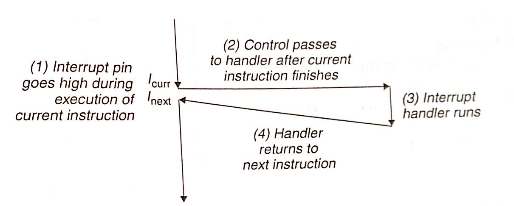
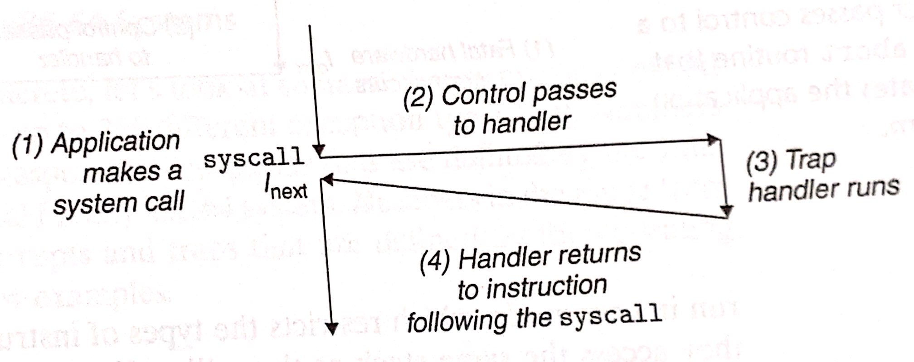
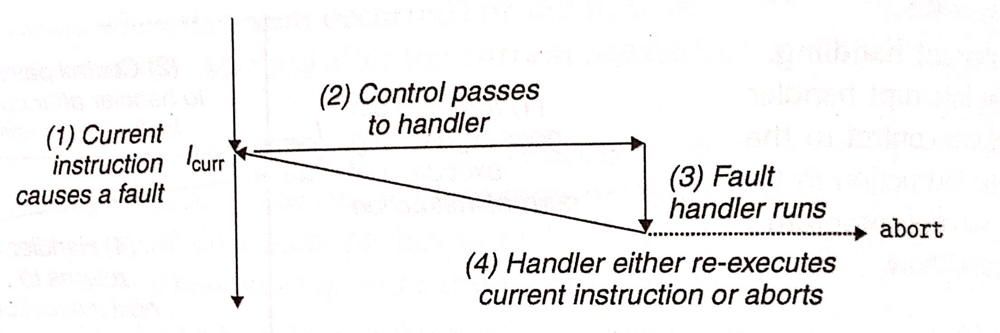
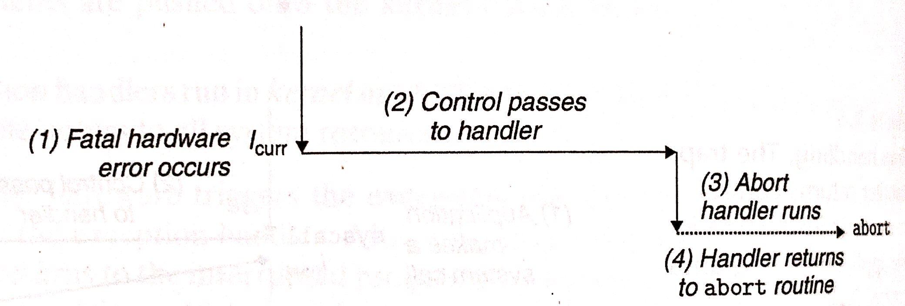

# Shell Lab report

updating now ...

## Problem Description

In this project, I will fulfill a simple Unix shell, where we would complete the empty function body list below:

• `eval`: Main routine that parses and interprets the command line. [70 lines]

• `builtin cmd`: Recognizes and interprets the built-in commands: quit, fg, bg, and jobs. [25 lines]

• `do bgfg`: Implements the bg and fg built-in commands. [50 lines]

• `waitfg`: Waits for a foreground job to complete. [20 lines]

• `sigchld handler`: Catches `SIGCHILD `signals. 80 lines]

• `sigint handler`: Catches `SIGINT `(ctrl-c) signals. [15 lines]

• `sigtstp handler`: Catches `SIGTSTP `(ctrl-z) signals. [15 lines]

All of these function is in `tsh.c`.

### The tsh Specification

+ The prompt should be the string “tsh> ”.

+ The command line typed by the user should consist of a name and zero or more arguments, all separated by one or more spaces. If `name `is a **built-in command**, then `tsh `should handle it immediately and wait for the next command line. Otherwise, `tsh `should **assume that name is the path of an executable file**, which it loads and runs in the context of an initial child process (In this context, the term job refers to this initial child process).

+ Typing `ctrl-c (ctrl-z)` should cause a `SIGINT (SIGTSTP)` signal to be sent to the current foreground job, as well as any descendents of that job (e.g., any child processes that it forked). If there is no foreground job, then the signal should have no effect.

+ If the command line ends with an ampersand `&`, then tsh should run the job in the background.

  Otherwise, it should run the job in the foreground.

+ Each job can be identified by either a process ID (PID) or a job ID (JID), which is a positive integer assigned by tsh. JIDs should be denoted on the command line by the prefix ’%’. For example, “%5” denotes JID 5, and “5” denotes PID 5.

+ `tsh `should support the following built-in commands:
  + The `quit `command terminates the shell.
  + The `jobs `command lists all background jobs.
  + The bg `<job>` command restarts `<job>` by sending it a `SIGCONT `signal, and then runs it in the background. The `<job> `argument can be either a **PID** or a **JID**.
  + The fg `<job>` command restarts `<job>` by sending it a `SIGCONT `signal, and then runs it in the foreground. The `<job> `argument can be either a **PID** or a **JID**.
+ `tsh `should reap all of its zombie children. If any job terminates because it receives a signal that it didn’t catch, then tsh should recognize this event and print a message with the job’s PID and a description of the offending signal.

## Background

### Exceptional Control Flow

From startup to shutdown, a CPU simply reads and executes(interprets) a sequence of instructions `i`, and one time, where it change the address `a_k` to `a_(k+1)`. Those instructions call the **control flow**. 

Up to now, there have two mechanisms for **changing the control flow**:

+ Jumps and branches
+ Call and return

React to changes in **program state**. Normally, the instruction `ik` and `ik+1` are adjacent with each other in the memory address and do the smooth flow changes unless an abrupt change occurred in the control flow.

However, only these control flows are not enough, because it is hard to deal with the **system state changes**, which is not related to the execution of the program. Such as I/O operation or data comes in the network adapter. This makes us introduce **Exceptional Control Flow(ECF)**. Exceptional Control flow occurs at all levels of a computer system.

+ At the **hardware level**, event detected by the **hardware trigger** abrupt control transfers to the exceptional handler.
+ At the **operating system level**, the kernel transfer control from one user process to another via **context switch**.
+ At the **application level**, a prcess can send a signal to another process that abruptly transfer control  to a **signal handler** in the recipient.
+ An **individual program** can react to errors by **sidestepping the usual call/return stack discipline** and **making nonlocal jumps** to arbitrary locations in other functions.

Applications request service from the operating systems(OS kernel) by using a form of ECF known as a **trap** or **system call**.

### Exception

The exception implemented partly by the hardware and the operating system. Also, an exception is a transfer of control to OS kernel in response to some change in the processor's state, where the state is encoded in various significant bits and siginal inside the process. Note that the change in state is known as an event. The event might directly related to the execution of the current instrcution.

When the processor detects that the event has occurred, it makes an indirect procedure call, through the jump table called the exception table, to operating system subrountine(exception handler) that is specifically designed to process this particular kind of event.

When the exception occurred, one of three things happened, which depending on the type of event that caused exception:

1. The handler returns control to the current instrcution `I_curr`, the instruction that was executing when the event not occurred.
2. The handler returns contorl to `I_next`, the instruction that would have executed next had the exception not occurred.
3. The handler aborts the interrupted program.

The exception state transfer, the figure from <a href = "https://www.cs.cmu.edu/afs/cs/academic/class/15213-f15/www/lectures/14-ecf-procs.pdf">cmu-213 slide</a>

Exception can be divided into four classes:

1. interrupts
2. traps
3. faluts
4. aborts

### Exception Handler

Each type of possible exception in a system is assigned a **unique nonnegative integer exception number**. Some of these numbers are assigned by the designers of the **process**, whereas other numbers are assigned by the **operating system** kernel(the memory-resident part of the operating system). 

At **system boot time**, the operating system allocates and initializes a **jump table** called **exception table** so that entry k contains the address of the handler of exception k. At **run time**, the processor detects that an event has occurred and determines the corresponding exception number k. The processor then triggers the exception by making an indirect procedual call, through entry k of the exception table, to the exception handler. Specifially, **the exception number is the index of exception table**, whose starting address is contained in a special CPU resgister called ***exception table base register***.

Once the hardware triggers the exception, the exception handler start to process the event. After that, it optionally returns to the interrupted program by executing a special **"return from interrupt"** instruction, which pops the appropriate state back into the process control and data register, restore the state to the user mode if the exception interrupted a user program, and then returns control to the interrupted program.

 
  

The exception table, the figure from <a href = "https://www.cs.cmu.edu/afs/cs/academic/class/15213-f15/www/lectures/14-ecf-procs.pdf">cmu-213 slide</a>

  

#### Difference between **Exception** and **Procedure Call**:

+ **Return Address**: as with the **procedural call**, the processor pushes a return address on the stack before branching to the handler. Whereas, for the exception, the return address id either the current instruction or the next instruction.
+ The processor also pushes some additional processor state onto the stack that will be necessary to restart the interrupted program when the handler returns.
+ When the control is being transferred from a user program to the kernel, all of these items are pushed onto **the kernel's stack rather than user's stack.**
+ Exception handler run in **kernel mode**. 

**The exception can divided by:**

1. Asynchronous Exceptions:
   + Interrupts
2. Synchronous Exceptions:
   + Traps
   + Faults
   + Aborts

### Interrupt(Asynchronous Exceptions)

Interrupts occur asynchronously as a result of signal from I/O devices that are external to the processor.

Process:

1. Hardware Interrupt are asychronous in the sense that they are not caused by the execution of any particular instruction.Exception handlers for hardare interrupt are often called **interrupt handlers**.
2. The processor notices that the **interrupt pin has go high**, reads the exception number from system bus.
3. The processor calls the appropriate  interrupt handler.
4. When handler returns, it returns the control to the next instruction in the control flow.

 
  

The interrupt work flow, this figure is from the book <a href = "http://csapp.cs.cmu.edu/3e/home.html">CS:APP3e</a>  chapter 8

### Synchronously Exceptions(Faulting Instruction)

#### Traps and System Calls

Traps are intentional exceptions that occur as a result of executing an instruction. Like interrupt handlers, trap handlers return contorl to the next instruction. **The most important use of traps is to provide a procedural-like interface between user program and the kernel**, known as **system call**.

To allow controlled access to such kernel services, process provides a special `syscall` instruction that user programs can execute when they are request the related service. Executing the `syscall` instruction cause a trap to an exception handler taht decodes the argument and calls the appropriate kernel routine.

From the programmer's perspective, a system call is identical to a regular function call, where the regular function runs in the **user mode**, which restricts the types of some higher privilege instructions they can execute, and they access the same stack as the calling function. Whereas the system call runs in the **kernel mode**, which allows it executes privileged instrctions and access a stack defined in the kernel.

 
  

The traps work flow, this figure is from the book <a href = "http://csapp.cs.cmu.edu/3e/home.html">CS:APP3e</a>  chapter 8

#### Faluts

Faults result from **error conditions** that a handler might be able to correct. When fault occurred, the processor transfers control to the fault handler. If the fault handler is able to correct the error condition, and then it returns control to the faulting instruction. Otherwise, the handler returns to an `abort` routine in the kernel that terminates the application program that caused fault.

 
  

The fault work flow, this figure is from the book <a href = "http://csapp.cs.cmu.edu/3e/home.html">CS:APP3e</a>  chapter 8

#### Aborts

 
  

The fault work flow, this figure is from the book <a href = "http://csapp.cs.cmu.edu/3e/home.html">CS:APP3e</a>  chapter 8

