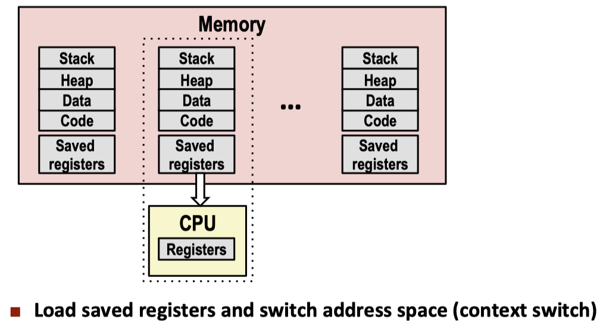
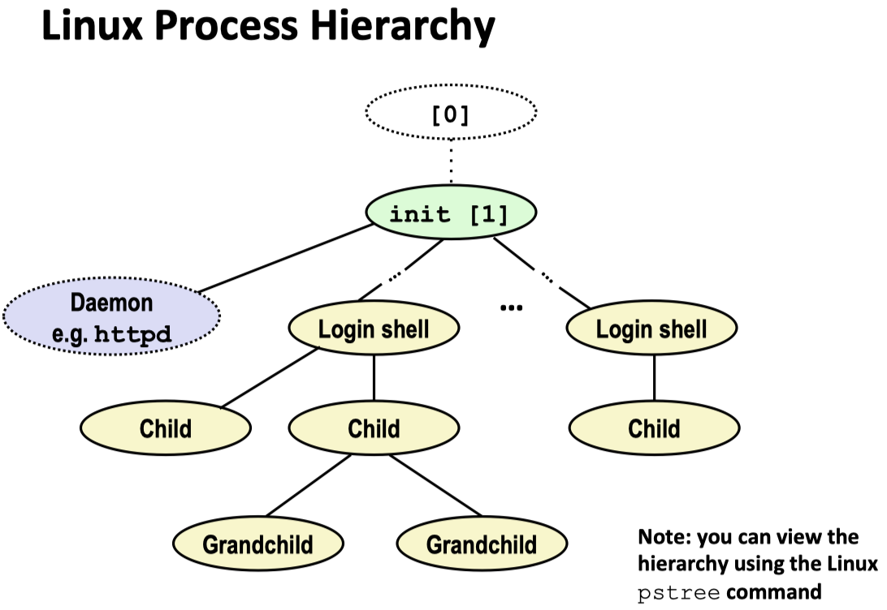
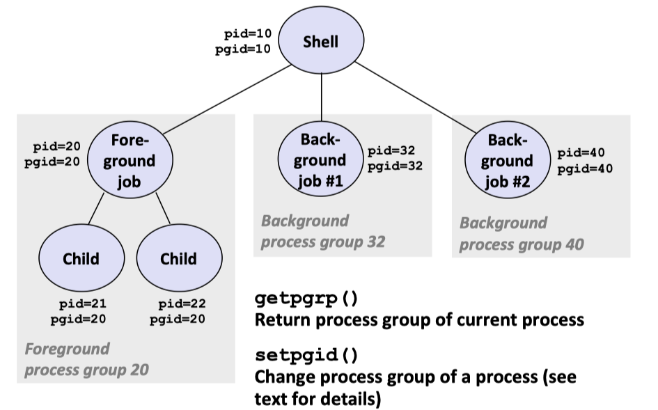
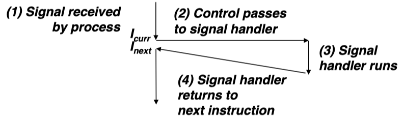

# Shell Lab report

updating ...

## Problem Description

In this project, I will fulfill a simple Unix shell, where we would complete the empty function body list below:

• `eval`: Main routine that parses and interprets the command line. [70 lines]

• `builtin cmd`: Recognizes and interprets the built-in commands: quit, fg, bg, and jobs. [25 lines]

• `do bgfg`: Implements the bg and fg built-in commands. [50 lines]

• `waitfg`: Waits for a foreground job to complete. [20 lines]

• `sigchld handler`: Catches `SIGCHILD `signals. 80 lines]

• `sigint handler`: Catches `SIGINT `(ctrl-c) signals. [15 lines]

• `sigtstp handler`: Catches `SIGTSTP `(ctrl-z) signals. [15 lines]

All of these function is in `tsh.c`.

### The tsh Specification

+ The prompt should be the string `“tsh> ”`.

+ The command line typed by the user should consist of a name and zero or more arguments, all separated by one or more spaces. If `name `is a **built-in command**, then `tsh `should handle it immediately and wait for the next command line. Otherwise, `tsh `should **assume that name is the path of an executable file**, which it loads and runs in the context of an initial child process (In this context, the term job refers to this initial child process).

+ Typing `ctrl-c (ctrl-z)` should cause a `SIGINT (SIGTSTP)` signal to be sent to the current foreground job, as well as any descendents of that job (e.g., any child processes that it forked). If there is no foreground job, then the signal should have no effect.

+ If the command line ends with an ampersand `&`, then tsh should run the job in the background.

  Otherwise, it should run the job in the foreground.

+ Each job can be identified by either a process ID (PID) or a job ID (JID), which is a positive integer assigned by tsh. JIDs should be denoted on the command line by the prefix ’%’. For example, “%5” denotes JID 5, and “5” denotes PID 5.

+ `tsh `should support the following built-in commands:
  + The `quit `command terminates the shell.
  + The `jobs `command lists all background jobs.
  + The bg `<job>` command restarts `<job>` by sending it a `SIGCONT `signal, and then runs it in the background. The `<job> `argument can be either a **PID** or a **JID**.
  + The fg `<job>` command restarts `<job>` by sending it a `SIGCONT `signal, and then runs it in the foreground. The `<job> `argument can be either a **PID** or a **JID**.
+ `tsh `should reap all of its zombie children. If any job terminates because it receives a signal that it didn’t catch, then tsh should recognize this event and print a message with the job’s PID and a description of the offending signal.

## Background

In this section, I just briefly summary some main conception for the exception and the signal. If you would like see more detail, please see the reference book: [CS:APP3e](http://csapp.cs.cmu.edu/3e/home.html).

### Exceptional Control Flow

From startup to shutdown, a CPU simply reads and executes(interprets) a sequence of instructions `i`, and one time, where it change the address `a_k` to `a_(k+1)`. Those instructions call the **control flow**. 

Up to now, there have two mechanisms for **changing the control flow**:

+ Jumps and branches
+ Call and return

React to changes in **program state**. Normally, the instruction `ik` and `ik+1` are adjacent with each other in the memory address and do the smooth flow changes unless an abrupt change occurred in the control flow.

However, only these control flows are not enough, because it is hard to deal with the **system state changes**, which is not related to the execution of the program. Such as I/O operation or data comes in the network adapter. This makes us introduce **Exceptional Control Flow(ECF)**. Exceptional Control flow occurs at all levels of a computer system.

+ At the **hardware level**, event detected by the **hardware trigger** abrupt control transfers to the exceptional handler.
+ At the **operating system level**, the kernel transfer control from one user process to another via **context switch**.
+ At the **application level**, a prcess can send a signal to another process that abruptly transfer control  to a **signal handler** in the recipient.
+ An **individual program** can react to errors by **sidestepping the usual call/return stack discipline** and **making nonlocal jumps** to arbitrary locations in other functions.

Applications request service from the operating systems(OS kernel) by using a form of ECF known as a **trap** or **system call**.

### Exceptions : Hardware and operating system kernel software

The exception implemented partly by the hardware and the operating system. Also, an exception is a transfer of control to OS kernel in response to some change in the processor's state, where the state is encoded in various significant bits and siginal inside the process. Note that the change in state is known as an event. The event might directly related to the execution of the current instrcution.

When the processor detects that the event has occurred, it makes an indirect procedure call, through the jump table called the exception table, to operating system subrountine(exception handler) that is specifically designed to process this particular kind of event.

When the exception occurred, one of three things happened, which depending on the type of event that caused exception:

1. The handler returns control to the current instrcution `I_curr`, the instruction that was executing when the event not occurred.
2. The handler returns contorl to `I_next`, the instruction that would have executed next had the exception not occurred.
3. The handler aborts the interrupted program.

The exception state transfer, the figure from <a href = "https://www.cs.cmu.edu/afs/cs/academic/class/15213-f15/www/lectures/14-ecf-procs.pdf">cmu-213 slide</a>

Exception can be divided into four classes:

1. interrupts
2. traps
3. faluts
4. aborts

### Exception Handler

Each type of possible exception in a system is assigned a **unique nonnegative integer exception number**. Some of these numbers are assigned by the designers of the **process**, whereas other numbers are assigned by the **operating system** kernel(the memory-resident part of the operating system). 

At **system boot time**, the operating system allocates and initializes a **jump table** called **exception table** so that entry k contains the address of the handler of exception k. At **run time**, the processor detects that an event has occurred and determines the corresponding exception number k. The processor then triggers the exception by making an indirect procedual call, through entry k of the exception table, to the exception handler. Specifially, **the exception number is the index of exception table**, whose starting address is contained in a special CPU resgister called ***exception table base register***.

Once the hardware triggers the exception, the exception handler start to process the event. After that, it optionally returns to the interrupted program by executing a special **"return from interrupt"** instruction, which pops the appropriate state back into the process control and data register, restore the state to the user mode if the exception interrupted a user program, and then returns control to the interrupted program.

 
  

The exception table, the figure from <a href = "https://www.cs.cmu.edu/afs/cs/academic/class/15213-f15/www/lectures/14-ecf-procs.pdf">cmu-213 slide</a>

  

#### Difference between **Exception** and **Procedure Call**:

+ **Return Address**: as with the **procedural call**, the processor pushes a return address on the stack before branching to the handler. Whereas, for the exception, the return address id either the current instruction or the next instruction.
+ The processor also pushes some additional processor state onto the stack that will be necessary to restart the interrupted program when the handler returns.
+ When the control is being transferred from a user program to the kernel, all of these items are pushed onto **the kernel's stack rather than user's stack.**
+ Exception handler run in **kernel mode**. 

**The exception can divided by:**

1. Asynchronous Exceptions:
   + Interrupts
2. Synchronous Exceptions:
   + Traps
   + Faults
   + Aborts

### Interrupt(Asynchronous Exceptions)

Interrupts occur asynchronously as a result of signal from I/O devices that are external to the processor.

Process:

1. Hardware Interrupt are asychronous in the sense that they are not caused by the execution of any particular instruction.Exception handlers for hardare interrupt are often called **interrupt handlers**.
2. The processor notices that the **interrupt pin has go high**, reads the exception number from system bus.
3. The processor calls the appropriate  interrupt handler.
4. When handler returns, it returns the control to the next instruction in the control flow.

 
  

The interrupt work flow, this figure is from the book <a href = "http://csapp.cs.cmu.edu/3e/home.html">CS:APP3e</a>  chapter 8

### Synchronously Exceptions(Faulting Instruction)

#### Traps and System Calls

Traps are intentional exceptions that occur as a result of executing an instruction. Like interrupt handlers, trap handlers return contorl to the next instruction. **The most important use of traps is to provide a procedural-like interface between user program and the kernel**, known as **system call**.

To allow controlled access to such kernel services, process provides a special `syscall` instruction that user programs can execute when they are request the related service. Executing the `syscall` instruction cause a trap to an exception handler taht decodes the argument and calls the appropriate kernel routine.

From the programmer's perspective, a system call is identical to a regular function call, where the regular function runs in the **user mode**, which restricts the types of some higher privilege instructions they can execute, and they access the same stack as the calling function. Whereas the system call runs in the **kernel mode**, which allows it executes privileged instrctions and access a stack defined in the kernel.

By convention, register `%rax` contains the syscall number, with up to six arguements: `%rdi`, `%rsi`,`%rdx`, `%r10`,`%r8` and `%r9`. On return from the system call, register `%rcx` and `%r11` are destroyed, and `%rax` contains the return value. Negative value is an error corresponding to negative `errno`.

 
  

The traps work flow, this figure is from the book <a href = "http://csapp.cs.cmu.edu/3e/home.html">CS:APP3e</a>  chapter 8

#### Faluts

Faults result from **error conditions** that a handler might be able to correct. When fault occurred, the processor transfers control to the fault handler. If the fault handler is able to correct the error condition, and then it returns control to the faulting instruction. Otherwise, the handler returns to an `abort` routine in the kernel that terminates the application program that caused fault.

 
  

The fault work flow, this figure is from the book <a href = "http://csapp.cs.cmu.edu/3e/home.html">CS:APP3e</a>  chapter 8

#### Aborts

Aborts result from unrecoverable fatal errors, typically hardware errors. **Aborts handlers never return control to the application program**.

 
  

The fault work flow, this figure is from the book <a href = "http://csapp.cs.cmu.edu/3e/home.html">CS:APP3e</a>  chapter 8

### Process

A process is an **instance of a program in execution**. Each program in the system runs in the **context** of some process. The context consist of the state that the program needs to run correctly, where the state includes:

+ the program's code 
+ data stored in memory
+ its stack
+ the contents of the general-purpose register
+ its program counter
+ environment variables
+ the set of open file descriptors.

Each time a user runs a program by typing the name of an executable object file to the shell, and then shell creates a new process and then runs the executable object file in the context of this new process. Application programs can also create new processes and run either their own code or other applications in the context of the new process.

Process provides each program with **two key abstractions**:

+ **Logical control flow:**

  The logical control flow is a **sequence of program counter values** that corresponded exclusively to instructions contained in our program's executable object file or in shared linked into our program dynamically at run time, where program counter is a 16 bit register that holds the address of the next instruction.

+ **Private address space:**

  Each program seems to have exclusive use of main memory. This space is private in the sense that a byte of memory associated with a particular address in the space cannot in general be read or write by any other process. The private address space is provided by kernel mechanism called virtual memory.

#### User and Kernel Mode

The processor typically provides the capability of restricting the instruction that an application can execute, where this capability set by a mode bit in some control register characterizes the privileges. Specifically, when the bit is set, the process is running in `kernel mode`, otherwise, the process running in `user mode`. A process running in the `user mode` is not allowed to execute privileged instructions nor is it allowed to directly reference code or date in the kernel area of the address space, whereas the process in the `kernel mode` can execute any instruction in the instruction set and access any memory location in the system. **The only way for the process to change from the user mode to the kernel mode is via an exception such as `a interrupt`,` a fault`, or `a trapping system call`.** 

Linux provides a mechanism called `/proc system` that allows user mode processes to access the content of kernel data structure.

### Context Switch : Hardware timer and kernel software

The context is the state that the kernel needs to restart a preempted process. It consist of

+ general-purpose register
+ the floating-pointer register
+ the program counter
+ user's stack
+ status register
+ kernel's stack
+ page table
+ a process table
+ a file table

 
  

Context Switch, the figure from <a href = "https://www.cs.cmu.edu/afs/cs/academic/class/15213-f15/www/lectures/14-ecf-procs.pdf">cmu-213 slide</a>

A context switch can occur in the following situation:

+ The kernel is executing a system call on behalf of the user. If the system call blocks because it is waiting for some event to occur, then the kernel can put the current process to sleep and switch to another process.
+ As a result of an interrupt.

### Process Control

####  `exit()`

Terminate the process with an *exit status* of status.

#### `fork()`: 

A parent process creates a new running child process, where the newly created child process gets an identical copy from the parent process's user-level virtual address space(code, data segment, heap, shared libraries, user stack and its open file descriptors). However, the pid between child and parent are different. In other words, child process duplicates the context of their parent but has a separate address space, where both of them have their own private address space and any subsequent changes of the variable that parent or child makes are private and not reflected in the memory of the other process.

Also, the `fork()` function **called once but it returns twice**: once in the calling process(the parent); and once in the newly created child process. In parent, `fork()` returns the PID of the child, whereas `fork()` returns a value of 0 for the child, where both parent and child are run concurrently.

Furthermore, **the child inherits all the parent's open files**, and thus it can get the same output as their parent does for the same file.

When a process terminates for any reason, the kernel does not remove it from the system immediately. Instead, t**he process is kept around in a terminated state until it is reaped by its parent**, which called ***zombie***. When parent process terminates, the kernel arranges for the init process(PID = 1, launched at the system startup) to become the adopted parent of  any orphaned children.

#### `wait()`

A process waits for its children to terminate or stop by calling the `waitpid()` or `wait()`(simpler version) function. Parent reaps a child by calling the wait function In other words, it suspends current process un;l one of its children terminates and return value is the pid of the child process that terminated. 

#### `execve()`

Loading and running the executable object file *filename* with the argument list *argv* and the environment variable *envp*. `execve` returns to the calling program only if there is an error. In the most of case, `execve` **call once and never return**.

Furthermore  `execve` overwrites code, data and stack for the current process but retains PID, open files and signal context.

### Shell

Normally, if want to create a newly process, we often use `fork()` to create separate address space and use `execve()` to replace the context in that space.

A **shell** is an interactive application-level program that runs programs on behalf of the user. A shell performs a sequence of *read/evaluate* steps and then terminates. Specifically, the read step reads a command line from the user and the evaluate step parses the command line and runs programs on behalf of the user.

 
  

Linux Process Hierarchy, the figure from <a href = "https://www.cs.cmu.edu/afs/cs/academic/class/15213-f15/www/lectures/15-ecf-signals.pdf">cmu-213 slide</a>

### Signal : kernel software and application software

A signal is a small message that notifies a process that an event of some type has occurred in the system, where the signal happened in a higher-level software form of exceptional control flow that allows the process and the kernel to interrupt other processes. Each signal type corresponds to some kind of system event. Low-level hardware exceptions are processed by the kernel's exception handlers and would not normally be visible to user process. **Signal provide a mechanism for exposing the occurrence of such exception to user process**. **Only information in a signal is its ID** and the fact that it arrived.

#### Sending Signal

The kernel *sends(delivers)* a signal to a destination process by updating some state in the context of the destination process when:

+ the kernel has detected a system event.

+ A process has invoked the ***kill*** system call(`/bin/kill` in Unix) to explicitly request

  the kernel to **send a signal** to the destination process, where **`kill `system call does not kill any process** unless you pass the related signal(`SIGKILL`) to kill it.

 For example:

we can use `linux > /bin/kill -9 15213` to send signal number 9(`SIGKILL`) to process/process group 15213.

##### Process Group

Every process belongs to exactly one **process group**, which is identified by a positive integer **process group ID**. By default, a child process belongs to the same process group as its parent.

 
  

Process group, the figure from <a href = "https://www.cs.cmu.edu/afs/cs/academic/class/15213-f15/www/lectures/15-ecf-signals.pdf">cmu-213 slide</a>

#### Receiving a Signal

A destination process receives a signal when it is **forced by the kerne**l to react in some way to the delivery of the signal.

The process can either: **terminate the process**, **ignore** or **catch** the signal by executing a user-level function called a **signal handler**.

 
  

Receving the signal, the figure from <a href = "https://www.cs.cmu.edu/afs/cs/academic/class/15213-f15/www/lectures/15-ecf-signals.pdf">cmu-213 slide</a>

When the kernel switches a process p from kernel mode to user mode, it checks the set of unblocked pending signals(`pnb = pending & ~blocked`). If this set `pnb` is empty, then the kernel passes the control to the next instruction in the logical flow of p. Otherwise, the kernel will choose least nonzero bit `k `in `pnb` and force process p  to receive signal `k` and repeat this operation until `pnb` is zero.

Each signal type has a predefined ***default action***:

+ The process terminates.
+ The process terminates and dump core.
+ The process stops until restarted by a `SIGCONT` signal.
+ The process ignore the signal.

Note that **`signal` system call does not actually signal anything but modify the default action accociate with some signal.** The only exceptions are `SIGSTOP `and `SIGKILL`, whose default actions cannot be changed.

The signal function are change the action associated with a signal  `signum` in one of three ways:

+ If the handler is `SIG_IGN`, then signals of type `signum` are ignored.
+ If the handler is `SIG_DFL`, then the action of signals of type `signum` reverts to the default action.
+ Otherwise, handler is the address of a **user-defined function**, called a `signal handler`, that will be called whenever the process receives a signal of type `signum`. 
  + Changing the default action by **passing the address of a handler** to the `signal` function is known as ***installing the handler***. 
  + The **invocation of the handler** is called ***catching the signal***.
  + The **execution of the handler** is referred to as ***handling the signal***.

When a process catches a signal of type k, the handler installed for signal k is invoked with a single integer argument set to k. This argument allows **the same handler function to catch different types of signals**.

When the handler executes its *return* statement, control(usually) **passes back to the instruction in the control flow** where the process was interrupted by the receipt of the signal.

#### Pending and Blocked Signal

A signal that has been sent but not yet received is called a **pending signal**. At any point in time, there can be at most one pending signal of a particular type. **A pending signal is received at most once**. If a process has a pending signal of type k, then any subsequent signals of type k sent to that process are not queued; they are simply discard.

A process can selectively block the receipt of certain signals. When a signal is blocked, it can be delivered, but the resulting pending signal will not be received until the process unblock the signal. 

For each process, the kernel **maintains the set of pending signals** in the pending bit vector, and **the set of blocked signals** in the **blocked bit vector**. The kernel sets bit k in pending whenever a signal of type k is delivered and clears bit k in pending whenever a signal of type k is received.

In Linux, it provides **implicit** and **explicit** mechanisms for blocking signal: 

+ ***Implicit blocking mechanism***: By default, the kernel blocks any pending signals of the type currently being **processed by a handler**.
+ ***Explicit blocking mechanism***: Application can explicitly block/unblock selected signal using the `sigprocmask` function and its helpers.
  + *SIG_BLOCK*: add the signal in set to blocked(blocked = blocked | set).
  + *SIG_UNBLOCK*: Remove the signals in set from blocked (blocked = blocked & ~set).
  + *SIG_SETMASK*: blocked = set.
  + If `oldset `is non-NULL, the previous value of the blocked bit vector is stored in `oldset`.

#### Guidelines for Wri&ng Safe Handlers

+ G0: Keep your handlers as simple as possible
+ G1: Call only async‐signal­‐safe functions in your handlers
+ G2: Save and restore `errno `on entry and exit
+ G3: Protect accesses to shared data structures by **temporarily blocking all signals**.
+ G4: Declare global variables as `volatile`
+ G5: Declare global flags as `volatile sig_atomic_t`
   + flag: variable that is only read or wriien (e.g. flag = 1, not flag++)
   + Flag declared this way does not need to be protected like other globals

`SIGCHLD`: This signal is used to change the child process's state. When parent create a child process, instead of waiting for child process terminated, parent will do the other work until child process send the `SIGCHLD` signal(the kernel send the `SIGCHLD` signal to parent when one of its child process terminates or stops). After parent received/caches the signal, it will recap this child process.
