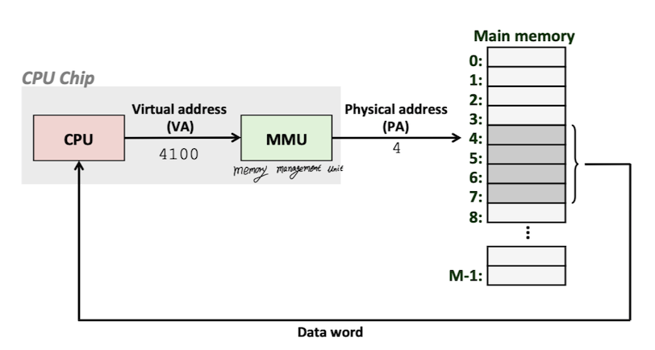

# Malloc Lab Report
Updating ...

## Background

### Virtual Memory

Virtual memory provides three important capabilities:

1. It uses main memory efficiently by **treating it as a cache** for an address space stored on disk, **keeping only the active areas in main memory** and transferring data back and forth between disk and memory as needed.
2. It simplifies memory management by providing each process with a **uniform address space**.
3. It **protects** the address space of each process from **corruption by other processes**.

With virtual memory, the CPU accesses main memory by generating a virtual address(VA), which is converted by the appropriate physical address before being sent to main memory. The task of **converting a virtual address to physical address** is known as ***address translation***.

Dedicated hardware on the CPU chip called the **memory management unit(MMU)** translates virtual addresses on the fly, using a lookup table stored in main memory whose content are managed by the operating system.

The address translation, the figure from <a href = "https://www.cs.cmu.edu/afs/cs/academic/class/15213-f15/www/lectures/17-vm-concepts.pdf">cmu-213 slide</a>

