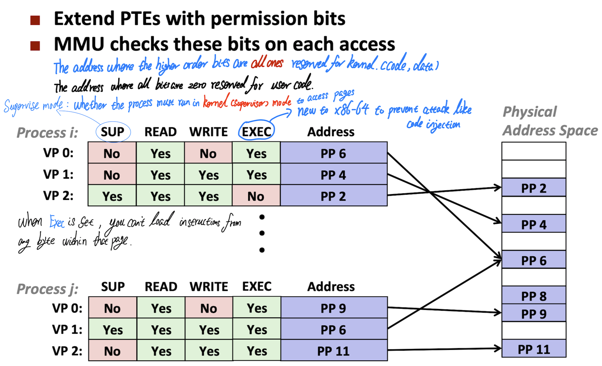

# Malloc Lab Report
Updating ...

## Background

### Virtual Memory

Virtual memory provides three important capabilities:

1. It uses main memory efficiently by **treating it as a cache** for an address space stored on disk, **keeping only the active areas in main memory** and transferring data back and forth between disk and memory as needed.
2. It simplifies memory management by providing each process with a **uniform address space**.
3. It **protects** the address space of each process from **corruption by other processes**.

With virtual memory, the CPU accesses main memory by generating a virtual address(VA), which is converted by the appropriate physical address before being sent to main memory. The task of **converting a virtual address to physical address** is known as ***address translation***.

Dedicated hardware on the CPU chip called the **memory management unit(MMU)** translates virtual addresses on the fly, using a lookup table stored in main memory whose content are managed by the operating system.


<p align="center">The address translation, the figure from <a href = "https://www.cs.cmu.edu/afs/cs/academic/class/15213-f15/www/lectures/17-vm-concepts.pdf">cmu-213 slide</a></p>

#### Address Spaces

An address space it an ordered set of nonnegative integer addresses `{0, 1, 2, ...}`.

If the integer in the address space are consecutive, then we say that it is a ***linear address space***.

In a system with virtual memory, the CPU generates virtual addresses from an addpress space of `𝑵 = 2ⁿ` called the ***virtual address space***: `{0, 1, 2, ..., 𝑵 - 1}`, where the size of an address space is characterized by the number of bits that are needed to represent the largest address. For example, a virtual address space with `𝑵 = 2ⁿ`  is called **n-bit address space**(such as 32-bit or 64-bit address space).

A system also has a physical address space that corresponds to the 𝑴 bytes of physical memory in the system: `{0, 1, 2, ..., 𝑴 - 1}`, where **𝑴 is not required to be a power of 2**.


Conceptually, a virtual memory is organized as **an array of N contiguous by-size cells stored on disk**, where each byte has a unique virtual address that serves as an index into the array. **The contents of the array on disk are cached in main memory.** 

As with any other cache in the memory hierarchy, the data on disk(the lower level) is partitioned into blocks that serve as the transfer units between disk and the main memory(the upper level). VM systems handle this by partioning the virtual memory into fixed-size blocks called ***virtual pages(VPs)***. Each virual page is `𝑷 = 2ᵖ` bytes in size.

Similarly, physical memory is partitioned into ***physical pages(PPs)***,also 𝑷 bytes in size. (Physical pages are also referred as ***page frames***)

At any point in time, the set of virtual pages is partitioned into **three disjoint subset**:

+ `Unallocated`. Pages that **have not yet been allocated(or created)** by the VM system. Unallocated blocks do not have any data associated with them, and thus do not occupy any space on disk.
+ `Cached`: Allocated pages that are **currently cached** in physical memory.
+ `Uncached`: Allocated pages that are **not cached** in physical memory.


<p align="center">The mapping between VPs -> PPs, the figure from <a href = "https://www.cs.cmu.edu/afs/cs/academic/class/15213-f15/www/lectures/17-vm-concepts.pdf">cmu-213 slide</a></p>

Because of the large miss penalty and the expense of accessing the first byte(disk is about 100,000 times slower than a DREAM), virtual page tend to be large－typically 4KB to 2MB. Due to the large miss penalty, **DRAM caches are fully assoicative; that is, any virtual page can be placed in any physical page** and also it requires a “large” mapping function.

Finally, because of the large access time of disk, **DRAM caches always use write-back instead of write-through**, where virual memory system try to **defer writing** anything back to the disk as long as possible.

#### Page Tables

As with any cache, the VM system must have some way to determine if a virtual page is cached somewhere in DRAM. If so, the system must determine which page it is cached in. If there is a miss, the system must determine where the virtual page is stored on disk. select a victim page in physical memory, and copy the virtual page from disk to DRAM, replacing the victim page. 

These capabilities are provided by a combination of

+ Operating system software;
+ Address translation in the ***MMU(Memory Management Unit)***, where **MMU** converts a logical address through a hardware call ***segmentation unit*** and then another hardware called ***paging unit***, which converts linear address into physical address.
+ A data structure stored in physical memory known as a ***page table*** that maps virtual pages to physical pages. The address translation hardware reads the page table each time it converts a virtual address to a physical address.


**The operating system is responsible for maintaining the contents of the page table and transferring pages back and forth between disk and DRAM.**

A page table is an array of ***page table entry(PTE)***. **Each page in the virtual address space has a PTE at a fixed offset in the page table.** 


<p align="center">Page Table, the figure from <a href = "https://www.cs.cmu.edu/afs/cs/academic/class/15213-f15/www/lectures/17-vm-concepts.pdf">cmu-213 slide</a></p>

In the picture above:

+ valid bit is set, that means the current page is cached in DRAM
+ valid bit is not set:
  + a null address indicates that the virtual page has not yet been allocated.
  + otherwise, the address points to the start of the virtual page on disk(not cached).

**Page Hit:** reference to VM word that is in physical memory(DRAM cache hit).

**Page Faults:** In virtual  memory parlance, **a DRAM cache miss known as a page fault**, where it reference to VM word that is **not in physical memory**. Page fault causes the transfer of chunk of code in the kernel called ***page fault handler***, which select a victm page.  

+ When CPU reference a word VP but that word has not in the memory, **a page fault exception** will be triggered and that exception then invoke a **page fault exception** handler in the kernel.
+ Next, the kernel copies **VP(virtual page) from disk to PP(physical page)** in memory, **updates PTE(page table entry)** and then returns.
+ When the handler returns, it restarts the faulting instruction, which **resends the faulting virtual address to the address translation hardware(MMU)**.
+ In the final, MMU check PTE again and fetch it.

For the terminology perspective, blocks in DRAM(main memory) and SRAM(cache memory) is known as ***pages***. 

The activity of transferring a page between disk and memory is known as ***swapping*** or ***paging***.

Pages are ***swapped in***(paged in) from disk to DRAM, and ***swapped out***(paged out) from DRAM to disk.

The strategy of **waiting until the last moment** to swap in a page, when a miss occurs, is known as ***demand paging***.


Although the total number of distinct pages that programs reference during an entrie run might exceed the total size of physical memory, **the principle of locality** promises that any any point in time they will tend to work on a **smaller set** of ***active pages*** known as the ***working set*** or ***resident set***.

If the working set size exceeds the size of physical memory, then the program can produce an unfortunate situation known as thrashing, where pages are swappe in and out continuously.

#### VM as a Tool for Memory Management

In fact, operating systems provide **a separate page table**, and thus **a separate virtual address space**, for each process.

Notice that **multiple virtual page can be mapped to the same shared physical page**.

The combination of demand pageing and separate virtual address space has a profound impact on the way that memory is used and managed in a system. In paricular, **VM simplifies linking and loading, the sharing of code and data, and allocating memory to applications**.

+ ***Simplifying Linking***: a separate address space allows each process to use the same basic format for its memory image, regardless of where the code and data actually reside in physical memory. 

  For example, 64-bit address space in Linux:

  + **the code segment always starts at virtual address 0x400000.** 
  + The data segment follows the code segment after a suitable alignment gap.
  + The stack occupies the highest portion of the user process address space and grows downward.

+ ***Simplifying loading***: To load `.text` and `.data` sections of an object file into a **newly created process**, the Linux loader(`execve`) allocates virtual pages for the code and data segments, **marks them as invalid**(i.e. not cached) and **points their page table entries to the appropriate locations** in the object file. 

  The interesting point is that the **loader never actually copies any data from disk into memory**. 

  The data are paged in automatically and on demand by the virtual memory system the first time each page is referenced, either by **the CPU** when it fetches an instruction or by an **executing instruction** when it references a memory location.

  This notion of mapping a set of contiguous virtual pages to an arbitrary locaiton in an arbitrary file is known as ***memory mapping***. Linux provides a system call called `mmap `that allows application programs to do their own memory mapping.

  

  <p align="center">Memory layout, the figure from <a href = "https://www.cs.cmu.edu/afs/cs/academic/class/15213-f15/www/lectures/17-vm-concepts.pdf">cmu-213 slide</a></p>

+ ***Simplifying sharing***: Separate address spaces provide the operating system with a consistent mechanism for managing sharing between user processes and the operating system itself.

  In general, **each process has it own private code, data, heap, and stack areas** that are not shared with any other process. In this case, the operating system creates page tables that map the corresponding virual pages to disjoint physical pages. However, in some instances it is desirable for processes the share code and data.

  For example, every process must call the same operating system kernel code, and every C program makes calls to routines in the standard C library such as `printf`. Rather than including separate copies of the kernel and standard C library in each process, the operating system can arrange for multiple processes to share a single copy of the code by **mapping the appropriate virtual pages in different processes to the same physical pages**.

  

  <p align="center">VM provides separate address spaces, the figure from <a href = "https://www.cs.cmu.edu/afs/cs/academic/class/15213-f15/www/lectures/17-vm-concepts.pdf">cmu-213 slide</a></p>

+ ***Simplifying memory allocation***: When a program running for allocating additional memory to user processes. When a program running in a user process requests additional heap space, the operating system allocates an appropriate number, say 𝐾, of contiguous virtual memory pages, and **maps them to 𝐾 arbitrary physical pages** located anywhere in physical memory. Because of the way page tables work, there is no need for the operating system to locate 𝐾 contiguous pages of physical memory. **The pages can be scattered randomly in physical memory**. 

### VM as a Tool for Memory Protection

Providing separate virtual address space makes it easy to isolate the private memories of different processes. But the address translation mechanism can be extended in an natural to provide more finer access control. Since the address translation hardware reads a PTE each time the CPU generates an address, it is straightforward to control access to the content of a virtual page by adding some additional permission bits to PTE.

Specifically:

+ A user process should not be allowed to modify its read-only code setion;
+ A user process should be allowed to read or modify any of the code and data structures in the kernel;
+ A user process should not be allowed to read or write the private memory of other processes;
+ A user process should not be allowed to modify any virtual pages that are shared with other processes, unless all parties explicitly allow it.(via calls to explicit interprocess communication system calls)



<p align="center">VM Protect the Memory as a Tool, the figure from <a href = "https://www.cs.cmu.edu/afs/cs/academic/class/15213-f15/www/lectures/17-vm-concepts.pdf">cmu-213 slide</a></p>

+ Processes running in ***kernel mode*** can access any page, but processes running in ***user mode*** are only allowed to access the pages fpr which **SUP is 0**.
+ The READ and WRITE bits contorl read and write access to the page.
+ If the instruction violates these permissions, then the CPU triggers a **general protection fault** that transfers control to an exception handler in the kernel, which sens a `SIGSEGV `signal to the offending process. Linux typically report this exception as a `segmentation fault`.

#### Address Translation

Formally, address translation is a  mapping between the elements of an 𝑁-element virtual address space(VAS) and 𝑀-element physical address space(PAS), `MAP: VAS ⟹ PAS U {∅}`, where 𝑁 usually larger than 𝑀


<p align="center">Address translation equation, the figure from <a href = "https://www.cs.cmu.edu/afs/cs/academic/class/15213-f15/www/lectures/17-vm-concepts.pdf">cmu-213 slide</a></p>


<p align="center">How MMU uses the page table to perform the mapping, the figure from <a href = "https://www.cs.cmu.edu/afs/cs/academic/class/15213-f15/www/lectures/17-vm-concepts.pdf">cmu-213 slide</a></p>

A control register in the CPU, the ***page table base register(PTBR)*** points to  the current page table. 

The 𝒏-bit virtual  address has two components: 

+ a 𝒑-bit ***virtual page offset(VPO)*** 
+ an (𝒏 - 𝒑)-bit ***virtual page number(VPN)***

The **MMU** uses the **VPN** to select the appropriate **PTE**. 

The corresponding physical address is the concatenation of the **physical page number** from **the page table entry** and the **VPO** from the virtual address.

Notice that since the physical and virtual pages are both 𝑷 bytes, ***the physical page offset(PPO)*** is identical to the ***VPO***.

##### Address Translation: Page Hit


<p align="center">Page hit in the address translation, the figure from <a href = "https://www.cs.cmu.edu/afs/cs/academic/class/15213-f15/www/lectures/17-vm-concepts.pdf">cmu-213 slide</a></p>

​    ⓵       Processor sends virtual address to MMU

​    ⓶-⓷ MMU fetches PTE from page table in memory

​    ⓸      MMU sends physical address to cache/memory

​    ⓹      Cache/memory sends word to processor

##### Address Translation: Page fault


<p align="center">Page fault in the address translation, the figure from <a href = "https://www.cs.cmu.edu/afs/cs/academic/class/15213-f15/www/lectures/17-vm-concepts.pdf">cmu-213 slide</a></p>

​    ⓵       Processor sends virtual address to MMU

​    ⓶-⓷ MMU fetches PTE from page table in memory

​    ⓸       Valid bit is zero, so MMU triggers page fault exception

​    ⓹       Handler identifies victim(and, if dirty, page it out to disk)

​    ⓺       Handlerr pages in new page and updates PTE in memory

​    ⓻       Handler returns to original process, restarting faulting instruction

   #### Speeding Up Address Translation with a TLB(Translation Lookaside Buffer)

Every time the CPU generates a virtual address, the **MMU must refer to a PTE** in order to translate the virtual address into a physical address. **In the worst case**, this requires an addtional fetch from memory, at a cost of tens to hundreds of cycles. However, many systems try to eliminate  evem this cost by including a small cache of PTEs in the MMU called a ***translationi lookaside buffer(TLB)***.

A TLB is a small, virtually addressed cache where each line holds a block consisting of a single PT, where it maps virtual page numbers to physical page numbers. A TLB usually has a high degree of associativity.

In TLB, the ***TLB index(TLBI)*** and ***TLB tag(TLBT)*** that are used for **set selection** and **line matching** are extracted from the virtual page number in the virtual address, where if TLB has `𝑇 = 2ᵗ`, ***TLBL*** consists of the **𝙩 least significant bits** of VPN, and ***TLBT*** consists of **remaining bits** in the VPN.


#### Multi-Level Page Tables

The main purpose of multi-level page table is to save the memory space if there are large regions of unused memory. In other word, multi-level page table only allocates page-table space in proportion to the amount of address space we using. Also, if carefully constructed, each portion of the page table fits neatly within a page, making it easier to manage memory, the OS can simply grab the next free page when it needs to allocate or grow a page table.

The basic idea behind a multi-level page table is simple:

1. chop up the page table into page-sized units;
2. If an entire page of page table entries(PTE) is **invalid**, don't allocate that page of page table at all, where that level1 PTE is null and the corresponding level2 page does not even have to exist;
3. **Only the level1 table needs to be in the main memory at all time.** 
4. The level2 page tables can be created and paged in and out by the VM system as they are needed. **Only the most heavily used level2 page tables need to be cached in main memory.**

we use ***page directory*** to track whether a page of the page table is valid( and if valid, where it is in memory). 

The page directory thus either can be used to tell you:

+ where a page of the page table is;
+ whether the entire page of the page table contains no valid pages.


<p align="center">Two-level page table, the figure from <a href = "https://www.cs.cmu.edu/afs/cs/academic/class/15213-f15/www/lectures/17-vm-concepts.pdf">cmu-213 slide</a></p>


<p align="center">Translation with k-level page table, the figure from <a href = "https://www.cs.cmu.edu/afs/cs/academic/class/15213-f15/www/lectures/17-vm-concepts.pdf">cmu-213 slide</a></p>

#### End-to-End Address translation

In this example, we got:

+ 14-bit virtual addresses
+ 12-bit physical address
+ Page size = 64 bytes


<p align="center">Addressing, the figure from <a href = "https://www.cs.cmu.edu/afs/cs/academic/class/15213-f15/www/lectures/18-vm-systems.pdf">cmu-213 slide</a></p>

For the virtual address:

+ The TLB is virtually addressed using the bits of the VPN. Since the TLB has four sets, **the 2 low-order bits of VPN serve as *the set index(TLBI)***.
+ The remaining **6 high-order bits serve as the *tag(TLBT)*** that distinguishes the different VPNs that might map to the same TLB set.
+ **VPN are not part of the page table and not stored in memory.**


<p align="center">Virtual page address layout, the figure from <a href = "https://www.cs.cmu.edu/afs/cs/academic/class/15213-f15/www/lectures/18-vm-systems.pdf">cmu-213 slide</a></p>

For the physical address:

+ the PPN of each invalid PTE is denoted with a dash to reinforce the idea that whatever bit values might happen to be stored there are not meaningful.
+ CO denotes to ***Cache Offset(block offset)***
+ CI denotes to ***Cache Index(set index)***
+ CT denotes to ***Cache Tag(the tag)***


<p align="center">Physical page address layout, the figure from <a href = "https://www.cs.cmu.edu/afs/cs/academic/class/15213-f15/www/lectures/18-vm-systems.pdf">cmu-213 slide</a></p>

1. To begin, the MMU extract the VPN from the virtual address and checks with the TLB to see if it has cached a copy of TPE from some previous memory reference. The TLB extracts the TLB index and the TLB tag from the VPN. hits on a valid match and returns the cache PPN to the MMU.

2. If the TLB had cache missed, then the MMU would need to fetch the PTE from main memory. Futhermore, **The MMU must fetch the PPN from PTE** in the page table.
   + If the resulting **PTE is invalid**, then there is a **page fault** and the kernel must page in the appropriate page and **rerun the load instruction**.
   + Another possible case is if the PTE is valid, but the necessary memory block misses in this cache.

3. Then MMU concatenates the PPN from the PTE with VPO from the virtual address, which forms the physical address.
4. The MMU sends the physical address to the cache, which extract cache offset(CO), the set index(CI), and the cache tag(CT) from the physical address.
5. The cache detects a hit, read out the data byte at offset CO, and returns itt to the MMU, which then passes it back to the CPU.


<p align="center">TLB fetching process</p>

Note that: **the virtual page offset is always identical to the physical page offset**, because the block size between virual page and physical page are the same size.

### Case Study: Linux Memory System


<p align="center">Intel Core i7 Memory System, the figure from <a href = "https://www.cs.cmu.edu/afs/cs/academic/class/15213-f15/www/lectures/18-vm-systems.pdf">cmu-213 slide</a></p>

The processor package(chip) includes four cores, a large L3 cache shared by all of the cores, and a DDR3 memory controller.

Each core contains:

+ **a hierarchy of TLBs**, where the TLBs are virtually addressed, and 4-way set associative.
+ **a hierarchy of data and instruction caches**, where an instruction cache that only stores instructions, and a data cache that only stores data.. 
+ **a set of fast point-to-point links** based on the QuickPath technology, for communicating directly with the other cores
+ **the external I/O bridges**

The L1, L2, L3 caches are physically addressed, with a block size of 64 bytes, where L1 and L2 are 8-way set associative, and L3 is 16-way set associative.

**The root reason of L1 cache is so small** is that the number of cache index and cache offset bits is exactly identical with the VPO in the virtual address and also the cache offset and index bit in the physical address are identical to the VPO(the offset bit of the virtual address). In other words, the way Intel implements the cache lookups depends on the cache index and cache offset bit in the physical address which identical to the offset bit in the virtual address.

**The page size can be configured start-up time as either 4KB or 4 MB. Linux uses 4KB pages.**


<p align="center">End-to-end Core i7 Address Translation, the figure from <a href = "https://www.cs.cmu.edu/afs/cs/academic/class/15213-f15/www/lectures/18-vm-systems.pdf">cmu-213 slide</a></p>

The Core-i7 uses a **four-level page** table hierarchy. Each process has its own private page table hierarchy. The full 64-bit nature of the virtual memory address space is not yet in use, however, rather only bottom 48 bits.

+ The top 16 bits of a virtual address are unused.

+ The bottom 12 bits(due to the 4-KB page size) are used as the offset(and hence **used directly, and not translated**).

+ Leaving the middle 36 bits of virtual address to take part in the translation.

  + P1 portion of the address is used to index into the topmost page directory, and the translation proceeds from there, one level at a time, until the actual page of the page table is indexed by P4, yielding the desired page table entry.

  

In summary, when we do the cache lookups,  the cache does the lookup using the the physical address, where it takes the index bits to identify set and uses the tag to see if there is a match. If there is, we have a cache hit, which returns the resulting word back to the CPU. Otherwise, there has a cache miss, so the cache request the data from the L2, L3, main memory or even disk.   

When a Linux process is running, **the page tables associated with allocated pages are all memory-resident**, although the Core i7 architecture allows these page table to be swapped in and out.


<p align="center">Core i7 Level 1-3 Page Table Entries, the figure from <a href = "https://www.cs.cmu.edu/afs/cs/academic/class/15213-f15/www/lectures/18-vm-systems.pdf">cmu-213 slide</a></p>


<p align="center">Core i7 Level 4 Page Table Entries, the figure from <a href = "https://www.cs.cmu.edu/afs/cs/academic/class/15213-f15/www/lectures/18-vm-systems.pdf">cmu-213 slide</a></p>

The PTE has **three permission bits** that control access to the page:

+ `R/W bit`: determines whether the contents of a page are read/write or read-only
+ `U/S bit`, which determines **whether the page can be accessed in user node**, protects code and data in the operating system kernel from user programs.
+ `XD bit`(execute disable), which was introduced in 64-bit systems, can be used to **disable instruction fetches from individual memory pages**. This is an important new feature that allows the operating system kernel to reduce the risk of buffer-overflow attacks by restricting execution to the read-only cpde segment.

As the MMU translates each virtual address, it also updates **two other bits** that can be used by **the kernel's page fault handler**:

The page cache tracks if entries are **clean**(read but not update) or **dirty**(a.k.a modified).

+ the MMU sets `A bit (reference bit)`,  each time a page is accessed. The kernel can use the reference bit to implement its **page replacement algorighm**.

+ the MMU sets `D bit (dirty bit)` each time the page is written to. **A page that has been modified is sometimes called dirty page**.

  The dirty bit tells the kernel whether or not **it must write back a victim page before it copies in a replacement page**.

**The kernel can call a special kernel-mode instruction to clear the reference or dirty bit.** 


<p align="center">Core i7 Page Table Translation, the figure from <a href = "https://www.cs.cmu.edu/afs/cs/academic/class/15213-f15/www/lectures/18-vm-systems.pdf">cmu-213 slide</a></p>

The CR3 control register contains the physical address of the beginning of the level1(L1) page table. The value of CR3 is part of each process context, and is resotred during each context swich. 

Note that CR3 used when [virtual addressing](https://en.wikipedia.org/wiki/Virtual_memory) is enabled, hence when the PG bit is set in CR0. CR3 enables the processor to translate linear addresses into physical addresses by locating the page directory and [page tables](https://en.wikipedia.org/wiki/Page_table) for the current task. Typically, the upper 20 bits of CR3 become the *page directory base register* (PDBR), which stores the physical address of the first page directory. If the PCIDE bit in [CR4](https://en.wikipedia.org/wiki/Control_register#CR4) is set, the lowest 12 bits are used for the [process-context identifier](https://en.wikipedia.org/wiki/Process-context_identifier) (PCID).[[1\]](https://en.wikipedia.org/wiki/Control_register#cite_note-Intel-Vol3a1-1) ([from_wiki_control_register](https://en.wikipedia.org/wiki/Control_register))


<p align="center">Speeding Up L1 Access, the figure from <a href = "https://www.cs.cmu.edu/afs/cs/academic/class/15213-f15/www/lectures/18-vm-systems.pdf">cmu-213 slide</a></p>

+ Bits that determine CI identical in virtual and physical address
+ Can index into cache while address translation taking place
+ Generally, we hit in TLB, so PPN bits(CT bits) available next
+ "Virtual indexed, physical tagged"
+ Cache carefully sized to make this possible

### Linux Virtual Memory System


<p align="center">Virtual Address Space of a Linux Process, the figure from <a href = "https://www.cs.cmu.edu/afs/cs/academic/class/15213-f15/www/lectures/18-vm-systems.pdf">cmu-213 slide</a></p>

The **kernel virutal memory** contains the code and data structures in the kernel. 

Some regions of the kernel virutal memroy are mapped to physical pages that are shared by all processes.  For example, **each process shares the kernel's code and global data structures**.

Linux also **maps a set of contigious virtual pages**(equal in size to the total amount of DRAM in the system) **to the corresponding set of contiguous physical pages**. This provides the kernel with a convenient way to access any specific location in physical memory - for example, when it needs to access page tables or to perform memory-mapped I/O operations on devices that are mapped to particular physical memory locations. **Basically, by reading and writing into these region, the kernel is reading and writing into physical memory.**

Other region of kernel virtual memory contain data that differ for each processes, where the kernel maintain for each process that the form of the  context. **Thus, we refer all these data structure that differents from each process as the context**.

Upon a context switch, the user portion of the currently-running address space **changes**, whereas the kernel portion is the same across processes.

Actually, there has a big gap between the top user stack and the beginning of the kernel coding data. 

In classic 32-bit Linux, the split between user and kernel portions of the address space takes place at address `OxC0000000`

The reason is that Intel architecture say that there have 48 address bits in 64-bit. 

+ If the higher order bit of that 48-bit address is zero, then all the remaining bit have to be zero, which is kind of like a sign extention. 
+ If the higher order bit of that 48-bit address is one, then you extend the one all way up to the remaining higher order bits.

So you can think that the kernel lives in the very top of the 64-bit address space. 

Another way to think that 

+ kernel address space always start with one, where the most significant bit is 1
+ user address space always have the most significant bit of 0 


<p align="center">Linux Organizes VM as Collection of "Areas", the figure from <a href = "https://www.cs.cmu.edu/afs/cs/academic/class/15213-f15/www/lectures/18-vm-systems.pdf">cmu-213 slide</a></p>

Linux Organizes the virtual memory as collection of ***areas***( also called ***segments*** ).

**An area is a contiguous chunk of existing( allocated ) virtual memory whose pages are related in someway.**  For example, ***the code segment*, *data segment*, *heap*, *shared library segment*, and *user stack* are all distinct areas**. Each existing virtual page is contained in some area, and any virtual page that is not part of some area does not exist and cannot be referenced by the process. The kernel does not keep track of virtual page that do not exist, and such pages do not consume any additional reousrce in memroy, on disk, or in the kernel itself.

The kernel maintains a distinct task structure(`task_struct`) for each process in the system. The element if the `task_struct` either contain or point to all of the information that the kernel needs to run the process.

One of the entries in the task structure points to an `mm_struct` that characterizes **the current state of the virtual memory**.

+ `pgd(Page global directory address)`: points to the base of the level1 table( the page table directory )
+ `mmap`: points to a list of  `vm_area_structs`, each of which characterizes an area of the current virtual address space.
  + `fvm_start`: points to the **beginning** of the area
  + `vm_end`: points to the **end** of the area
  + `vm_port`: describes the **read/write permissions** for all of the pages contained in the area.
  + `vm_flags`: describes(among other things) whether the pages in the area are **shared with other processes** or **private to this process**.
  + `vm_next`: points to the **next area** in the list.

When the kernel runs this process, it stroes `pgd` in the CR3 control register.


<p align="center">Linux Page Fault Handling, the figure from <a href = "https://www.cs.cmu.edu/afs/cs/academic/class/15213-f15/www/lectures/18-vm-systems.pdf">cmu-213 slide</a></p>

Linux contains **two types of kernel virtual addresses**:

+ ***Kernel logical addresses***: this is what you would consider the **normal virtual address space of the kernel**;

  to get more memory of this type, kernel code merely needs to call `kmalloc`.

  **Most kernel data structure living here**, such as page table, per-process kernel stack.

  **Unlike most other memory in the system, kernel logical memory *cannot* be swapped to disk.**

  There is a **direct mapping** between **kernel logical addresses** and **the first portion of physical memory**, where the direct mapping has two ways to implement:

  1. It is simply translate back and forth between kernel logical addresses and physical addresses. As a result, these addresses are often treated as if they are indeed physical.
  2. If a chunk of memory is **contiguous in kernel logical address space**, it is also **contiguous in physical memory**. This makes memory allocated in this part of the kernel's address space suitable for operations which need contiguous physical memory to work correctly, such as I/0 transfer to and from devices via ***directory memory access(DMA)***.

+ ***Kernel virutal address***: to get the memory of this type, kernel code calls `vmalloc`, which returns a pointer to a virtually contiguous region of the desired size.

  Unlike kernel logical address, **kernel virutal memory is usually not contiguous.** Each kernel virtual page may map to non-contiguous physical pages. However, such memory is **easier to allocate** as a result, and thus used for large buffers where **finding a contiguous large chunk of physical memory would be challenging**.

  + **In 32-bit Linux**, one other reason for the existence of kernel virtual addresses is that they enable the kernel to address more than(roughly) 1GB.

  + However, with the move to **64-bit Linux**, the need is less urgent, because the kernel is not confined to only the last 1GB of the virtual address space.

#### Memory Mapping

The Linux **page cache** is unified, **keeping pages in memory from three primary source**:

1. **memory-mapped file**
2. file data
3. metadata from device(usually accessed by directing `read()` and `write()` calls to the file system)

Linux initializes the content of a virtual memory area by associating it with an object on disk, a process known as memory mapping.

Areas can be mapped to one of two types of objects:

1. ***Regular file*** on disk(i.e., get its initial value from): An area can be mapped to a **contiguous section of a regular disk file**, such as an executable object file, where **the initial page bytes come form a section of file.** That is, it happned in the case of the page containing the code and that area contains with the code is mapped to a portion of the executable binary, and **the initial value of that area comes from the corresponding executable binary file.** 

   **The file section is divided into page-size pieces**, with **each piece containing the initial contents of a virtual page**. Because of demand paging, **none of these virtual pages in actually swapped into physical memory until the CPU first touch that page**( i.e., issues a virtual address that falls within that page's region of the address space). 

   **If the area is larger than the file section, then the area is padded with zeros.**

2. ***Anonymous file***(e.g. nothing): An area can be mapped to an anonymous file, **created by the kernel, that contains all binary zeros**. 

   Normally, heap and stack pages that comprise each process are called **anonymous memory**, becuase there is no named file underneath of it, but rather swap space.

   The first time the CPU touches a virtual page in such an area, 

   + the kernel finds an appropriate victim page in physical memory, 
   + swaps out the victim page if it is dirty, overwrites the victim page with binary zeros, 
   + and updates the page table to mark the page as resident.

   Notice that no data are actually transferred between disk and memory. For this reason, pages in areas that are mapped to anonymous files are sometimes called ***demand-zero pages***.

These entities are kept in a ***page cache hash table***, allowing for quick lookup when said data is needed. Dirty data is periodically written to the backing store(i.e., to a specific file for file data, or to swap space for anonymous regions) by background threads(called `pdflush`), thus ensuring the modified data eventually is written back to persistent storage. This background activity either takes place after a certain time period or if too many pages are consider ed dirty.

In either case, once a virutal page is initialized, it is swapped back and forth between a sepcial swap file maintained by the kernel. The swap file is also known as the ***swap space*** or the ***swap area***.

 An important point to realize is that at any point in time, **the swap space bounds the total amount of virtual pages that can be allocated by the currently running processes.**

In some cases, a system runs low on memory, and Linux has to decide which page to kick out of memory to free up space. To do this, Linux uses a modified form of ***2Q replacement***. It keeping two lists, and dividing memory between them. 

+ When **accessed for the first time**, a page is placed on one queue(called ***inactive list*** in Linux).
+ When it is **re-referenced**, the page is promoted to the other queue(called ***active list*** in Linux).

When replacement needs to take place, the candidate moves page from the bottom of **active list** to the **inactive list**, keeping the active list is about **two-thirds** of the total page cache size. Linux would ideally manage these lists in perfect LRU order, but doing so is costly. Thus, as with many operating systems, an **approximation of LRU** similar to the clock replacement algorithm is utilized.

**The 2Q approach generally behaves quite a bit like LRU, but notably handles the case where a cyclic large-file access occurs by confining the pages of that cyclic access to the inactive list.** Because pages associate with cyclic large-file are **never re-referenced before getting kicked out of memory**, they do not flush out other useful page found in the active list.

#### Sharing Objects

An object can be mapped into an area of virtual memory as either a ***shared object*** or a ***private object***.

+ If a process maps a ***shared object*** into an area of its virtual address space, then **any writes that the process makes to that area are visible to any other processes that have also mapped the shared object into their virtual memory.** 

  Furthermore, the changes are also **reflected** in the original object on disk.

+ Changes made to an area mapped to a ***private object***, on the other hand, **are not visible to other processes**, and **any writes that the process makes to the area are not reflect back to the object on disk.**

<p align="center">  </p>

<p align="center">Shared Objects, the figure from <a href = "https://www.cs.cmu.edu/afs/cs/academic/class/15213-f15/www/lectures/18-vm-systems.pdf">cmu-213 slide</a></p>

1. Process 1 maps the shared object
2. Process 2 maps the shared object
3. Notice how the virtual addresses can be different

#### Private Copy-on-write(COW) objects

The core idea of copy-on-write is that it defer the copying of the pages in private objects until the last possible mement

A private object begins life in exactly the same way as a known as shared object, with **only one copy of the private object stored in physical memory**.

For each process that maps the private object, the page table entries(PTE) for the corresponding private area are **flagged as read-only**, and the area struct is flagged as ***private copy-on-write***. 

However, as soon as a process attempts to write to some page in the private area, the write triggers a **protection fault**.

When the fault handler notices that the protection exception was caused by the process trying to write to a page in a private copy-on-write area, it **creates a new copy of the page**, and then **restores writes permission to the page**.

When the fault handler returns, **the CPU re-executes the write**, which now proceeds normally on  the newly created page.

<p align="center">  </p>

<p align="center">Private Copy-on-write Objects, the figure from <a href = "https://www.cs.cmu.edu/afs/cs/academic/class/15213-f15/www/lectures/18-vm-systems.pdf">cmu-213 slide</a></p>

#### The `fork` Function Revisited

When the `fork` function is called by the current process, the kernel creates various data structures for the new process and assign it a unique PID.

+ To create the virutal address for new process, it creates exact copies of the current process's `mm_struct`, `vm_area_struct` and page tables.
+ Flag each page in both processes as read-only
+ Flag each `vm_area_struct  ` in both processes as ***private copy-on-write***.

When `fork` returns in the new process, **the new process now has an exact copy of the virtual memory as it existed** when the `fork `was called.

When either of the processes **performs any subsequent writes**, **the copy-on-write mechanism creates new pages**, thus preserving the abstraction of a private address space for each process.

#### The `execve` Function Revisited

For the function `execve("a.out", NULL, NULL);`

The `execve` function loads and runs the program contained in the executable object file `a.out` within the current process, effectively **replacing the current program with the `a.out` program**.

1. **Delete existing user areas**, where it free `vm_area_struct` and **page table** for old areas.

2. **Map private areas**. Create new area structs for the code, data, bss, and stack area of the new program. All of these new areas are ***private copy-on-write***. Specifically, it creates `vm_area_struct` and **page table** for new areas.

   + Programs and initialized data backed by object files.
   + `.bss` and **stack** backed by anonymous files.

3. Map shared areas.

   <p align="center">  </p>

   

   <p align="center">Map private areas, the figure from <a href = "https://www.cs.cmu.edu/afs/cs/academic/class/15213-f15/www/lectures/18-vm-systems.pdf">cmu-213 slide</a></p>

4. Set the program counter(PC) in `.text`. `execve` sets the program counter in the current process's context to point to the entry point in the code area.

**Note that the loading operation in `execve` deferred until that page is actually referenced.** Before that, `execve` just creates new structs and do the mapping operation. 

#### User-Level Memory Mapping(`mmap`)

Linux processes can use the `mmap` function to **create new areas of virtual memory** and to **map objects into these areas**.

```c
#include<unistd.h>
#include<sys/mman.h>

// Return pointer to start of mapped area if OK, MAP_FAILED(-1) on error
void *mmap(void *start, size_t length, int prot, int flags, int fd, off_t offset);
```

The `mmap` function asks the kernel to **create a new virtual memory areas**, preferably one that starts at address `start`, and to map a c**ontiguous chunk of the objects** specified by file descriptor `fd` to the new area.

The contiguous object chunk has a size of  `length` bytes and starts at an offset of  `offset` bytes from the beginning of the file.

The `start` address is merely a hint, and is usually specified as `NULL`.

<p align="center">  </p>

<p align="center">mmap function <a href = "https://www.cs.cmu.edu/afs/cs/academic/class/15213-f15/www/lectures/18-vm-systems.pdf">cmu-213 slide</a></p>

The `prot`argument contains bits that describe the access permissions of the newly mapped virtual memory area(i.e, the `vm_prot` bits in the corresponding area struct)

+ `PROT_EXEC`: pages in the area consist of **instructions** that may be executed by the CPU.
+ `PROT_READ`: pages in the area may be **read**.
+ `PROT_WRITE`: pages in the area may be **written**.
+ `PROT_NONE`: pages in the area **cannot be accessed**.

The `flags` argument consist of bits that describe the **type** of the mapped object:

+ If the `MAP_ANON` flag bit is set, then the backing store is an anonymous object and the corresponding virtual pages are demand-zero.
+ `MAP_PRIVATE`: indicates a ***private copy-on-write object***.
+ `MAP_SHARED`: indecates a **shared object**.

## Dynamic Memory Allocation

A dynamic allocator maintains an area of a process's virtual memory known as ***heap***.

The most important reason that programs use dynamic memory allocation is that often **they do not know the sizes of certain data structure until the program actually runs**.

An allocator maintains the heap as a collection of ***various-size blocks***. Each block is a contiguous chunk of virtual memory that is either ***allocated*** or ***free***.

+ An ***allocated block*** has been explicitly reserved for user by the application, where it remains allocated until it is freed, either explicitly by the application or implicitly by the memory allocator itself.
+ A ***free block*** remains free until it is explicitly allocated by the application.

### Types of allocator

+ ***Explicit allocator***: application allocates and frees space
  + E.g. `malloc `and `free `in C
  + The `new `and `delete `calls in C++
+ ***Implicit allocator***: application allocates, but does not free space
  + E.g. garbage collection

Note that the total amount of virtual memory allocated by all of the processes in a system is **limited by the amount of swap space on disk**.

### The `malloc` and `free` functions

Programs allocate blocks from the heap by calling the `malloc` function

The `malloc` function **returns a pointer** to a block of memory of **at least size bytes that is suitably aligned for any kind of data object** that might be contained in the block. In practice, the alignment depends on whether the code is compiled to run in 32-bit mode(`gcc -m32` or 64-bit machine) or 64-bit mod(the default in 64-bit machine):

+ In 32-bit mode, `malloc` returns a block whose **address is always a multiple of 8**;
+ In 64-bit mode, **the address is always a multiple of 16**.

Specifically:

```c
#include <stdlib.h>
void *malloc(size_t size);
```

+ If successful, it returns a pointer to a memory block o f at least size bytes aligned to an **8-byte (x86)** or **16-byte (x86-64**) boundary
+ If `malloc` encounters a problem(e.g. the program requests a block of memory that is larger than the avaliable virtual memory), then it returns `NULL` and sets `errno`. 
+ `malloc` does not initialize the memory it returns. Applications that want to **initialized dynamic memory** can use `calloc`, a thin wrapper around the `malloc` function that initializes the **allocated memory to zero**. Application that want to **change the size of a previously allocated block** can use the `realloc` function.

Dynamic memory allocates such as `malloc` can allocate or deallocate the heap memory explicitly by using the `mmap` and `munmap` functions, or they can use the `sbrk` function:

```c
#include <unistd.h>
void *sbrk(intprt_t incr);
```

The `sbrk` function grows or shrinks the heap by adding ***incr*** to the kernel's ***brk pointer***.

+ If successful, it returns the **old value** of `brk`
+ Otherwise, it returns -1 and sets **errno** to `ENOMEM`.
+ If **incr** is zero, then `sbrk` returns the current value of **brk**.
+ `sbrk` with ***a negative incr is legal*** but tricky because **the return value(the old value of brk) points to abs(incr) bytes past the new top of the heap**.

Program free allocated heap blocks by calling the `free` function

```c
#include <stdlib.h>
void free(void *ptr);
```

+ Returns the block pointed by `p` to pool of available memory

+ The `ptr` argument must point to the beginning of an allocated block that was obtained from `malloc`, `calloc` and `realloc`

  If not, then the behavior of free is undefined.

  Even worse, since it returns nothing, free gives no  indication to the application that something is wrong.


<p align="center">Allocating and freeing blocks with malloc() and free() <a href = "http://csapp.cs.cmu.edu/3e/home.html">CS:APP3e</a>  chapter 9</p>

### Fragmentation

#### Internel Fragmentation

For given block, internal fragmentation occurs if payload is smaller than block size.

<p align="center">  </p>

<p align="center">Internal fragmentation <a href = "https://www.cs.cmu.edu/afs/cs/academic/class/15213-f15/www/lectures/18-vm-systems.pdf">cmu-213 slide</a></p>

For internal fragmentation, we can just look at all the previous request we made and look the size of payload for each one of these request, where we can determine the level of internal fragmentation. In other words, it is simply the sum of the differences between the sizes of the allocated blocks and their payloads.

#### External Fragmentation

External Fragmentation occurs when there is enough aggregate heap memory, but **no single free block is large enough**.

**External fragmentation is much more diffcult to quantify** than internal fragmentation becasue it depends not only on the pattern of previous request ans the allocator implementation but also on the pattern of ***future*** requests. Since external fragmentation is diffcult to quantify and impossible to predict, allocators typically employ heuristics that attempt to **maintain small numbers of larger free blocks rathan than large numbers of small free blocks**.


### Implicit Free Lists

Any practical allocator needs some data structure that allows it to distinguish **block boundaries** and to distinguish between **allocated and free blocks**.

In this case, a block consists of **a one-word header**, **the payload**, and **possibly some additional padding**. The header encodes the block size(includeing the header and any padding) as well as whether the block is allocated or free.

If we impose a double-word alignment constraint, then the block size is always a **multiply of 8** and ***the 3 low-order bits of the block size are always zero***. Thus, we need to store only the 29 high-order bits of the block size, freeing the remaining 3 bits to encode other information. In this case, we are using the least significant of these bits(***the allocated bit***) to indicate whether the block is allocated or free.

For example, suppose we have an **allocated block** with a block size of 24(0x18)bytes, then its header would be

```c
0x00000018 | 0x1 = 0x00000019
```

Similarly, a **free block** with a block size of 40(0x28) bytes would have a header of

```c
0x00000028 | 0x0 = 0x00000028
```

The header is followed by the payload that the application requested when it called `malloc`. The payload is followed by a chunk of unused padding that can be any size.

The padding might be part of an allocator's strategy for combating external fragmenation. Or it might be needed to satisfy the alignment requirements.

<p align="center">  </p>

<p align="center">Format of a simple heap block <a href = "http://csapp.cs.cmu.edu/3e/home.html">CS:APP3e</a>  chapter 9</p>

In implicit free list, the free block blocks are linked implicitly by the size fields in the headers. **The allocator can indirectly traverse the entire set of free blocks by traversing *all* of the blocks in the heap.** Notice that we need some kind of specially marked end block — in this example, a terminating header with the allocated bit set and a size of zero.

<p align="center">  </p>

<p align="center">Implicit free list structure <a href = "https://www.cs.cmu.edu/afs/cs/academic/class/15213-f15/www/lectures/18-vm-systems.pdf">cmu-213 slide</a></p>

**Advantage:**

+ Simplicity.

**Disadvantage:**

+ the cost of any operation that requires a search of the free list.

It is important to realize that **the system's alignment requirement and the allocator's choice of block format impose a minimum block size on the allocator**. **No allocated or free block may be smaller than this minimum**.


#### Finding a Free Block

1. **first fit**: Search list from beginning, choose first free block that fits.
   + Can take linear time in total number of blocks(allocated or free)
   + In practice it can cause "splinters" at beginning of list.
2. **next fit**: Like first fit, but **search list starting where previous search finished**
   + **Should often be faster than first fit**: avoids re-scanning unhelpful blocks
   + Some research suggests that fragmentation is worse
3. **best fit**: Seach the list, choose the best free block: fits, with fewest bytes left over
   + Keeps fragments small — usually improves memory utilization
   + Will typically run slower than first fit

#### Splitting Free Blocks

Since allocated space might be smaller than free space, we might want to **split the block**, where the first part becomes the allocator block and the remainder becomes a new free block.

<p align="center">  </p>

<p align="center">Split the block <a href = "https://www.cs.cmu.edu/afs/cs/academic/class/15213-f15/www/lectures/18-vm-systems.pdf">cmu-213 slide</a></p>

```c
void addblock(ptr p, int len){
  int newsize = ((len+1) >> 1) << 1; // round up to even
  int oldsize = *p & -2;             // mask out low bit(clear the "allocated" flag)
  *p = newsize | 1;                  // set new length
  if(newsize < oldsize)
    *(p+newsize) = oldsize - newsize;// set length in remaining
                                     // part of block
}
```

#### Coalescing

Join(coalesce) with next/ previous blocks, if they are free. Such adjacent free blocks can cause a phenomenon known as ***false fragmentation,*** where there is a lot of available free memory chopped up into, small, unusable free blocks. 

To coalesce blocks, 

+ the allocator can opt for **immediate coalescing** by merging any advance blocks each time a block is freed. Immediate coalescing is straightforward and can be performed in constant time, but with some request patterns it can introduce a form of **threshing where a block is repeatedly coalesced and then split soon thereafter**.
+ Or it can opt for **deferred coalescing** by waiting to coalesce by waiting to coalesce free blocks at some later time. For example the allocator might defer coalescing until some allocation requests fails, and then scan the entire heap, coalescing all free blocks. **Fast allocators often opt for some form of deferred coalescing**.

<p align="center">  </p>

<p align="center">Coalesce the block <a href = "https://www.cs.cmu.edu/afs/cs/academic/class/15213-f15/www/lectures/18-vm-systems.pdf">cmu-213 slide</a></p>

```c
void free_block(prt p){
  *p = *p & -2;        // clear allocated flag
  next = p + *p;       // find next block
  if((*next & 1) == 0)
    *p = *p + *next;   // add to this block if not allocated.
}
```


<p align="center">  </p>

<p align="center">Format of heap block that uses a boundary tag <a href = "http://csapp.cs.cmu.edu/3e/home.html">CS:APP3e</a>  chapter 9</p>

To coalesce the previous block or do the bidirectional coalescing, we can use the ***boundary tags***, where it allows for constant-time coalescing of previous block. The idea is to add ***footer(boundary tags)*** at the end of each block, where the **footer is a replica of the header**. If each block includes such a footer, then the allocator can determine the **starting location** and **status of the previous block** by inspecting its footer, which is **always one word away from the start of the current block**.

Futhermore, we can optimize the bounday tags by eliminates the need for a footer in allocated blocks. If we were to store the allocated/free bit of the previous block in **one of the excess low-order bits of the current block**, **then the allocated blocks would not need footers**, and we could use that extra space for payload. Note, however, that free blocks would still need footers.


### Explicit Free List(Doubly Linked List)

Since by definition **the body of a free block is not needed** by the program, the pointers that implement the data structure can be stored within the bodies of the free blocks. For example, the heap can be organized as a doubly linked free list by including a `pred`(predecessor) and `succ`(successor) pointer in each free block.

Using a doubly linked list instead of an implicit free list **reduces the first-fit allocation time** from **linear in the total number of blocks** to **linear in the number of free block**. However, **the time to free a block can be either linear or constant**, dependinig on the policy we choose for ordering the blocks in the free list.

<p align="center">  </p>

<p align="center">Format of heap block that uses doubly linked free list <a href = "http://csapp.cs.cmu.edu/3e/home.html">CS:APP3e</a>  chapter 9</p>


<p align="center">  </p>

<p align="center">Explicit Free List <a href = "https://www.cs.cmu.edu/afs/cs/academic/class/15213-f15/www/lectures/18-vm-systems.pdf">cmu-213 slide</a></p>


<p align="center">  </p>

<p align="center">Allocation From Explicit Free List <a href = "https://www.cs.cmu.edu/afs/cs/academic/class/15213-f15/www/lectures/18-vm-systems.pdf">cmu-213 slide</a></p>


#### Insertion Policy

+ **LIFO(last-in-first-out) policy**
  + Insert freed block at **the beginning of the free list**
  + **Pros**: Simple and constant time
  + **Cons**: Framentation is wrose than address ordered.
+ **Address-order policy**
  + Insert freed blocks so that **free list blocks are always in address order**
  + **Cons:** Requires Search
  + **Pros:** Fragmentation is lower than LIFO

### Segregated Free Lists

Segregated Free list is to maintain multiple free lists, where each list holds blocks that are roughly the same size.

The general idea is to partition the set of all possible block sizes into equivalence classes called size classes.

<p align="center">  </p>

<p align="center">Segregated List <a href = "https://www.cs.cmu.edu/afs/cs/academic/class/15213-f15/www/lectures/18-vm-systems.pdf">cmu-213 slide</a></p>

There are have many ways to define the size of classes:

+ Partition the block sizes by powers of 2
+ Assign small blocks to their own size classes and partition large blocks by powers of 2

#### Simple Segregated Storage

With simple segregated storage, the free list for **each size class contains same-size blocks**, **each the size of the largest element of the size class**. For example, if some size class is defined as {17 - 32}, then the free list for that calss consists entirely of block size of 32.

To **allocate a block of some give size**, we check the appriopriate free list.

+ If the **list is not empty**, we simply allocate the first block in its entirety. Free blocks are never split to satisfy allocation requests.
+ If the **list is empty**, the allocator requests a **fixed-size chunk of additional memory from the operating system**(typically a multiple of the page size), **divides the chunk into equal-size blocks**, and **links the blocks together** to form the new free list. To free a block, the allocator simply inserts the block at the front of the appropriate free list.
+ Since there is no coalescing or splitting, allocated block do not need an allocated/free flag in the header and don't need footers either.
+ A significant disadtantage is that simple segregated storage is **susceptible to internal and external fragmentation.**

#### Segregated Fits

With this approach, the allocator maintains an array of free lists. Each free list is associated with a size class and is organized as some kind of explicit or implicit list. Each list contains potentially **different-size blocks** whose sizes are members of the size class.

To allocate a block, we determine the size class of the request and do first-fit search of the appropriate free list for a block that fits.

1. If we **find one**, then we**(optionally) split it** and **insert the fragment in the appropriate free list**.

2. If we **cannot find a block** that fits, then we **search the free list for the next larger size class**.

3. We repeat the step 2 until we find a block that fits
4. If **none of the free list yields a block that fits**, then **we request additional heap memory** from the operating system, **allocate the block** out of this new heap memory, and place the remainder in the appropriate size class.
5. To **free a block**, we **coalesce** and place the result on the appropriate free list.


***Buddy Systems*** is a special case of segregated fits where **each size class is power of 2**.

Originally, there is one block of size `2ᵐ` words. **To allocate a block** of size `2ᵏ`, we find the first available block of size `2ʲ`, where `k ≤ j ≤ m`.

+ if `j = k`, then we are done

+ Otherwise, we **recursively split the block in half until**` j = k`. 
+ Each **remaining half(known as buddy)** is placed on the appropriate free list.

To **free** a block of size `2ᵏ`. we continue coalescing with the free buddies. When **we encounter an allocated buddy, we stop the coalescing**.


+ The **advantage** of buddy system is that
  + given the address and the size of a block, it is **easy to compute the address of its buddy**
  + buddy system allocator is its **fast searching and coalescing**.
+ The **disadvantage** of buddy system is that the power-of-w requirement on the block size can cause **significant internal fragmentation**.


## Solution

### Implicit Free List

**Result of First Fit Search**

```bash
➜  ~/cmu-15-213-CSAPP3E-lab/6.Malloc_lab/malloclab-handout ./mdriver -v
Team Name:Self-study
Member 1 :Wufangjie Ma:mwfj0215@gmail.com
Using default tracefiles in /home/mwfj/cmu-15-213-CSAPP3E-lab/6.Malloc_lab/malloclab-handout/traces/
Measuring performance with gettimeofday().

Results for mm malloc:
trace  valid  util     ops      secs  Kops
 0       yes   99%    5694  0.006875   828
 1       yes   99%    5848  0.005694  1027
 2       yes   99%    6648  0.009918   670
 3       yes  100%    5380  0.007094   758
 4       yes   66%   14400  0.000096149378
 5       yes   92%    4800  0.005179   927
 6       yes   92%    4800  0.005252   914
 7       yes   55%   12000  0.141966    85
 8       yes   51%   24000  0.250082    96
 9       yes   27%   14401  0.056451   255
10       yes   34%   14401  0.001967  7322
Total          74%  112372  0.490573   229

Perf index = 44 (util) + 15 (thru) = 60/100
```


#### Result of Next Fit Search

```bash
➜  ~/cmu-15-213-CSAPP3E-lab/6.Malloc_lab/malloclab-handout ./mdriver -v
Team Name:Self-study
Member 1 :Wufangjie Ma:mwfj0215@gmail.com
Using default tracefiles in /home/mwfj/cmu-15-213-CSAPP3E-lab/6.Malloc_lab/malloclab-handout/traces/
Measuring performance with gettimeofday().

Results for mm malloc:
trace  valid  util     ops      secs  Kops
 0       yes   91%    5694  0.001948  2923
 1       yes   92%    5848  0.001165  5021
 2       yes   95%    6648  0.002990  2223
 3       yes   97%    5380  0.002854  1885
 4       yes   66%   14400  0.000093154839
 5       yes   91%    4800  0.002795  1717
 6       yes   89%    4800  0.003186  1507
 7       yes   55%   12000  0.013566   885
 8       yes   51%   24000  0.006896  3480
 9       yes   27%   14401  0.053710   268
10       yes   45%   14401  0.001931  7460
Total          73%  112372  0.091134  1233

Perf index = 44 (util) + 40 (thru) = 84/100

```


### Explicit Free List

#### Test Result

```bash
➜  ~/cmu-15-213-CSAPP3E-lab/6.Malloc_lab/malloclab-handout ./mdriver -v
Team Name:Self-study
Member 1 :Wufangjie Ma:mwfj0215@gmail.com
Using default tracefiles in /home/mwfj/cmu-15-213-CSAPP3E-lab/6.Malloc_lab/malloclab-handout/traces/
Measuring performance with gettimeofday().

Results for mm malloc:
trace  valid  util     ops      secs  Kops
 0       yes   89%    5694  0.000218 26179
 1       yes   92%    5848  0.000148 39567
 2       yes   94%    6648  0.000298 22286
 3       yes   96%    5380  0.000214 25187
 4       yes   99%   14400  0.000142101337
 5       yes   86%    4800  0.000443 10840
 6       yes   85%    4800  0.000476 10095
 7       yes   55%   12000  0.003606  3328
 8       yes   51%   24000  0.003096  7753
 9       yes   99%   14401  0.000097147703
10       yes   53%   14401  0.000087165719
Total          82%  112372  0.008824 12735

Perf index = 49 (util) + 40 (thru) = 89/100
```


## Reference

[[1] Malloc tutorial.](https://danluu.com/malloc-tutorial/)

[[2] CMU-15213 Slide: Virtual Memory: Concepts.](https://www.cs.cmu.edu/afs/cs/academic/class/15213-f15/www/lectures/17-vm-concepts.pdf)

[[3] CMU-15213 Slide: Virtual Memory: Systems.](https://www.cs.cmu.edu/afs/cs/academic/class/15213-f15/www/lectures/18-vm-systems.pdf)

[[4] CMU-15213 Slide: Dynamic Memory Allocation: Basic Concepts.](https://www.cs.cmu.edu/afs/cs/academic/class/15213-f15/www/lectures/19-malloc-basic.pdf)

[[5] CMU-15213 Slide: Dynamic Memory Allocation: Advanced Concepts.](https://www.cs.cmu.edu/afs/cs/academic/class/15213-f15/www/lectures/20-malloc-advanced.pdf)
