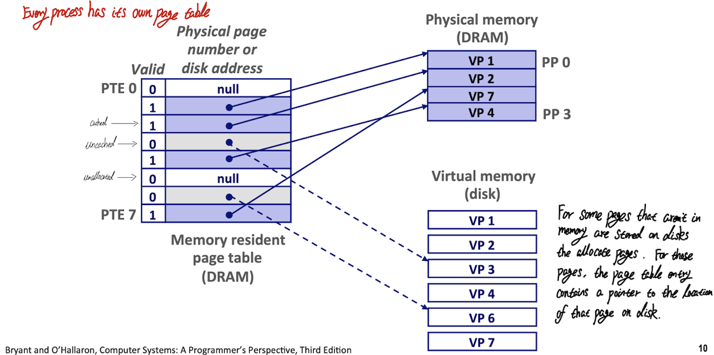

# Malloc Lab Report
Updating ...

## Background

### Virtual Memory

Virtual memory provides three important capabilities:

1. It uses main memory efficiently by **treating it as a cache** for an address space stored on disk, **keeping only the active areas in main memory** and transferring data back and forth between disk and memory as needed.
2. It simplifies memory management by providing each process with a **uniform address space**.
3. It **protects** the address space of each process from **corruption by other processes**.

With virtual memory, the CPU accesses main memory by generating a virtual address(VA), which is converted by the appropriate physical address before being sent to main memory. The task of **converting a virtual address to physical address** is known as ***address translation***.

Dedicated hardware on the CPU chip called the **memory management unit(MMU)** translates virtual addresses on the fly, using a lookup table stored in main memory whose content are managed by the operating system.

The address translation, the figure from <a href = "https://www.cs.cmu.edu/afs/cs/academic/class/15213-f15/www/lectures/17-vm-concepts.pdf">cmu-213 slide</a>

#### Address Spaces

An address space it an ordered set of nonnegative integer addresses `{0, 1, 2, ...}`.

If the integer in the address space are consecutive, then we say that it is a ***linear address space***.

In a system with virtual memory, the CPU generates virtual addresses from an addpress space of `𝑵 = 2ⁿ` called the ***virtual address space***: `{0, 1, 2, ..., 𝑵 - 1}`, where the size of an address space is characterized by the number of bits that are needed to represent the largest address. For example, a virtual address space with `𝑵 = 2ⁿ`  is called **n-bit address space**(such as 32-bit or 64-bit address space).

A system also has a physical address space that corresponds to the 𝑴 bytes of physical memory in the system: `{0, 1, 2, ..., 𝑴 - 1}`, where **𝑴 is not required to be a power of 2**.

Conceptually, a virtual memory is organized as **an array of N contiguous by-size cells stored on disk**, where each byte has a unique virtual address that serves as an index into the array. **The contents of the array on disk are cached in main memory.** 

As with any other cache in the memory hierarchy, the data on disk(the lower level) is partitioned into blocks that serve as the transfer units between disk and the main memory(the upper level). VM systems handle this by partioning the virtual memory into fixed-size blocks called ***virtual pages(VPs)***. Each virual page is `𝑷 = 2ᵖ` bytes in size.

Similarly, physical memory is partitioned into ***physical pages(PPs)***,also 𝑷 bytes in size. (Physical pages are also referred as ***page frames***)

At any point in time, the set of virtual pages is partitioned into **three disjoint subset**:

+ `Unallocated`. Pages that **have not yet been allocated(or created)** by the VM system. Unallocated blocks do not have any data associated with them, and thus do not occupy any space on disk.
+ `Cached`: Allocated pages that are **currently cached** in physical memory.
+ `Uncached`: Allocated pages that are **not cached** in physical memory.

The mapping between VPs -> PPs, the figure from <a href = "https://www.cs.cmu.edu/afs/cs/academic/class/15213-f15/www/lectures/17-vm-concepts.pdf">cmu-213 slide</a>

Because of the large miss penalty and the expense of accessing the first byte(disk is about 100,000 times slower than a DREAM), virtual page tend to be large－typically 4KB to 2MB. Due to the large miss penalty, **DRAM caches are fully assoicative; that is, any virtual page can be placed in any physical page** and also it requires a “large” mapping function.

Finally, because of the large access time of disk, **DRAM caches always use write-back instead of write-through**, where virual memory system try to **defer writing** anything back to the disk as long as possible.

#### Page Tables

As with any cache, the VM system must have some way to determine if a virtual page is cached somewhere in DRAM. If so, the system must determine which page it is cached in. If there is a miss, the system must determine where the virtual page is stored on disk. select a victim page in physical memory, and copy the virtual page from disk to DRAM, replacing the victim page. 

These capabilities are provided by a combination of

+ Operating system software;
+ Address translation in the ***MMU(Memory Management Unit)***;
+ A data structure stored in physical memory known as a ***page table*** that maps virtual pages to physical pages. The address translation hardware reads the page table each time it converts a virtual address to a physical address.

**The operating system is responsible for maintaining the contents of the page table and transferring pages back and forth between disk and DRAM.**

A page table is an array of ***page table entry(PTE)***. **Each page in the virtual address space has a PTE at a fixed offset in the page table.** 

Page Table, the figure from <a href = "https://www.cs.cmu.edu/afs/cs/academic/class/15213-f15/www/lectures/17-vm-concepts.pdf">cmu-213 slide</a>

In the picture above:

+ valid bit is set, that means the current page is cached in DRAM
+ valid bit is not set:
  + a null address indicates that the virtual page has not yet been allocated.
  + otherwise, the address points to the start of the virtual page on disk(not cached).

