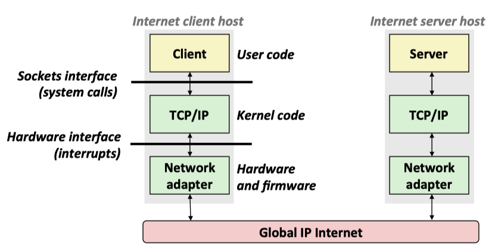
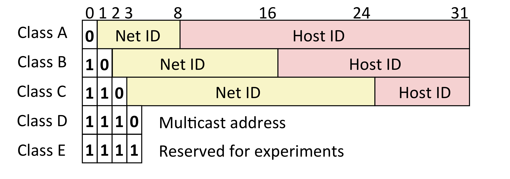
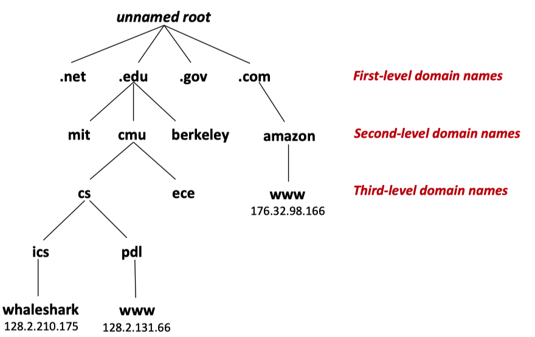
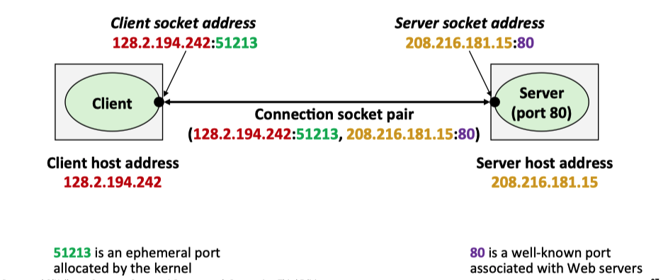
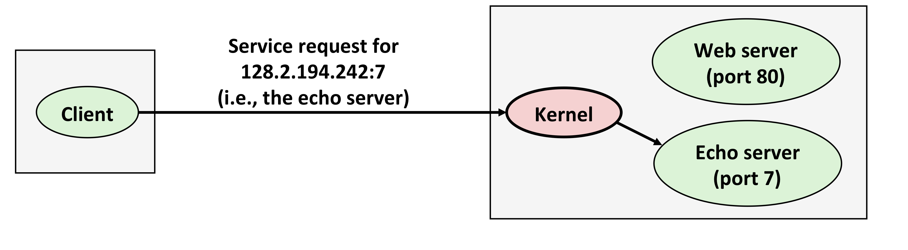
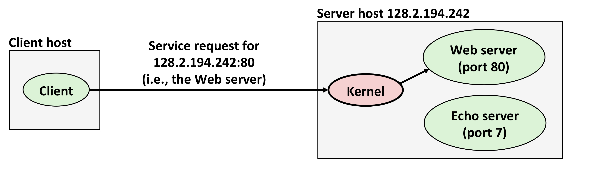
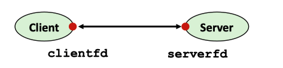
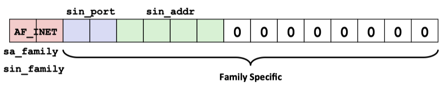
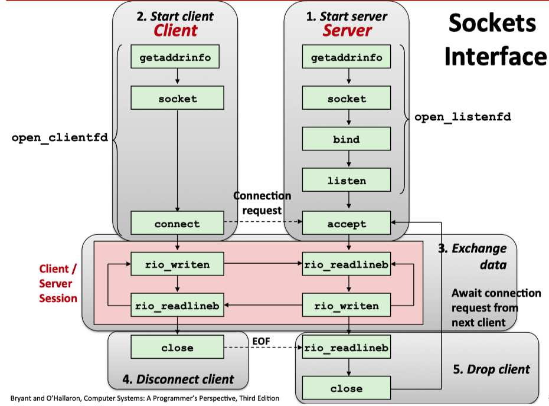
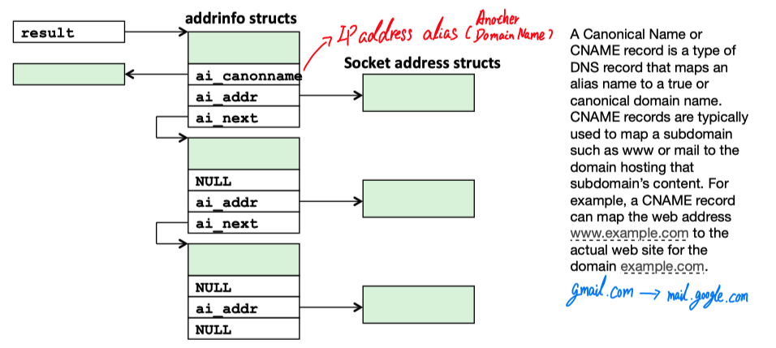

# Proxy Lab Report

## Background: Network Programming

For the knowledge of System-Level I/O, please refer to [this link](../IO_And_FileSystem/README.md)

### The Client-Server Model

In client-server model, an application consists of ***a server process*** and one or more ***client processes***. 

+ Server manages some resource. 
+ Server provides service by manipulaing resource for clients.  
+ Server activated by request from client (vending machine analogy)

The fundamental operation in the client-server model is the ***transaction***. A client-server transaction consists of four steps:

1. When a client needs service, it initiates a transaction by ***sending a request to the server***.
2. The server ***receives the request***, interprets it, and manipulates its resources in the appropriate way.
3. The server ***sends a response to the client*** and then waits for the next request.
4. The client receives the response and manipulates it.

<p align="center">  </p>

<p align="center">A client-server transaction, the figure from <a href = "https://www.cs.cmu.edu/afs/cs/academic/class/15213-f15/www/lectures/17-vm-concepts.pdf">cmu-213 slide</a></p>

### Networks

Clients and servers often run on separate hosts and communicate using the hardware and software resources of a *computer network*.

To a host, a network is just another I/O device that serves as a source and sink for data

<p align="center">  </p>

<p align="center">Hardware organization of a Network Host, the figure from <a href = "https://www.cs.cmu.edu/afs/cs/academic/class/15213-f15/www/lectures/17-vm-concepts.pdf">cmu-213 slide</a></p>

+ An ***adapter*** plugged into an expansion slot on the I/O bus provides the **physical interface** to the network. 
  + Data received from the network are copied from the adapter, across the I/O and memory buses into memory, typically by a DMA transfer.
  + Similarly, data can also be copied from memory to the network.
+ Physically, a network is hierarchical system that is organized by geographical proximity.

#### Lower Level: Local Area Network

At the lowest level is a ***LAN(local area network)*** that spans a building or a campus. The most popular LAN techology by far is ***Ethernet***.

+ Ethernet segment consists of a collection of ***hosts*** connected by wires(twisted pairs) to a ***hub***.

  <p align="center">  </p>

  <p align="center">Ethernet Segment, the figure from <a href = "https://www.cs.cmu.edu/afs/cs/academic/class/15213-f15/www/lectures/17-vm-concepts.pdf">cmu-213 slide</a></p>

  + Ethernet typically span small areas, such as a room or a floor, and each wire has the same maximum bit bandwidth, typically 100 Mb/s or 1 Gb/s.

  + Each Ethernet adapter has a globally unique 48-bit address(MAC address) that is stored in a nonvolatile memory on the adapter. 

  + A host can send **a chunk of bits called a *frame*** to any other host on the segment. 

    Each frame includes:

    + some fixed number of header bits that identify the source and destination of the frame 
    + the frame length, followed by a payload of data bits. 

    Every host adapter sees the frame, but only the destination host actually read it.

  + ***Multiple Ethernet segments*** can be connected into larger LANs, called ***bridged Ethernet***, using a set of wires and small boxes called bridges.

    + In a Bridge Ethernet, some wires connect bridges to bridges, and others connect bridges to hubs.
    + The bandwidths of the wires can be difference.

    <p align="center">  </p>

    <p align="center">Bridge Ethernet Segment, the figure from <a href = "https://www.cs.cmu.edu/afs/cs/academic/class/15213-f15/www/lectures/17-vm-concepts.pdf">cmu-213 slide</a></p>

    <p align="center">  </p>

    <p align="center">Conceptual view of the LAN, the figure from <a href = "https://www.cs.cmu.edu/afs/cs/academic/class/15213-f15/www/lectures/17-vm-concepts.pdf">cmu-213 slide</a></p>

#### Higher Level: Internets

At a higher level in the hierarchy, multiple incompatible LANs can be connected by specialized conputers called ***routers to form an internet***(interconnected network). 

+ Each router has an adapter(port) for each network that it is connected to.
+ Router can also connect high-speed point-to-point phone connections, which are exaples of network known as WANs(wide area networks)
+ In general, routers can be used to build internet from arbitrary collections of LANs and WANs.

To solve the problem of incompatible networks, we use network same **network protocol** running on each host and router that smoothes out the differences between the different networks. The network protocol is a software that governs how hosts and routers cooperate in order to transfer data. The protocol must provide two basic capabilites:

1. **Name scheme**: Different LAN technologies have different and incompatible ways of assigning address to hosts. The network protocol smoothes these differences by defining ***a uniform format for host addresses***. Each host is then assigned at least one of these internet addresses that uniquely identifies it.

2. **Delivery mechanism:** Different networking technologies have different and incompatible ways of encoding bits on wires and of **packaging these bits into frames**. The internet protocol smoothes these differences by defining a uniform way to bundle up data bits into discrete chunks called ***packets***.

   A packet consists of:

   - a ***header***, which contains the packet size and addresses of the source and destination hosts;
   - a ***payload***, which contain data bits sent from the source host.

<p align="center">  </p>

<p align="center">How data travel from one host to another on an internet, the figure from <a href = "https://www.cs.cmu.edu/afs/cs/academic/class/15213-f15/www/lectures/17-vm-concepts.pdf">cmu-213 slide</a></p>

The eight basic steps:

1. The client on **host A invokes a system call** that copies the data from the client's virtual address space into a kernel buffer.

2. The protocol software on host A creates a LAN1 frame by **appending an internet header** and a **LAN1 frame to  the data**. The internet header is addressed to internet host B. The LAN1 frame header is addressed to the router. It then passes the frame to the adapter.

   Notice that the **payload of the LAN1 frame is an internet packet**, whose payload is the actual user data. This kind of encapsulation is one of the fundamental insights of internetworking.

3. The LAN1 adapter copies the frame to the network.

4. When the frame reaches the router, the router's LAN1 adapter reads it from the wire and passes it to the protocol software.

5. The **router fetches the destination internet address from the internet packet header** and **uses this as an index into a routing table** to determine where to forward the packet, which in this case is LAN2. The router then **strips off the old LAN1 frame header**, **prepends a new LAN2 frame header addresses** to host B, and passes the resulting frame to the adapter.

6. The router's LAN2 adapter copies the frame to the network.

7. When the frame reaches host B, its adapter reads the frame from the wire and passes it to the protocol software.

8. Finally, **the protocol software on host B strips off the packet header and frame header**. The protocol software will eventually copy the resulting data into the server's virtual address space when **the server invokes a system call that reads the data**.

### The Global IP Internet

<p align="center">  </p>

<p align="center">Hardware and software organization of an Internet application, the figure from <a href = "https://www.cs.cmu.edu/afs/cs/academic/class/15213-f15/www/lectures/17-vm-concepts.pdf">cmu-213 slide</a></p>

From a programmer's perspective, we can think of the Internet as a worldwide collection of hosts with the following properties:

+ The set of hosts is mapped to a set of **32-bit IP addresses**. 
  + eg: 128.2.203.179
+ The set of IP address is mapped to a set of identifiers called ***Internet domain names***.
  + eg: 128.2.203.179 is mapped to www.cs.cmu.edu
+ A process on one Internet host can communicate with a process on any other Internet host over a ***connection***.

#### IP Address

32-bit IP addresses are stored in an ***IP address struct***

+ IP addresses are always stored in memory in **network byte order**(big-endian byte order).

+ True in general for any integer transferred in a packet header from one machine to another.

  ```c
  /* IP address structure */ 
  struct in_addr { 
    uint32_t s_addr; /* Address in network byte order (big-endian) */ 
  };
  ```

  <p align="center">  </p>

  <p align="center">IP(V4) Address space divided into classes, the figure from <a href = "https://www.cs.cmu.edu/afs/cs/academic/class/15213-f15/www/lectures/17-vm-concepts.pdf">cmu-213 slide</a></p>

+ Userful network byte-order conversion function(***'I' = 32 bits***, ***'S' = 16 bits***)

  + `htonl`: convert `uint32_t` from host to network byte order
  + `htons`: convert `uint16_t` from host to network byte order
  + `htohl`: convert `uint32_t` from network to host byte order
  + `ntohs`: convert `uint16_t` from network to host byte order

#### Dotted Decimal Notation

By convertion, each byte in a 32-bit IP address is represented by its decimal value and separate by a period

+ IP address: 0x 80 02 C2 F2 = 128.2.194.242

Use `getaddrinfo` and `getnameinfo` functions to convert between IP address and dotted decimal format

+ Function for converting between binary IP addresses and dotted decimal string(**'n' denotes to *network*, 'p' denotes to presentation**):
  + `inet_pton`: Dotted decimal string -> IP address in network byte order
  + `inet_ntop`: IP address in network byte order -> Dotted decimal string

#### Domain Naming System(DNS)

<p align="center">  </p>

<p align="center">Subset of the Internet domain name hierarchy, the figure from <a href = "https://www.cs.cmu.edu/afs/cs/academic/class/15213-f15/www/lectures/17-vm-concepts.pdf">cmu-213 slide</a></p>

The Internet maintains a mapping between IP addresses and domain names in a huge **worldwide distributed database** called DNS.

Conceptually, **programmers can view the DNS database as a collection of million of host entries**.

+ Each host entry defines the mapping between a set of domain names and IP addresses.

+ In a mathematical sense, a host entry is an equivalence class of domain names and IP addresses.

+ Can explore properites of DNS mapping using `nslookup`:

  + Output edited for brevity

+ Each host has a locally defined domain name `localhost`, which always maps to the ***loopback address:*** `127.0.0.1`

  ```shell
  linux> nslookup localhost
  Address: 127.0.0.1
  ```

+ Use `hostname` to determine real domain name of local host:

  ```shell
  linux> hostname
  whaleshark.ics.cs.cmu.edu
  ```

#### Internet Connections

Clients and servers communicate by sending stream of bytes over ***connections***. 

Each connection is:

+ ***Point-to-point:*** connect a pair of processes.
+ ***Full-duplex:*** data can flow in both directions at the same time.
+ ***Reliable:*** stream of bytes sent by the source is eventually received by the destination in the same order it was sent.

A ***socket*** is an end **point of a a connection**. Each socket has a corresponding socket address that consists of an Internet address and ***16-bit integer port*** and is denoted by the notaion address: `port`.

+ ***Ephemeral port:*** **Assigned automatically** by client kernel when client makes a connection request.
+ ***Well-know port:*** **Associated** with some **service** provided by a server
  + e.g. port 80 is associated with Web servers
+ Popular services have permanently assigned ***well-known ports*** and corresponding ***well-know service names:***
  + echo server: 7/echo
  + ssh servers: 22/ssh
  + email server: 25/smtp
  + Web servers: 80/http
+ Mappings between well-know ports and service names is contained in the file `/etc/services` on each Linux machine.

A connection is uniquely identified by the socket addresses of its two end point. This pair of socket addresses is known as a ***socket pair*** and is denoted by the tuple: 

`(cliaddr: cliport, servaddr: servport)`

+ `cliaddr` is the client's IP address
+ `cliport`: is the client's port
+ `servaddr`: is the server's IP address
+ `servport`: is the server's port

<p align="center">  </p>

<p align="center">Anatomy of an Internet connection, the figure from <a href = "https://www.cs.cmu.edu/afs/cs/academic/class/15213-f15/www/lectures/17-vm-concepts.pdf">cmu-213 slide</a></p>

In general, the job of the kernel to differentiate the different connections coming into the machine and figure it out, which 

1. software/process to wake up when some data arrives form another machine, 
2. and program actual running on that machine or make use of that data, where that's done by associating for each port, a particular process executing program that handle that particular request.

<p align="center">  </p>

<p align="center">  </p>

<p align="center">Using ports to identify services, the figure from <a href = "https://www.cs.cmu.edu/afs/cs/academic/class/15213-f15/www/lectures/17-vm-concepts.pdf">cmu-213 slide</a></p>

### The Socket Interface

The ***socket interface*** is a set of functions that are used in conjunction with the UNIX I/O functions to build network applications. It created in the early 80's as part of the original Berkeley distribution of Unix that contained an early version of the internet protocols. It has been implemented on most mordern systems, including all UNIX variants as well as Windows and Machintosh systems.

#### What is socket?

+ To the kernel, a socket is an **endpoint of communication**

+ To an application, **a socket is a file descriptor** that lets the application read/write from/to the network

  + **Remember:** All Unix I/O devices, including networks, are **modeled as files**.

+ Clients and Servers communicate with each other by reading from and writing to socket descriptors

  <p align="center">  </p>

  <p align="center">Brief overview of socket connection, the figure from <a href = "https://www.cs.cmu.edu/afs/cs/academic/class/15213-f15/www/lectures/17-vm-concepts.pdf">cmu-213 slide</a></p>

+ The main distinction between regular file I/O and socket I/O is **how the application "opens" the socket descriptors**.

#### The socket address structures

+ Generic Socket Address:

  + For address arguments to **connect**, **bind**, and **accept**

  + Necessary only because C did not have generic(`void *`) pointers when the socket interface was designed

    ```c
    /* Generic socket address structure(for connect, bind, and accept) */
    struct sockaddr{
      uint_16_t	sa_family;	 /* Protocol family */
      char			sa_data[14]; /* Address data */
    };
    ```

  + For casting convenience, we adopt the Stevents convention: `typedef struct sockaddr SA;`

    <p align="center">  </p>

    <p align="center">Family Specific(sa_family), the figure from <a href = "https://www.cs.cmu.edu/afs/cs/academic/class/15213-f15/www/lectures/17-vm-concepts.pdf">cmu-213 slide</a></p>

  + Internet-specific socket address:

    + Must cast (`struct sockaddr_in *`) to (`struct sockaddr *`) for functions that take socket address arguments.

  ```c
  /* IP socket address structure */
  struct sockaddr_in{
    uint_16_t				sin_family;	/* Protocol family (always AF_INET), the protocol requires 16-bits */
    uint_16_t				sin_port;		/* Port number in network byte order */
    struct	in_addr	sin_addr;		/* IP address in network byte order */
    unsigned char		sin_zero[8];/* Pad to sizeof(struct sockaddr)*/
  };
  ```

  

<p align="center">  </p>

<p align="center">Overview of network applications based on the socket interface, the figure from <a href = "https://www.cs.cmu.edu/afs/cs/academic/class/15213-f15/www/lectures/17-vm-concepts.pdf">cmu-213 slide</a></p>

### Host and Service Conversion: `getaddrinfo`

`getaddrinfo` and `getnameinfo` converting back and forth between **binary socket address structures** and the string **representations** of 

+ hostname
+ host addresses
+ service names,
+ port numbers:

When used in conjunction with the sockets interface, they allow us to write network program that are independent of any particular version of the IP protocol.

#### `getaddrinfo`

The `getaddrinfo` function converts string representation of hostname, host addresses, service names and port numbers into socket address structures. It is the modern replacement for the obsolete `gethostbyname` and `getservbyname` functions, where , unlike those functions, it is reentrant and works with any protocol.

Advantages:

+ Reentrant(can be safely used by threaded programs).
+ Allows us to write protable protocol-independent code
  + Works with both IPV4 and IPV6

Disadvantages:

+ Complex
+ Fortunately, a small number of usage patterns suffice in most cases.

```c
#include <sys/types.h>
#include <sys/socket.h>
#include <netdb.h>

int getaddrinfo(const char *host, const char *service, const struct addrinfo *hints,
               	struct addrinfo **result);
/* Returns: 0 if OK, nonzero error code on error */
void freeaddrinfo(struct addrinfo *result); /* Returns Nothing */
const char *gat_strerror(int errorcode); /* Returns: error message */
```

Given `host` and `service`(the two components of a socket address), `getaddrinfo` returns a result that **points to a linked list of** `addrinfo` structure, each of which points to a socket address structure that corresponds to `host` and `service`.

+ For the clients, it walk this list, trying each socket address in turn until the calls to `socket `and `connect ` succeed and the connection is established.
+ For the servers, it walk the list until calls to `socket` and `bind` succeed and the descriptor is bound to a valid socket address.
+ To avoid memory leaks, the application must eventually free the list by calling `freeaddrinfo`
+ If `getaddrinfo` returns a nonzero error code, the application can call `gai_error` to convert the code to a message string.

<p align="center">  </p>

<p align="center">Data structure returned by <strong>getaddrinfo</strong>, the figure from <a href = "https://www.cs.cmu.edu/afs/cs/academic/class/15213-f15/www/lectures/17-vm-concepts.pdf">cmu-213 slide</a></p>

The `host` argument to `getaddrinfo` can be either a **domain name** or a **numeric addresses**(e.g. a dotted-decimal IP address).

The `service` argument can be either a service name(e.g. http) or a decimal port number.  

If we are not interested in converting the hostname to an address, we can set `host` to `NULL`. The same holds fo service.

However, you need to specify at least one of the `host` and `service` arguments.

The optional `hints` argument is an `addrinfo` structure that provides finer control over the list of socket addresses that `getaddrinfo` returns. When passed as `hint argument`, only the `ai_family`, `ai_socketype`, `ai_protocol`, and `ai_flags` fields can be set. **The other fields must be set to zero(or `NULL`). In pratice, we use `memset` to zero the entire structure and then set a few selected fields.**

```c
struct addrinfo {
  int ai_flags; 						/* Hints argument flags */ 
  int ai_family; 						/* First arg to socket function */ 
  int ai_socktype; 					/* Second arg to socket function */ 
  int ai_protocol; 					/* Third arg to socket function */ 
  char *ai_canonname; 			/* Canonical host name */ 
  size_t ai_addrlen; 				/* Size of ai_addr struct */ 
  struct sockaddr *ai_addr; /* Ptr to socket address structure */ 
  struct addrinfo *ai_next; /* Ptr to next item in linked list */
};
```

+ By default, `getaddrinfo` can return both **IPV4** and **IPV6** socket addresses.

  + Setting `ai_family` to `AF_INET` restricts the list to  **IPV4** addresses.
  + Setting it to `AF_INET6` restricts the list to **IPV6** addresses.

+ By default, for each unique address associated with `host`, the `getaddrinfo` function can return up to three `addrinfo`, each with a different `ai_socktype` field:

  + one for connections
  + one for datagrams
  + ont for raw sockets

  Setting `ai_socktype` to `SOCK_STREAM` restricts the list to **at most one** `addrinfo` structure for each unique address, one whose socket address can be used as the end point to a connection.

+ The `ai_flags` field is a bit mask that further modifies the default behavior.

  + `AI_ADDRCONFIG`: This flag is recommond if you are using connections. It asks `getaddrinfo` to return **IPV4** addresses only if the local host is configured for **IPV4**. Similary for **IPV6**
  + `AI_CANONNAME`: By default, the `ai_cannoname` field is `NULL`. If this flag is set, it instructs `getaddrinfo` to point the `ai_canoname` field in the first `addrinfo` structure in the list to the canonical(offical) name of `host`.
  + `AI_NUMBERICSERV`: By default, the service argument can be a **service name** or a **port name**. **This flag forces the service argument to be a port name.**
  + `AI_PASSIVE`: By default, `getaddrinfo` returns socket addresses that can be used by clients as active sockets in calls to `connect`. This flag instructs it to return socket addresses that can be **used by servers as listening sockets**, where, in this case, the `host` argument should be `NULL`

## Solution


## Lab Test Result

### Part1 Only (40/40)

```shell
➜  ~/cmu-15-213-CSAPP3E-lab/7.Proxy_lab cd part1-only      
➜  ~/cmu-15-213-CSAPP3E-lab/7.Proxy_lab/part1-only make clean
rm -f *~ *.o proxy core *.tar *.zip *.gzip *.bzip *.gz
➜  ~/cmu-15-213-CSAPP3E-lab/7.Proxy_lab/part1-only make
gcc -g -Wall -c proxy.c
gcc -g -Wall -c csapp.c
gcc -g -Wall csapp.o proxy.o -o proxy -lpthread
➜  ~/cmu-15-213-CSAPP3E-lab/7.Proxy_lab/part1-only ./driver.sh
*** Basic ***
Starting tiny on 6550
Starting proxy on 18704
1: home.html
   Fetching ./tiny/home.html into ./.proxy using the proxy
   Fetching ./tiny/home.html into ./.noproxy directly from Tiny
   Comparing the two files
   Success: Files are identical.
2: csapp.c
   Fetching ./tiny/csapp.c into ./.proxy using the proxy
   Fetching ./tiny/csapp.c into ./.noproxy directly from Tiny
   Comparing the two files
   Success: Files are identical.
3: tiny.c
   Fetching ./tiny/tiny.c into ./.proxy using the proxy
   Fetching ./tiny/tiny.c into ./.noproxy directly from Tiny
   Comparing the two files
   Success: Files are identical.
4: godzilla.jpg
   Fetching ./tiny/godzilla.jpg into ./.proxy using the proxy
   Fetching ./tiny/godzilla.jpg into ./.noproxy directly from Tiny
   Comparing the two files
   Success: Files are identical.
5: tiny
   Fetching ./tiny/tiny into ./.proxy using the proxy
   Fetching ./tiny/tiny into ./.noproxy directly from Tiny
   Comparing the two files
   Success: Files are identical.
Killing tiny and proxy
basicScore: 40/40
```


### Part1 and Part2 (55/55)

```shell
➜  ~/cmu-15-213-CSAPP3E-lab/7.Proxy_lab/part1_and_part2 make clean
rm -f *~ *.o proxy core *.tar *.zip *.gzip *.bzip *.gz
➜  ~/cmu-15-213-CSAPP3E-lab/7.Proxy_lab/part1_and_part2 make
gcc -g -Wall -c sbuf.c
gcc -g -Wall -c proxy.c
gcc -g -Wall -c csapp.c
gcc -g -Wall sbuf.o csapp.o proxy.o -o proxy -lpthread
➜  ~/cmu-15-213-CSAPP3E-lab/7.Proxy_lab/part1_and_part2 ./driver.sh
*** Basic ***
Starting tiny on 4600
Starting proxy on 28346
1: home.html
   Fetching ./tiny/home.html into ./.proxy using the proxy
   Fetching ./tiny/home.html into ./.noproxy directly from Tiny
   Comparing the two files
   Success: Files are identical.
2: csapp.c
   Fetching ./tiny/csapp.c into ./.proxy using the proxy
   Fetching ./tiny/csapp.c into ./.noproxy directly from Tiny
   Comparing the two files
   Success: Files are identical.
3: tiny.c
   Fetching ./tiny/tiny.c into ./.proxy using the proxy
   Fetching ./tiny/tiny.c into ./.noproxy directly from Tiny
   Comparing the two files
   Success: Files are identical.
4: godzilla.jpg
   Fetching ./tiny/godzilla.jpg into ./.proxy using the proxy
   Fetching ./tiny/godzilla.jpg into ./.noproxy directly from Tiny
   Comparing the two files
   Success: Files are identical.
5: tiny
   Fetching ./tiny/tiny into ./.proxy using the proxy
   Fetching ./tiny/tiny into ./.noproxy directly from Tiny
   Comparing the two files
   Success: Files are identical.
Killing tiny and proxy
basicScore: 40/40

*** Concurrency ***
Starting tiny on port 9722
Starting proxy on port 14058
Starting the blocking NOP server on port 18376
Trying to fetch a file from the blocking nop-server
Fetching ./tiny/home.html into ./.noproxy directly from Tiny
Fetching ./tiny/home.html into ./.proxy using the proxy
Checking whether the proxy fetch succeeded
Success: Was able to fetch tiny/home.html from the proxy.
Killing tiny, proxy, and nop-server
concurrencyScore: 15/15
```


### Passed All Test (70/70)

```shell
➜  ~/cmu-15-213-CSAPP3E-lab/7.Proxy_lab/proxylab-handout make clean
rm -f *~ *.o proxy core *.tar *.zip *.gzip *.bzip *.gz
➜  ~/cmu-15-213-CSAPP3E-lab/7.Proxy_lab/proxylab-handout make
gcc -g -Wall -c sbuf.c
gcc -g -Wall -c reader-writer.c
gcc -g -Wall -c lrucache.c
gcc -g -Wall -c proxy.c
gcc -g -Wall -c csapp.c
gcc -g -Wall sbuf.o csapp.o reader-writer.o lrucache.o proxy.o -o proxy -lpthread
➜  ~/cmu-15-213-CSAPP3E-lab/7.Proxy_lab/proxylab-handout ./driver.sh
*** Basic ***
Starting tiny on 20753
Starting proxy on 29245
1: home.html
   Fetching ./tiny/home.html into ./.proxy using the proxy
   Fetching ./tiny/home.html into ./.noproxy directly from Tiny
   Comparing the two files
   Success: Files are identical.
2: csapp.c
   Fetching ./tiny/csapp.c into ./.proxy using the proxy
   Fetching ./tiny/csapp.c into ./.noproxy directly from Tiny
   Comparing the two files
   Success: Files are identical.
3: tiny.c
   Fetching ./tiny/tiny.c into ./.proxy using the proxy
   Fetching ./tiny/tiny.c into ./.noproxy directly from Tiny
   Comparing the two files
   Success: Files are identical.
4: godzilla.jpg
   Fetching ./tiny/godzilla.jpg into ./.proxy using the proxy
   Fetching ./tiny/godzilla.jpg into ./.noproxy directly from Tiny
   Comparing the two files
   Success: Files are identical.
5: tiny
   Fetching ./tiny/tiny into ./.proxy using the proxy
   Fetching ./tiny/tiny into ./.noproxy directly from Tiny
   Comparing the two files
   Success: Files are identical.
Killing tiny and proxy
basicScore: 40/40

*** Concurrency ***
Starting tiny on port 15206
Starting proxy on port 1702
Starting the blocking NOP server on port 29301
Trying to fetch a file from the blocking nop-server
Fetching ./tiny/home.html into ./.noproxy directly from Tiny
Fetching ./tiny/home.html into ./.proxy using the proxy
Checking whether the proxy fetch succeeded
Success: Was able to fetch tiny/home.html from the proxy.
Killing tiny, proxy, and nop-server
concurrencyScore: 15/15

*** Cache ***
Starting tiny on port 17328
Starting proxy on port 16786
Fetching ./tiny/tiny.c into ./.proxy using the proxy
Fetching ./tiny/home.html into ./.proxy using the proxy
Fetching ./tiny/csapp.c into ./.proxy using the proxy
Killing tiny
Fetching a cached copy of ./tiny/home.html into ./.noproxy
Success: Was able to fetch tiny/home.html from the cache.
Killing proxy
./driver.sh: line 399: 13704 Terminated              ./proxy ${proxy_port} &> /dev/null
cacheScore: 15/15

totalScore: 70/70
```

