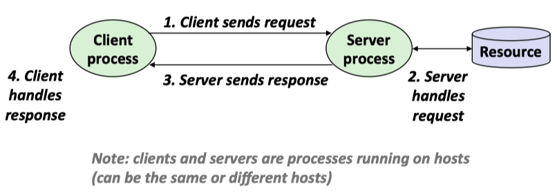
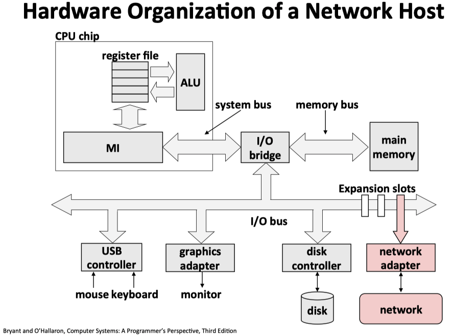
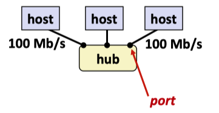
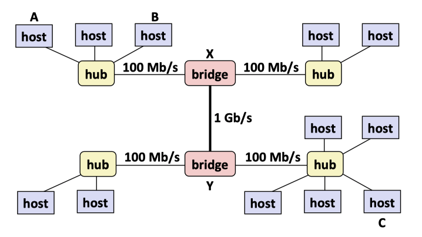
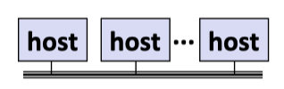
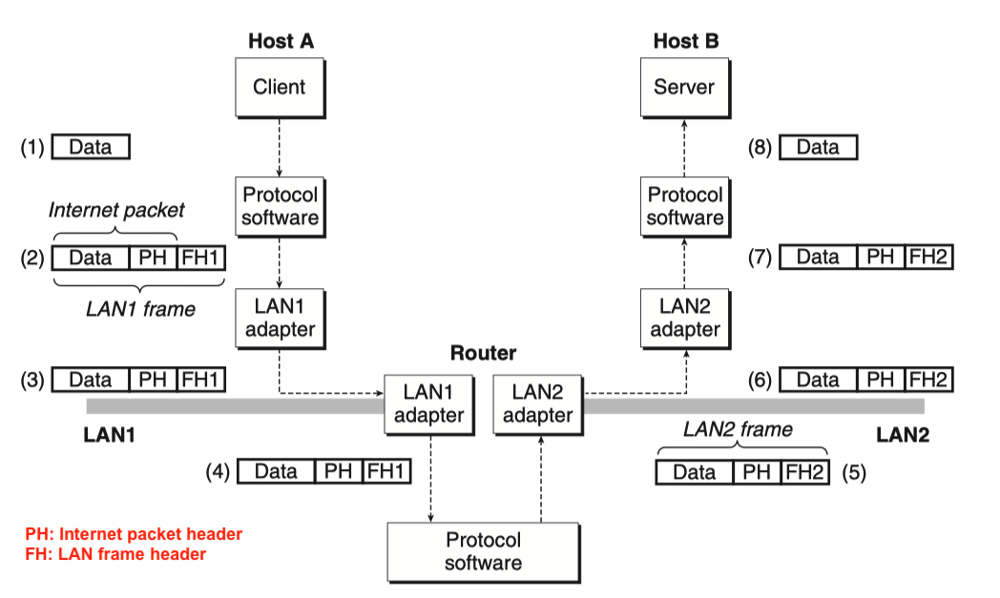

# Proxy Lab Report

## Background: Network Programming

For the knowledge of System-Level I/O, please refer to [this link](../IO_And_FileSystem/README.md)

### The Client-Server Model

In client-server model, an application consists of ***a server process*** and one or more ***client processes***. 

+ Server manages some resource. 
+ Server provides service by manipulaing resource for clients.  
+ Server activated by request from client (vending machine analogy)

The fundamental operation in the client-server model is the ***transaction***. A client-server transaction consists of four steps:

1. When a client needs service, it initiates a transaction by ***sending a request to the server***.
2. The server ***receives the request***, interprets it, and manipulates its resources in the appropriate way.
3. The server ***sends a response to the client*** and then waits for the next request.
4. The client receives the response and manipulates it.

<p align="center">  </p>

<p align="center">A client-server transaction, the figure from <a href = "https://www.cs.cmu.edu/afs/cs/academic/class/15213-f15/www/lectures/17-vm-concepts.pdf">cmu-213 slide</a></p>

### Networks

Clients and servers often run on separate hosts and communicate using the hardware and software resources of a *computer network*.

To a host, a network is just another I/O device that serves as a source and sink for data

<p align="center">  </p>

<p align="center">Hardware organization of a Network Host, the figure from <a href = "https://www.cs.cmu.edu/afs/cs/academic/class/15213-f15/www/lectures/17-vm-concepts.pdf">cmu-213 slide</a></p>

+ An ***adapter*** plugged into an expansion slot on the I/O bus provides the **physical interface** to the network. 
  + Data received from the network are copied from the adapter, across the I/O and memory buses into memory, typically by a DMA transfer.
  + Similarly, data can also be copied from memory to the network.
+ Physically, a network is hierarchical system that is organized by geographical proximity.

#### Lower Level: Local Area Network

At the lowest level is a ***LAN(local area network)*** that spans a building or a campus. The most popular LAN techology by far is ***Ethernet***.

+ Ethernet segment consists of a collection of ***hosts*** connected by wires(twisted pairs) to a ***hub***.

  <p align="center">  </p>

  <p align="center">Ethernet Segment, the figure from <a href = "https://www.cs.cmu.edu/afs/cs/academic/class/15213-f15/www/lectures/17-vm-concepts.pdf">cmu-213 slide</a></p>

  + Ethernet typically span small areas, such as a room or a floor, and each wire has the same maximum bit bandwidth, typically 100 Mb/s or 1 Gb/s.

  + Each Ethernet adapter has a globally unique 48-bit address(MAC address) that is stored in a nonvolatile memory on the adapter. 

  + A host can send **a chunk of bits called a *frame*** to any other host on the segment. 

    Each frame includes:

    + some fixed number of header bits that identify the source and destination of the frame 
    + the frame length, followed by a payload of data bits. 

    Every host adapter sees the frame, but only the destination host actually read it.

  + ***Multiple Ethernet segments*** can be connected into larger LANs, called ***bridged Ethernet***, using a set of wires and small boxes called bridges.

    + In a Bridge Ethernet, some wires connect bridges to bridges, and others connect bridges to hubs.
    + The bandwidths of the wires can be difference.

    <p align="center">  </p>

    <p align="center">Bridge Ethernet Segment, the figure from <a href = "https://www.cs.cmu.edu/afs/cs/academic/class/15213-f15/www/lectures/17-vm-concepts.pdf">cmu-213 slide</a></p>

    <p align="center">  </p>

    <p align="center">Conceptual view of the LAN, the figure from <a href = "https://www.cs.cmu.edu/afs/cs/academic/class/15213-f15/www/lectures/17-vm-concepts.pdf">cmu-213 slide</a></p>

#### Higher Level: Internets

At a higher level in the hierarchy, multiple incompatible LANs can be connected by specialized conputers called ***routers to form an internet***(interconnected network). 

+ Each router has an adapter(port) for each network that it is connected to.
+ Router can also connect high-speed point-to-point phone connections, which are exaples of network known as WANs(wide area networks)
+ In general, routers can be used to build internet from arbitrary collections of LANs and WANs.

To solve the problem of incompatible networks, we use network same **network protocol** running on each host and router that smoothes out the differences between the different networks. The network protocol is a software that governs how hosts and routers cooperate in order to transfer data. The protocol must provide two basic capabilites:

1. **Name scheme**: Different LAN technologies have different and incompatible ways of assigning address to hosts. The network protocol smoothes these differences by defining ***a uniform format for host addresses***. Each host is then assigned at least one of these internet addresses that uniquely identifies it.

2. **Delivery mechanism:** Different networking technologies have different and incompatible ways of encoding bits on wires and of **packaging these bits into frames**. The internet protocol smoothes these differences by defining a uniform way to bundle up data bits into discrete chunks called ***packets***.

   A packet consists of:

   - a ***header***, which contains the packet size and addresses of the source and destination hosts;
   - a ***payload***, which contain data bits sent from the source host.

<p align="center">  </p>

<p align="center">How data travel from one host to another on an internet, the figure from <a href = "https://www.cs.cmu.edu/afs/cs/academic/class/15213-f15/www/lectures/17-vm-concepts.pdf">cmu-213 slide</a></p>

The eight basic steps:

1. The client on **host A invokes a system call** that copies the data from the client's virtual address space into a kernel buffer.

2. The protocol software on host A creates a LAN1 frame by **appending an internet header** and a **LAN1 frame to  the data**. The internet header is addressed to internet host B. The LAN1 frame header is addressed to the router. It then passes the frame to the adapter.

   Notice that the **payload of the LAN1 frame is an internet packet**, whose payload is the actual user data. This kind of encapsulation is one of the fundamental insights of internetworking.

3. The LAN1 adapter copies the frame to the network.

4. When the frame reaches the router, the router's LAN1 adapter reads it from the wire and passes it to the protocol software.

5. The **router fetches the destination internet address from the internet packet header** and **uses this as an index into a routing table** to determine where to forward the packet, which in this case is LAN2. The router then **strips off the old LAN1 frame header**, **prepends a new LAN2 frame header addresses** to host B, and passes the resulting frame to the adapter.

6. The router's LAN2 adapter copies the frame to the network.

7. When the frame reaches host B, its adapter reads the frame from the wire and passes it to the protocol software.

8. Finally, **the protocol software on host B strips off the packet header and frame header**. The protocol software will eventually copy the resulting data into the server's virtual address space when **the server invokes a system call that reads the data**.

## Solution


## Lab Test Result

### Part1 Only (40/40)

```shell
➜  ~/cmu-15-213-CSAPP3E-lab/7.Proxy_lab cd part1-only      
➜  ~/cmu-15-213-CSAPP3E-lab/7.Proxy_lab/part1-only make clean
rm -f *~ *.o proxy core *.tar *.zip *.gzip *.bzip *.gz
➜  ~/cmu-15-213-CSAPP3E-lab/7.Proxy_lab/part1-only make
gcc -g -Wall -c proxy.c
gcc -g -Wall -c csapp.c
gcc -g -Wall csapp.o proxy.o -o proxy -lpthread
➜  ~/cmu-15-213-CSAPP3E-lab/7.Proxy_lab/part1-only ./driver.sh
*** Basic ***
Starting tiny on 6550
Starting proxy on 18704
1: home.html
   Fetching ./tiny/home.html into ./.proxy using the proxy
   Fetching ./tiny/home.html into ./.noproxy directly from Tiny
   Comparing the two files
   Success: Files are identical.
2: csapp.c
   Fetching ./tiny/csapp.c into ./.proxy using the proxy
   Fetching ./tiny/csapp.c into ./.noproxy directly from Tiny
   Comparing the two files
   Success: Files are identical.
3: tiny.c
   Fetching ./tiny/tiny.c into ./.proxy using the proxy
   Fetching ./tiny/tiny.c into ./.noproxy directly from Tiny
   Comparing the two files
   Success: Files are identical.
4: godzilla.jpg
   Fetching ./tiny/godzilla.jpg into ./.proxy using the proxy
   Fetching ./tiny/godzilla.jpg into ./.noproxy directly from Tiny
   Comparing the two files
   Success: Files are identical.
5: tiny
   Fetching ./tiny/tiny into ./.proxy using the proxy
   Fetching ./tiny/tiny into ./.noproxy directly from Tiny
   Comparing the two files
   Success: Files are identical.
Killing tiny and proxy
basicScore: 40/40
```


### Part1 and Part2 (55/55)

```shell
➜  ~/cmu-15-213-CSAPP3E-lab/7.Proxy_lab/part1_and_part2 make clean
rm -f *~ *.o proxy core *.tar *.zip *.gzip *.bzip *.gz
➜  ~/cmu-15-213-CSAPP3E-lab/7.Proxy_lab/part1_and_part2 make
gcc -g -Wall -c sbuf.c
gcc -g -Wall -c proxy.c
gcc -g -Wall -c csapp.c
gcc -g -Wall sbuf.o csapp.o proxy.o -o proxy -lpthread
➜  ~/cmu-15-213-CSAPP3E-lab/7.Proxy_lab/part1_and_part2 ./driver.sh
*** Basic ***
Starting tiny on 4600
Starting proxy on 28346
1: home.html
   Fetching ./tiny/home.html into ./.proxy using the proxy
   Fetching ./tiny/home.html into ./.noproxy directly from Tiny
   Comparing the two files
   Success: Files are identical.
2: csapp.c
   Fetching ./tiny/csapp.c into ./.proxy using the proxy
   Fetching ./tiny/csapp.c into ./.noproxy directly from Tiny
   Comparing the two files
   Success: Files are identical.
3: tiny.c
   Fetching ./tiny/tiny.c into ./.proxy using the proxy
   Fetching ./tiny/tiny.c into ./.noproxy directly from Tiny
   Comparing the two files
   Success: Files are identical.
4: godzilla.jpg
   Fetching ./tiny/godzilla.jpg into ./.proxy using the proxy
   Fetching ./tiny/godzilla.jpg into ./.noproxy directly from Tiny
   Comparing the two files
   Success: Files are identical.
5: tiny
   Fetching ./tiny/tiny into ./.proxy using the proxy
   Fetching ./tiny/tiny into ./.noproxy directly from Tiny
   Comparing the two files
   Success: Files are identical.
Killing tiny and proxy
basicScore: 40/40

*** Concurrency ***
Starting tiny on port 9722
Starting proxy on port 14058
Starting the blocking NOP server on port 18376
Trying to fetch a file from the blocking nop-server
Fetching ./tiny/home.html into ./.noproxy directly from Tiny
Fetching ./tiny/home.html into ./.proxy using the proxy
Checking whether the proxy fetch succeeded
Success: Was able to fetch tiny/home.html from the proxy.
Killing tiny, proxy, and nop-server
concurrencyScore: 15/15
```


### Passed All Test (70/70)

```shell
➜  ~/cmu-15-213-CSAPP3E-lab/7.Proxy_lab/proxylab-handout make clean
rm -f *~ *.o proxy core *.tar *.zip *.gzip *.bzip *.gz
➜  ~/cmu-15-213-CSAPP3E-lab/7.Proxy_lab/proxylab-handout make
gcc -g -Wall -c sbuf.c
gcc -g -Wall -c reader-writer.c
gcc -g -Wall -c lrucache.c
gcc -g -Wall -c proxy.c
gcc -g -Wall -c csapp.c
gcc -g -Wall sbuf.o csapp.o reader-writer.o lrucache.o proxy.o -o proxy -lpthread
➜  ~/cmu-15-213-CSAPP3E-lab/7.Proxy_lab/proxylab-handout ./driver.sh
*** Basic ***
Starting tiny on 20753
Starting proxy on 29245
1: home.html
   Fetching ./tiny/home.html into ./.proxy using the proxy
   Fetching ./tiny/home.html into ./.noproxy directly from Tiny
   Comparing the two files
   Success: Files are identical.
2: csapp.c
   Fetching ./tiny/csapp.c into ./.proxy using the proxy
   Fetching ./tiny/csapp.c into ./.noproxy directly from Tiny
   Comparing the two files
   Success: Files are identical.
3: tiny.c
   Fetching ./tiny/tiny.c into ./.proxy using the proxy
   Fetching ./tiny/tiny.c into ./.noproxy directly from Tiny
   Comparing the two files
   Success: Files are identical.
4: godzilla.jpg
   Fetching ./tiny/godzilla.jpg into ./.proxy using the proxy
   Fetching ./tiny/godzilla.jpg into ./.noproxy directly from Tiny
   Comparing the two files
   Success: Files are identical.
5: tiny
   Fetching ./tiny/tiny into ./.proxy using the proxy
   Fetching ./tiny/tiny into ./.noproxy directly from Tiny
   Comparing the two files
   Success: Files are identical.
Killing tiny and proxy
basicScore: 40/40

*** Concurrency ***
Starting tiny on port 15206
Starting proxy on port 1702
Starting the blocking NOP server on port 29301
Trying to fetch a file from the blocking nop-server
Fetching ./tiny/home.html into ./.noproxy directly from Tiny
Fetching ./tiny/home.html into ./.proxy using the proxy
Checking whether the proxy fetch succeeded
Success: Was able to fetch tiny/home.html from the proxy.
Killing tiny, proxy, and nop-server
concurrencyScore: 15/15

*** Cache ***
Starting tiny on port 17328
Starting proxy on port 16786
Fetching ./tiny/tiny.c into ./.proxy using the proxy
Fetching ./tiny/home.html into ./.proxy using the proxy
Fetching ./tiny/csapp.c into ./.proxy using the proxy
Killing tiny
Fetching a cached copy of ./tiny/home.html into ./.noproxy
Success: Was able to fetch tiny/home.html from the cache.
Killing proxy
./driver.sh: line 399: 13704 Terminated              ./proxy ${proxy_port} &> /dev/null
cacheScore: 15/15

totalScore: 70/70
```

