# Concurrency Basic

Normally, we treated concurrency mainly as a mechanism that the operating system kernel used to run multiple applicaiton programs. But concurrency is not limted to the kernel. Application-level concurrency is useful in other way as well:

+ ***Accessing slow I/O devices :*** When an application is waiting for data to arrive from a slow I/O device such as a disk, the kernel keeps the CPU busy by running other processes.
+ ***Interacting with humans :*** People who interact with computers demand the ability to perform multiple tasks at the same time.
+ ***Reducing latency by deferring work :*** For example, a dynamic storage allocator might reduce the latency of individual **free** operations by deferring coalescing to a concurrent "coalescing" flow that **runs at a lower priority**, soaking up spare CPU cycles as they become available.
+ ***Servicing multiple network clients :*** For a real server that might be expected to service hundreds or thoudsands of clients per second, it is not acceptable to allow one slow client to deny service to the others. A better approach is to build a ***concurrent server*** that creates a separate logical flow for each client. This allows the server to service multiple clients concurrently and precludes slow clients from monopolizing the server.
+ ***Computing in parallel on multi-core machines :*** Many modern systems are equipped with multi-core processors that contain multiple CPUs. Applications that are partitioned into concurrent concurrent flows often run faster on multi-core machines than on uniprocessor machines because the flows execute in parallel rather than being interleaved.

Application that use application-level concurrency are known as ***concurrent programs***. Modern operating system provide ***three basic approaches for building concurrent programs***:

+ ***Processes :*** With this approach, each logical control flow is a process that is scheduled and maintained by the kernel. Since processes have separate virtual address space, flows that want to communicated with each other must use some kind of explicit ***interprocess communication(IPC)*** mechanism.
+ ***I/O multiplexing :*** This is form of concurrent programming where applications explicitly schedule their own logical flow in the context of a **single process**. **Logical flows are modeled as state machines** that the main program explicitly transitions from state to state as a result of data arriving on file descriptors. **Since the program is a single process, all flows share the same address space**.
+ ***Threads :*** Threads are logical flows that run in the context of **a single process** and are **scheduled by the kernel**. You can think of threads as a hybrid of other two approaches:
  + scheduled by the kernel like process flows
  + shareing the same virtual address space like I/O multiplexing flows.

**In this artical, we mainly focus on concurrent in threads.**

# Concurrent Programming with Threads

Like processes, ***threads*** are mechanism that permits an application to perform multiple tasks concurrently. A single process can contain multiple threads. However, each thread is very much like a separate tiny process, except for one difference: **they share the same address space and thus can access the same data.**

<p align="center">  </p>

<p align="center">Four threads executing in a process from <a href = "https://man7.org/tlpi/">The Linux programming interface</a>  chapter 29</p>

Like processes, threads are scheduled automatically by the kernel and are known to the kernel by an integer ID.

There are major differences, in the context switch we perform between threads as compared to processes: 

+ **the address space remain the same**

+ In a multi-threaded process, **instead of a single stack in the address space, there will be one per thread**. In other words, any stack-allocated variables, parameters, return values, and other things that we put on the stack will be placed in what is something called ***thread-local storage***.

  Each thread has its own ***thread context***, including:

  + unique integer ***thread ID(TID)***
  + stack(local variables and funcntion call linkage information)
  + stack pointer
  + program counter
  + general-purpose registers
  + condition codes.
  + signal mask
  + the `errno` variable
  + floating-point environment(see `fenv(3)`)
  + realtime scheduling policy and priority
  + CPU affinity(Linux-specific)
  + capabilities(Linux-specific)

  All the thread running in a process **share the entire virtual address space of that process**, including:

  + code segment
  + data segment
  + heap
  + shared libraries
  + open files
  + process ID and parent process ID
  + process group ID and session ID
  + controlling terminal
  + process credentials(user and group IDs)
  + open file descriptor
  + file system related information: unmask, current working directory, and root directory
  + Interval timers(`setitimer()`) and POSIX timers(`timer_create()`)
  + System V semaphore undo(`semadj`) values
  + resource limits
  + CPU time consumed (as returned by `times()`)
  + resource consumed (as returned by `getrusage()`)
  + nice value (set by `setpriority)` and `nice()`)

+ like the aforementioned aboved, the thread context is much smaller than a process context

+ threads, unlike processes, are not organized in a rigid parent-child hierarchy. The threads associated with a process from a ***pool of peers***, independent og which threads were created by which other threads.

  The main thread is distinguished from other threads only in the sense that it is always the first thread to run in the process.

  The main impact of this notion of a pool of peers is that **a thread can kill any of its peers or wait for any of its peers to terminate** and **eachh peer can read and write the same shared data**.

<p align="center">  </p>

<p align="center">Single-Threaded And Multiple-Threaded Address Space from <a href = "https://pages.cs.wisc.edu/~remzi/OSTEP/">
Operating Systems: Three Easy Pieces</a>  chapter 26</p>

### Why use threads?

1. **parallelism**
2. To avoid blocking program progress due to slow I/O.

### Thread Execution Model

Basically, each process begins life as a  single thread called the ***main thread***. At some point, the main thread creates a ***peer thread***, and from this point in time the two threads run concurrently. Eventually, control passes to the peer thread via context switch, either

+ because the main thread executes a slow system call such as `read()` or `sleep()`
+ or because it is interrupted by the system's interval timer.

The peer thread executes for a while before control passes back to the main thread.

The state of a single thread is thus very similar to that of a process. It has a **program counter(PC)** that tracks where the program is fetching instructions from. Each thread has their own private set of registers it uses computation; thus, if there are two threads that are running on a singple processor, when switching from running one(T1) to running the other(T2), a ***context switch*** must take place. The context switch between threads is quite similar to the context switch between processes, **as the register state of T1 must be saved and the register state of T2 restored before running T2**. With the processes, we saved state to a **process control blocks(PCBs)**; now, we'll need one or more **thread control blocks(TCBs)** to store the state of each thread of a process. 

<p align="center">  </p>

<p align="center">concurrent thread execution from <a href = "http://csapp.cs.cmu.edu/3e/home.html">CS:APP3e</a>  chapter 12</p>

## Pthread API

The Pthread API defines a number of data types, here some of them in the table below:

<p align="center">  </p>

<p align="center">Four threads executing in a process from <a href = "https://man7.org/tlpi/">The Linux programming interface</a>  chapter 29</p>

#### errno

The traditional method of returning status from system calls and some library functions is to return 0 on success or -1 on error, with `errno` being set to indicate the error. The functions in the Pthreads API do things differently. All Pthreads function return 0 on success or a posivitve number on failure. The failure value is one of the same values that can be placed in `errno` by traditional UNIX system calls.

If a thread made a function call that returned an error in a global errno variable, then this would confuse other threads that might also be making function calls and checking errno. In other words, race conditions would result. Therefore, **in threaded programs, each thread has its own errno value.**

#### Compiling Pthreads programs

On Linux, programs that use the Pthread API must be compiled with the `cc -pthread` option, the effect of this option include the following:

+ The `_REENTRANT` preprocessor macro is defined, This causes the declarations of a few reentrant fucntion to be exposed.(We will describe reentrant function later)
+ The program is linked with the `libpthread` library(the equivalent of  `-pthread`)


#### Thread Creation(`pthread_create`)

When a program is started, the resulting process consists of a single thread, called ***initial*** or ***main*** thread.

In addition, threads create other threads by calling the `pthread_create` function

```c
#include <pthread.h>
int pthread_create(pthread_t *thread, const pthread_attr_t *attr, 
                   void *(*start)(void *), void *arg);
/* Return 0 on sucess, or positive error number on error */
```

+ The new thread commences executions by calling **the function identified** by ***start*** with the argument ***arg***(*i.e., `start(arg)`*), where the thread that calls `pthread_create()` continues execution with the next statment that follows the call.

+ The `arg` argument is declared as `void *`, meaning that we can pass a pointer to any type of object to the ***start*** function. Typically, `arg` points to a global or heap variable, then `arg` can also be specified as a pointer to a structure containing the arguments as separate fields. With judicious casting, we can even specify `arg` as an ***int***.

  The return value of  ***start*** is likewise of tyep `void *`, and it can be employed in the same way as the `arg` argument.

+ The `thread` argument points to a **buffer of type `pthread_t`** into which the unique identifier for this thread is copied before `pthread_create()` returns. This identifier can be used in later Pthreads calls to refer to the thread.

+ The `attr` argument is a pointer to a `pthread_attr_t` object that specifies various attributes for the new thread, where it includes information such as the location, size of the thread's stack and the thread's scheduling policy and priority.

After a call to `pthread_create()`, a program has no guarantees about which thread will be next be scheduled to use the CPU(on multiprocessor system, both threads may simultaneously execute on different CPUs)


#### Thread IDs

Each thread within a process is uniquely identified by a thread ID. This ID is returned to the caller of `pthread_create()`, and a thread can obtain its own ID using `pthread_self()`.

```c
#include <pthread>
pthread_t pthread_self(void)
```

Thread IDs are useful within applications for the following reasons:

+ Various Pthreads functions use thread IDs to identify the thread on which they are act.
+ In some applications, it can be useful to **tag dynamic data structures with the ID of a particular thread**. This can serve to identify the thread that created or "owns" a data structure, or can be usesd by one thread to identify a specific thread that should subsequently do something with that data structure.

The `pthread_equal()` functions allows us check whether two thread IDs are the same.

```c
#include <pthread.h>
int pthread_equal(pthread_t t1, pthread_t t2);
/**Return nonzero value if t1 and t2 are equal, otherwise zero/
```

The `pthread_equal()` function is needed because the `pthread_t` data type must be treated as opaque data. On Linux, `pthread_t` happens to be defined as an ***unsigned long***, but on other implementations, it could be a pointer or a structure.

**In the Linux threading implementations, thread IDs are unique across processes.**

#### Thread Termination

A thread terminates in one of the following ways:

+ The thread terminates *implicitly* when its top-level thread routine returns

+ The thread terminate *explicitly* by calling the `pthread_exit()` function. Calling `pthread_exit()` is equivalent to performing a ***return*** in the thread's start function, which the difference that `pthread_exit()` can be called from any function that has been called by the thread's start function.If the main function calls `pthread_exit()`, it waits for all other peer threads to terminate and then terminates the main thread and the entire process with a return value of `thread_return`

  ```c
  #include <pthread.h>
  void pthread_exit(void *thread_return);
  /* Never returns */
  ```

  The `thread_return` argument specifies the return value for the thread. The value pointed to by `thread_return` should not be located on the thread's stack, since the content of that stack become undefined on thread termination. The same statement applies to the value given to a `return` statement in the thread's start function.

+ Some peer thread calls the Linux `exit()` function, which terminates the process and all threads associate with this process.

+ Another peer thread terminates the current thread by calling the `pthread_cancel` function with the ID of the current thread.

  ```c
  #include <pthread.h>
  int pthread_cancel(pthrea_t tid);
  /* Returns: 0 if OK, nonzero on error */
  ```

#### Recaping Terminated Threads(`thread_join()`)

The `pthread_join()` function wait for the thread identified by ***thread*** to terminated. (If that thread has already terminated, `pthread_join()`)

```c
#include <pthread.h>
int pthread_join(pthread_t tid, void **thread_return);
/* Returns 0 if OK, nonzero on error */
```

+ The `pthread_join()` function blocks util thread tid terminates
+ Assign the generic `(void *)` pointer returned by the thread routine to the location pointed to by `thread_return`, and then ***recaps*** any memory resources held by the terminated thread.
+ If  `thread_return` is a non-NULL pointer, then it receives a copy of the terminated thread's return value- that is, the value was specified when the thread performance a ***return*** or called `pthread_exit()`
+ If a thread is no detached, then we must join with it using `pthread_join()`:
  + If we fail to do this, then, when the thread terminates, it produces the thread equivalent of a zombie process.
  + Aside from wasting system resources, if enough thread zombies accmulate, we won't be able to create additional threads.
+ The task that `pthread_join()` performs for threads is similar to that performed by `waitpid()` for processes, However, there are some notiable differences:
  + Any thread in a process can use `pthread_join()` to join with any other thread in the process, no matter which thread spawn the current one
  + There is no way of saying "join with any thread"(for processes, we can do this using the call `waitpid(-1, &status, options)`); nor is there a way to do a nonblocking join(analogous to the `waitpid()` ***WNOHANG*** flag)

#### Detaching Threads

At any point in time, a thread is either ***joinable*** or ***detached***.

+ A ***joinable thread*** can be reaped and killed by other threads, where its memory resource(such as stack) are not freed until it is reaped by another thread. When it reminates, another thread can obtain its return status using `pthread_join()`.
+ A ***detached thread*** cannot by reaped by other threads, where its memory resources are freed automatically by the system when it terminates.

By default, a thread is ***joinable***. To mark the thread as ***detached***, we need to makeing a call to ***pthread_detach()*** specifying the thread's identifier in thread. In order to avoid memory leak, **each joinable thread should be either explicitly reaped by another thread or detached by a call to the `pthread_detached` function.**

```c
#include <pthread.h>
int pthread_detach(pthread_t tid);
/* Returns: 0 if ok, nonzero on error */
```

Once a thread has been detached, it is no longer possible to use `pthread_join()` to obtain its return status, and the thread can't be made joinable again.

Detaching a thread doesn't make it immune to a call to `exit()` in another thread or a ***return*** in main thread. In such an event, **all threads in th process are immediately terminated, regardless of whether they are joinable or detached**. To put things another way, **`pthread_detached()` simply controls what happened after a thread terminates**, not how or when it terminates.

Thread can detach themselves by calling `pthread_detach` with an argument of `pthread_self()`.

#### Initialize Threads

The `pthread_once` function allows you **initialize the state associated with a thread routine**.

```c
#include <pthread.h>
pthread_once_t once_control = PTHREAD_ONCE_INIT;
int pthread_once(pthread_once_t *once_control, void (*init_routine)(void))
```

+ The `once_control` variable is a global or static variable that is always initialized to PTHREAD_ONCE_INIT.
+ The first time you call `pthread_once` with an argument of `control_once `, it invokes `init_routine`, which is a function with no input arguments that returns nothing. Subsequent calls to `pthread_once ` with the same `once_control` variable do nothing.
+ The `pthread_once` function is useful whenever you need to **dynamically initialize global variable that are shared by multiple threads**.

#### Thread Attributes

We mentioned earlier that the `pthread_create()` `attr` argument, whose type is `pthread_attr_t`, can be used to specify the attributes used in the creation of a new thread.

We’ll just mention that these attributes include information such as the location and size of the thread’s stack, the thread’s scheduling policy and priority.

Code in `threads/detached_attrib.c`

```c
pthread_t thr; pthread_attr_t attr; int s;

s = pthread_attr_init(&attr); if (s != 0) errExitEN(s, "pthread_attr_init");

/* Assigns default values */

s = pthread_attr_setdetachstate(&attr, PTHREAD_CREATE_DETACHED); if (s != 0) errExitEN(s,"pthread_attr_setdetachstate");

s = pthread_create(&thr, &attr, threadFunc, (void *) 1); if (s != 0) errExitEN(s, "pthread_create");

s = pthread_attr_destroy(&attr); if (s != 0) errExitEN(s, "pthread_attr_destroy");
```


## Shared Variables in Threaded Programs

#### Mapping Variables to Memory

Variables in threads C programs are mapped to virtual memory according to their storage classes:

+ ***Global variables :*** A global variable is any variable declared outside of a function. At run time, the read/write of virtual memory **contains exactly one instance of each global variable** that can be referenced by any thread.
+ ***Local automatic variable :*** A local automatic variable is one that is declared inside a function **without the `static` attribute**. At run time, **each thread's stack contains its own instances of any local automatic variables.** This is true even if multiple threads execute the same thread routine.
+ ***Local static variable :*** A local static variable is one that is declared inside a function **with the `static` attribute**. As with global variables. the read/write area of virtual memory **contains exactly on instance of each local static variable** declared in a program.

#### Shared Variable

In an operational sense**, it is impossible for one thread to read or write the register values of another thread.** On the other hand, any thread can access any location in the shared virtual memory. If one thread modifies a memory location, then every other thread will eventually see the change if it read that location. Thus **registers are never shared, whereas virtual memory is always shared**.

The memory model for the separate thread stack is not as clean. These stacks are contained in the stack area of the virtual address space and are usually accessed independently by their perspective threads. We say usually rather than always, because **different thread stacks are not protected from other thread**. So if a thread somehow manage to acquire a pointer from another thread's stack, then it can read and write any part of that stack.

Let us image a simple example where two threads wish to update a global variable. When we run this type of code, we can examine that each time when we run the code, even on a single processor, we don't necessary get the desired result. To understand why this happened, we must understand the code sequence that the compiler generates for the update of global variable. For example, if wew wish to simple add a number(let's say 1) to a global variable `counter`, the code sequence for doing so might look something like this(in X86):

```assembly
100	mov	0x8049alc,	%eax
105	add	$0x1,				%eax
108	mov	%eax,				0x8049alc
```

This example assumes that the variable `counter` is located at address `0x8049alc`. In this three-instruction sequence, the x86 `mov` instruction is used first to get the memory value at the address and put it into resgister `eax`, Then add is performed, add 1(`0x1`) to the contents of `eax` register, and finally, the content of `eax` are stored back into memory at the same address.

Let's image one of our two threads(Thread 1) enters this region of code, and is thus about to increment `counter` by one. It loads the value of `counter`(let's say it's to 50 to begin with) into its register `eax`. Thus, `eax = 50` for Thread 1. Then adds one to the register; thus `eax = 51`. Now, something unfortunate happens: **a timer interrupt goes off**; thus, the OS save the state of the currently running thread(its PC, its registers including `eax` *etc.*) to the thread's TCB.

Now something worse happens: Thread 2 is chosen to run, and it enters this same piece of code. It also executes the first instruction, getting the value of `counter` and putting it into its `eax`(remember: each thread when running has its own private register; the registers are virtualized by the content-switch code that saves and store them). The value of `counter` is still 50 at this point, and this Thread 2 has `eax = 50`. Let's assume that Thread 2 executes the next two instruction, incrementing `eax` by 1(thus `eax = 51`), and then saving the contents of  `eax` into `counter`(`0x8049alc` in our example). Thus, the global variable `counter` now has value `51`.

Finally, another context switch occurs, and Thread 1 resume running. Recall that it had just executed the `mov` and `add`, and is now about to perform the final `mov` instruction. Recall also that `eax = 51`. Thus, the final `mov` instruction executes, and save the value to memory; the counter is set to `51` again.

<p align="center">  </p>

<p align="center">Race condition example1 from <a href = "https://pages.cs.wisc.edu/~remzi/OSTEP/">
Operating Systems: Three Easy Pieces</a>  chapter 26</p>

For another example, let's assume that each thread increments the counter `niters` times, we expect the final value should be `2 * niters`. However, when we run the code, we not only get wrong answers, we get different answers each time.

<p align="center">  </p>

<p align="center">The code with improper synchronization, the figure from <a href = "https://www.cs.cmu.edu/afs/cs/academic/class/15213-f15/www/lectures/24-sync-basic.pdf">cmu-213 slide</a></p>


<p align="center">  </p>

<p align="center">Assembly code for improper counter loop, the figure from <a href = "https://www.cs.cmu.edu/afs/cs/academic/class/15213-f15/www/lectures/24-sync-basic.pdf">cmu-213 slide</a></p>

We can also partition the loop code for threa i into five parts:

1. ***Hi :*** The block of instructions at the head of the loop
2. ***Li :*** The instruction that loads the shared variable `cnt` into the accumulator register `%rdx`, where `%rdx` denotes the value of register `%rdx` in thread i.
3. ***Ui :*** The instruction that updates(increments) `%rdx`
4. ***Si :*** The instruction that stores the updated value of `%rdx`, back to the shared variable `cnt`
5. ***Ti :*** The block of instructions at the tail of the loop

Notice that the head(***Hi***) and tail(***Ti***) manipulate only local stack variable, while ***Li***, ***Ui*** and ***Si*** manipulate the countents of the shared counter variable.

What we have demonstrated here is called a ***race condition***(or, more specifically, a ***data race***): the results depend on the timing execution of the code. Because multiple threads executing this code can result in a race condition, we call this code a ***critical section***. A critical section is a piece of code that accesses a shared variable(or more genernally, a shared resource) and must not be concurrently executed by more than one thread. ***In the code of critical section, there is no way for you to predict whether the operating system will choose a correct ordering for your threads***.

What we really want for this code is what we call ***mutual exclusion***. This property guarantees that **if one thread is executing within the critical section, the others will be prevent from doing so**.

#### Progress Graphs

A ***progress graph*** models the execution of n concurrent threads as a **trajectory** through an n-dimensional Cartesian space. Each axis ***k*** corresponds to the progress of ***thread k***. Each point(***I1, I2, ..., In***) represents the state where thread k(k = 1, 2, 3, ... , n) has completed instruction ***Ik***. The origin of the graph corresponds to the ***initial state*** where none of the threads has yet completed an instruction.

+ A progress graph models instruction execution as a ***transition*** from one state to another. **A transition is represented as a directed edge from one point to an adjacent point.** 
+ Legal transitions move to the right or up. 
+ Two instructions cannot complete at the same time - diagnoal transitions are not allowed.
+ Program never run backward so transitions that move down or left are not legal either.

<p align="center">  </p>

<p align="center">The basic of Progress Graph, the figure from <a href = "https://www.cs.cmu.edu/afs/cs/academic/class/15213-f15/www/lectures/24-sync-basic.pdf">cmu-213 slide</a></p>


<p align="center">  </p>

<p align="center">Trajectories in Progress Graph, the figure from <a href = "https://www.cs.cmu.edu/afs/cs/academic/class/15213-f15/www/lectures/24-sync-basic.pdf">cmu-213 slide</a></p>

On the progress graph, the intersection of the two critical sections defines a region of the state space know as an ***unsafe region***.

A trajectory that skirts the unsafe region known as a ***unsafe trajectory***.

Any safe trajectory will correctly update the shared counter. In order to guarantee correct execution of threads, we must somehow ***synchronize*** the threads so that they always have a safe trajectory.

<p align="center">  </p>

<p align="center">Critical section and unsafe region, the figure from <a href = "https://www.cs.cmu.edu/afs/cs/academic/class/15213-f15/www/lectures/24-sync-basic.pdf">cmu-213 slide</a></p>


<p align="center">  </p>

<p align="center">Critical section and unsafe region, the figure from <a href = "https://www.cs.cmu.edu/afs/cs/academic/class/15213-f15/www/lectures/24-sync-basic.pdf">cmu-213 slide</a></p>

Ideally, the way to solve the race condition would be to have more powerful instructions that whenever the instruction adds a value to a memory location, and the hardware guarantees that it executes ***atomically***; when the instruction executed, it would be perform the update as a desired. It could not be interrupted mid-instruction, because that is precisely the guarantee we receive from the hardware: **when an interrupt occurs, either the instruction has not run at all, or it has run to completions**; there is no in-between state, where these grouping of many actions into a single atomic action is called a ***transaction***.

However, in the general case, almost all the hardward cannot support this operations. Instead, we can ask hardware for a few useful instructions upon which we can build a general set of what we call ***synchronization primitives***. By using these hardware synchronization primitives, in combination with some help from the operating system, we will be able to build multi-thread code that accesses critical section in a synchronized and controlled manner, and thus reliably produces the correct result despite the challenge nature of concurrent execution.


## Locks

A lock is just a variable, and thus to use one, you must declare a **lock variable** of some kind(such as mutex above). This lock variable holds the states of the lock at any instance in time and thus exactly one thread holds the lock and presumably is in a critical section.

+ Calling the routine `lock()` tries to acquire the lock; 
+ if no other thread holds the lock, the thread will acquire the lock and enter the critical section; this thread is sometines said to be the owner of the lock.
+ If another thread then calls `lock()` on that same lock variable, it will not return while the lock is held by another thread; In that  way, other threads are prevented from entering the critical section while the first thread that holds the lock is in there.

In general, we view thread as entities created by the programmer but scheduled by the OS, in any fashion that the OS chooses. However, lock yield some of that control back to the programmer can guarantee that no more than a single thread can ever be active within that code. Thus, locks help transform the chaos that is traditional OS scheduling into a more controlled activity.

There have three criteria for the lock:

1. ***multual exclusion***
2. ***fairness***: 
   - Does each thread contending for the lockget a fair shot at acquiring it once it is free?
   - Does any thread contending for the lock ***starve*** while doing so, thus never obtaining it?
3. performance: by comparing these difference scenarios, we can better understand the performance impact of using various locking techniques.
   1. For the case of no contention; When a single thread is running and grabs and releases the lock, what isi the overhead of doing so?
   2. For the case of multiple threads are contending for the lock on a single CPU; in this case, are the performance concern?


### Pthread Locks(***a.k.a mutex***)

The name that the POSIX library uses for aa lock is a ***mutex***, as it is used to provide ***mutual exclusion*** between threads.

Another shared variable issue between threads example here: The program incorrectly incrementing a global variable from two threads:

```c
#include <pthread.h> #include "tlpi_hdr.h"

static int glob = 0;

static void * 
threadFunc(void *arg) {
    /* Loop 'arg' times incrementing 'glob' */
    int loops = *((int *) arg);
    int loc, j;

    for (j = 0; j < loops; j++) {
      loc = glob; loc++; glob = loc;
    }
    return NULL;
}

int main(int argc, char *argv[]) {

    pthread_t t1, t2; int loops, s;
    loops = (argc > 1) ? getInt(argv[1], GN_GT_0, "num-loops") : 10000000;

    s = pthread_create(&t1, NULL, threadFunc, &loops);

    if (s != 0) errExitEN(s, "pthread_create");

    s = pthread_create(&t2, NULL, threadFunc, &loops);

    if (s != 0) errExitEN(s, "pthread_create");

    s = pthread_join(t1, NULL); if (s != 0)

    errExitEN(s, "pthread_join");
  	s = pthread_join(t2, NULL); if (s != 0)
    errExitEN(s, "pthread_join");
    printf("glob = %d\n", glob); 
  	exit(EXIT_SUCCESS);
}
```

Just like the previous examples, this program creates two threads, each of which executes the same function. The function executes a loop that repeatedly increments a global variable, `glob`, by copying `glob `into the local variable `loc`, incrementing `loc`, and copying `loc `back to `glob`. (Since loc is an automatic variable allocated on the per-thread stack, each thread has its own copy of this variable.) The number of iterations of the loop is determined by the command-line argument supplied to the program, or by a default value, if no argument is supplied.

<p align="center"> 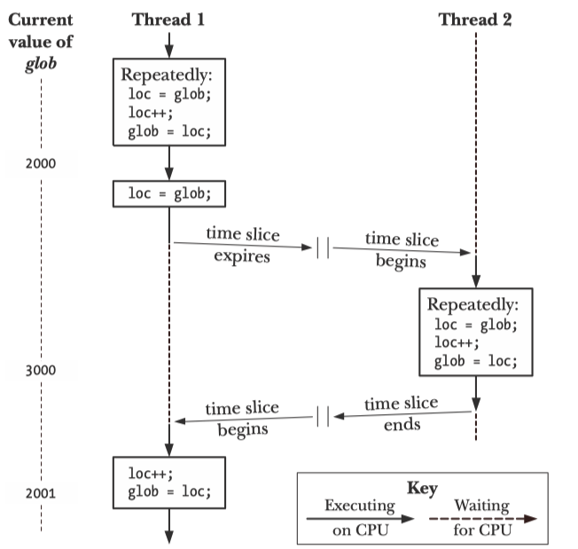 </p>

<p align="center">Another bad synchronization example from <a href = "https://man7.org/tlpi/">The Linux programming interface</a>  chapter 30</p>

Basically, the process of problem occurred should be:

1. Thread 1 fetches the current value of `glob `into its local variable `loc`. Let’s assume that the current value of `glob `is 2000.

2. The scheduler time slice for thread 1 expires, and thread 2 commences execution.

3. Thread 2 performs multiple loops in which it fetches the current value of `glob `into its local variable `loc`, increments `loc`, and assigns the result to `glob`. In the first of these loops, the value fetched from glob will be 2000. Let’s suppose that by the time the time slice for thread 2 has expired, `glob `has been increased to 3000.

4. Thread 1 receives another time slice and resumes execution where it left off. Having previously (step 1) copied the value of glob (2000) into its `loc`, it now increments loc and assigns the result (2001) to `glob`. At this point, the effect of the increment operations performed by thread 2 is lost.

This nondeterministic behavior is a consequence of the vagaries of the kernel’s CPU scheduling decisions. In complex programs, this nondeterministic behavior means that such errors may occur only rarely, be hard to reproduce, and therefore be difficult to find.

To avoid the problems that can occur when threads try to update a shared variable, we must use ***mutex***(short for mutual exclusion) to **ensure that only one thread at a time can access the variable**. More generally, mutex can be used to ensure atomic access to any share resource, but protecting shared variable is the most common use.

A mutex has two states: ***locked*** and ***unlocked***. At any moment, at most one thread may hold the lock on a mutex. **Attempting to lock a mutex that is already locked either blocks or fails with an error, depending on the method used to place to lock.** 

When a thread locks mutex, it becoming the owner of that mutex. Only the mutex owner can unlock the mutex. This property improves the structure of code that uses mutexes and also allow for some optimization in the implementation of muteness. Because of this ownership property, the terms ***acquire*** and ***release*** are sometimes used synonymously for lock and unlock.

In general, we employ a different mutex for each shared resource(which may consist of multiple related variables), and each thread employs the following protocol for accessing a resource:

+ lock the mutex for the shared resource
+ access the shared resource
+ unlock the mutex

If multiple thread try to execute this block of code(***a.k.a. critical section***), the fact that **only one thread can hold the mutex**(the other remain blocked) means that **only one thread at a time can enter the block**.

<p align="center"> 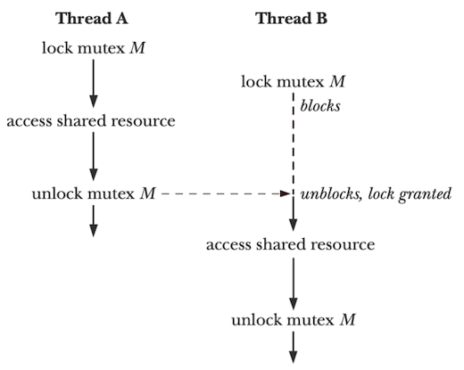 </p>

<p align="center">Using mutex to protect a critical section from <a href = "https://man7.org/tlpi/">The Linux programming interface</a>  chapter 30</p>

To lock and unlock mutex, we use the `pthread_mutex_lock()` and  `pthread_mutex_unlock()`  functions.

```c
#include <pthread.h>
int pthread_mutex_lock(pthread_mutex_t *mutex);
int pthread_mutex_unlock(pthread_mutex_t *mutex);
/* Both return 0 on success, or a positive error number on error */
```

+ To lock a mutex, we specify the mutex in a call to `pthread_mutex_lock()`
  + If the mutex is currently unlocked, this call locks the mutex and returnn immediately.
  + If the mutex is currently locked by another thread, then `pthread_mutex_lock()` blocks until the mutex is unlocked, at which point it locks the mutex and returns.
  + If the calling thread itself has already locked the mutex given to `pthread_mutex_lock()`, then, for the default type of mutex, one of two implementation-defined possibilities may result: the thread deadlocks, blocked trying to lock a mutex that it already owns, or the call fails, returning the error `EDEADLK`
+ The `pthread_mutex_unlock()` function unlock a mutex previous locked by the calling thread.
  + It is an error to unlock a mutex that is not currently locked
  + or to unlock a mutex that is blocked by another thread.
+ If more than one other thread is waiting to acquire the mutex unlocked by a call to `pthread_mutex_unlock()`, it is indeterminate which thread will succeed in acquiring it.


**`pthread_mutex_trylock()`** and **`pthread_mutex_timedlock()`**

+ `pthread_mutex_trylock()` function is the same as `pthread_mutex_lock()`, except that if the mutex is currently locked, `pthread_mutex_trylock()` fails, returning the error `EBUSY`
+ The `pthread_mutex_timedlock()` function is the same as `pthread_mutex_lock()`, except that the caller can specify an additional argument, `abstime` that places a limit on time that the thread will sleep while waiting to acquire the mutex.
  + If the time interval specified by its `abstime` argument expires without the caller becoming the owner of the mutex, `pthread_mutex_timedlock()` returns the error `ETIMEDOUOT`.

#### Statically Allocated Mutexes

A mutex can either be allocated as a static variable or be created dynamically at run time(for example, in a block of memory allocated via `malloc()`).

A mutex is a variable of the type `pthread_mutex_t`. Before it can be used, a mutex must always be initialized. For a statically allocated mutex, we can do this by assigning it the value `PTHREAD_MUTEX_INITIALIZAER`:

```c
pthread_mutex_t mtx = PTHREAD_MUTEX_INITIALIZAER;
```


#### Dynamically Initializing a Mutex

For dynamically allocating a mutex, we must using function of `pthread_mutex_init()`

```c
#include <pthread.h>
int pthread_mutex_init(pthread_mutex_t *mutex, const pthread_mutexattr_t *attr);
/* Returns 0 on success, or a positive error number on error */
```

+ The `mutex` argument identifies the mutex to be initialized.
+ The `attr` argument is a pointer to a `phread_mutexattr_t` object that has previously been initialized to define the attributes of the mutex.
  + If `attr` is specified as `NULL`, then the mutex is assigned various default attributes.

SUSv3 specifies that initializing an already initialized mutex results in underfined behavior; we should not do this:

Among the cases where we must use `pthread_mutex_init()` rather than a static initializer are the following:

+ The mutex was dynamically allocated on the heap
+ The mutex is an automatic variable on the stack
+ We want to initialize a statically allocated mutex with attributes other than the defaults.

When an automatically or dynamically allocated mutex is no longer required, it should be destroyed using `pthread_mutex_destroy()`

```c
#include <pthread.h>
int pthread_mutex_destroy(pthread_mutex_t *mutex);
/* Returns 0 on success, or a positive error number on error */
```

**It is safe to destroy a mutex only when it is unlock, and no thread will subsequently try to lock it.**

+ If the mutex resides in a region of dynamically allocated memory, then it should be destroyed before freeing that memory region.
+ An automatically allocated mutex should be destroyed before its host function returns.
+ A mutex that has been destroyed with `pthread_mutex_destroy()` can subsequently be **reinitialized** by `pthread_mutex_init()`.

To summary:

+ A single thread may not lock the same mutex twice
+ A thread may not unlock a mutex that it doesn't currently own
+ A thread may not unlock a mutex that is not currently locked.


## Spin Lock

#### Lock Implementation: Controling Interrupt

One of the earliest solutions used to provide mutual exclusion was **disable interrupts for critical sections**. This solution was invented for single-processor systems. The code would look like:

```c
void lock(){
  DisableInterrupts();
}
void unlock(){
  EnableInterrupts();
}
```

+ **The main positive of this approach is simplicity**.

+ **The negatives:**

  1. This approach requires us to allow any calling thread to perform a ***privileged*** operation(turning interrupts on and off), and thus **trust** that this facility is not abused.

     For example: 

     - a greedy program could call `lock()` at the beginning of its execution and thus monopolize the processor.
     - an errant of malicious program would call `lock()` and go into an endless loop. In this case, the OS never regains control of the system, and there is only one recourse: restart the system.

  2. The approach does not work with multiprocessors.

  3. turning off interrupts for extended period of time can lead to interrupts becoming lost, which can lead to serious system program. Specifically, if the CPU missed the fact that a disk device has finished a read request, the OS will lost the ability to wake up the process that is waiting for I/O read.

  4. This approach can be inefficient.

### A Failed Attempt: Just Using Loads/Stores

In this approach, we will have to reply on CPU hardware and the instructions it provides us to build a proper lock.

```c
typedef struct __lock_t { int flag; } lock_t;
void init(lock_t *mutex){
  /* 0 -> lock is available, 1 -> held */
  mutex->flag = 0;
}
void lock(lock_t *mutex){
  while(mutex->flag == 1) /* TEST the flag */
    ; /* spin-wait(do noting) */
  mutex->flag = 1;; /* not SET it */
}
void unlock(lock_t *mutex){
  mutex->flag = 0;
}
```

The idea is simple: using a simple variable(`flag`) to indicate whether some thread has possession of a lock.

+ The first thread that enters the critical section will call `lock()`, which **tests whether the flag is equal to 1**, and then **set the flag to 1** to indicate that thread now **hold** the lock.
+ When finished with the critical section, the thread calls `unlock()` and clear the flags, thus indicating that the lock is no longer held.
+ If another thread happens to call `lock()` while the first thread is in the critical section, it will simply  **spin-wait** in the while loop for that thread to call `unlock()` and clear the flag.
+ Once the first thread does so, the waiting thread will fail out of the while loop, set the flag to 1 for itself, and proceed into the critical section.

Unfortunately, the code has two problems:

+ one of correctness

  We can easily product a case where **both threads set the flag to 1** and **both threads are thus able to enter the critical section**.

<p align="center"> 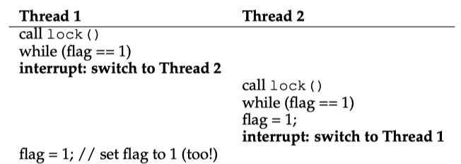 </p>

<p align="center">The problem of load and set from <a href = "https://man7.org/tlpi/">The Linux programming interface</a>  chapter 30</p>

- performance

  the way a thread waits to acquire a lock that is already held: **it endlessly checks the value of flag**, a technique known as ***spin-waiting***. **Spin-waiting wastes time waiting for another thread to release a lock.** The waste is exceptionally high on a uniprocessor, where the thread that the waiter is waiting for cannot even run (at least, until a context switch occurs)! Thus, as we move forward and develop more sophisticated solutions, we should also consider ways to avoid this kind of waste.
  
  

### Building Working Spin Locks with Test-And-Set

***Test-And-Set*** known as the simplest bit of hardware support to understand.

```c
int TestAndSet(int * old_ptr, int new)
{ 
  int old = * old_ptr; // fetch old value at old_ptr 
  * old_ptr = new; // store ’new’ into old_ptr 
  return old; // return the old value 
}
```


```c
typedef struct __lock_t{
  int flag;
} lock_t;

void init(lock_t *lock){
  // 0: lock is available, 1: lock is held
  lock->flag = 0;
}

void lock(lock_t *lock){
  while(TestAndSet(&lock->flag, 1) == 1)
    ; // spin-wait (do noting)
}
```

Specifically, it returns the old value pointed to by the `old_ptr`, and simultaneoulsy updates said value to `new`. The reason it is called "test and set" is that **it enables you to "test" the old value(which is what returned) while simultaneously "setting" the memory location to a new value**;as it turns out, this slightly more powerful instruction is enough to build a simple **spin lock**.

Case 1:

+ Imagine first the case where a thread calls `lock()` and no other thread currently holds the lock; thus, flag should be 0.
+ When the thread calls `TestAndSet`(flag, 1), the routine will return the old value of `flag`, which is 0; thus, the calling thread, which is ***testing*** the value of flag, will not got caught spinning in the while loop and will acquire the lock.
+ The thread will also atomically **set** the value to 1, thus indicating that the lock is now held.
+ When the thread is finished with its critical section, it calls `unlock()` to set the flag back to zero.

Case 2:

+ Imagine when one thread already has the lock held(*i.e.*, flag is 1). In this case, this thread will call `lock()` and then calll `TestAndSet`(flag, 1) as well.
+ `TestAndSet()` will return the old value, which is 1(becauase the lock is held), while simultaneously setting it to 1 again.
+ As long as the lock held by another thread, `TestAndSet()` will repeatedly return 1, and thus this thread will spin and spin until the lock is finally released.
+ When the flag is finally set to 0 by some other thread, this thread will call `TestAndSet()` again, which will now return 0 while atomically setting the value to 1 and thus acquire the lock and enter the critical secton.

**By making both the test (of the old lock value) and set (of the new value) a single atomic operation, we ensure that only one thread acquires the lock. And that’s how to build a working mutual exclusion primitive!**

It is the simplest type of lock to build, and simply spins, using CPU cycles, until the lock becomes available. 

+ To work correctly on a **single processor**, it requires a ***preemptive scheduler*** (i.e., one that will interrupt a thread via a timer, in order to run a different thread, from time to time). 
+ Without preemption, spin locks don’t make much sense on a single CPU, as a thread spinning on a CPU will never relinquish it.

#### Evaluating Spin Locks

+ **correctness**(does it provide mutual exclusion?): **Yes**. the spin lock only allows a single thread to enter the critical section at a time. 
+ **fairness**(how fair is a spin lock to waiting thread?): **No**, spin locks don’t provide any fairness guarantees. Simple spin locks (as discussed thus far) are **not fair** and **may lead to starvation**.
+ **performance**(What are the costs of using spin lock?): 
  1. single processor: performance overheads can be quite painful;
     - The scheduler might then **run every other thread** (imagine there are N − 1 others), **each of which tries to acquire the lock**.
     - Each of those threads will spin for the duration of a time slice before giving up the CPU, a waste of CPU cycles.
  2. multiply processores: Spinning to wait for a lock held on another processor doesn’t waste many cycles in this case, and thus can be effective.

### Compare-And-Swap(CAS)

Another hardware primitive that some systems provide is known as the ***compare-and-swap*** instruction (as it is called on SPARC, for example), or ***compare-and-exchange*** (as it called on x86).

Compare-and-swap (CAS) is an atomic operation that allows for the comparison of a value in memory with an expected value and the conditional swapping of the value if the comparison is successful. The CAS operation is typically performed in a single atomic step, ensuring that no other concurrent operation can interfere with it.

The basic idea is for ***compare-and-swap*** to test whether the value at the address specified by `ptr` is equal to `expected`;

+ if so, indicating that no other thread has modified the value in the meantime, and thus update the memory location pointed by `ptr` with the new value.
+ if not, do nothing, where it means that the value has been modified by another thread.

In either case, **return the original value at that memory location**, thus allowing the code calling compare-and-swap to know whether it succeeded or not.

```c
int CompareAndSwap(int *ptr, int expected, int new){
  int original = *ptr;
  if(original == expected)
    *ptr = new;
  return original;
}

typedef struct __lock_t { 
  int flag; 
} lock_t;

void init(lock_t * lock) { 
  // 0: lock is available, 1: lock is held 
  lock->flag = 0; 
}

void lock(lock_t *lock){
  while(CompareAndSwap(&lock->flag, 0, 1) == 1)
    ; //spin
}

void unlock(lock_t * lock) { 
  lock->flag = 0; 
}
```

The purpose of CAS is to achieve synchronization and ensure atomic updates without the need for locks or other explicit synchronization mechanisms. CAS is commonly used in lock-free and wait-free algorithms, where multiple threads can concurrently access shared data structures or perform atomic operations without blocking or waiting for locks.

### Fetch-And-Add

***Fetch-and-add*** is an atomic operation that reads the value from a memory location and atomically adds a specified value to that location. Fetch-and-add atomically increments a value while returning the old value at a particular address. The fetch-and-add operation ensures that **no other concurrent operation can interfere with the read and addition**, providing atomicity and synchronization.

```c
int FetchAndAdd(int *ptr){
  int old = *ptr;
  *ptr = old + 1;
  return old;
}
```

**Fetch-and-add is often used as a key operation in the implementation of a ticket lock.**

**Ticket lock** operates based on the idea of **serving customers in a queue**, where **each customer takes a ticket with a unique number when they arrive**. The customer with the lowest ticket number is served first. Similarly, in a ticket lock, each thread/process requesting the lock takes a ticket and waits until its ticket number matches the current ticket being served. This ensures that threads/processes are served in a first-come-first-served manner.

```c
typedef struct __lock_t{
  int ticket;
  int turn;
} lock_t;

void lock_init(lock_t *lock){
  lock -> ticket = 0;
  lock -> turn   = 0;
}

void lock(lock_t *lock){
  int myturn = FetAndAdd(&lock->ticket);
  while(lock->turn != myturn)
    ; // spin
}

void unlock(lock_t *lock){
  lock->turn = (lock->turn) + 1;
  // or FetAndAdd(&lock->turn)
}
```

Note one important difference with this solution versus our previous attempts: **it ensures progress for all threads**. 

+ Once a thread is assigned its ticket value, it will be scheduled at some point in the future (once those in front of it have passed through the critical section and released the lock). 
+ In our previous attempts, no such guarantee existed; a thread spinning on test-and-set (for example) could spin forever even as other threads acquire and release the lock.


### Yield Operation in Lock

The idea is simple: when you are going to spin, instead give up the CPU to another thread.

In this approach, we assume an operating system primitive `yield()` which a thread can call when it wants to **give up the CPU and let another thread run**. A thread can be in one of three states (***running***, ***ready***, or ***blocked***); **yield is simply a system call that moves the caller from the *running* state to the *ready* state**, and thus promotes another thread to running. Thus, the yielding thread essentially deschedules itself.

If one thread acquires the lock and is preempted before releasing it, the other thread that calls `lock()`, find the lock held, and yield the CPU. Each of thread that not held the lock will execute this run-and-yield pattern before the thread holding the lock gets to run again.

Howver, this approach is still costly; **the cost of a context switch can be substantial**, and there is thus plenty of waste.

### Using Queues: Sleeping instead of Spinning

Unfortunately, all of the previous approach are using spinning wait, and **too much spining can be quite inefficient**.

The scheduler determines which thread runs next; if the scheduler makes a bad choice, a thread runs that must either 

+ spin waiting for the lock (our first approach)
+ yield the CPU immediately (our second approach). 

Either way, there is potential for waste and no prevention of starvation.

To solve this problem, only hardware involve is not enough, where it needs OS support, as well as a **queue to keep track of which threads are waiting to acquire the lock**.

In Linux, it provides a ***futex(short for "fast userspace mutex")***, a in-kernel functionality. Each futex has associated with it a specific physical memory location, as well as a per-futex in-kernel queue. The key idea behind futex is that most of the time, the synchronization can be performed in userspace without involving the kernel. This reduces the overhead of context switches and system calls, making futex an efficient choice for low-contention scenarios.

Specifically, two calls are available. 

+ The call to `futex_wait(address, expected)` 
  + puts the calling thread to sleep, assuming the value at `address` is equal to `expected`.
  + If `address != expected`, the call returns immediately.
+ The call to the routine `futex_wake(address)` wakes one thread that is waiting on the queue.

The code snippet below is from `lowlevellock.h` in the nptl library(parrt of the gnu libc library)

```c
void mutex_lock(int *mutex){
  int v;
  /* Bit 31 was clear, we got the mutex(the fastpath) */
  if(atomic_bit_test_set(mutex, 31) == 0)
    return ;
  atomic_increment(mutex);
  while(1){
    if(atomic_bit_test_set(mutex, 31) == 0){
      atomic_decrement(mutex);
      return ;
    }
    /*
    	We have to waitFirst make sure the futex value
    	we are monitoring is truly negative(locked)
    */
    v = *mutex;
    if(v >= 0)
      continue;
    futex_wait(mutex, v);
  }
}

void mutex_unlock(int *mutex){
	/* 
		Adding 0x80000000 to counter results in 0 if 
		and only if there are not other interested threads 
  */ 
  if (atomic_add_zero (mutex, 0x80000000))
		return;

  /*
    There are other threads waiting for this mutex, 
    wake one of them up. 
  */ 
  futex_wake (mutex);
}
```

Several points need to mention:

+ This code snippet uses a **single integer to track both whether the lock is held or not** (the high bit of the integer) and **the number of waiters on the lock** (all the other bits). 

  Thus, if the lock is negative, it is held (because the high bit is set and that bit determines the sign of the integer).

+ When there is no contention for the lock; with only one thread acquiring and releasing a lock, very little work is done (the atomic bit test-and-set to lock and an atomic add to release the lock).

The futex mechanism's effectiveness lies in its ability to handle low-contention scenarios efficiently, as most of the synchronization work is done in userspace without incurring the overhead of frequent system calls or context switches. When contention increases, the kernel's involvement helps ensure that the synchronization remains reliable and doesn't lead to livelocks or other issues.


## Condition Variables

There are many cases where a thread wishes to check whether a condition is true before continuing its execution. For example, a parent thread might wish to check whether a child thread has completed before continuing (this is often called a `join()`).

To wait for a condition to become true, a thread can make sure of what is konwn as a ***condition variable***. A ***condition variables*** is an explicit queue that threads can put themselves on when some state of execution(*i.e*, some  condition) is not as desire (by ***waiting*** on the condition); Some other thread, when it changes said state, can then wake one(or more) of those waiting threads thus allow them to continue(by ***signal*** the condition).

The idea goes back to Dijkstra’s use of “private semaphores”<a href="#reference1">[1]</a>; a similar idea was later named a “condition variable” by Hoare in his work on monitors <a href="#reference2">[2]</a>.

**A mutex prevents multiple threads from accessing a shared variable at the same time. A condition variable allows one thread to inform other threads about changes in the state of a shared variable (or other shared resource) and allows the other threads to wait (block) for such notification.**

**A condition variable is always used in conjunction with a mutex.** The mutex provides mutual exclusion for accessing the shared variable, while the condition variable is used to signal changes in the variable’s state.

#### Pthread APIs

##### Statically Allocated Condition Variables

A condition variable has the type `pthread_cond_t`. As with a mutex, **a condition variable must initialized before use**.

For statically allocated condition variable, this is done by assigning it the value `PTHREAD_COND_INITIALIZER`:

```c
pthread_cond_t cond = PTHREAD_COND_INITIALIZER;
```

##### Signaling and Waiting on Condition Variables

The principle condition variable operations are ***signal*** and ***wait***. 

+ The signal operation(`pthread_cond_signal()` and `pthread_cond_broadcast()`) is a notification to one or more waiting threads that a shared variable's state has changed.

  + The difference between `pthread_cond_signal()` and `pthread_cond_broadcast()` lies in what happens if multiple threads are blocked in `pthread_cond_wait()`

    + With `pthread_cond_signal()`, we are simply guaranteed that at least one of the blocked thread is woken up;

      `pthread_cond_signal()` should be used only if just one of the waiting threads needs to be woken up to handle the change in state of the shared variable, and it doesn’t matter which one of the waiting threads is woken up.

      Specifially:

      1. All waiting threads are awoken.

      2. One thread is scheduled first. This thread checks the state of the shared variable(s) (under protection of the associated mutex) and sees that there is work to be done. The thread performs the required work, changes the state of the shared variable(s) to indicate that the work has been done, and unlocks the associated mutex.

      3. Each of the remaining threads in turn locks the mutex and tests the state of the shared variable. However, because of the change made by the first thread, these threads see that there is no work to be done, and so unlock the mutex and go back to sleep (i.e., call pthread_cond_wait() once more).

    + With `pthread_cond_broadcast()`, all blocked threads are woken up.

      Using `pthread_cond_broadcast()` always yields correct results (since all threads should be programmed to handle redundant and spurious wake-ups), but `pthread_cond_signal()` can be more efficient.

      `pthread_cond_broadcast()` handles the case where the waiting threads are designed to perform different tasks (in which case they probably have different predicates associated with the condition variable).

+ The wait operation(`pthread_cond_wait()`) is the means of blocking until such a notification is received.

  + `pthread_cond_wait()` also takes a mutex as a parameter, where **it assumes that this mutex is locked when `wait()` is called**.
  + The responsibility of `pthread_cond_wait()` is to **release the lock** and **put the calling thread to sleep(atomatically)**; 
  + When the thread wakes up(after some other thread has signaled it), it must **re-acquire the lock** before returning to the caller.

```c
#include <pthread.h>

int pthread_cond_signal(pthread_cond_t *cond); 
int pthread_cond_broadcast(pthread_cond_t *cond); 
int pthread_cond_wait(pthread_cond_t *cond, pthread_mutex_t *mutex);

/* All return 0 on success, or a positive error number on error */
```

A condition variable holds no state information. It is simply a mechanism for communicating information about the application’s state. If no thread is waiting on the condition variable at the time that it is signaled, then the signal is lost. A thread that later waits on the condition variable will unblock only when the variable is signaled once more.

+ The `pthread_cond_timedwait()` function is the same as `pthread_cond_wait()`, except that the `abstime` argument **specifies an upper limit on the time** that the thread will sleep while waiting for the condition variable to be signaled.

```c
#include <pthread.h>

int pthread_cond_timedwait(pthread_cond_t *cond, pthread_mutex_t *mutex, 
                           const struct timespe *abstime);
/* Return 0 on Success, or a positive error number on error */
```

##### Dynamically Allocated Condition Variables

The `pthread_cond_init()` function is used to dynamically initialize a condition variable, where we must use `pthread_cond_init()` to initilize automatically and dynamically allocated condition variables, and to initialize a statically allocated condition variable with attributes other than the default.

```c
#include <pthread.h>

int pthread_cond_init(pthread_cond_t *cond, const pthread_condattr_t *attr);
/* Return 0 on success, or a positive error number on error */
```

+ The `cond` argument identifies the condition variable to be initialized.
+ Various Pthread functions can be used to initilize the attribute in the `pthread_condattr_t` object pointed by `attr`.
  + if `attr` is `NULL`, a default set of attributes is assigned to the condtion variable.

When an automatically or dynamically allocated condition variable is no longer required, then it should be **destroyed** using `pthread_cond_destroy()`. **It is not necessary to call `pthread_cond_destroy()` on a condition variable that was statically initialized** using `PTHREAD_COND_INITIALIZER`.

```c
#include <pthread.h>
int pthread_cond_destory(pthread_cond_t *cond);
/* Return 0 on success, or a positive error number on error */
```

**It is safe to destroy a condition variable only when no threads are waiting on it.** 

**If the condition variable resides in a region of dynamically allocated memory,** **then it should be destroyed before freeing that memory region.** An automatically allocated condition variable should be destroyed before its host function returns.

A condition variable that has been destroyed with `pthread_cond_destroy()` can subsequently be reinitialized by `pthread_cond_init()`.

#### Why Condition Variable Functions Require A Mutex? <a href="#reference4">[4]</a>

One of the reasons is that the condition variable is originally implemented by the mutex lock.

For the wait operation, it will 'atomically' unlock the mutex, allowing others access to the condition variable(for signaling). Then when the condition variable is signalled or broadcast to, one or more of the thread on the waiting list will be woken up and the mutex will be magically locked again for that thread.

Specifically, when the thread has been flagged to stop doing work (usually by another thread setting the exit condition then kicking the condition variable to wake this thread up), the wait loop will exit, the mutex will be unlocked and this thread will exit. The condition variable relieves you of the burden of polling some condition instead allowing another thread to notify you when something needs to happen.

The vast majority of what are often erroneously called [***spurious wakeups***](https://en.wikipedia.org/wiki/Spurious_wakeup) was generally always because multiple threads had been signalled within their `pthread_cond_wait` call (broadcast), one would return with the mutex, do the work, then re-wait. Then the second signalled thread could come out when there was no work to be done. So you had to have an extra variable indicating that work should be done (this was inherently mutex-protected with the condvar/mutex pair here - other threads needed to lock the mutex before changing it however).


## Semaphores

A semaphore, `s`, is a global variable witha nonnegative integer value that can only be manipulated by two special operationis:

+ ***P***(s): a.k.a **Proberen** in Dutch(to test)
  + If `s` is nonzero, then ***P*** decrements `s` and returns immediatly.
  + If  `s` is zero, then suspend the thread until `s` become nonzero and the thread is restarted by a ***V*** operation. After restarting, the ***P*** operation decrements `s` and returns control to the caller.
+ ***V***(s): The ***V*** operation increments `s` by 1. (*a.k.a* **Verhogen** in Dutch(to increment))
  + If there are any threads blocked at a ***P*** operation waiting for `s` to become nonzero, then ***V*** operation restarts exactly one of these threads, which then completes its ***P*** operation by decrementing `s`.

The basic idea is to associate a semaphore `s`, initially 1, with each shared variable(or related set of shared variables) and then surround the corresponding critical section with `P(s)` and `V(s)` operations.

Semaphores inherently provide synchronization with atomic wait and signal operations, making them easier to use in certain cases without the need for explicit locks.

In the POSIX standard, these routines are `sem wait()`(***P***) and `sem post() ` (***V***).

```c
#include <semaphore>

int sem_init(sem_t *sem, int pthread, unsigned int value);
int sem_destroy(sem_t *sem);
int sem_wait(sem_t *s); /* P(s) */
int sem_post(sem_t *s); /* V(s) */
/* Return: 0 if Ok; -1 on error */
```

where , in `sem_init`, `pthread` argument indicates whether the semaphore is to be shared between threads or between processes.

+ **If `pthread` is 0**, then the semaphore is to be **shared between the threads of the calling process**.
  + `sem` is typically specified as the address of either a global variable or a variable allocated on the heap.
  + A thread-shared semaphore has process persistence; it is destroyed when the process terminates
+ **If `pthread` is nonzero, then semaphore is to be shared between processes.**
  + `sem` must be the address of a location in a region of shared memory(a POSIX shared memory object, a shared mapping created using `mmap()` or System V shared memory segment)
  + **The semaphore persists as long as the shared memory in which it resides**.(The shared memory regions created by most of these techniques have kernel persistence. The exception is shared anonymous mappings, which persist only as long as process maintains the mapping).
  + Since a child produced via `fork()` inherits its parent's memory mapping, **process-shared semaphores are inherited by the child of a `fork()`**, and parent and child can use these semaphores to synchronize their actions.

There are no permission settings associated with an unnamed semaphore (i.e., `sem_init()` has no analog of the mode argument of `sem_open()`). Access to an unnamed semaphore is governed by the permissions that are granted to the process for the underlying shared memory region.

After an unnamed semaphore segment has been destroyed with `sem_destroy()`, it can be reinitialized with `sem_init()`.

An unnamed semaphore should be destroyed before its underlying memory is deallocated.

+ For the `sem_wait()`, it decrements(decrease by 1) the value of the semaphore referred to by `sem`.
  + If the semaphore currently has a value greater than 0, `sem_wait()` returns immediately.
  + If the value of the semaphore is currently 0, `sem_wait()` blocks until the semaphore value rises above 0; at that time, semaphore is then decremented and `sem_wait()` returns.
  + If a blocked `sem_wait()` calls is interrupted by a signal handler, then it fails with the error `EINTR`, regardless of whether the `SA_RESTART` flag was used when establishing the signal handler with `sigaction()`.(On some UNIX implementations, `SA_RESTART` does cause `sem_wait()` to automatically restart.)
+ For the `sem_post()`, it increments(increases by 1) the value of the semaphore referred to by `sem.`
  + If the value of the semaphore was 0 before the `sem_post()` call, and some other process(or thread) is blocked waiting to decrement the semaphore, then that process is awoken, and its `sem_wait()` call proceeds to decrement the semaphore.
  + If multiple processes(or threads) are blocked in `sem_wait()`, then, if the processes are being scheduled under the default round-robin time-sharing policy, it is indeterminated which one will will be awoken and allowed to decrement the semaphore.

#### Binary Semaphore(Locks)

For binary semaphore, **its value always 0 or 1**. Performancing a `P` operation on a mutex is equal to `locking` operation, whereas `V` operation is equal to `unlocking` the mutex.

Let's assume we have two threads:

+ The first thread(Thread 0) calls `sem_wait()` or `P` operation; it will first decrement the value of the semaphore, chaning it to 0.
+ Then, it will wait only if the value is **not great than or equal to 0**. Because the value is zero, `sem_wait()` will simply return and calling thread willl continue. Thread 0 now is free to enter the critical section.
+ If no other thread tries to acquire the lock while Thread 0 is inside the critical section, when it calls `sem_post()` or `V` opeartion, it will simply restore the value of the semaphore to 1(and not wake a waiting thread, because there is none)

A more interesting case arises when Thread 0 “holds the lock” (i.e., it has called `sem wait()` but not yet called `sem_post()`), and another thread (Thread 1) tries to enter the critical section by calling `sem wait()`. In this case, Thread 1 will decrement the value of the semaphore to -1, and thus wait(putting itself to sleep and relinquishing the processor). When Thread 0 runs again, it will eventually call `sem_post()`, incrementing the value of  the semaphore back to zero, and then wake the waiting thread(Thread 1), which will then be able to acquire the lock for itself. When Thread 1 finishes, it will again increment the value of the semaphore, restoring it  to 1 again.

<p align="center"> 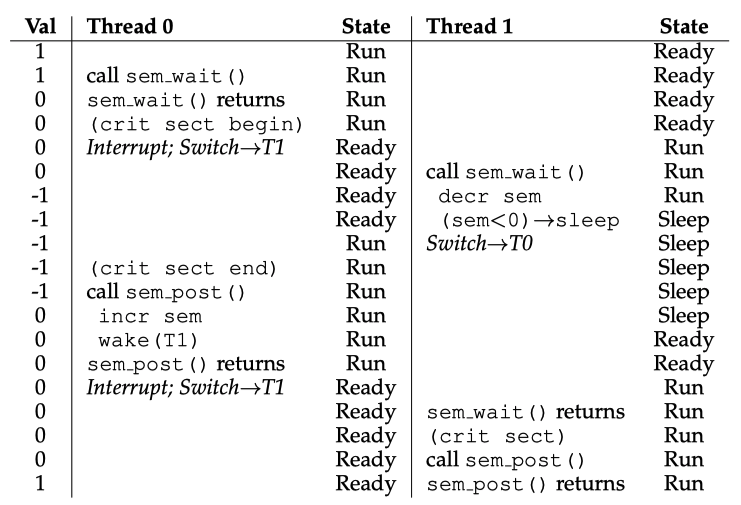 </p>

<p align="center">Thread Trace: Two Threads Using A Semaphore from <a href = "https://pages.cs.wisc.edu/~remzi/OSTEP/">
Operating Systems: Three Easy Pieces</a>  chapter 31</p>

<p align="center"> 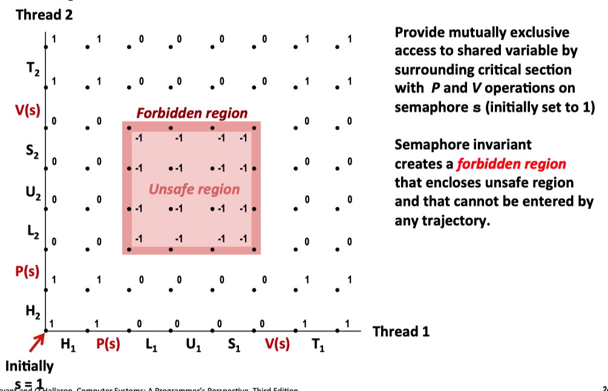 </p>

<p align="center">Process graph for binary semaphore, the figure from <a href = "https://www.cs.cmu.edu/afs/cs/academic/class/15213-f15/www/lectures/24-sync-basic.pdf">cmu-213 slide</a></p>

#### Semaphore For Ordering

Semaphore are also useful to order events in a concurrent program. For example. a thread may wish to wait for a list to become non-empty, so it can delete an element from it. In this pattern of usage, we often find one thread ***waiting*** for something to happen, and another thread making that something happen and then ***signaling*** that it is has happened, thus walking the waiting thread. We are thus using semaphore as an ***ordering primtive***(similar to the uage of ***condition variable***)

```c
sem_t s;
void *child(void *arg){
  printf("child\n");
  sem_post(&s); /* signal here: child is done */
  return NULL;
}
int main(int argc, char **argv){
  sem_init(&s, 0, 0);
  printf("parent: begin\n");
  pthread_t c;
  Pthread_create(&c, NULL, child, NULL);
  sem_wait(&s); /* wait here for child */
  printf("parent: end\n");
  return 0;
}
```

There has two cases we need to consider:

1. the parent creates the child but the ***child has not run yet*** (i.e., it is sitting in a ready queue but not running).

   + the parent will call `sem_wait()` **before** the child has called `sem_post()`; we’d like the parent to wait for the child to run.
   + This will happen is **if the value of the semaphore is not greater than 0; hence, 0 is the initial value.** The parent runs, decrements the semaphore (to -1), then waits (sleeping).
   + When the child finally runs, it will call `sem_post()`, increment the value of the semaphore to 0, and wake the parent, which will then return from sem wait() and finish the program.

   <p align="center"> 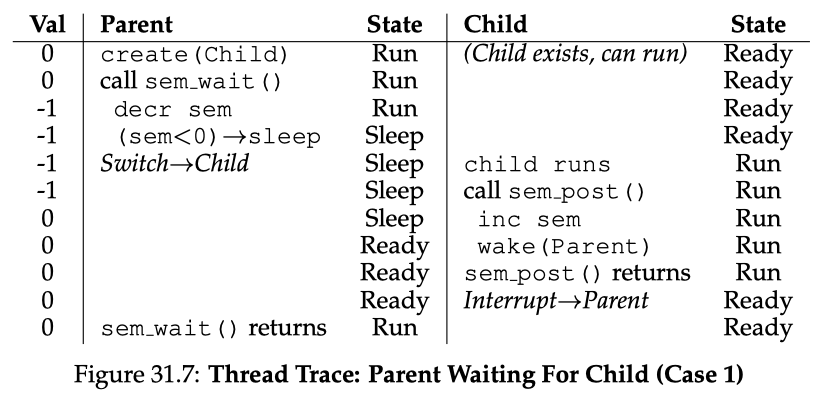 </p>

   <p align="center">Thread Trace: Parent Waiting for Child Case1 from <a href = "https://pages.cs.wisc.edu/~remzi/OSTEP/">
   Operating Systems: Three Easy Pieces</a>  chapter 31</p>

2. when the ***child runs to completion*** **before** the parent gets a chance to call `sem_wait()`.

   + the child will first call `sem_post()`, thus incrementing the value of the semaphore from 0 to 1.

   + When the parent then gets a chance to run, it will call `sem_wait()` and find the value of the semaphore to be 1; the parent will thus decrement the value (to 0) and return from `sem_wait()` without waiting, also achieving the desired effect.

     <p align="center"> 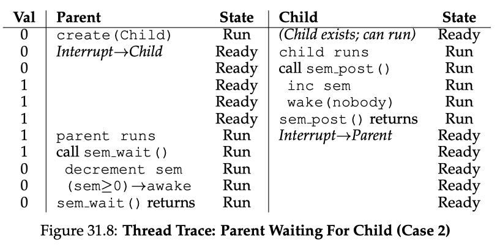 </p>

     <p align="center">Thread Trace: Parent Waiting for Child Case2 from <a href = "https://pages.cs.wisc.edu/~remzi/OSTEP/">
     Operating Systems: Three Easy Pieces</a>  chapter 31</p>


## The Difference Between Mutex with Condition Variable and Semaphore

1. Ownership:
   + A shared resource protected by mutex lock can be accessed **only by one thread** at any time. 
     The thread owning the mutex lock has to release it in order to let any other thread access the resource (which will again require acquisition of the mutex lock).
   + Semaphore allows a resource to be concurrently accessed by **at most N threads at any time**. The value of N is dependent on the application.
2. Purpose:
   + A mutex lock with a condition variable is primarily used for mutual exclusion (protecting critical sections) and providing a way for threads to wait for specific conditions to become true before proceeding. **It allows threads to coordinate based on complex conditions.**
   +  A semaphore is a synchronization primitive used to control access to a shared resource or to represent the count of available resources. It is **commonly used for resource counting**, such as managing a fixed pool of resources that multiple threads can access.
3. Signaling:
   + Condition variables allow for **explicit signaling**, meaning threads can be awakened based on specific conditions, reducing unnecessary wake-ups and providing more **precise control over thread coordination**.
   + Normally, semaphore will wake all the thread up when calls `sem_post()` and not guarantee which one thread will take over the resource.

The **main difference** between mutex with condition variable and semaphore lies in their primary use cases and how they handle signaling:

- ***Mutex with Condition Variable*** is typically used when you need mutual exclusion and want threads to wait for complex conditions before proceeding. It provides **explicit signaling control** and is more suitable for scenarios where threads need to **wait for specific conditions** to become true before they can continue their tasks.

  The scenarios that used mutex with condition variable more often:

  1. ***Producer-Consumer Problem***: Mutex locks with condition variables are commonly used to solve the classic producer-consumer problem, where multiple producer threads generate data, and multiple consumer threads process the data. The condition variable allows consumers to wait for new data when the buffer is empty and be awakened when the producer adds new data.
  2. ***Reader-Writer Problem***: In scenarios where multiple reader threads can access shared data simultaneously but exclusive access is required for writer threads, mutex locks with condition variables can be used to implement reader-writer synchronization. Readers acquire the mutex lock to access the shared data, while writers wait on the condition variable when they want exclusive access to modify the data.
  3. ***Barrier Synchronization***: Mutex locks with condition variables can be used to implement barrier synchronization, where multiple threads need to synchronize at a certain point before proceeding. Threads wait on a condition variable until all threads have reached the barrier, and then the condition is signaled to allow all threads to proceed.

- ***Semaphore*** is often used for **resource counting or controlling access to a limited number of resources**. It is more straightforward in terms of signaling, as it allows threads to wait until a certain number of resources become available. Semaphores are often used when the number of resources is fixed or when you want to limit the number of concurrent tasks accessing a resource.

  The scenarios that used semaphore more often:

  1. ***Resource Pool Management***: Semaphores are commonly used to manage resource pools, where a fixed number of resources is available for use by multiple threads. The semaphore's count represents the number of available resources, and threads wait for the semaphore when they need a resource, which decrements the count. When a resource is released, the semaphore is signaled to increment the count.
  2. ***Task Pool and Throttling***: In scenarios where a fixed number of threads need to work on tasks concurrently or where a certain number of tasks can be processed in parallel, semaphores can be used to control task concurrency. Threads acquire semaphore permits before working on a task and release them when done, limiting the number of tasks running in parallel.
  3. ***Multithreaded Printing***: Semaphores can be used in multithreaded environments to synchronize access to shared resources like a printer. Threads representing different print jobs can acquire a semaphore permit to print, ensuring that only a limited number of print jobs are processed simultaneously.

## Producer-Consumer Problem

***Producer-consumer problem***, also known as ***bound buffer problem***, which was first postd by Dijkstra<a href="#reference3">[3]</a>.

Imagine one or more producer threads and one or more consumer threads. A producer and consumer thread share a ***bounded buffer*** with ***n slots***.

+ Producer thread repeatedly generate new data items and place them in a buffer;
+ Consumer thread repeatedly grab the date items from the buffer and consume(use) them in some way.

Producer-consumer interactions occur frequently in real-systems. For example:

+ In a multimedia system, 

  + the producer might encode video frames, 
  + while the consumer decodes and renders them on the screen.

  The purpose of the buffer is to reduce jitter in the video stream caused by data-dependent differences in the encoding and decoding times for individual frames.
  The buffer provides a reservior of slots to the producer and a reservior of encoded frames to the consumer.

+ Another common example is the design of graphical user interfaces

  + The producer detects mouse and keyboard events and inserts them in the buffer.
  + The consumer removes the events from the buffer in some priority-based manner and paints the screen.

### Mutex + Condition Variable

First of all, condition variables is to **always use while loops**. To do this is for solving the problem of ***Mesa semantics*** <a href="#reference5">[5]</a>, the problem is raised from after the producer woke the waiting consumer thread but before this thread ever ran, the state of the bound buffer changed by the other consumer thread. Specifically, signaling a thread only wakes the target consumer thread up, but there is no guarantee that when the target consumer thread runs.

Second, for the producer-consumer problem, ***single condition variable for both of producer and consumer is not enough***.

In the code, producer threads wait on the condition `empty`, and signals `fill`. Conversely, **consumer threads wait on fill and signal empty**. By doing so, a consumer can never accidentally wake a consumer, and a producer can never accidentally wake a producer.

```c
int buffer[MAX];
int fill_ptr = 0;
int use_ptr = 0;
int count = 0;

void put(int value){
  buffer[fill_ptr] = value;
  fill_ptr = (fill_ptr + 1) % MAX;
  count ++;
}

int get(){
  int tmp = buffer[use_ptr];
  use_ptr = (use_ptr + 1) % MAX;
  count --; 
  return tmp;
}
```


```c
cond_t empty, fill;
mutex_t mutex;

void *producer(void *arg){
  int i;
  for(i = 0; i < loops; i++){
    Pthread_mutex_lock(&mutex);
    while(count == MAX)
      Pthread_cond_wait(&empty, &mutex);
    put(i);
    Pthread_cond_signal(&fill);
    Pthread_mutex_unlock(&mutex);
  }
}

void *consumer(void *arg){
  int i;
  for(i = 0; i < loops; i++){
    Pthread_mutex_lock(&mutex);
    while(count == 0)
      Pthread_cond_wait(&fill, &mutex);
    int tmp = get();
    Pthread_cond_signal(&empty);
    Pthread_mutex_unlock(&mutex);
    printf("%d\n", tmp);
  }
}
```

***Covering condition :*** replace the `pthread_cond_signal() `call in the code above with a call to `pthread_cond_broadcast()`, which **wakes up all waiting threads**. By doing so, we guarantee that any threads that should be woken are. The downside, of course, can be a negative performance impact, as we might needlessly wake up many other waiting threads that shouldn’t (yet) be awake. Those threads will simply wake up, re-check the condition, and then go immediately back to sleep.

#### Semaphore

In the code, we use three semaphore values to make sure every thing works fine, where

+ `empty` is to markwhether the current slot is empty or not. Producer decrease this value and consumer increase it.
+ `full` is to mark whether the current slot is full or noto. Producer increase it and consumer decrease it.
+ `mutex` is the part the implementation of mutual exclusion(binary semaphore), which is to prevent the race condition.

```c
sem_t empty;
sem_t full;
sem_t mutex
 
#define MAX 1
 
int buffer[MAX];
int fill = 0;
int use = 0;

void put(int value){
  buffer[fill] = value;
  fill = (fill + 1) % MAX;
}

int get(){
  int tmp = buffer[use];
  use = (use + 1) % MAX;
  return tmp;
}

void *producer(void *arg){
  int i;
  for(i = 0; i < loops; i++){
    sem_wait(&empty);
    sem_wait(&mutex); /* mutex here */
    put(i);
    sem_post(&mutex); /* and here */
    sem_post(&full);
  }
}

void *consumer(void *arg){
  int i;
  for(i = 0; i < loops; i++){
    sem_wait(&full);
    sem_wait(&mutex); /* mutex here */
    int tmp = get(i);
    sem_post(&mutex); /* and here */
    sem_post(&empty);
    printf("%d\n", tmp);
  }
}

int main(int argc, char * argv[]) { 
  
  // ...
	sem_init(&empty, 0, MAX); // MAX are empty 
  sem_init(&full, 0, 0); // 0 are full 
  sem_init(&mutex, 0, 0); // 0 are mutex
  // ...

}
```


## Reader-Writer Problem

A collection of concurrent threads is accessing a shared object such as a data structure in main memory or a database on disk, some thread only read object while other modify it.

+ Threads that modify the object are called ***writers***
+ Threads that only read it are called ***readers***

Write must have exclusive access to the object, but readers may share the object with an unlimited number of other readers.
In general, there are an unbounded number of concurrent readers and writers.

The special type of lock to support this type of operation is known as a ***reader-writer lock***.

+ If some thread wants to update the data strucuture in question, it should call the new pair of synchronization operations:  `rwlock_acquire_write_lock()`, to acquire a write lock and `rwlock_release_write_lock()` to release it.
  Internally, these simply use the ***write lock*** semaphore to ensure that **only a single writer can acquire the lock** and thus enter the critical section to update the data structure in question.
+ When acquiring a read lock, the reader first acquires `lock` and then increments the ***readers*** variable to track how many readers are currently inside the data structure.
  The important step then taken within `rwlock_acquire_readlock()` occurs when the first reader acquires the lock; in that case, the reader also acquire the ***write lock*** by calling `sem_wait()` on the ***writer lock*** semaphore, an then releasing the lock by calling `sem_post()`.
  + ***once a reader has acquired a read lock, more reader will be allowed to acquire the read lock too***; 
  + however, **any thread that wishes to acquire the writee lock will have to wait unitl all readers are finished;** 
  + **the last one to exit the critical section call `sem_post()` on write lock and thus enable a waiting writer to acquire the lock**.

```c
typedef struct _rwlock_t{
  sem_t lock;       /* binary semaphore */
  sem_t writelock;  /* allow ONE writer/MANY readers */
  int readers;      /* number of readers in critical section */
} rwlock_t;

void rwlock_init(rwlock_t *rw){
  rw->readers = 0;
  sem_init(&rw->lock, 0, 1);
  sem_init(rw->writelock(&rw->lock, 0, 1));
}

void rwlock_acquire_readlock(rwlock_t *rw){
  sem_wait(&rw->lock);
  rw->readers ++;
  if(rw->readers == 1) /* first reader gets writelock */
    sem_wait(&rw->writelock);
  sem_post(&rw->writelock);
}

void rwlock_release_readlock(rwlock_t *rw){
  sem_wait(&rw->lock);
  rw->readers --;
  if(rw->readers == 0) /* last reader lets it go */
    sem_post(&rw->writelock);
  sem_post(&rw->lock);
}

void rwlock_acquire_writelock(rwlock_t *rw){
  sem_wait(&rw->writelock);
}

void rwlock_release_writelock(rwlock_t *rw){
  sem_post(&rw->writelock);
}
```

Readers-writers interactions occur frequently in real systems. For example:

+ In online airline reservation system, an unlimited number of customers are allowed to concurrently inspect the seat assignments, but a custeromer who is booking a seat must have exclusive access to the database.
+ In a multi-threads cacheing web proxy, an unlimited number of threads can fetch existing pages from the shared page cache, but any thread that writes a new page to the cache must have exclusive access,

The reader-writer problem has several variations, each based on the priorities of readers and writers.

+ The ***first readers-writers problem***, **which favors readers**, requires that no reader be kept wairing unless a writer has already been granted permission to use the object.
  In other words, no reader should wait simply because a writer is waiting.
+ The ***second readers-writes problem***, **which favors writes**, requires that once a writer is ready to write, it performs its write as soon as possible.
  In this case, a reader that arrives after a writer must wait, even if the writer is also waiting.

## The Dining Philosophers

The basic setup for the problem is: assume there are five "philosophers" sitting around a table. Between each pair of philosophers is a single fork(and thus, five total). The philosophers each have times where they think, and don't need any forks. When the philosopher intends to eat, a philosopher needs two forks, both the one on their left and the one on their right. 

<p align="center"> 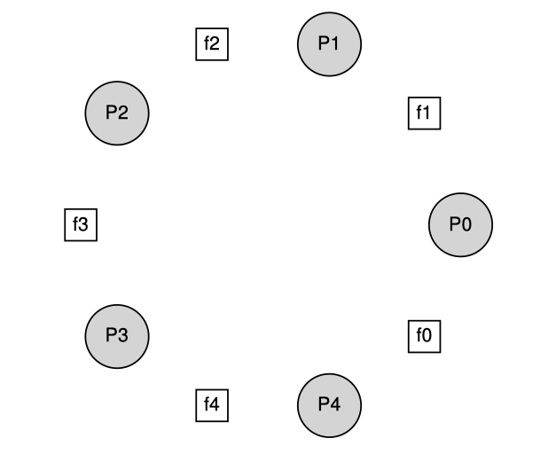 </p>

<p align="center">The Dinning Philosophers from <a href = "https://pages.cs.wisc.edu/~remzi/OSTEP/">
Operating Systems: Three Easy Pieces</a>  chapter 31</p>

The one solution is that all the philosophers grab the left fork first except one grab the right one(inverse order). The reason for doing this is to avoid the **deadlock**, where if each philosopher happens to grab the fork on their left before any philosopher can grab the fork on their right, each will be stuck holding the one fork and waiting for another forever. Specifically, philosopher 0 grabs fork 0, philosopher 1 grabs fork 1, philosopher 2 grabs fork 2, philosopher 3 grabs fork 3, and philosopher 4 grabs fork 4; all the forks are acquired, and all the philosophers are stuck waiting for a fork that another philosopher possesses.

## Thread Safety

A function ***thread-safe*** if and only if it will always produce correct results when called repeatedly from multiple concurrent threads.

We can identify **four(nondisjoint) classes** of thread-unsafee functions:

1. ***Functions that do not protect shared variables.*** This class of thread-unsafe functions is relatively easy to make thread-safe: **protect the shared   variable with synchronization operation**.

   + Advantage is that it does not require any changes in the calling program
   + Disadvantage is that the synchronization operation slow down the functions.

2. ***Function that keep state across multiple invocations.*** 
   The `rand` function is thread-unsafe because the result of the current invocation depends on an intermediate result from the previous iteration. When we call `rand` repeatedly from a single thread after seeding it with a call to `srand`, we can expect a repeatable sequence of numbers. However, this assumption no longer holds if multiple threads are calling `rand`.
   **The only way to make a function such as `rend` thread-safe is to rewrite it** so that it does not user any `static` data, relying on instead on the caller to pass the state information in arguments.
   The disadvantage is that the programmer is now forced to change the code in the calling routine as well.
   In a large program where there are potentially hundreds of different call sites, making such modifications could be nontrivial and prone to error.

3. ***Functions that return a pointer to a static variable.*** Some functions such as `ctime` and `gethostbyname`, compute a result in a `static` variable and then return a pointer to that variable. If we call such functions from concurrent threads, then disaster is likely, as result being used by **one thread are sliently overwritten by another thread**.
   There are two ways to deal with this class of thread-unsafe functions.

   1. One option is to rewrite the function so that the caller passess the address of the variable in which store the results. This eliminates all shared data, but it requires the programmer to have access to the function source code.

   2. If the thread-safe function is diffcult or impossible to modify(*e.g.*, the code is very complex or there is no source code available), then another option is to use the ***lock-and-copy*** technique.
      The basic idea is to associate a mutex with the thread-unsafe function. 
      At each call site:

      1. lock the mutex, 
      2. call the thread-unsafe function, 
      3. copy the result returned by the function to a private memory location, 
      4. and then unlock the mutex.

      To minimize changes to the caller, you should define a thread-safe wrapper function that performs the lock-and-copy and then replace all calls to the thread-unsafe function with calls to the wrapper.

4. ***Functions that call thread-unsafe functions***.
   If a function `f` calls a thread-unsafe function `g`, is `f` thread-unsafe?
   It depends. 

   + If `g` is a **class 2** function that relies on the **state across multiple invovation**, then `f` is also thread-unsafe and there is no resource short of rewritting `g`.
   + If `g` is a **class 1** or **class3** function, then `f` can still be thread-safe if you protect the call site and any resulting shared data with a mutex.


## Reentrancy

The reentrancy function characterized by the property that **they do not reference any shared data when they are called by multiple threads**. 

Reentrant functions are typically more efficient than non-reentrant thread-saft functions because they require no synchronization operations. Furthermore, the only way to convert the ***thread-unsafe function that keep state across multiple invocations***  into thread-safe one is to rewrite it so that it is reentrant.

<p align="center"> 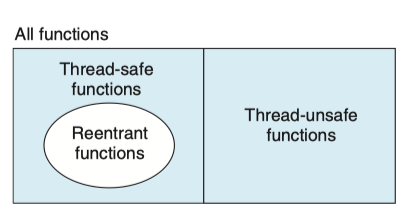 </p>

<p align="center">Relationships between the sets of reentrant, thread-safe, and thread-unsafe functions from <a href = "http://csapp.cs.cmu.edu/3e/home.html">CS:APP3e</a> chapter 12</p>

If all function arguments are passed by value and all data references are to local automatic stack variable(*i.e.*, no reference to static or global variable), then the function is ***explicit reentrant***, in the sense that we can assert its reentrancy regardless of how it is called.

However, if we loosen our consumption a bit and allow some parameters in our otherwise explicitly reentrant function to be **passed by reference**(*i.e.*, we allow them to pass pointers), then we have an ***implicitly reentrant function***, in the sense that it is only reentrant if the calling threads are careful to pass pointers to nonshared data. For example the `rand_r` function is implicitly function

```c
/* rand_r - return a pseudorandom integer on 0..32767 */ 
int rand_r(unsigned int *nextp) {
	*nextp = *nextp * 113515245 + 12345;
	return (unsigned int)(*nextp / 65536) % 32768;
}
```

<p align="center"> 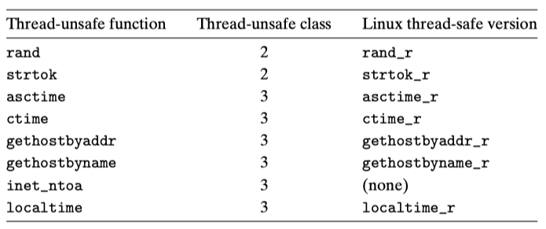 </p>

<p align="center">Common threa-unsafe library function from <a href = "http://csapp.cs.cmu.edu/3e/home.html">CS:APP3e</a> chapter 12</p>


## Non-Deadlock Bugs

### Atomicity-Violation Bugs

The formal definition of an atomicity violation is: "The desired serializability among multiple memory accesses is violated(*i.e.* a code region is intended to be atomic, but **the atomicity is not enforced during execution**)." Typically, the code in each thread has an atomicity assumption. when this assumption is incorrect, the code will not work as desire.

To prevent atomicity violations, concurrent programs must use proper synchronization mechanisms like mutex locks, semaphores, condition variables, or atomic instructions. These mechanisms ensure that critical sections of code are protected from concurrent access, allowing operations to be executed atomically and avoiding data races and other concurrency issues.

Detecting and debugging atomicity violations can be challenging, as they may not always lead to immediate failures or errors. They can result in subtle and intermittent bugs that are hard to reproduce. Thorough testing, code review, and careful application of synchronization techniques are essential to prevent and resolve atomicity violation issues in concurrent programs.

### Order-Violation Bugs

The formal definition of order violation is: "The desired order between two(group of) memory accesses is flipped(*i.e.,* A should always be executed before B, but the order is not enforced during execution)"

The fix to this type of bug is generally to enforce ordering. As discussed previously, using **condtion variables** is an easy and robust way to add this style of synchronization into modern code bases.

## Lock-free Algorithm <a href="#reference6">[6]</a><a href="#reference7">[7]</a><a href="#reference8">[8]</a>

A lock-free algorithm is a concurrent programming technique that aims to provide progress guarantees and avoid the use of traditional locks or synchronization primitives like mutexes and semaphores. In a lock-free algorithm, threads can make progress even in the presence of contention, contention being the scenario where multiple threads try to access shared resources simultaneously.

The main goal of lock-free algorithms is to improve concurrent program performance by minimizing contention and avoiding the potential drawbacks of using locks, such as thread blocking and potential deadlocks.

Lock-free algorithm allow concurrent update of shared data structures without resorting to critical sections protected by operating system managed locks. It handles communication, data sharing, and other mechanisms that usually require threads to be synchronized differently to avoid the need for locks.

On a system using a lock-free algorithm, it is guaranteed that some thread is making progress. This means that the overall system is making progress toward the end goal. However, there still might be starved threads, as lock-free algorithms only guarantee that at least one thread is making progress at any given time.

A significant benefit of lock (or wait)-freedom for real-time systems is that by avoiding locks the potential for priority inversion is avoided. Solutions for avoiding priority inversion usually involve special real-time process schedulers. 

Designing generalized lock-free algorithms is hard, and thus design lock-free data structures instead(Buffer, list, stack, queue, map, deque, snapshot).

With the exception of a uniprocessor implementation of a single-reader single-writer ring buffer FIFO, all the lock-free algorithms which I have encountered require the use of special atomic processor instructions such as **CAS (compare and swap)** or **LL/SC (load linked/store conditional)**. Furthermore, the correct implementation of these algorithms also requires an understanding of the use of memory barriers to force the order of some memory reads and writes on multiprocessor systems. This is because memory controllers may reorder reads and writes as observed by other processors on an multiprocessor system (or by prehipherals on a uniprocessor system).

### Lock-free Stack(aka LIFO queue)

```c++
class Node{
  Node *next;
  int data;
};
Node *head;

// Lock-free stack push
void push(int t) {
  Node* node = new Node(t);
  do {
  	node->next = head;
  } while (!cas(&head, node, node->next));
}

// Lock-free stack pop
bool pop(int& t){
  Node *current = head;
  while(current){
    if(cas(&head, current->next, current)){
      t = current->data;
      return true;
    }
    current = head;
  }
  return false;
}
```

### ABA Problem

+ Thread 1 looks at some shared variable, finds that it is **A**
+ Thread 1 calculates same data based on the fact that the variable is **A**
+ Thread 2 executes, change the variable to **B**(if Thread 1 wakes up now and tries to compare-and-set, all is well – compare and set fails and Thread 1 retries)
+ Instead, Thread 2 changes variable back to **A**

<p align="center"> 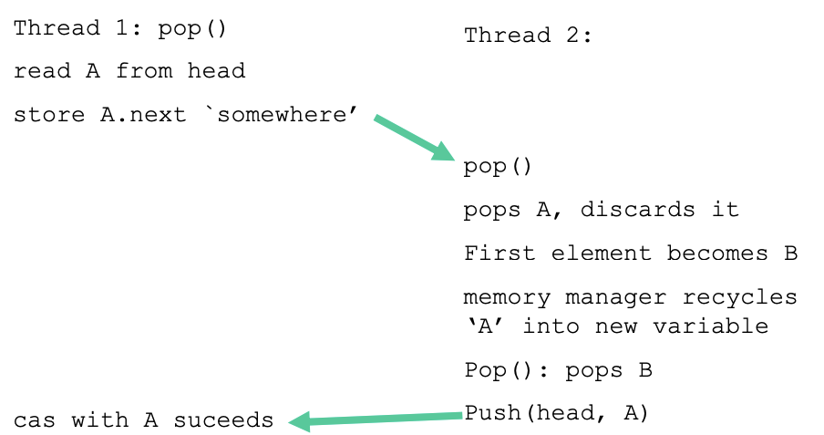 </p>

<p align="center">Figure comes from <a href = "https://www.cs.cmu.edu/~410-s05/lectures/L31_LockFree.pdf">Lock-Free Programming by Geoff Langdale</a></p>

<p align="center"> 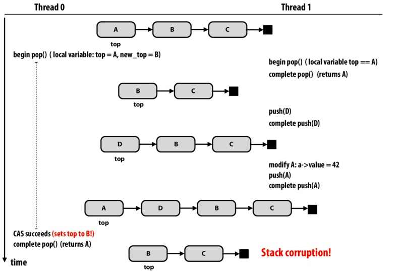 </p>

<p align="center">Figure comes from <a href = "https://www.cs.cmu.edu/~410-s05/lectures/L31_LockFree.pdf">Lock-Free Algorithms by DanceWithDragon and abattagl</a></p>

To address the ABA problem, various techniques can be employed, such as:

1. ***Double-Word Compare-and-Swap (DCAS)***: DCAS extends the CAS operation to use **two memory words for comparison**, effectively checking if both the data value and a separate "tag" value match before performing the update.
2. ***Using Hazard Pointers:*** Hazard pointers are a technique that involves maintaining a list of "hazard pointers" to shared data locations that threads are currently working with. Before performing an operation, a thread must acquire a hazard pointer, which protects the data from being modified by other threads.
3. The other solution is to ***put a counter for the number of pop operations***. By checking both the value and number of pop operations, it can be ensured whether or not the value is up-to-date.

**Theoretically not a problem for LL/SC-based approaches.**

+  ‘Ideal’ semantics of Load-linked/Store-conditional don’t suffer from this problem
+ No ‘ideal’ implementation of load-linked/store-conditional exists (so all new problems instead of ABA)
  + Spurious failures
  + Limited or no access to other shared variables between LL/SC pairs

## Deadlock


## Reference

<a name="reference1"></a>[[1] “Cooperating sequential processes” by Edsger W. Dijkstra. 1968.](https://www.cs.utexas.edu/users/EWD/ewd01xx/EWD123.PDF)

<a name="reference2"></a>[[2] “Monitors: An Operating System Structuring Concept” by C.A.R. Hoare. Communications of the ACM, 17:10, pages 549–557, October 1974.](https://www.cs.utexas.edu/users/EWD/ewd01xx/EWD123.PDF)

<a name="reference3"></a>[[3] “Information Streams Sharing a Finite Buffer” by E.W. Dijkstra. Information Processing Letters 1: 179180, 1972.](https://www.cs.utexas.edu/users/EWD/ewd03xx/EWD329.PDF)

<a name="reference4"></a>[[4] Stackoverflow: [Why do pthreads’ condition variable functions require a mutex?](https://stackoverflow.com/questions/2763714/why-do-pthreads-condition-variable-functions-require-a-mutex)](https://stackoverflow.com/questions/2763714/why-do-pthreads-condition-variable-functions-require-a-mutex)

<a name="reference5"></a>[[5] “Experience with Processes and Monitors in Mesa” by B.W. Lampson, D.R. Redell. Communications of the ACM. 23:2, pages 105-117, February 1980.](https://dl.acm.org/doi/pdf/10.1145/800215.806568)

<a name="reference6"></a>[[6] Some notes on lock-free and wait-free algorithms](http://www.rossbencina.com/code/lockfree?q=~rossb/code/lockfree/)

<a name="reference7"></a>[[7] Lock-Free Programming - Geoff Langdale](https://www.cs.cmu.edu/~410-s05/lectures/L31_LockFree.pdf)

<a name="reference8"></a>[[8] **Lock-Free Algorithms** - **DanceWithDragon and abattagl**](http://15418.courses.cs.cmu.edu/spring2013/article/32) 
