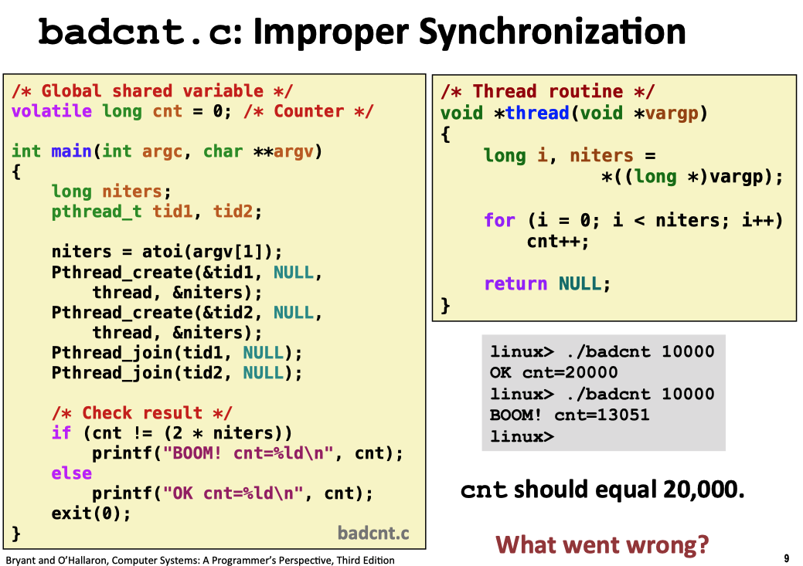
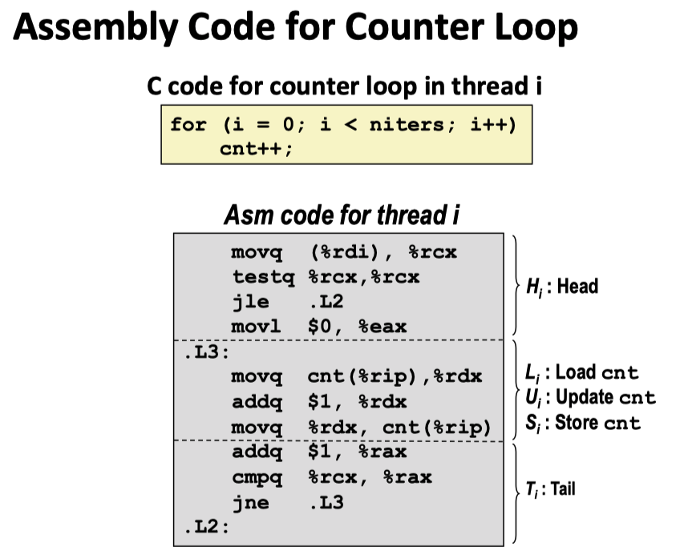

# Concurrency Basic

Normally, we treated concurrency mainly as a mechanism that the operating system kernel used to run multiple applicaiton programs. But concurrency is not limted to the kernel. Application-level concurrency is useful in other way as well:

+ ***Accessing slow I/O devices :*** When an application is waiting for data to arrive from a slow I/O device such as a disk, the kernel keeps the CPU busy by running other processes.
+ ***Interacting with humans :*** People who interact with computers demand the ability to perform multiple tasks at the same time.
+ ***Reducing latency by deferring work :*** For example, a dynamic storage allocator might reduce the latency of individual **free** operations by deferring coalescing to a concurrent "coalescing" flow that **runs at a lower priority**, soaking up spare CPU cycles as they become available.
+ ***Servicing multiple network clients :*** For a real server that might be expected to service hundreds or thoudsands of clients per second, it is not acceptable to allow one slow client to deny service to the others. A better approach is to build a ***concurrent server*** that creates a separate logical flow for each client. This allows the server to service multiple clients concurrently and precludes slow clients from monopolizing the server.
+ ***Computing in parallel on multi-core machines :*** Many modern systems are equipped with multi-core processors that contain multiple CPUs. Applications that are partitioned into concurrent concurrent flows often run faster on multi-core machines than on uniprocessor machines because the flows execute in parallel rather than being interleaved.

Application that use application-level concurrency are known as ***concurrent programs***. Modern operating system provide ***three basic approaches for building concurrent programs***:

+ ***Processes :*** With this approach, each logical control flow is a process that is scheduled and maintained by the kernel. Since processes have separate virtual address space, flows that want to communicated with each other must use some kind of explicit ***interprocess communication(IPC)*** mechanism.
+ ***I/O multiplexing :*** This is form of concurrent programming where applications explicitly schedule their own logical flow in the context of a **single process**. **Logical flows are modeled as state machines** that the main program explicitly transitions from state to state as a result of data arriving on file descriptors. **Since the program is a single process, all flows share the same address space**.
+ ***Threads :*** Threads are logical flows that run in the context of **a single process** and are **scheduled by the kernel**. You can think of threads as a hybrid of other two approaches:
  + scheduled by the kernel like process flows
  + shareing the same virtual address space like I/O multiplexing flows.


## Concurrent Programming with Processes


## Concurrent Programming with I/O multiplexing


## Concurrent Programming with Threads

Like processes, ***threads*** are mechanism that permits an application to perform multiple tasks concurrently. A single process can contain multiple threads. However, each thread is very much like a separate tiny process, except for one difference: **they share the same address space and thus can access the same data.**

<p align="center">  </p>

<p align="center">Four threads executing in a process from <a href = "https://man7.org/tlpi/">The Linux programming interface</a>  chapter 29</p>

Like processes, threads are scheduled automatically by the kernel and are known to the kernel by an integer ID.

There are major differences, in the context switch we perform between threads as compared to processes: 

+ **the address space remain the same**

+ In a multi-threaded process, **instead of a single stack in the address space, there will be one per thread**. In other words, any stack-allocated variables, parameters, return values, and other things that we put on the stack will be placed in what is something called ***thread-local storage***.

  Each thread has its own ***thread context***, including:

  + unique integer ***thread ID(TID)***
  + stack(local variables and funcntion call linkage information)
  + stack pointer
  + program counter
  + general-purpose registers
  + condition codes.
  + signal mask
  + the `errno` variable
  + floating-point environment(see `fenv(3)`)
  + realtime scheduling policy and priority
  + CPU affinity(Linux-specific)
  + capabilities(Linux-specific)

  All the thread running in a process **share the entire virtual address space of that process**, including:

  + code segment
  + data segment
  + heap
  + shared libraries
  + open files
  + process ID and parent process ID
  + process group ID and session ID
  + controlling terminal
  + process credentials(user and group IDs)
  + open file descriptor
  + file system related information: unmask, current working directory, and root directory
  + Interval timers(`setitimer()`) and POSIX timers(`timer_create()`)
  + System V semaphore undo(`semadj`) values
  + resource limits
  + CPU time consumed (as returned by `times()`)
  + resource consumed (as returned by `getrusage()`)
  + nice value (set by `setpriority)` and `nice()`)

+ like the aforementioned aboved, the thread context is much smaller than a process context

+ threads, unlike processes, are not organized in a rigid parent-child hierarchy. The threads associated with a process from a ***pool of peers***, independent og which threads were created by which other threads.

  The main thread is distinguished from other threads only in the sense that it is always the first thread to run in the process.

  The main impact of this notion of a pool of peers is that **a thread can kill any of its peers or wait for any of its peers to terminate** and **eachh peer can read and write the same shared data**.

<p align="center">  </p>

<p align="center">Single-Threaded And Multiple-Threaded Address Space from <a href = "https://pages.cs.wisc.edu/~remzi/OSTEP/">
Operating Systems: Three Easy Pieces</a>  chapter 26</p>

### Why use threads?

1. **parallelism**
2. To avoid blocking program progress due to slow I/O.

### Thread Execution Model

Basically, each process begins life as a  single thread called the ***main thread***. At some point, the main thread creates a ***peer thread***, and from this point in time the two threads run concurrently. Eventually, control passes to the peer thread via context switch, either

+ because the main thread executes a slow system call such as `read()` or `sleep()`
+ or because it is interrupted by the system's interval timer.

The peer thread executes for a while before control passes back to the main thread.

The state of a single thread is thus very similar to that of a process. It has a **program counter(PC)** that tracks where the program is fetching instructions from. Each thread has their own private set of registers it uses computation; thus, if there are two threads that are running on a singple processor, when switching from running one(T1) to running the other(T2), a ***context switch*** must take place. The context switch between threads is quite similar to the context switch between processes, **as the register state of T1 must be saved and the register state of T2 restored before running T2**. With the processes, we saved state to a **process control blocks(PCBs)**; now, we'll need one or more **thread control blocks(TCBs)** to store the state of each thread of a process. 

<p align="center">  </p>

<p align="center">concurrent thread execution from <a href = "http://csapp.cs.cmu.edu/3e/home.html">CS:APP3e</a>  chapter 12</p>


### Pthread API

The Pthread API defines a number of data types, here some of them in the table below:

<p align="center">  </p>

<p align="center">Four threads executing in a process from <a href = "https://man7.org/tlpi/">The Linux programming interface</a>  chapter 29</p>

#### errno

The traditional method of returning status from system calls and some library functions is to return 0 on success or -1 on error, with `errno` being set to indicate the error. The functions in the Pthreads API do things differently. All Pthreads function return 0 on success or a posivitve number on failure. The failure value is one of the same values that can be placed in `errno` by traditional UNIX system calls.

If a thread made a function call that returned an error in a global errno variable, then this would confuse other threads that might also be making function calls and checking errno. In other words, race conditions would result. Therefore, **in threaded programs, each thread has its own errno value.**

#### Compiling Pthreads programs

On Linux, programs that use the Pthread API must be compiled with the `cc -pthread` option, the effect of this option include the following:

+ The `_REENTRANT` preprocessor macro is defined, This causes the declarations of a few reentrant fucntion to be exposed.(We will describe reentrant function later)
+ The program is linked with the `libpthread` library(the equivalent of  `-pthread`)


#### Thread Creation(`pthread_create`)

When a program is started, the resulting process consists of a single thread, called ***initial*** or ***main*** thread.

In addition, threads create other threads by calling the `pthread_create` function

```c
#include <pthread.h>
int pthread_create(pthread_t *thread, const pthread_attr_t *attr, 
                   void *(*start)(void *), void *arg);
/* Return 0 on sucess, or positive error number on error */
```

+ The new thread commences executions by calling **the function identified** by ***start*** with the argument ***arg***(*i.e., `start(arg)`*), where the thread that calls `pthread_create()` continues execution with the next statment that follows the call.

+ The `arg` argument is declared as `void *`, meaning that we can pass a pointer to any type of object to the ***start*** function. Typically, `arg` points to a global or heap variable, then `arg` can also be specified as a pointer to a structure containing the arguments as separate fields. With judicious casting, we can even specify `arg` as an ***int***.

  The return value of  ***start*** is likewise of tyep `void *`, and it can be employed in the same way as the `arg` argument.

+ The `thread` argument points to a **buffer of type `pthread_t`** into which the unique identifier for this thread is copied before `pthread_create()` returns. This identifier can be used in later Pthreads calls to refer to the thread.

+ The `attr` argument is a pointer to a `pthread_attr_t` object that specifies various attributes for the new thread, where it includes information such as the location, size of the thread's stack and the thread's scheduling policy and priority.

After a call to `pthread_create()`, a program has no guarantees about which thread will be next be scheduled to use the CPU(on multiprocessor system, both threads may simultaneously execute on different CPUs)


#### Thread IDs

Each thread within a process is uniquely identified by a thread ID. This ID is returned to the caller of `pthread_create()`, and a thread can obtain its own ID using `pthread_self()`.

```c
#include <pthread>
pthread_t pthread_self(void)
```

Thread IDs are useful within applications for the following reasons:

+ Various Pthreads functions use thread IDs to identify the thread on which they are act.
+ In some applications, it can be useful to **tag dynamic data structures with the ID of a particular thread**. This can serve to identify the thread that created or "owns" a data structure, or can be usesd by one thread to identify a specific thread that should subsequently do something with that data structure.

The `pthread_equal()` functions allows us check whether two thread IDs are the same.

```c
#include <pthread.h>
int pthread_equal(pthread_t t1, pthread_t t2);
/**Return nonzero value if t1 and t2 are equal, otherwise zero/
```

The `pthread_equal()` function is needed because the `pthread_t` data type must be treated as opaque data. On Linux, `pthread_t` happens to be defined as an ***unsigned long***, but on other implementations, it could be a pointer or a structure.

**In the Linux threading implementations, thread IDs are unique across processes.**

#### Thread Termination

A thread terminates in one of the following ways:

+ The thread terminates *implicitly* when its top-level thread routine returns

+ The thread terminate *explicitly* by calling the `pthread_exit()` function. Calling `pthread_exit()` is equivalent to performing a ***return*** in the thread's start function, which the difference that `pthread_exit()` can be called from any function that has been called by the thread's start function.If the main function calls `pthread_exit()`, it waits for all other peer threads to terminate and then terminates the main thread and the entire process with a return value of `thread_return`

  ```c
  #include <pthread.h>
  void pthread_exit(void *thread_return);
  /* Never returns */
  ```

  The `thread_return` argument specifies the return value for the thread. The value pointed to by `thread_return` should not be located on the thread's stack, since the content of that stack become undefined on thread termination. The same statement applies to the value given to a `return` statement in the thread's start function.

+ Some peer thread calls the Linux `exit()` function, which terminates the process and all threads associate with this process.

+ Another peer thread terminates the current thread by calling the `pthread_cancel` function with the ID of the current thread.

  ```c
  #include <pthread.h>
  int pthread_cancel(pthrea_t tid);
  /* Returns: 0 if OK, nonzero on error */
  ```

#### Recaping Terminated Threads(`thread_join()`)

The `pthread_join()` function wait for the thread identified by ***thread*** to terminated. (If that thread has already terminated, `pthread_join()`)

```c
#include <pthread.h>
int pthread_join(pthread_t tid, void **thread_return);
/* Returns 0 if OK, nonzero on error */
```

+ The `pthread_join()` function blocks util thread tid terminates
+ Assign the generic `(void *)` pointer returned by the thread routine to the location pointed to by `thread_return`, and then ***recaps*** any memory resources held by the terminated thread.
+ If  `thread_return` is a non-NULL pointer, then it receives a copy of the terminated thread's return value- that is, the value was specified when the thread performance a ***return*** or called `pthread_exit()`
+ If a thread is no detached, then we must join with it using `pthread_join()`:
  + If we fail to do this, then, when the thread terminates, it produces the thread equivalent of a zombie process.
  + Aside from wasting system resources, if enough thread zombies accmulate, we won't be able to create additional threads.
+ The task that `pthread_join()` performs for threads is similar to that performed by `waitpid()` for processes, However, there are some notiable differences:
  + Any thread in a process can use `pthread_join()` to join with any other thread in the process, no matter which thread spawn the current one
  + There is no way of saying "join with any thread"(for processes, we can do this using the call `waitpid(-1, &status, options)`); nor is there a way to do a nonblocking join(analogous to the `waitpid()` ***WNOHANG*** flag)

#### Detaching Threads

At any point in time, a thread is either ***joinable*** or ***detached***.

+ A ***joinable thread*** can be reaped and killed by other threads, where its memory resource(such as stack) are not freed until it is reaped by another thread. When it reminates, another thread can obtain its return status using `pthread_join()`.
+ A ***detached thread*** cannot by reaped by other threads, where its memory resources are freed automatically by the system when it terminates.

By default, a thread is ***joinable***. To mark the thread as ***detached***, we need to makeing a call to ***pthread_detach()*** specifying the thread's identifier in thread. In order to avoid memory leak, **each joinable thread should be either explicitly reaped by another thread or detached by a call to the `pthread_detached` function.**

```c
#include <pthread.h>
int pthread_detach(pthread_t tid);
/* Returns: 0 if ok, nonzero on error */
```

Once a thread has been detached, it is no longer possible to use `pthread_join()` to obtain its return status, and the thread can't be made joinable again.

Detaching a thread doesn't make it immune to a call to `exit()` in another thread or a ***return*** in main thread. In such an event, **all threads in th process are immediately terminated, regardless of whether they are joinable or detached**. To put things another way, **`pthread_detached()` simply controls what happened after a thread terminates**, not how or when it terminates.

Thread can detach themselves by calling `pthread_detach` with an argument of `pthread_self()`.

#### Initialize Threads

The `pthread_once` function allows you **initialize the state associated with a thread routine**.

```c
#include <pthread.h>
pthread_once_t once_control = PTHREAD_ONCE_INIT;
int pthread_once(pthread_once_t *once_control, void (*init_routine)(void))
```

+ The `once_control` variable is a global or static variable that is always initialized to PTHREAD_ONCE_INIT.
+ The first time you call `pthread_once` with an argument of `control_once `, it invokes `init_routine`, which is a function with no input arguments that returns nothing. Subsequent calls to `pthread_once ` with the same `once_control` variable do nothing.
+ The `pthread_once` function is useful whenever you need to **dynamically initialize global variable that are shared by multiple threads**.

#### Thread Attributes

We mentioned earlier that the `pthread_create()` `attr` argument, whose type is `pthread_attr_t`, can be used to specify the attributes used in the creation of a new thread.

We’ll just mention that these attributes include information such as the location and size of the thread’s stack, the thread’s scheduling policy and priority.

Code in `threads/detached_attrib.c`

```c
pthread_t thr; pthread_attr_t attr; int s;

s = pthread_attr_init(&attr); if (s != 0) errExitEN(s, "pthread_attr_init");

/* Assigns default values */

s = pthread_attr_setdetachstate(&attr, PTHREAD_CREATE_DETACHED); if (s != 0) errExitEN(s,"pthread_attr_setdetachstate");

s = pthread_create(&thr, &attr, threadFunc, (void *) 1); if (s != 0) errExitEN(s, "pthread_create");

s = pthread_attr_destroy(&attr); if (s != 0) errExitEN(s, "pthread_attr_destroy");
```


### Shared Variables in Threaded Programs

#### Mapping Variables to Memory

Variables in threads C programs are mapped to virtual memory according to their storage classes:

+ ***Global variables :*** A global variable is any variable declared outside of a function. At run time, the read/write of virtual memory **contains exactly one instance of each global variable** that can be referenced by any thread.
+ ***Local automatic variable :*** A local automatic variable is one that is declared inside a function **without the `static` attribute**. At run time, **each thread's stack contains its own instances of any local automatic variables.** This is true even if multiple threads execute the same thread routine.
+ ***Local static variable :*** A local static variable is one that is declared inside a function **with the `static` attribute**. As with global variables. the read/write area of virtual memory **contains exactly on instance of each local static variable** declared in a program.

#### Shared Variable

In an operational sense**, it is impossible for one thread to read or write the register values of another thread.** On the other hand, any thread can access any location in the shared virtual memory. If one thread modifies a memory location, then every other thread will eventually see the change if it read that location. Thus **registers are never shared, whereas virtual memory is always shared**.

The memory model for the separate thread stack is not as clean. These stacks are contained in the stack area of the virtual address space and are usually accessed independently by their perspective threads. We say usually rather than always, because **different thread stacks are not protected from other thread**. So if a thread somehow manage to acquire a pointer from another thread's stack, then it can read and write any part of that stack.

Let us image a simple example where two threads wish to update a global variable. When we run this type of code, we can examine that each time when we run the code, even on a single processor, we don't necessary get the desired result. To understand why this happened, we must understand the code sequence that the compiler generates for the update of global variable. For example, if wew wish to simple add a number(let's say 1) to a global variable `counter`, the code sequence for doing so might look something like this(in X86):

```assembly
100	mov	0x8049alc,	%eax
105	add	$0x1,				%eax
108	mov	%eax,				0x8049alc
```

This example assumes that the variable `counter` is located at address `0x8049alc`. In this three-instruction sequence, the x86 `mov` instruction is used first to get the memory value at the address and put it into resgister `eax`, Then add is performed, add 1(`0x1`) to the contents of `eax` register, and finally, the content of `eax` are stored back into memory at the same address.

Let's image one of our two threads(Thread 1) enters this region of code, and is thus about to increment `counter` by one. It loads the value of `counter`(let's say it's to 50 to begin with) into its register `eax`. Thus, `eax = 50` for Thread 1. Then adds one to the register; thus `eax = 51`. Now, something unfortunate happens: **a timer interrupt goes off**; thus, the OS save the state of the currently running thread(its PC, its registers including `eax` *etc.*) to the thread's TCB.

Now something worse happens: Thread 2 is chosen to run, and it enters this same piece of code. It also executes the first instruction, getting the value of `counter` and putting it into its `eax`(remember: each thread when running has its own private register; the registers are virtualized by the content-switch code that saves and store them). The value of `counter` is still 50 at this point, and this Thread 2 has `eax = 50`. Let's assume that Thread 2 executes the next two instruction, incrementing `eax` by 1(thus `eax = 51`), and then saving the contents of  `eax` into `counter`(`0x8049alc` in our example). Thus, the global variable `counter` now has value `51`.

Finally, another context switch occurs, and Thread 1 resume running. Recall that it had just executed the `mov` and `add`, and is now about to perform the final `mov` instruction. Recall also that `eax = 51`. Thus, the final `mov` instruction executes, and save the value to memory; the counter is set to `51` again.

<p align="center">  </p>

<p align="center">Race condition example1 from <a href = "https://pages.cs.wisc.edu/~remzi/OSTEP/">
Operating Systems: Three Easy Pieces</a>  chapter 26</p>

For another example, let's assume that each thread increments the counter `niters` times, we expect the final value should be `2 * niters`. However, when we run the code, we not only get wrong answers, we get different answers each time.

<p align="center">  </p>

<p align="center">The code with improper synchronization, the figure from <a href = "https://www.cs.cmu.edu/afs/cs/academic/class/15213-f15/www/lectures/24-sync-basic.pdf">cmu-213 slide</a></p>


<p align="center">  </p>

<p align="center">Assembly code for improper counter loop, the figure from <a href = "https://www.cs.cmu.edu/afs/cs/academic/class/15213-f15/www/lectures/24-sync-basic.pdf">cmu-213 slide</a></p>

We can also partition the loop code for threa i into five parts:

1. ***Hi :*** The block of instructions at the head of the loop
2. ***Li :*** The instruction that loads the shared variable `cnt` into the accumulator register `%rdx`, where `%rdx` denotes the value of register `%rdx` in thread i.
3. ***Ui :*** The instruction that updates(increments) `%rdx`
4. ***Si :*** The instruction that stores the updated value of `%rdx`, back to the shared variable `cnt`
5. ***Ti :*** The block of instructions at the tail of the loop

Notice that the head(***Hi***) and tail(***Ti***) manipulate only local stack variable, while ***Li***, ***Ui*** and ***Si*** manipulate the countents of the shared counter variable.

What we have demonstrated here is called a ***race condition***(or, more specifically, a ***data race***): the results depend on the timing execution of the code. Because multiple threads executing this code can result in a race condition, we call this code a ***critical section***. A critical section is a piece of code that accesses a shared variable(or more genernally, a shared resource) and must not be concurrently executed by more than one thread. ***In the code of critical section, there is no way for you to predict whether the operating system will choose a correct ordering for your threads***.

What we really want for this code is what we call ***mutual exclusion***. This property guarantees that **if one thread is executing within the critical section, the others will be prevent from doing so**.

#### Progress Graphs

A ***progress graph*** models the execution of n concurrent threads as a **trajectory** through an n-dimensional Cartesian space. Each axis ***k*** corresponds to the progress of ***thread k***. Each point(***I1, I2, ..., In***) represents the state where thread k(k = 1, 2, 3, ... , n) has completed instruction ***Ik***. The origin of the graph corresponds to the ***initial state*** where none of the threads has yet completed an instruction.

+ A progress graph models instruction execution as a ***transition*** from one state to another. **A transition is represented as a directed edge from one point to an adjacent point.** 
+ Legal transitions move to the right or up. 
+ Two instructions cannot complete at the same time - diagnoal transitions are not allowed.
+ Program never run backward so transitions that move down or left are not legal either.

<p align="center">  </p>

<p align="center">The basic of Progress Graph, the figure from <a href = "https://www.cs.cmu.edu/afs/cs/academic/class/15213-f15/www/lectures/24-sync-basic.pdf">cmu-213 slide</a></p>


<p align="center">  </p>

<p align="center">Trajectories in Progress Graph, the figure from <a href = "https://www.cs.cmu.edu/afs/cs/academic/class/15213-f15/www/lectures/24-sync-basic.pdf">cmu-213 slide</a></p>

On the progress graph, the intersection of the two critical sections defines a region of the state space know as an ***unsafe region***.

A trajectory that skirts the unsafe region known as a ***unsafe trajectory***.

Any safe trajectory will correctly update the shared counter. In order to guarantee correct execution of threads, we must somehow ***synchronize*** the threads so that they always have a safe trajectory.

<p align="center">  </p>

<p align="center">Critical section and unsafe region, the figure from <a href = "https://www.cs.cmu.edu/afs/cs/academic/class/15213-f15/www/lectures/24-sync-basic.pdf">cmu-213 slide</a></p>


<p align="center">  </p>

<p align="center">Critical section and unsafe region, the figure from <a href = "https://www.cs.cmu.edu/afs/cs/academic/class/15213-f15/www/lectures/24-sync-basic.pdf">cmu-213 slide</a></p>

Ideally, the way to solve the race condition would be to have more powerful instructions that whenever the instruction adds a value to a memory location, and the hardware guarantees that it executes ***atomically***; when the instruction executed, it would be perform the update as a desired. It could not be interrupted mid-instruction, because that is precisely the guarantee we receive from the hardware: **when an interrupt occurs, either the instruction has not run at all, or it has run to completions**; there is no in-between state, where these grouping of many actions into a single atomic action is called a ***transaction***.

However, in the general case, almost all the hardward cannot support this operations. Instead, we can ask hardware for a few useful instructions upon which we can build a general set of what we call ***synchronization primitives***. By using these hardware synchronization primitives, in combination with some help from the operating system, we will be able to build multi-thread code that accesses critical section in a synchronized and controlled manner, and thus reliably produces the correct result despite the challenge nature of concurrent execution.

