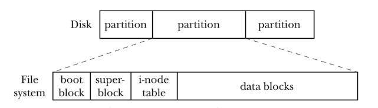
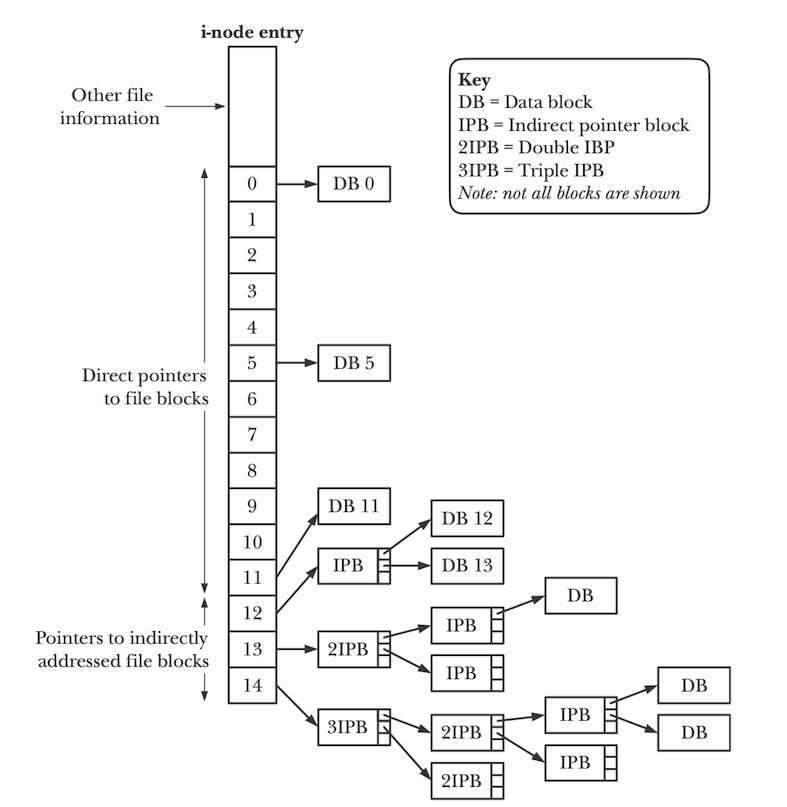
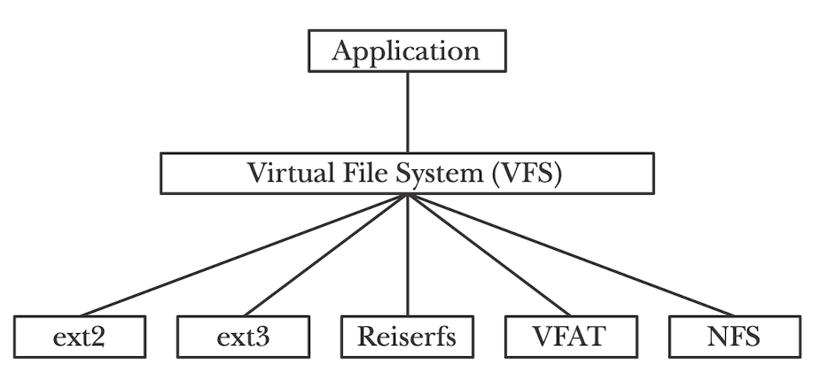

File System & System I/O

## 1. File Basic

Input/Output(I/O) is the process of **copying data between main memory and external device** such as disk drives, terminals and networks.

+ Input operation copies data from an I/O device to main memory;
+ Output operation copies data from memory to a device.

In linux, ***file*** is a sequence of m bytes: `B0, B1, ... , B_k, ..., B_(m-1)`.
In most modern system, the **operating system does not know much about the structure of the file**, rather, **the responsibility of the file system is simply to store such data peresistently on disk and make sure that when you request the data again**.

Each Linux file has a type that indicates its role in the system:

+ A ***regular file*** contains arbitrary data.  For historical reasons, the **low-level name of a file** is often referred to as its `inode number`
  Application programs often distinguish between

  + **text files**: each line is a sequence of characters. A Linux text file consist of a sequence of *text lines*, where each line is a sequence of characters terminated by a `newline character('\n')` (end of line - EOF). The newline character is the same as the ASCII line feed character(line feed - LF) and has numeric value of `0x0a`; For Windows and Internet protocols, new line character should be: `\r\n(0xd0xa)`, where its line feed should be carriage return;
  + **binary files**: everything except text file

  To kernel, there no difference between text and binary files.

+ A ***directory*** is a file consisting of an array of links, where each links maps a filename to a file, which may be another directory;
  For the lower-level name of directory, it contains a list of (user-readable name, lower-level name) pairs. 
  **Each entry in a directory refers either files or other directories.**

  Each directories contains at least two entries:

  + `.`(dot): the link to the directory itself
  + `..`(dot-dot): the link to its parent directory in the directory hierarchy.

  You can create a directory with the `mkdir` command; view ites content with `ls`, and delete it with `rmdir or rm -rf`

  <p align="center">  </p>

  <p align="center">Portion of the Linux directory hierarchy from <a href = "http://csapp.cs.cmu.edu/3e/home.html">CS:APP3e</a>  chapter 10</p>

+ A ***socket*** is a file that is used to communicate with another process cross a network.

**Regular files and directories typically reside on hard disk devices.**


A ***file descriptor (fd)*** is just a integer, private per process, and is used in UNIX system to access file; thus, once a file is opened, you can use the file descriptor to read and write the file. In this way, **file descriptor is a capability**.

Another way to think file descriptor is as a pointer to an object of type file; once you have such object, you can call other "method" to access the file, like `read()` and `write()`.

**File discriptors are managed by the operating system on a per-process basis.**


All I/O device, such as networks, disks, and terminals, are modeled as files, and all input and output is performanced by reading and writing the appropriate files:

+ `/dev/sda2`(`/user` disk partition)
+ `/dev/tty2`(terminal)
+ `/boot/vmlinuz-3.13.0-55-generic`(kernel image)
+ `/proc` (kernel data structures)

This elegant mapping of files allows the Linux kernel to export a simple, low-level application interface, known as Unix I/O, that enables all input and output to be performed in a uniform and consisent way.


## 2. The File System Interface

### 2.1 Opening Files: `open()`

An application announces its intention to access an I/O by asking the kernel to open the corresponding file.

The `open` function converts a `filename` to a file descriptor and returns the descriptor number, the descriptor returned always the smallest descriptor that is not currently open in the process, where `fd = open(pathname, flags, mode)` opens the file identified by pathname, returning a file descriptor used to refer to the open file in subsequent calls. (If the `pathname` is symbolic link, it is dereferenced)

The kernel returns ***file descriptor***, that identifies the file in all subsequent operations on the file. 

+ The kernel keeps track of all information about the open file. 
+ The application only keeps track of the descriptor

```c
#include<sys/types.h>
#include<sys/stat.h>
#include<fcntl.h>

int open(char *filename, int flags, mode_t mode); // return new descriptor if OK, -1 otherwise
```

Each process created by a Linux shell begins life with three open files:

+ standard input (descriptor 0) (STDIN_ FILENO in `<unistd.h>`)
+ standard output (descriptor 1) (STDOUT_FILENO in `<unistd.h>`)
+ standard error (descriptor 2) (STDERR_FILENO in `<unistd.h>`)

#### 2.1.1 Flags

The `flags` argument can also be bit-wise  **ORed**(|) in flags with one or more bits masks that provide additional instructions

The table below divided into the following groups:

+ ***File access mode flags***: There are the flags like O_RDONLY, O_WRONLY, O_RDWR flags, where they can be retrieved using `fcntl()` F_GETFL operation.

+ ***File creation flags:*** These are the flags shown in the second part of the table below, where they control various aspects of the behavior of the `open()` call, as well as options for subsequent I/O operations. These flags cannot be retrieved or changed
+ ***Open file status flags:*** There are the remaining flags in the table below, where they can be retrieved and modified using the `fcntl()` F_GETFL and F_SETFL operations.

<p align="center">  </p>

<p align="center">Values of the flags argument of open() from <a href = "https://man7.org/tlpi/">The Linux programming interface</a>  chapter 4</p>

#### 2.1.2 Mode Argument

The mode(`st_mode `in `stat `structure) argument specifies the access permission bit of new files. As part of its context, each process has a `umask` that is set by calling the unmask function. The first 3 of these bits are special bits known as the **set-user-ID**, **set-group-ID**, and **sticky bits**(labeled U, G, and T commonly)

<p align="center">  </p>

<p align="center">The layout of st_mode bit mask from <a href = "https://man7.org/tlpi/">The Linux programming interface</a>  chapter 4</p>

+ **set-user-ID program:** A set-user-ID program allows a process to **gain privileges it would not normally have**, by **setting the process's effective user ID** to the same value as the user ID(owner) of the executable file; When a set-user-ID program is run, **the kernel sets the effective user ID of the process to be the same the user ID** of the executable file;

+ **set-group-ID program:** A set-group-ID performs the analogous task for the process's effective group ID. (**effective group ID** and **effective userID** are used to determine the permission granted to a process, normally they are the same value); When a set-group-ID program is run, **the kernel sets the effective user ID of the process to be the same the group ID** of the executable file;

  For the perspective of stikcy bit, set-group-ID mainly serve two purpose:

  + controlling the group ownership of new files created in a directory mounted with the `nogrpid `option
  + enabling mandatory locking on a file

+ **set-user-ID program and set-group-ID program** can also designed to change the effective IDs of a process to something other than `root`

+ **set-user-ID bit** and **set-group-ID bit** are set using the `chmod` command 

  + `chmod u+s`: turn on set-user-ID permission bit;
  + `chmod g+s`: turn on set-group-ID permission bit.

+ **sticky bit**: 

  + *On older UNIX implementations*, the sticky bit was provided as a way of **making commonly used programs run faster**.

    +  **If the sticky bit was set on a program file**, then the first time the program was executed, a copy of the program text was **saved in the swap area**—thus **it sticks in swap, and loads faster** on subsequent executions.

  + *In modern UNIX implementations (including Linux)*:

    + **For directories**, the sticky bit acts as the **restricted deletion flag**. Setting this bit on a directory means that an **unprivileged process** can **unlink** (`unlink()`,` rmdir()`) and **rename** (`rename()`) files in the directory only if it has write permission on the directory and owns either the file or the directory.

      This makes it possible to create a directory that is **shared by many users**, who can each **create and delete their own files in the directory but can’t delete files owned by other users**. The sticky permission bit is commonly set on the `/tmp` directory for this reason.

    + **A file’s sticky permission bit** is set via the chmod command (`chmod +t file`) or via the `chmod()` system call. If the sticky bit for a file is set, `ls –l` shows a lowercase or uppercase letter T in the other-execute permission field, depending on whether the other-execute permission bit is on or off, as in the following:

      ```shell
      $ touch tfile 
      $ ls -l tfile
      -rw-r--r-- 1 mtk  users   0 Jun 23 14:44 tfile
      $ chmod +t tfile 
      $ ls -l tfile
      -rw-r--r-T 1 mtk  users   0 Jun 23 14:44 tfile
      $ chmod o+x tfile 
      $ ls -l tfile
      -rw-r--r-t 1 mtk  users   0 Jun 23 14:44 tfile
      ```

The **remaining 9 bits** form the mask defining the permission that are granted to various categories of users accessing the file. The file permission maks divideds the world into three categories:

+ ***Owner***(also known as ***user***): The permissions granted the owner of the file;
+ ***Group***: The permission granted to user who are members of the file's group
+ ***Other***: The permission granted to everyone else

Three permission may be granted to each user category:

+ ***Read***: The content of the file may be read
+ ***Write***: The content of the file may be changed
+ ***Execute***: The file may be executerd(i.e. it is a program or a script). In order to execute a script file, **both read and execute permission are required**.

The permission and ownership of a file can be viewed using the command `ls -l`, as in the following example:

<p align="center">  </p>

The `<sys/stat.h>` header file defines constants that can be **ANDed (&)** with `st_mode `of the `stat `structure, in order to **check whether particular permission bits are set.** (These constants are also defined via the inclusion of `<fcntl.h>`, which prototypes the `open()` system call.)

| Constant                            | Octal Value               | Permission Bit                                 | Description                                                  |
| :---------------------------------- | :------------------------ | ---------------------------------------------- | :----------------------------------------------------------- |
| S_ISUID <br />S_ISGID <br />S_ISVTX | 04000<br/>02000<br/>01000 | Set-user-ID<br />Set-group-ID<br />Sticky      | This is the set-user-ID on execute bit<br />This is the set-group-ID on execute bit<br />This is the *sticky* bit. |
| S_IRUSR<br />S_IWUSR<br />S_IXUSR   | 0400<br/>0200<br/>0100    | User-read<br />User-write<br />User-execute    | User (owner) can read this file<br />User (owner) can write this file<br />User (owner) can execute this file |
| S_IRGRP<br />S_IWGRP<br />S_IXGRP   | 040<br/>020<br/>010       | Group-read<br />Group-write<br />Group-execute | Members of the owner’s group can read this file<br />Members of the owner’s group can write this file<br />Members of the owner’s group can execute this file |
| S_IROTH<br />S_IWOTH<br />S_IXOTH   | 04<br/>02<br/>01          | Other-read<br />Other-write<br />Other-execute | Others (anyone) can read this file<br />Others (anyone) can write this file<br />Others (anyone) can execute this file |

In addition to the mode bit shown above, **three constants** are defined to equate to **masks for all three permissions for each of the categories owner, group, and other**: `S_IRWXU (0700)`, `S_IRWXG (070)`, and `S_IRWXO (07)`.

When `open()` is used to create a new file, the *mode* bit-mask argument specifies the permissions to be placed on the file. If the `open()` call doesn't specify `O_CREAT`, mode can be ommitted

```c
/* Open existing file for reading */
fd = open("startup", O_RDONLY);
if (fd == -1)
	errExit("open"); 
/* 
 * Open new or existing file for reading and writing, truncating to zero bytes; 
 * file permissions read+write for owner, nothing for all others 
 */ 
fd = open("myfile", O_RDWR | O_CREAT | O_TRUNC, S_IRUSR | S_IWUSR);

if (fd == -1)
  errExit("open"); /* Open new or existing file for writing; writes should always append to end of file */ 

fd = open("w.log", O_WRONLY | O_CREAT | O_TRUNC | O_APPEND, S_IRUSR | S_IWUSR);

if (fd == -1)
  errExit("open");
```

### 2.2 `umask`( or system call `umask()` )

The ***umask*** is a process attribute that specifies which **permission bits should always be *turned off* when new files or directories are created by the process**. Often, **a process just uses the umask it inherits from its parent shell**, with the (usually desirable) consequence that the **user can control the umask of programs** executed from the shell using the shell built-in command umask, which changes the umask of the shell process.

The initialization files for most shells **set the default umask to the octal value** `022` (`----w--w-`). This value specifies that write permission should always be turned off for group and other.

The `umask()` system call changes a process’s umask to the value specified in ***mask***.

```c
#include <sys/stat.h>
mode_t umask(mode_t mask);
```

When a process creates a new file by calling the open function with some mode argument, then the access permission bits of the file are set to `mode & ~umask`. For example, suppose we  are given the following  default values for `mode` and  `umask`:

```c
#define DEF_MODE  S_IRUSR|S_IWUSR|S_IRGRP|S_IWGRP|S_IROTH|S_IWOTH 
#define DEF_UMASK S_IWGRP|S_IWOTH
```

Then the following code fragment creates a new file in which the owner of the file has read and write permission, and all other users have read permissions:

```c
umask(DEF_UMAKE)
fd = Open("foo.txt", O_CREAT|O_TRUNC|O_WRONLY, DEF_MODE);
```

**A call to `umask()` is always successful, and returns the previous umask.**

### 2.3 File Control Operations: `fcntl()`

The `fcntl()` system call performs a range of control operations on an open file descriptor:

```c
#include <fcntl.h>
int fcntl(int fd, int cmd, ...)
```

The `cmd` argument can specify a wide range of operations.

As indicated by the **ellipsis( ... )**, the third argument to `fcntl()` can be of different types, or it can be omitted. The kernel uses the value of the `cmd `argument to determine the data type (if any) to expect for this argument.

One usage of `fcntl` is to **retrieve or modify the access mode and open file status flags** of an open file.

+ To **retrieve these setting**, we specify `cmd` as F_GETFL:

```c
int flags, accessMode;
flags = fcntl(fd, F_GETFL);     /* Third argument is not required */
if(flags == -1)
  errExit("fcntl");
if(flags & O_SYNC)              /* Check if the file was opened for synchronizes write */
  printf("write are synchronized \n");

accessMode = flags & O_ACCMODE; /* To check the access mode, we mask the flags value with O_ACCMODE */
if( accessMode == O_WRONLY || accessMode == O_RDWR )
  printf("file is writable \n");
```

+ We can use the `fcntl()` F_SETFL command to **modify some of the open file status flags**. 

  + The flags that can be modified are `O_APPEND`, `O_NONBLOCK`, `O_NOATIME`, `O_ASYNC` and `O_DIRECT`.
  + Attempts to modify other flags are ignored.

+ Using `fcntl()` to modify open file status flags is particularly useful in the following cases:

  + The file was **not opened by the calling program**, so that **it had no control over the flags** used in the `open()` call.
  + **The file descriptor was obtained from a system call other than `open()`**, such as `pipe()` and `socket()`

+ To modify the open file status flags:

  +  we use `fcntl()` to retrieve a copy of the existing flags, 
  + then modify the bits we wish to change, 
  + and finally make a further call to `fcntl()` to update the flags;

  ```c
  /* To enable the O_APPEND flag */
  int flags;
  
  flags = fcntl(fd, F_GETFL);
  if(flags == -1)
    errExit("fcntl");
  flags |= O_APPEND;
  if(fcntl(fd, F_SETFL, flags) == -1)
    errExit("fcntl")
  ```

### 2.4 Reading File: `read()`

The `read` function copies at most `n` bytes from the current file position of descriptor `fd` to memory location `buf`.  

+ If the data of the file is not in cache, the process enters the `sleep-wait state`, waiting for memory to map files on disk by `open()`. Specifically, when a process read a file and the data of the file is not resident in the memory, in that case, the process will go to the sleep-wait state.
+ Requesting the `read()` system call causes the CPU to switch from the user mode to the kernel mode

```c
#include <unistd.h> 
ssize_t read(int fd, void *buffer, size_t count);
```

Return value:

+  `-1` indicates an error;
+ `0 `indicates EOF;
+ Otherwise, the return value indicates the number of  bytes taht were actually transferred.

The `count` argument specifies the **maximum number of byte to read**; the `buffer` argument supplies the address of the memory buffer into which the input data is to be placed. **This buffer must be at least `count `bytes long**.

A call to `read()` may read **less than the requested number of bytes**. For a regular file, the probable reason for this is that we were **close to the end of the file**. When `read()` is applied to other types of files—such as `pipes, FIFOs, sockets, or terminals`—there are also various circumstances where it may **read fewer bytes than requested**.

`read()` doesn't place a terminating **null byte** at the end of the string that `printf()` is being asked to print, where `read()` can be used to read any sequence of bytes from a file. In other words, there is no way that `read()` can tell the difference between text file or the binary form.

If a terminating null byte is required at the end of the input buffer, we must put it there explicitly:

```c
char buffer[MAX_READ + 1]; 
ssize_t numRead;
numRead = read(STDIN_FILENO, buffer, MAX_READ); 
if (numRead == -1) 
  errExit("read");
buffer[numRead] = '\0';
printf("The input data was: %s\n", buffer);
```

The reason is that **the size of buffer must be at least one greater than the largest string we expect to read**.

### 2.5 Writing File: `write()`

The `write` function copies at most `n` bytes from memory location `buf` to the current file position of descriptor `fd`

```c
#include <unistd.h>
ssize_t write(int fd, void *buffer, size_t count);
```

*buffer* is the address of the data to be written; *count* is the number of bytes to write from buffer; and *fd* is a file descriptor referring to the file to which data is to be written.

Return Value:

+ The number of bytes actually written on success, it might be less than `count`
  + For disk file, possible reasons for such a partical writee hat are disk was filled or the process resource limit on file size was reached.
  + For network socket, the internel buffering constriants and long network delays can cause `read/write` to return short counts.
  + Short count also occur when you call `read/write` on a Linux pipe

+ Note that: when performing I/ on a disk file, a successful return from `write()` doesn't guarantee that the data has been transferred to disk, because the kernel performs **buffering of disk I/O in order to reduce disk activiry** and expedite `write()` call.

### 2.6 Changing the File Offset: `lseek()`

For each open file, the kernel records a file offset, sometimes also called the read-write offset or pointer. This is the location in the file at which the next `read()` or `write()` will commence. The file offset is expressed as an ordinal byte position relative to the start of the file. The first byte of the file is at offset 0.

The `lseek()` system call **adjusts the offset of the open file** referred to by the file descriptor ***fd***, according to the values specified in ***offset*** and ***whence***.

```c
#include <unistd.h>
off_t lseek(int fd, off_t offset, int whence);
```

The `offset` argument specifies  a value **in bytes**. The `whence` argument indicates the **base point** from which offset is to be interpreted, and is one of the following values:

+ SEET_SET: the file offset is set ***offset*** bytes from the beginning of the file.
+ SEEK_CUR: the file offset is adjusted by offset bytes relative the the current file offset
+ SEEK_END:  the file offset is set to **the size of theh file plus offset**

If `whence `is SEEK_CUR or SEEK_END, offset may be negative or positive; for SEEK_SET, offset must be nonnegative.

<p align="center">  </p>

<p align="center">Interpreting the whence arguement of lseek() from <a href = "https://man7.org/tlpi/">The Linux programming interface</a>  chapter 4</p>

For example:

```c
lseek(fd, 0, SEEK_SET);     /* Start of file */
lseek(fd, 0, SEEK_END);     /* Next byte after the end of the file */
lseek(fd, -1, SEEK_END);    /* Last byte of file */
lseek(fd, -10, SEEK_CUR);   /* Ten bytes prior to current location */
lseek(fd, 10000, SEEK_END); /* 10001 bytes past last byte of file */
```

Return Value:

+ New file offset on success
+ `-1` on error

Note: 

+ Calling `lseek()` simply adjusts the kernel’s record of the file offset associated with a file descriptor. **It does not cause any physical device access**.
+ Applying `lseek()` to a `pipe`, `FIFO`, `socket`, or `terminal `is **not permitted;** `lseek()` fails, with errno set to ESPIPE.


***File hole*** refers to the space between the previous end of the file and the newly written bytes. From the programming point of view, the bytes in a hole exist, and **reading from the hole returns a buffer of bytes containing 0(null byte)**. **File holes don't, however, take up any disk space**. The file system doesn't allocate any dis block for a hole until data is written into it.

**The main advantage of file holes** is that a sparsely populated file consumes **less disk space than would otherwise be required** if the null bytes actually needed to be allocated in disk blocks. Most native UNIX file systems support the concept of file holes, but many nonnative file systems (e.g., Microsoft’s VFAT) do not. **On a file system that doesn’t support holes, explicit null bytes are written to the file.**

The exisence of holes means that a file's nominal size may be larger than the amount of disk storage it utilizes. Writing bytes into the middle of the file holw will decrease the amount of free disk space as the kernel allocates blocks to fill the hole, even though the file's size doesn't change.

### 2.7 Operation Outside the Universal I/O Model: `ioctl()`

The `ioctl()` system call is a general-purpose mechanism for performing file and device operations taht fall outside the universal I/O model.

```c
#include <sys/ioctl.h>
int ioctl(int fd, int request, .../* argp */);
```

+ `fd` : open file decriptor for the device or file
+ `request` is a device-dependent request code. An `ioctl()` **request** has encoded in it whether the argument is an `in `parameter or `out `parameter, and the size of the argument argp in bytes.
+ The third argument to `ioctl()`, which we label `argp` can be of any type. The value of the request argument enables `ioctl()` to determine what type of value to expect in `argp`. Typically, `argp` is a pointer to either an integer or a structure; in some case, it is unused.


## 3. I/O Buffer

When working with disk files, the `read()` and  `write()` system call don't directly initiate disk access, Instead, they simple **copy data** between a `user-space buffer` and a buffer in the **kernel** `buffer cache`.

For example, the following call transfer 3 bytes of data from a buffer in user-space memory to a buffer in kernel space:

`write(fd, "abc", 3);`

**For the kernel write:**

1. `write()` returns immediately
2. At some later point, the kernel writes(flushes) its buffer to the disk.(Hence, we say that the system call is not `synchronize` with the disk operation). 
3. If, in the interim, **another process attempts to read these bytes of the file, then the kernel automatically supplies the data from the buffer cache, rather than from(the outdated contents of) the file.**

**For the kernel read:** for sequential file access, the kernel typically performs `read-ahead` to try  to ensure that the next blocks of a file are read into theh buffer before the reading process requires them.

1. **It reads data from the disk and stores it in a kernel buffer**.
2. **Calls to `read()` fetch data from this buffer until it is exhausted**
3. **the kernel reads the next segment of the file into the buffer cache**.

The Linux kernel imposes **no fixed upper limit** on the size of the buffer cache. The kernel will allocate as many buffer cache pages as are required.

If **available memory is scarce**, then the kernel **flushes some modified buffer cache page on disk**, in order to free those pages for reuse.

**In order to transfer large amounts of data from files, buffering them into large blocks can greatly improve I/O performance by reducing the number of times we call system calls.** 

### 3.1 File Stream

A *file stream* is a **sequence of bytes** used to hold file data. Usually a file has only one file stream, namely the file's default data stream.

**The file stream provides access to an operating-system file through the stream I/O interface.**  File descriptors are represented as objects of type `int`, while streams are represented as `FILE *` objects <a href="#reference2">[2]</a> <a href="#reference3">[3]</a>.

For historical reasons, the type of the C data structure that represents a stream is called `FILE` rather than “stream”. Since most of the library functions deal with objects of type `FILE *`, sometimes the term *file pointer* is also used to mean “stream”. This leads to unfortunate confusion over terminology in many books on C <a href="#reference2">[2]</a> <a href="#reference3">[3]</a>.

The "streaming" **API functions** such as `fopen()`, `fscanf()`, etc -and the functions that use **the terminal** "streams" (`stdin` and `stdout`) such as `printf()` and `scanf()` - are implemented using the `FILE` structure as its API handle. **This API and the handle are implemented "on top of" the file descriptor API** <a href="#reference1">[1]</a>. In other words, A pointer of the file stream is the `FILE` struct (`typedef struct_IO_FILE FILE`)

However, on file systems that support multiple data streams, each file can have multiple file streams. One of these is the default data stream, which is ***unnamed***. The others are named alternate data streams. **When you open a file, you are actually opening a stream of the given file**.

The biggest **"operational" difference** between the API related to **file stream** and **file descriptor** is the **"streaming API" uses a buffer maintained inside the `FILE `structure**, while the **file descriptor API is not buffered** (at least not by the API calls; it can be by the device driver or lower levels) <a href="#reference1">[1]</a>

The streaming APIs use the buffer to minimize interaction with the file system, which is relatively expensive to access<a href="#reference1">[1]</a>.

**As a general rule, the file descriptor API may be slower for small I/O operations due to this buffering, but it is often faster for "big" accesses than the streaming API** <a href="#reference1">[1]</a>.

### 3.2 The interfaces of set buffer

#### 3.2.1 `setvbuf()`

The `setvbuf()` function may be used on **any open stream to change its buffer**. In other words, `setvbuf()` function controls the form of buffering employed by the ***stdio*** library.

```c
#include <stdio.h>
int setvbuf(FLIE *stream, char *buf, int mode, size_t size);
```

+ `stream` arguement identifies the file steam whose buffering is to be modified.
+ `buf` and `size` argument specify the buffer to  be used for `stream`, these arguments may be specified in two ways:
  + If `buf ` is non-NULL, then it points to a **block of memory** of `size` bytes that is to be used as the buffer for `stream`
  + If `buf` is NULL, then the `stdio` library automatically allocates a buffer for use with `stream`
+ `mode` argument specifies the type of buffering
  + `_IONBF`: ***Don't buffer I/O.*** Each `stdio `library call results in an **immediate** `write()` or `read()` system call. The `buf `and `size `arguments are **ignored**, and can be specified as NULL and 0, respectively.
  + `_IOLBF`: ***Employ line-buffered I/O.*** This flag is the **default for streams referring to *terminal devices*.** 
    + For output streams, **data is buffered until a newline character is output** (unless the buffer fills first). 
    + For input streams, data is read a line at a time.
  + `_IOFBF`: ***Employ fully buffered I/O.*** Data is read or written (via calls to read() or write()) **in units equal to the size of the buffer**. This mode is **the default for streams referring to *disk files***.

After the stream has been opened, the `setvbuf()` call **must be made before calling any other `stdio ` function on the stream**. The `setvbuf()` call affects the behavior of all subsequent `stdio `operations on the specified stream.

**Note that `setvbuf()` returns a nonzero value (not necessarily –1) on error.**

#### 3.2.2 `setbuf()`

The `setbuf()` function is layered on top of the `setvbuf()`, and performs a similar task.

```c
#include <stdio.h>
void setbuf(FILE *stream, char *buf);
```

Other than the fact that it doesn't return a function result, `setbuf(fp, buf)` is equivalent to:
 `setvbuf(fp, buf, (buf != NULL) ? _IOFBF : _IONFB，BUFSIZ);`

+ `buf` argument is specified either:
  + **NULL**: for no buffering
  + **As a pointer**: caller-allocated buffer of `BUFSIZE` bytes.
  + `BUFSIZ` is defined in `<stdio.h>`. In the glibc implementation, this constant has the value `8192`, which is typical.

#### 3.2.3 `setbuffer()`

The `setbuffer()` function is similar to `setbuf()`, but allow the caller to specify the size of `buf`.

```c
#define _BSD_SOURCE
#include <stdio.h>
void setbuffer(FILE *stream, char *buf, size_t size);
```

The call `setbuffer(fp, buf, size) ` is equvalent to: `void setbuffer(fp, buf, (buf != NULL) ? _IOFBF : _IONBF, size);`

#### 3.2.3 `fflush()`

The `fflush()` **flushes the output buffer** for the specific ***stream***, where the stream flushed to a kernel buffer via `write()`.

```c
#include <stdio.h>
int fflush(FILE *stream);
```

+ If `stream` is NULL, `fflush()` flushes all `stdio` buffers;
+ When it applied to an **input stream**, any bufferd input to be discarded. (The buffer will be refilled when the program enxt tries to read from stream);
+ When the corresponding **stream is closed**, the buffer of `stdio` is automatically flushed.

In many C library implementations, including `glibc`, if `stdin` and `stdout` **refer to a terminal**, then **an implicit `fflush(stdout)` is performed** whenever input is read from `stdin`. This has the effect of flushing any prompts written to  `stdout` that don't include a terminating newline character.


### 3.3 Controling Kernel Buffering of File I/O

#### Synchronized I/O data integrity and synchronized I/O file integrity

***Synchronized I/O completion*** is mean that an I/O operation that has **either been successfully tranferred[to the disk] or diagnosed as unsuccessful**.

**SUSv3** defines two different types of synchronized I/O completion: 

1. ***synchronized I/O data integrity completion***: This type of completion concern with ensuring that a **file data update transfers sufficient information** to allow **a later retrieval of that data proceed**.
   + **For a read operation**, the requested file data has been transferred(from the disk) to the process. If there were **any pending write** operations affecting the requested data, **these are transferred to the disk before performing the read**.
   + **For a write operation**, the date specified in the write request has been transferred from the process to the disk, and all file metadata required to retrieve that data has also been transferred, where just part of metadata attributes of the file need to be transferred. **(data& part of metadata need to be transferred)**
2. ***synchronized file intergrity completion***: a **superset** of synchronized I/O data intergrity completion. During a file update, all updated file metadata is transferred to disk, even if it is not necessary for the corresponding operation.

#### Corresponding system calls

####3.3.1 `fsync()` system call

The `fsync()` causes **the buffered data and all meta data** associated with the **open file descriptor** `fd` to be **flushed to disk**. Calling `fsync()` **forces the file to the the synchronized I/O file integrity completion** state.

```c
#include <unistd.h>
int fsync(int fd);
```

+ An `fsync()` call **returns** only after the transfer to the disk device(or at least its cache) has **completed**.

#### 3.3.2 `fdatasync()` system call

The `fdatasync()` system call operates similarly to `fsync()`, but only forces the file to the synchronized I/O data integrity completion state.

```c
#include <unistd.h>
int fdatasync(int fg);
```

+ Using `fdatasync()` potentially reduces the number of disk operations from the two(file data & file metadata attributes) required by `fsync() ` to one(file data), where some file metadata attributes don't need to be transferred for synchronized I/O data completion(as we discuss above).

  Advantages:

  + Reducing the number if disk I/O operations in order to improve I/O performance that are making multiple file updates
    + File data and metadata normally reside on different part of the disk, where updating them **require repeated seek operation** backward and forward across the disk.
  + Accurate maintenance of certain matadata(such as temestamps) is not essential.


#### 3.3.3 `sync()` system call

The `sync()` system call caused **all kernal buffers containing updated file information**(i.e., data blocks, pointer blocks, metadata etc.) to be **flushed to disk.**

In the Linux implementation, `sync()` returns only after all data has been transferred to the disk device(or at least to its cache).

### 3.4 `O_SYNC` flag: making all writes synchronous

Specifying the `O_SYNC `flag when calling `open()` makes all subsequent output synchronous: `fd = open(pathname, O_WRONLY | O_SYNC);`

Aftern this `open()`  call, **every `write()` to the file automatically flushes the file data and meta data to the disk**.

#### 3.4.1 Performance impact

To write **1 million bytes to a newly created file** for a range of buffer size(on `ext2` file system), `O_SYNC` **increases elapsed time enormously** (in 1-byte buffer cacse, by a factor of more than 1000). 

**Note** also the **large differences** between the **elapsed and CPU times** <a href="#reference4">[4]</a> for **writes** with `O_SYNC`. This is a consequence of **the program being blocked while each buffer is actually transferred to disk**.

<p align="center">  </p>

<p align="center">CPU Time VS Elapse Time <a href="#reference4">[4]</a></p>

**Modern disk drives have large internal caches**, and by default, `O_SYNC `**merely causes data to be transferred to the cache**. If we **disable caching on the disk** (using the command hdparm –W0), then the performance impact of `O_SYNC `becomes even more extreme. 

+ In the 1-byte case, the elapsed time rises from 1030 seconds to around 16,000 seconds. 
+ In the 4096-byte case, the elapsed time rises from 0.34 seconds to 4 seconds.

<p align="center">  </p>

<p align="center">Impact of the O_SYNC flag on the speed of writing 1 million bytes from <a href = "https://man7.org/tlpi/">The Linux programming interface</a>  chapter 13</p>

The `O_DSYNC `flag causes writes to be performed according to the requirements of synchronized I/O data integrity completion (like `fdatasync()`).

The `O_RSYNC `flag is specified in conjunction with either `O_SYNC `or `O_DSYNC`, and **extends the write behaviors of these flags to read operations**.

+ **Specifying both `O_RSYNC` and `O_DSYNC `** when opening a file means that **all subsequent reads are completed** according to the requirements of **synchronized I/O data integrity** (i.e., prior to performing the read, all pending file writes are completed as though carried out with O_DSYNC).
+ **Specifying both `O_RSYNC `and `O_SYNC `** when opening a file means that **all subsequent reads are completed** according to the requirements of **synchronized I/O file integrity** (i.e., prior to performing the read, all pending file writes are completed as though carried out with O_SYNC).


<p align="center">  </p>

<p align="center">Summary of I/O Buffering from <a href = "https://man7.org/tlpi/">The Linux programming interface</a>  chapter 13</p>


### 3.5 `posix_fadvice()`: Advising the kernel about I/O partterns

The `posix_fadvice()` system_call allows a process to inform the kernel about its likely pattern for accessing file data.

The kernel may(but is not obliged to) use the information provided by `posix_fadvice()` to optimize its use of the buffer cache, thereby improving I/O performance for the process and for the system as a whole. Calling `posix_fadvice()` **has no effect on the semantics of a program**.

```c
#define _XOPEN_SOURCE 600
#include <fcntl.h>

int posix_fadvice(int fd, off_t offset, off_t len, int advice)
```

+ `fd` : a file descriptor identifying the file about **whose access patterns we wish to inform the kernel**.

+ `offset` and `len`: identify **the region of the file** about which advice is being given

  + `offset `specifies the starting offset of the region
  + `len `specifies the size of the region in bytes, where `len` value of **0** means all bytes from `offset` through to **the end of the file**.

+ `advice` argument indicates the process's **expected pattern** of access of the file:

  + `POSIX_FADV_NORMAL`: no special advice

  + `POSIX_FADV_SEQUENTIAL`: read data sequentially from lower offsets to higher offsets. On Linux, this operation sets the file `read-ahead` window to the twice the default size

  + `POSIX_FADV_RANDOM`: The process expects to access the specified file region in the near future.

    That is, **the kernel performs read-ahead to populate the buffer cache with file data** in the range specified by `offset `and `len`, where the subsequent `read()` calls on the file **don't block on disk I/O**; instead, **they simply fetch data from the buffer cache**.

    + The kernel provides **no guarantees about how long the data fetched from the file** will remain resident in the buffer cache.
    + If other **processes or kernel activities place a sufficiently strong demand on memory**, then **the pages will eventually be reused**, where if **memory pressure is high**, then we should ensure that **the elapsed time between the `posix_fadvise()` call and the subsequent `read()` call(s) is short**.

  + `POSIX_FADV_DONTNEED`: The process expects **not to access the specified file region** in the near future. This advises the kernel that **it can free the corresponding cache pages** (if there are any).
    On Linux, this operation is performed in two steps.

    1. if the underlying device is **not currently congested with a series of queued write operations**, the **kernel flushes any modified pages** in the specified region.
    2. the kernel attempts to **free any cache pages** for the region:
       + For **modified pages** in the region, this second step will succeed only if the device’s write queue was not congested.

  + `POSIX_FADV_NOREUSE`: The process expects to access data in the specified file region once, and then not to reuse it. (This hint tells **the kernel that it can free the pages after they have been accessed once**.)
    **On Linux, this operation currently has no effect.**


### 3.6 Direct I/O(Or Raw I/O): Bypassing the Buffer Cache

For most applications, **using direct I/O can considerably degrade performance**.

Direct I/O is intended only for applications with specialized I/O requirements, such as **database systems**(perform their own cache and I/O optimizations)

This is because the kernel applies a number of **optimizations to improve the performance of I/O done via the buffer cache**, including performing **sequential read-ahead**, **performing I/O in clusters of disk blocks**, and **allowing processes accessing the same file to share buffers in the cache**.

To do Direct I/O(Or Raw I/O), we specify the `O_DIRECT `flag when opening the file or device with `open()`.

#### Alignment restrictions for direct I/O

+ **The data buffer being transferred must be aligned on a memory boundary** that is a **multiple of the block size**.
+ The **file or device offset** at which data transfer commences **must be a multiple of the block size**.
+ The **length of the data to be transferred** must be a **multiple of the block size**.

Failure to observe any of these restrictions results in the error `EINVAL`.

### 3.7 `fileno` and `fdopen()`: Mixing library functions and System Calls on the same file for File I/O

```c
#include <stdio.h>

ing fileno(FILE *stream); /* Returns file descriptor on success, or –1 on error */

FILE *fdopen(int fd, const char *mode); /* Returns (new) file pointer on success, or NULL on error */
```

#### 3.7.1 `fileno()`

Given a stream, `fileno()` returns the corresponding file descriptor. This file descriptor can be then used in the usual way with I/O system call such as `read()`, `write()`, `dup()` and `fcntl()`

#### 3.7.2 `fdopen()`

The `fdopen()` function is **the converse of** `fileno()`. 
Given a file descriptor, **it creates a corresponding stream that uses this descriptor for its I/O**.
The **mode** argument is the same as for `fopen()`;

The `fdopen()` function is especially useful for **descriptors referring to files other than regular files**, such as socket and pipes. To use the `stdio ` library with these file types, we must use `fdopen()` to **create a corresponding file stream**.

Please keep this in mind: 

+ **I/O system calls** transfer data **directly** to the kernel buffer cache, 
+ **The stdio library** **waits** until **the stream’s user-space buffer is full** before calling `write()` to transfer that buffer to the kernel buffer cache.

For example: 

```c
printf("To man the world is twofold, "); 
write(STDOUT_FILENO, "in accordance with his twofold attitude.\n", 41);
```

In the usual case, **the output of the `printf()` will typically appear after the output of the `write()`**, so that this code yields the following output:

```txt
in accordance with his twofold attitude. 
To man the world is twofold,
```

**When intermingling I/O system calls and stdio functions, judicious use of `fflush()` may be required to avoid this problem.**

## 4. File System

### 4.1 Device Special Files(Devices)

A special file corresponds to a device on the system. With the kernel, **each device type has a corresponding device driver, which handles all I/O requests for the device**.

A ***device driver*** is a unit of kernel code that implements a set of operations that(normally) correspond to input and output actions on an associated piece of hardware. The API provided by device drivers is fixed, and includes operations corresponding to the system call `open()`, `close()`, `read()`, `write()`, `mmap()`, and `ioctl()`.

Devices can be divided into two types:

+ ***Character Devices*** handle data on a character-by-character basis. Terminals and keyboards are examplels of character devices.
+ ***Block Devices*** handle a block at a time. The size of a block depends on the type of device, but is typically some multiple of **512 bytes**. Examples of block devices include disk and tap device.

Device files appear within the file system, just like other files, usually under the `/dev` directory. The superuser can create a device file using the `mknod` command and the privilege program can do this by using `mknod()` system call.

Each device file has a ***majoy ID number*** and a ***minor ID number***:

+ The major ID identifies the general class of device, and is used by **the kernel to lookup the appropriate driver** for this type of device.
+ The minor ID uniquely identifies a particular device within a general class

A device's major and minor IDs are recorded in the i-node for the device file. Each device driver registers its association with a specific major device ID, and this association provides the connection between the device special file and the device driver.

Each disk is divided into one or more(nonoverlapping) ***partitions***. **Each partition is treated by the kernel as a separate device** residing under `/dev` directory.
For ***disk partition***, it my hold any type of infomation, but usually contains one of the following:

+ A ***file system*** holding regular file and directories
+ A ***data area*** accessed as a raw-mode device(some database management system use this technique)
+ A ***swap area*** used by the kernel for memory management
  + Swap area is created using the `mkswap(8)` command
  + A privileged(`CAP_SYS_ADMIN`) process can use the `swapon()` system call to notify the kernel that **a disk partition is to be used as a swap area**.
    ( `swapon()`: disk partition -> swap area )
  + The `swapoff()` system call performs the converse function: telling kernel to cease using a disk partition as a swap area.
    ( `swapoff()`: swap area -> disk partition )
  + The Linux-specific `/proc/swaps` file can be used to **display information about the currently enabled swap areas on the system**. 
    This information includes:
    + the size of each swap area
    + the amount of the area that is in use.

### 4.2 Overall structure of File System

A file system is an organized collection of regular files and directories. A file system is created using the `mkfs` command.

The **basic unit** for allocating space in a file system is a logical block, which is some multiple of cintiguous physical blocks on the disk device on which the files system resides.

A file system contains the following parts:

+ ***Boot block:*** **This is always the first block in a file system.** The boot block is not used by the file system; rather, it contain **information used to boot the operating system. All file system have a boot block.**

+ ***Superblock(S):*** This is a single block, immediately following the boot block, which contain the information about this particular file system, including:

  + the size of the i-node table: how many inode in the i-node table
  + the size of  data block(data region)
  + the size of logical blocks in this file system
  + the size of the file system in logical blocks

  **When mounting a file system, the operating system will read the superblock** first to initialize various parameters, and then attach the volume to the file system tree(we will discuss this later).

  Different file system residing on the same physical device can be of different types and sizes, and have different parameter settings, where this is one of the reasons for splitting a disk into multiple partitions.

+ ***I-node table:*** Each file or directories in the file system has a **unique entry in the i-node table**. This entry, **inode**, records various infomation about the file, where this information is the key piece of **metadata** and **tracks** things like:

  + which data block(in the data region) compries a file
  + the size of the file
  + its owner and access rights
  + access and modify times ... 

  The i-node table is sometimes also called the **i-list**.

+ ***Bitmap:*** A bitmap is a simple structure: each bit is used to indicate whether the corresponding obejct/block is **free(0)** or **in-use(1)**. 
  Typically, data region and inode table would have their own bitmap respectively -- **data bitmap(d)** and **inode bitmap(i)**.

+ ***Data blocks:*** The great majority of space in a file system is used for the blocks of data that form the files and directories residing in the file system.

<p align="center">  </p>

<p align="center">The file system strucure from <a href = "https://pages.cs.wisc.edu/~remzi/OSTEP/">
Operating Systems: Three Easy Pieces</a>  chapter 40</p>

<p align="center">  </p>

<p align="center">The layout of disk partition and file system from <a href = "https://man7.org/tlpi/">The Linux programming interface</a>  chapter 14</p>


### 4.3 I-nodes

A file system's ***i-node table*** contains one ***i-node*** (short for *index node*) for each file residing in the file system, where the name of i-node given by historical reason from UNIX[RT74] or earlier system, used because these nodes were originally arranged in an array, and the array *indexed* into when accessing a particular inode. Each node is implicitly referred to by a number called  ***i-node number( or simply i-number)***, where the i-node number of a file is the first field displayed by the `ls -li` command. In **vsfs**(and other simple file systems), given an i-number, you should directly be able to calculate where on the disk the corresponding inode is located.

The information maintained in an i-node include the followiing:

+ File type(*e.g.*, regular file, directory, symbolic link, character device)
+ Owner (also referred to as the user ID or UID) for the file
+ Group (also referred to as the group ID or GID) for the file.
+ Access permission for three categories of user:
  + owner (protection infomation)
  + group
  + other
+ Three timestamps: 
  + time of last access to the file (shown by `ls -lu`)
  + the of last modification of the file(shown by `ls -l`)
  + time of last status change (last change to i-node information, shown by `ls -lc`)
+ Number of hard links to the file
+ Size of the file in bytes
+ Number of blocks actually allocated to the file, measured in units of 512-byte blocks.
+ Pointer to the data blocks of the file

<p align="center">  </p>

<p align="center">The detail of inode table from <a href = "https://pages.cs.wisc.edu/~remzi/OSTEP/">
Operating Systems: Three Easy Pieces</a>  chapter 40</p>

For example, to read inode number 32:

1. the file system would first calculate the offset into the inode regoin ( `32 * sizeof(inode)` or `8192` )
2. add it to the start address of the inode table on disk (`inodeStartAddress = 12 KB`)
3. arrive upon the correct byte address of the desired block of inodes: `20 KB`
4. Due to the way reach the data from disks are not byte addressable, but rather consist of a large number of addressable sector, usually 512 bytes.
   To fetch the block of inode that contains i-node 32, the file system would issue a read to sector `(20 * 1024)/512` or `40`, to fetch the desired inode block.

+ More general, the sector address `iaddr` of the inode block can be calculated as follows:
  + `blk = (inumber * sizeof(inode_t)) / blockSize;`
  + `sector = ((blk * blockSize) + inodeStartAddr) / sectorSize;`


#### 4.3.1 The Multi-Level Index

To support bigger files, we can use ***indirect pointer***. Instead of pointing to a block that contains user data, it points to a block that contains more pointers, each of which point to user data. Thus, an inode may have some fixed number of direct pointers(*e.g.*, 12), and a single indirect pointer.

If a file grows large enough, an indirect block is allocated(from data-block region of the disk), and inode's slot for an indirect pointer is set to pointer it. Assuming 4-KB block and 4-byte disk addresses, that adds another 1024 pointers; the file can grow to be `(12 + 1024) * 4k` or `4144 KB`

Not surprisingly, in such an approach, you might want to support event larger files. To do so, just add another level of pointers to the inode: **the double indirect pointer**. This pointer refers to a block that contains pointers to **indirect blocks**, each of which contain pointers to data block. A double indirect pointer thus adds the posibility to grow files with an additional `1024 * 1024` or `1-million` 4KB blocks, in other words supporting files that are over 4GB in size,

Overall, this imbalanced tree is referred as the  ***Multi-level index*** approach to file blocks. The reason of the existence for such imblanced tree is that *most file are small*, and the this imblanced tree reflects such a reality.
Thus, with a small number of direct pointers (12 is a typical number), an inode can directly point to 48 KB of data, needing one(or more) indirect blocks for larger files.

#### 4.3.2 i-node and data pointers in `ext2` file system

`ext2` ***the Second Extended File system***, the most widely used file system on Linux <a href="#reference5">[5]</a>

Like most UNIX file systems, the `ext2` file **doesn't store the data block of a file contiguously or even in sequential order**(though it does attempt to store them close to one another). To locate the file data blocks, **the kernel maintains a set of pointers in the i-node.** Removing the need to store the blocks of a file contiguously allows the file system to use space in an effiecienty way. In particular, **it reduces the incidence of fregmentation of free disk space** -- the wastage created by the exitence of numberous pieces of noncontiguous free space, all of which are too small to use.

Under `ext2`, each i-node contains 15 pointers.

+ The **first 12 of these pointers** point to the locationo in the file system of the **first 12 blocks** of the file.
+ The next pointer(thirteenth) is a ***pointer to a block pointers*** that give th locations of the thirteenth and subsequent data blocks of the file.
  The number of pointers in this block depends on the block size of the file system.
+ Each pointer requires 4 bytes, so there may be from 256 pointers(for a 1024-byte block size) to 1024 pointers(for a  4096-byte block size)
+ For even larger file, the forteenth pointer(number 13 in the diagram below) is a ***double indirect pointer*** - it points to blocks of pointers that in turn point to blocks of pointers that in turn point to data blocks of the file.
+ For a truly enormous file arise, there is a further level of indirection: the last pointer(number 14 in the diagram below in the i-node is a ***triple-indirect pointer***.

<p align="center">  </p>

<p align="center">Structure of file blocks for a file in an ext2 file system from <a href = "https://man7.org/tlpi/">The Linux programming interface</a>  chapter 14</p>

Advantage for the structure of `ext2` i-node:

+ It allows the **i-node structure to be a fixed size**, while at the same time allowing for **a file of an arbitrary size**;
+ It allows the file system to **store the blocks of a file noncontiguously**, while also allowing the data to be **accessed randomly** via `lseek()`;  The kenerl, just need to calculate which pointer(s) to follow;
+ For **small files**, which from the overwhelming majority of files on most systems, this scheme allows the file data blocks to be **accessed rapidly** via the direct pointers of the  i-node.
+ This design **allow the file hole exist**. Rather than allocate blocks of null bytes for the holes in a file, the file system can **just mark(with the value 0) appropriate pointers in the i-node** and in the indirect pointer blocks to indicate that they don't refer to actual disk blocks.

####4.3.3 Read/Write a file for the i-node perspective

+ **Read a file from disk**: 

  1. `open()` the file:
     1. **Traverse the file** path begining at the root of the file system(in the root directory, which simply called `/`)
     2. **Find i-node number of the target file** to get the corresponding inode. Usually, we find the i-number of the file or directory in its parent directory;
        The root has no parent, and thus the file system must know the inode number of the root when it is mounted.
        In most Unix file systems, **the root inode number is 2.**
     3. Once the inode is read in, the file system can look inside of it to 
     4. **find pointers to data block**, which contain the content of the root directory . 
     5. The file system thus will use these on-disk pointers to read through the directory.
     6. After find the corresponding entry, the file system will also have found the next level of the directory for that file path, which it will need next.
     7. The next step is to **recursively traverse the pathname until the desired inode is found**.
     8. The final step is to read the inode of the target file/directory into the memory. The file system then does:
        1. the file system do the permission check; 
        2. allocates the file descriptor for the corresponding process if the target inode is newly created.
        3. return the file descriptor to the user.
  2. `read()` the file: once the file opened, the program issue a `read()` system call to read from the file:
     + **the first read**(at offset 0 unless `lseek()` has been called) will:
       1. **read the first block of the file**;
       2. **consulting the inode to find the location of such a block;**
       3. it may alsy **update the inode with a new *last-accessed time***.
     + The further read will **update the in-memory open file table** for this file descriptor and **the file offset**;
     + read the next block.
  3. `close()` the file: when the file is closed, the file descriptor should be deallocated.

  

  <p align="center">File read of <strong>/foo/bar</strong> timeline from <a href = "https://pages.cs.wisc.edu/~remzi/OSTEP/">
  Operating Systems: Three Easy Pieces</a>  chapter 40</p>

+ **Write a file to disk**:

  1. the file must be opened.
  2. the application issue `write()` call to update the file with new content
     + Unlike `read()`, writing to the file may also allocate a block
     + When writing out a new file, each write not only has to write data to disk but has to first decide which blaock to allocate to the file and thus update other structures of the disk.
     + Thus, each wrtie to a file logically generates **5 I/Os**:
       + one read operation is to **read the data bitmap**(which is then updated to mark the newly-allocated block are used)
       + two more read then **write the inode**(which is updated with the new block's location)
       + one to **write the actual block itself**
  3. close the file descriptor.

+ **Create a file**: to create a file, the file system must **not only allocate the inode, but also allocate space within the directory containing the new file**.

  + The total amout of I/O traffic to do so is quite high:
    + one read to the inode bitmap(to **find the free inode**)
    + one write to the new inode itself(to **initialize** it)
    + one write to the data of the directory(to **link the high-level name** of the file to its inode number)
    + one read and write to the directory inode to update it

  If the directory needs to grow to accommodate the new entry, additional I/Os(*i.e*, to the date bitmap, and the new directory block) will be needed too.

  

<p align="center">File creation of <strong>/foo/bar</strong> timeline from <a href = "https://pages.cs.wisc.edu/~remzi/OSTEP/">
Operating Systems: Three Easy Pieces</a>  chapter 40</p>

### 4.4 The Fast File System(FFS)

The idea was to design the file system strucutres and allocation policies to be "disk aware" and thus improv performance.

The first step was to change the on-disk structure. FFS divides the disk into a number of ***cylinder groups***.  A single **cylinder** is a set of tracks on different surface of a hard drive that are the same distance from the center of the drive. **FFS aggregates each N consecutive cylinders into group**, and thus **the entire disk can thus be viewed as a collection of cylinder group**.

<p align="center">  </p>

<p align="center">Cylinder Goup from <a href = "https://pages.cs.wisc.edu/~remzi/OSTEP/">
Operating Systems: Three Easy Pieces</a>  chapter 41</p>

Note that modern drives do not export enough information for the file system to truly understand whether a particular cylinder is in use and thus modern file system(such as Linux ext2, ext3, and ext4) instead organize the drive into **block group**, each of which is just a **consecutive portion of the disk's address space**, where these groups are the central mechanism that FFS uses to imporove performance whether you call cylinder group or block group. FFS can ensure that **accessing one after the other will not result in long seeks aross the disk**.

<p align="center">  </p>

<p align="center">Block Goup from <a href = "https://pages.cs.wisc.edu/~remzi/OSTEP/">
Operating Systems: Three Easy Pieces</a>  chapter 41</p>

To use these groups to store file and directories, FFS needs to have the ability to place files and directories into a group, and track all necessary information about them therein. To do so, FFS includes all the stuctures you might expect a file system to have within each group (*e.g*, space for inode, data blocks *etc.*).

<p align="center">  </p>

<p align="center">File/Directory structure in FFS from <a href = "https://pages.cs.wisc.edu/~remzi/OSTEP/">
Operating Systems: Three Easy Pieces</a>  chapter 41</p>

#### 4.4.1 To allocate files and directories, the first thing should be

1. the placement of directories: FFS find the cylinder group with:
   + a **low number** of allocated directories(to balance directories across groups)
   + a **high number** of free inodes(to subsequently be able to allocate a bunch of files).
2. put the direcotry data and inode in that group.

For file, FFS does two things:

1. it make sure to **allocate the data block of a file in the same group** as its inode, and thus preventing long seeks between inode and data;
2. it place all files that are in the same directory in thhe cylinder group of the directory they are in.

Thus, if a user creats four files: `/a/b`, `/a/c`, `/a/d` and `/b/f`, FFS would try to place the first three near one another(same group) and the fourth far away(in some other group).

Note that the FFS policy also does two positive things: 

1. the data blocks of each file are near each file's inode
2. files in the same firectory are near one another

**Files in a directory are often accessed together**: imagine compiling a bunch of files and the linking them into a single executable. Because such namespace-based locality exists, FFS will often improve performance, making sure that seeks between realted file are nice and short. 

#### 4.4.2 Large File Exception

For  large files, FFS places the next "large" chunk of file after some number of blocks are allocated into the first block group(*e.g.* 12 blocks, or the number of direct pointers available within an inode). If the chunk size is large enough, the file system will spend most of its time transferring data from disk and just a (relatively) little time seeking between chunks of the block.

To compute the chunk size, the calculation of FFS is based on the structure of inode itself, where the first twelve direct blocks were placed in the same group as the inode; each subsequent indirect blocks were placed the block it pointed to, was placed in a different group.

To solve the internal fragmentation issue, FFS introduce **sub-blocks**, which were 512-byte little blocks that the file system could allocate to files. As the file grew, the file system will continue allocating  512-byte blocks to it until it acquires a full 4KB of data. After that point, FFS will find a 4KB block，*copy* the sub-block into it, and free the sub-block for future use.

To avoid the process inefficiency, FFS modify the ***libc*** library, where the library would **buffer writes and then issue them in 4KB chunks to the file system**, and thus avoiding the sub-block specialization entriely in most case.

#### 4.4.3 Sequential read problem

FFS also might have **sequential read problem**, where FFS would first issue a read to block 0; by the time the read was complete, and FFS then issued a read to block 1, which it was too late. In other words, block 1 had rotated under the head and now the read to block 1 would incur a full rotation.

To solve the sequential read problem, FFS was smart enough to **figure out for a particular disk *how many* blocks it should skip in doing layout** in order to avoid extra rotation; this technique was called **parameterization**, as FFS would figure ou the specific perfromance parameters of the disk and use those to decide on the exact staggered layout scheme.
 For modern disks, they are smart enough. They **internally read the entire track in and buffer it in an internal disk cache**(often called a **track buffer** of this very reason). Then on subsequent reads to the track, the disk will just return the desired data from its cache. File system thus no longer worry about these incredibly low-level detail. Abstration and higher-level interfaces can be good thing, when design properly.


### 4.5 The Virtual File System(VFS)

The *virtual file system*(VFS, sometimes also referred to as the *virtual file switch*) is a kernel feature that resolves the problem of difference between different file systems in Linux by creating an **abstraction layer for file-system operations**

+ The VFS defiens a generic interface for file-system operations. All programs that work with file specify their operation in terms of this generic intereface.
+ Each file system provides an implementation for the VFS interface.

<p align="center">  </p>

<p align="center">The layout of virtual file system from <a href = "https://man7.org/tlpi/">The Linux programming interface</a>  chapter 14</p>

Under this scheme, programs need to understand only the VFS interface and can ignore details of individual file-system implementations.

The VFS interface includes operations corresponding to all of the usual system calls for working with file systems and directories, such as `open()`, `read()`, `write()`, `lseek()`, `close()`, `truncate()`, `stat()`, `mount()`, `unmount()`, `mmap()`, `mkdir()`, `link()`, `unlink()`, `symlink()` and `rename()`.

Natually, some  file systems --especially non-UNIX file systems-- don't suppor all of the VFS operations(*e.g.* Microsoft's FAT doesn't support the notion of symbolic links, created using `symlink()`). In such case, the underlying file system passes an error back to the VFS layer  indicating the lack of support, and the VFS in turn passes this error code back to the application.

## 5. Crash Consistency: FSCK and Journaling <a href="#reference7">[7]</a>

One major challenge faced by file system is how to update persisten data structure despite the presence of a **power loss** or **system crash**, which known as **crash-consistency problem**.

There have two ways to solve such problem

+ **file system checker**(*a.k.a* **fsck**) taken by old file systems
+ **journaling**(a.k.a **write-ahead logging**): A tecnique which adds a little bit of overhead to each write but recovers more quickly from crashes or power losses.

When we **append to the file**, we are adding a new data block to the data block section, and thus must update three on-disk structures:

+ **the inode**, which must point to the new block and record the new larger size due to the append;
+ **the new data block DB**;
+ **a new version of the data bitmap**, which indicates that the new data block has been allocated.

Thus, in the memory of the system, we have to update these three blocks and must write to the disk. To achieve this transition, the file system must perform **three separate writes** to the disk: inode; bitmap; and data block(db). Note that such three writes usually don't happen immediately when the user issue a `write()` system call; rather, 

1. the **dirty inode, bitmap and new data will sit in main memory**(in the **page cache** or **buffer cache**) first
2. then, when the file system finally decides to write them to disk(after say 5 seconds or 30 seconds),  **the file system will issue the requisite write requests to the disk**.

Unfortunately, a crash may occur and thus interfere with these updates to the disk. In particular, if a crash happens after one or two of these writes have taken place, but not all three, the file system could be left in a funny state.

### 5.1 Crash Scenarios

+ **Just the *data block(Db*) is written to disk:** In this case, the data is on disk, but there is no inode that points to it and no bitmap that even says the block is allocated. Thus, **it is as if the write never occurred**. This case is **not a problem** at all from the perspective of file-system crash consistency.

+ **Just the updated *inode* is written to disk**: In this case, the indoe points to the disk address where **Db was about to be written, but Db has not yet been written there**.  Thus, if we trust that pointer, we will read **garbage** data from the disk(the old content)

  Furthermore, the **file-system inconsistency** occurred. **The on-disk bitmap is telling us that newly written data blocks has not been allocated, but the inode is saying that it has.** 

+ **Just the updated *bitmap* is written to disk:** In this case, the bitmap indicated that the newly written data block is allocated, but there is no inode that points to it. Thus the file system is inconsistenct again; if left unresolved, this write would result in a **space  leak**, as newly written block would never be used by the file system.

+ **The inode and bitmap are written to disk, but not data block(Db):** In this case, **the file system metadata is completely consistent**: the inode has a pointer to the newly written block, the bitmap indicates that this block in use.

+ **The inode and datablock(Db) are written but not the bitmap:**  In this case, we have the inode pointing to the correct data on disk, but again have inconsistency between the inode and the old version of the bitmap.

+ **The bitmap and data block(Db) are written, but not inode:** In this case, we again have inconsistency between the inode and the data bitmap. However, even though the block was written and the data bitmapa it usage, we have no idea which file it belongs to, as no inode points to the file.

### 5.2 The File System Checker(FSCK)

`fsck` is a Unix tool for **finding such inconsistencies and repairing them**; similar tool to check and repair a disk partition exist on different systems, where the real goal is to **make sure the file system meta data is internally consistent**.

Note that such an approach can't fix all problems; consider, for example, the file system looks consistent but the inode points to garbage data.

Specifically, `fsck` runs before the file system is mounted and made available(`fsch` assume that no other file-system activity is on-going while it runs); once finished, the on-disk file system should be consistent and thus can be made accessible to users.

+ **Superblock:** `fsck` first check if the **superblock is greater than the number of blocks that have been allocated**. Usually the goal of these sanity check is to find a suspect(corrupt) superblock; in this case, the system(or adminstrator) may decide to use an alternate copy of the superblocks.

+ **Free blocks**: Next, `fsck` scans the inodes, indirect blocks, double indirect blocks *etc.*, to **build an understanding of which blocks are currently allocated within the file system**. It use this knowledge to produce a correct version of the allocation bitmaps; thus, if there is any inconsistency between bitmaps and inodes, it is resolved by **trusting the information within inodes**.

  **The same type of check is performed for all the inodes**, making sure that all inode that look like they are in use are marked as such in the inode bitmaps.

+ **Inode state:** Each inode is **checked for corruption** or other problems. For example, `fsck` make sure that **each allocated inode has a valid type field**(*e.g.* regular file, directory, symbolic link, *etc.*). **If there are problems with the inode fields that are not easily fixed, the inode is considered suspect and cleared by `fsck`; the inode bitmap is correspondingly updated.**

+ **Inode links:** `fsck` also **verifies the link count of each allocated inode**, where the **link count indicates the number of different directories that contain a reference(*i.e.*, a link) to this particular file**. To verify the link count,

  +  `fsck` scans through the entire directory tree, starting at the root directory, and builds its own link counts for every file and directory in the file system.
  + If there is a **mismatch between the newly-calculated count and that found within an inode**, corrective action must be taken, usually by fixing the ocunt within the inode.
  + If **an allocated inode is discovered but no directory refers to it**, it is moved to the ***lost + found*** directory.

+ **Duplicates:** `fsck` also check for **duplicate pointers**, *i.e.*, cases where two different inodes refer to the same block.

  + If one inode is obviously bad, it may be cleared.
  + Alternately, the pointerd-to block could be copied, thus giving each inode its own copy as desired.

+ **Bad blocks:** A check for bad block pointers is also performed while scanning through the list of all pointers. **A pointer is considered "bad" if it obviously points to something *outside* its valid range**;

  + *e.g.*, it has an address that refers to a block greater than the partition size. In this case, `fsck` can't do anything too intelligent; it just removes(clears) the pointers from the inode or indirect block.

+ **Directory checks:** `fsck` does not understand the content of user files. However, **directoreis hold specifically formatted information created by the file system itself.** Thus, `fsck` performs additional integrity checks on the contents of each directory, **making sure that `"."` and `".."` are the first entries**, that each inode referred to in a directory entry is allocated, and ensuring that no directory is linked to more than once in the entire hierarchy.

**Disadvantage** of `fsck`: **they are too slow.** With a very large disk volume, scanning the entire disk to find all the allocated blocks and read the entire directory tree make take many minutes or hours.

### 5.3 Journaling(or Write-Ahead Logging)

In file systems, we usually call write-ahead logging **journaling** for historical reasons. The basic idea of **journaling** is that:

+ When updating the disk, before overwriting the structures in place, first write down a little note(somewhere else on the disk, is a well-know location) describing what you are about to do.
+ Writing this node is the "write ahead" part, and we write it to a structure that we organize as a "log" 

In other words, a journaling file system logs(journals) all metadata update to a special on-disk journal file before they are actually carried out. The updates are logged in groups of related metadata updates(transactions), where when the event of a system crash in the middle of a transaction, on system reboot, the log can be used to rapidly redo any incomplete updates and bring the file system back to a consistent state.

Let's take `ext3` in Linux as an example. In general the `ext3` structure would be like:

<p align="center">  </p>

<p align="center">File structure in <strong>ext3</strong> from <a href = "https://pages.cs.wisc.edu/~remzi/OSTEP/">
Operating Systems: Three Easy Pieces</a>  chapter 41</p>

#### 5.3.1 Data Journaling

Before writing the adata to their final disk location, we are now first going to write them to the log(*a.k.a.* journal). This is what this will look like in the log:

<p align="center">  </p>

<p align="center">The initial layout of journaling log from <a href = "https://pages.cs.wisc.edu/~remzi/OSTEP/">
Operating Systems: Three Easy Pieces</a>  chapter 41</p>

+ The transaction begin**(TxB**) tells us about this update, including **infomration about the pending update to the file system**, as well as some kind of **transaction identifier(TID)**. 
+ The middle three blocks just contain the exact contents of the blocks themselves; this is known as **physical logging** as we are putting the exact physical contents of the update in the journal(an alternate idea, **logical logging**, puts a more comapct logical representation of the update in the journal)
+ The final block(**TxE**) is a **marker of the end of this transaction**, and will also contain the TID.

Once this transaction is safely on disk, we are ready to **overwrite the old structures in the file system**; this process is called **checkpointing**. Thus, to **checkpoint** the file system, we issue the writes `I[v2]`, `B[v2]` and `Db` to their disk locations as the figure shown above; If these writes complete successfully, we have successfully checkpointed the file system and are basically done.

Thus, the initial sequence of  operations:

1. **Journal write:** Write the transaction, including:
   + a transaction-begin block, 
   + all pending data and metadata updates, 
   + a transaction-end block, to the log; wait for these writes to complete.
2. **Checkpoint:** Write the pending metadata and data updates to their final locations in the file system.

However, only do the two steps above is not enough. The reason is that when the crash occurs, there may have a loss data problem. Specifically, the disk internally may perform scheduling and complete small pieces of the big write in any order. Thus, if we just finish updated some partial blocks when the accident occurred(like power loss), the whole update process would not be fully recorded. However, when the system try to "replay" this write sequence, the data operation it does actually is incompleted, and thus some data will be lost during this recovery process happened.

To solve the data loss problem, the file system issues the **transactional write** in two steps, where **atomicity guarantee** provided by disk is an important aspect of this process:

1. it writes all blocks except the `TxE` block to the journal, issuing these writes all at once.<a href="#reference7">[7]</a>

<p align="center">  </p>

2. When these writes complete, the file system issues the write of the `TxE` block, thus leaving the journal in  this final safe state: <a href="#reference7">[7]</a>

<p align="center">  </p>

In such case, write will either happen or not(and never be half-writting); thus, to make sure the write to `TxE` is atomic, one should make it single 512-byte block. Therefore, the journaling protocol layout should be like:

1. **Journal write:** Write the contents of the transaction block(including `TxB` metadata, and data) to the log; wait for these writes to complete;
2. **Journal commit:** Write the transaction commit block(containing `TxE`) to the log; wait for write to complete; transaction is said to be **committed**;
3. **Checkpoint:** Write the contents of the updates(metadata and data) to their final on-disk locations in the file system.

#### 5.3.1.1 Recovery

If the crash happen before the transaction is written safely to the log:

+ the pending update is simply skipped

+ If the crash happens after the transaction has committed to the log, but before the checkpoint is complete, the file system can **recover** the updates as follows:

  1. When the system boots, the file system recovery process wil scan the log
  2. **Redo Log**: Look for transaction that have committed to the disk, and thus these transactions are **replayed**(in order), where the file system again attemptting to write out the blocks in the transaction to their final on-disk locations.

  By recovering the committed transactions in the journal, the file system ensures that the on-disk structure are consistent, and thus proceed by mounting the file system and readying itself  for new requests.

  In the wrost case, some of updates are simply performed again during the recovery. Because recovery is rare operation(only taking place after an unexpected system crash), a  few redundant writes are noting to worry about.

#### 5.3.1.2 Batch log update

When we create two files at the same time, we logically commit all of the infomation of these two files(inode, bitmap, data block *etc.*) to journal for each of two file creation, which could cause the problem of ***excessive write traffic***. In this case  some file systems do not commit each update to disk one at a time(*e.g.* LINUX `ext3`); rather, **one can buffer all updates into a global transaction**. 

Specifically:

1. the file system marks the in-memory inode bitmap, inodes or the other information releated to these files as dirty when multiple file creation happened.
2. the file system adds those informations to the list of blocks that form the current transaction.
3. When it is finally time to write these blocks to disk, this single global transaction is committed containing all of the updates described above.

Thus, when it is finally time to write to disk, the file system first carefully writes out the details of the transaction to the journal(*a.k.a.* write-ahead log); after the transaction is completed, the file system checkpoints those blocks to their final locations on disk.

However, the log is of a finite size. If keep adding transactions to it, it will soon fill.

**Two problems arise when the log becomes full**:

1. The larger the log, the longer recovery will take, as the recovery must replay all the transactions within the log(in order) to recovery;
2. When the log is full(or nearly full), no futher transaction can be committed to the disk, thus marking the file system "less than useful"

To address these problems, **journaling file system treat the log as a circular data structure**, re-using it over and over again; this is why the journal is somtimes referred to as a **circualr log**. To do so, once a transaction has been checkpointed, the file system should free the space it was occupying within the journal, allowing the log space to be reused.

In the journal superblock(not the same as the superblock of the main file system), the journaling system records enough information to know which transaction have not yet been checkpointer, and thus reduces recovery time as well as enable re-use of the log in a circular fashion.

<p align="center">  </p>

<p align="center">The superblock of the journal structure from <a href = "https://man7.org/tlpi/">The Linux programming interface</a>  chapter 14</p>

The data  journaling protocol layout should be like:

1. **Journal write:** Write the contents of the transaction block(including `TxB` metadata, and data) to the log; wait for these writes to complete;
2. **Journal commit:** Write the transaction commit block(containing `TxE`) to the log; wait for write to complete; transaction is said to be **committed**;
3. **Checkpoint:** Write the contents of the updates(**metadata and data**) to their final on-disk locations in the file system.
4. **Free:** Some time later, **mark the transaction free in the journal by updating the journal superblock**.

The problem of data journaling protocol: the file system is writting each data block to the disk ***twice***: Journal write and writting to disk.

<p align="center">  </p>

<p align="center">Data Journaling Timeline from <a href = "https://man7.org/tlpi/">The Linux programming interface</a>  chapter 14</p>

### 5.3.2 Metadata Journaling

You can think of ***metadata journaling*** as a simpler version of the data journaling, where it **just write the metadata of the file to the journal**, rather than writing both user data and metadata to the journal(just like data journal did). 

In most systems, **metadata journaling(akin to ordered journaling of `ext3`) is more popular than full data journaling.**

**The data block(Db)**, previously written to the log, **would instead be written to the file system proper, avoiding the extra write**; given that most I/O traffic to the disk is data, not writing data twicw substantially reduces the I/O load of journaling.

Generally, file systems **write data blocks(of regular files) to the disk first** before related metadata is written to disk.

Specifically, the protocol is as follows:

1. **Data write:** Write data to final locations; wait for completion(the wait is optional)
2. **Journal metadata write:** **Write the begin block and metadata to the log;** wait for writes to complete.
3. **Journal commit:** Write the **transaction commit block**(containing `TxE`) to the log; wait for the write to complete; the transaction(including data) is now committed.
4. **Checkpoint metadata:** Write  theh content of the **metadata update** to their final locations within the file system.
5. **Free:** Later, **mark the transaction free in journal superblock**.

By forcing the data write first, a file system can guarantee that a pointer will **never point to garbage**.

<p align="center">  </p>

<p align="center">Metadata Journaling Timeline from <a href = "https://man7.org/tlpi/">The Linux programming interface</a>  chapter 14</p>

**Note that forcing the data write to complete(Step 1) before issuing writes to the journal(Step 2) is not required for correctness**, as indicated in the protocol above. Specifically, it would be fine to concurrently issue writes to data, the transaction-begin block, and journaled metadataa; the only real requirement is that **Step 1 and 2 complete before the issuing of the journal commit block(Step 3)**.

## 5. Mounting and Unmounting File Systems

On Linux, as on other UNIX systems, all files from all file systems reside under a single directory tree. At the base of this tree is the root directory, `/`(slash). Other file systems are ***mounted* under the root directory** and appear as subtrees within the overall hierarchy.

The superuser uses a command of the following from  to mount a file system:

```shell
mount device directory # mount a system
```

Note that: to change mount location: `unmount` -> `mount again with specific directory`

To list the currently mounted file systems, we can use the command `mount`, with no argument

```shell
$ mount
/dev/sda6 on / type ext4 (rw)
proc on /proc type proc (rw)
sysfs on /sys type sysfs (rw)
devpts on /dev/pts type devpts (rw,mode=0620,gid=5) /dev/sda8 on /home type ext3 (rw,acl,user_xattr)
/dev/sda1 on /windows/C type vfat (rw,noexec,nosuid,nodev) /dev/sda9 on /home/mtk/test type reiserfs (rw)
```


<p align="center">  </p>

<p align="center">The mount point in the file system from <a href = "https://man7.org/tlpi/">The Linux programming interface</a>  chapter 14</p>

The `mount()` and `unmount()` system calls allow a privileged(`CAP_SYS_ADMIN`) process to mount and unmount file system.

Before looking at the mount-related system calls, it is useful to know about **three files** that contain information about the file system that are currently mounted or can be mounted:

+ A list of the currently mounted file systems can be read fromo the Linux-specific `/proc/mounts` file, where `/proc/mounts` is an interface to kernel data structures.
+ The `mount(8)` and `unmount(8)` commands automatically maintain the file `/etx/mtab`, which includes file system-specific options given to `mount(8)`, but not shown in `/proc/mounts`. However, due to `mount(8)` and `unmount(8)` system calls don't update `/etc/mtab`, this file may be **inaccurate** if some application that **mounts or unmounts devices fails to update it**.
+ The `/etc/fstab` file, maintained manually by the system administrator, contains **descriptions of all of the available file systems** on a system, and is used by `mount(8)`,`unmount(8)`, and `fsck(8)` commands.

 `/proc/mounts`,  `/etx/mtab` and `/etc/fstab` files share a common format, described in the `fstab(5)` manual page.

The `getfsent(3)` and `getmntent(3)` manual pages document functions that can be used to read records from these files.

Here is an example of a line from the `/proc/monuts` file:

```shell
/dev/sda9 /boot ext3 rw 0 0
```

This command contains six fields:

1. The name of the mountend device.
2. The mount point for the device.
3. The file-system type.
4. **Mount flags**, where `rw` indicates that the file system wae mounted read-write
5. A number used to control the operation of file-system backups by `dump(8)`.
   - This field and the next are used only in the `/etc/fstab` file
   - For `/proc/mounts` and `/etx/mtab`, these fields are always 0
6. A number used to control the order which `fsck(8)` **checks file system at system boot time**.


### 5.1 `mount()` : mounting a file system

The `mount()` system call mounts the file system contained on the device specified by `source` under the directory(the **mount point**) specified by `target`

```c
#include <sys/mount.h>
int mount(const char* source, const char *target, const char *fstype, unsigned long mountflags, const void *data);
// Returns 0 on success, or -1 on error
```

+ `source` and `target` are used for the first two arguments because `mount()` can perform other tasks than mouting a disk file system under a directory.

+ `fstype` argument is a string identifying the type of file system contained on the device, such as `ext4` or `btrfs`.

+ `mountflags` argument is a bit mask constructed by ORing(`|`) zero or more of flags shown in the table below

  <p align="center">  </p>

  <p align="center">The mount flag table from <a href = "https://man7.org/tlpi/">The Linux programming interface</a>  chapter 14</p>

+ `data`: **a pointer to a buffer** of information whose interpretation depends on the file system.
  + For most file-system  types, this argument is a string consistent of comma-separated option settings.
  + A full list of these options can be found in the `mount(8)` page.

#### 5.1.1 Example:

1. creating a directory to be used as a mount point and mounting a file system:

```shell
$ su # Need privilege to mount a file system 
Password:
mkdir /testfs
./t_mount -t ext2 -o bsdgroups /dev/sda12 /testfs
cat /proc/mounts | grep sda12 # Verify the setup 
/dev/sda12 /testfs ext3 rw 0 0 # Doesn’t show bsdgroups 
grep sda12 /etc/mtab
```

Looks like the program doesn't update `/etx/mtab`

2. remounting the system read-only:

```shell
./t_mount -f Rr /dev/sda12 /testfs
cat /proc/mounts | grep sda12 # Verify change 
# string ro displayed from /proc/mounts indicates that this is a read-only mount
/dev/sda12 /testfs ext3 ro 0 0 
```

3. move the mount point to a new location within the directory hierarchy:

```shell
# mkdir /demo
# ./t_mount -f m /testfs /demo
# cat /proc/mounts | grep sda12 Verify change /dev/sda12 /demo ext3 ro 0
```

##### Code

```C
#include <sys/mount.h>
#include "tlpi_hdr.h"
static void
usageError(const char *progName, const char *msg) {
    if (msg != NULL)
        fprintf(stderr, "%s", msg);
fprintf(stderr, "Usage: %s [options] source target\n\n", progName);
fprintf(stderr, "Available options:\n");
#define fpe(str) fprintf(stderr, " " str) /* Shorter! */
fpe("-t fstype	[e.g., 'ext2' or 'reiserfs']\n");
fpe("-o data 		[file system-dependent options,\n");
fpe("						 e.g., 'bsdgroups' for ext2]\n");
fpe("-f mountflags can include any of:\n");
#define fpe2(str) fprintf(stderr, " " str)
    fpe2("b - MS_BIND					create a bind mount\n");
    fpe2("d - MS_DIRSYNC			synchronous directory updates\n");
    fpe2("l - MS_MANDLOCK			permit mandatory locking\n");
    fpe2("m - MS_MOVE					atomically move subtree\n");
    fpe2("A - MS_NOATIME			don't update atime (last access time)\n"); 
    fpe2("V - MS_NODEV				don't permit device access\n");
    fpe2("D - MS_NODIRATIME		don't update atime on directories\n");
    fpe2("E - MS_NOEXEC				don't allow executables\n");
    fpe2("S - MS_NOSUID				disable set-user/group-ID programs\n");
    fpe2("r - MS_RDONLY				read-only mount\n");
    fpe2("c - MS_REC					recursive mount\n");	
    fpe2("R - MS_REMOUNT			remount\n");
    fpe2("s - MS_SYNCHRONOUS	make writes synchronous\n");
    exit(EXIT_FAILURE);
}
int
main(int argc, char *argv[])
{
    unsigned long flags;
    char *data, *fstype;
    int j, opt;
    flags = 0;
    data = NULL;
    fstype = NULL;
		while ((opt = getopt(argc, argv, "o:t:f:")) != -1) { 
      switch (opt) {
        case 'o':
          data = optarg;
          break;
        case 't':
          fstype = optarg;
          break;
        case 'f':
          for(j=0; j < strlen(optarg); j++){
            switch (optarg[j]){
              case 'b' : flags |= MS_BIND; 				break;
              case 'd' : flags |= MS_DIRSYNC;			break;
              case 'l' : flags |= MS_MANDLOCK;		break;
              case 'm' : flags |= MS_MOVE;				break;
              case 'A' : flags |= MS_NOATIME;			break;
              case 'V' : flags |= MS_NODEV;				break;
              case 'E' : flags |= MS_NOEXEC;			break;
              case 'S' : flags |= MS_NOSUID;			break;
              case 'r' : flags |= MS_RDONLY;			break;
              case 'c' : flags |= MS_REC;					break;
              case 'R' : flags |= MS_REMOUNT;			break;
              case 's' : flags |= MS_SYNCHRONOUS;	break;
              dafault	 : usageError(argv[0], NULL);
            }
          }
          break;
        default:
          usageError(argv[0], NULL);
      }
    }
  if(argc != optind + 2)
    usageError(argv[0], "Wrong number of arguments\n");
  if(mount(argv[optind], argv[optind + 1], fstype, flags, data) == -1)
    errExit("mount");
  exit(EXIT_SUCCESS);
}
```


### 5.3 `umount()` and `umount2()` : unmounting a file system

The `umount()` system call unmounts a mounted file system.

```c
#include <sys/mount.h>
int umount(const char *target);
# Return 0 on success, or -1 on error
```

+ `target`: it specifies the mount point of the file system to be unmounted.

It is not possible to unmount a file system that is *busy*; that is, if there are open files on the file system, or a process's current working directory is somewhere in the file system. Calling `umount()` on a busy file system yields the error `EBUSY`.

The `umount2()` system call is an extended version of `umount()`. It allows finer control over the unmount operation via the ***flags*** argument.

```c
#include <sys/mount.h>
int unmount2(const char *target, int flags);
```

+ This ***flags*** bit-mask argument consists of zero or more of the following value ORed together:
  + `MNT_DETACH`: **Perform a lazy unmount.** The mount points is marked so that no process can make new accesses to it, but processes that are already using it can continue to do so. The file system is actually unmounted when all processes cease using the mount.
  + `MNT_EXPIRE`: Mark the mount point as ***expired***.
    + If an **initial `umount2()` call is made specifying this flags**, and the **mount point is not busy**, then the call fails with the error `EAGAIN`, but the mount point is marked to expire. A mount point remains expired as long as no process subsequently makes use of it.
    + A second `umount2()` call specifying `MNT_EXPIRE` will **unmount an expired mount point**. This provides a mechanism to **umount a file system that hasn't been used for some period of time**. This flag can't be specified with `MNT_DETACH` or `MNT_FORCE`
  + `MNT_FORCE`: Force an unmount even if the device is busy(NFS mounts only). Employing this option can cause data loss.
  + `UMOUNT_NO_FOLLOW`: Don't deference *target* if it is a symbolic link, This flags is designed for use in certain **set-user-ID-root** programs that allow unprivileged user to perform unmounts, in order to avoid the security problems that could occur if *target* is a symbolic link that is changed to point to different location.

## Reference

<a name="reference1"></a>[[1] Quora - What is the difference between the file descriptor and stream?](https://www.quora.com/What-is-the-difference-between-the-file-descriptor-and-stream)

<a name="reference2"></a>[[2] The GNU C Library](https://www.gnu.org/software/libc/manual/html_mono/libc.html)

<a name="reference3"></a>[[3] StackOverFlow - What is the difference between a stream and a file?](https://stackoverflow.com/questions/20937616/what-is-the-difference-between-a-stream-and-a-file)

<a name="reference4"></a>[[4] Wikipedia - CPU time](https://en.wikipedia.org/wiki/CPU_time)

<a name="reference5"></a>[[5] Ext2fs Home Page](https://e2fsprogs.sourceforge.net/ext2.html)

<a name="reference6"></a>[[6] The Linux programming interface](https://man7.org/tlpi/)

<a name="reference7"></a>[[7] Operating Systems: Three Easy Pieces](https://pages.cs.wisc.edu/~remzi/OSTEP/)
