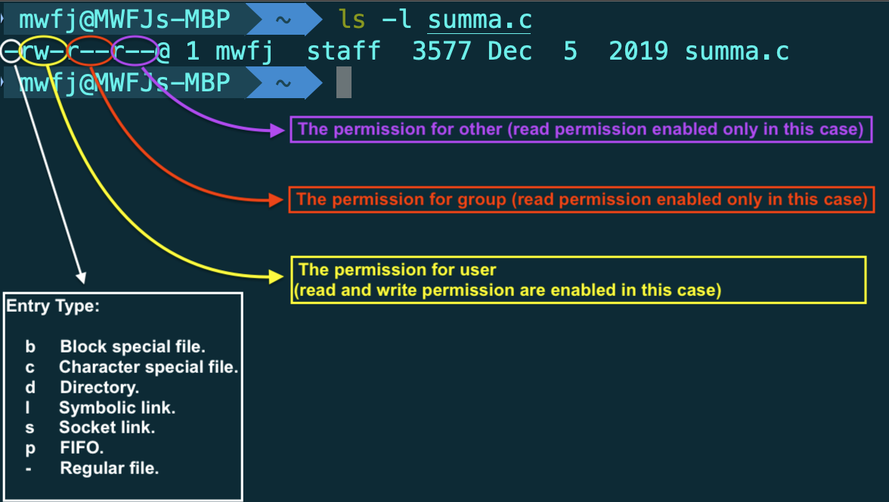

# File System & System I/O

## 1. File Basic

Input/Output(I/O) is the process of **copying data between main memory and external device** such as disk drives, terminals and networks.

+ Input operation copies data from an I/O device to main memory;
+ Output operation copies data from memory to a device.

In linux, ***file*** is a sequence of m bytes: `B0, B1, ... , B_k, ..., B_(m-1)`.

Each Linux file has a type that indicates its role in the system:

+ A ***regular file*** contains arbitrary data. Application programs often distinguish between

  + **text files**: each line is a sequence of characters. A Linux text file consist of a sequence of *text lines*, where each line is a sequence of characters terminated by a `newline character('\n')` (end of line - EOF). The newline character is the same as the ASCII line feed character(line feed - LF) and has numeric value of `0x0a`; For Windows and Internet protocols, new line character should be: `\r\n(0xd0xa)`, where its line feed should be carriage return;
  + **binary files**: everything except text file

  To kernel, there no difference between text and binary files.

+ A ***directory*** is a file consisting of an array of links, where each links maps a filename to a file, which may be another directory;

  Each directories contains at least two entries:

  + `.`(dot): the link to the directory itself
  + `..`(dot-dot): the link to its parent directory in the directory hierarchy.

  You can create a directory with the `mkdir` command; view ites content with `ls`, and delete it with `rmdir or rm -rf`

  <p align="center">  </p>

  <p align="center">Portion of the Linux directory hierarchy <a href = "http://csapp.cs.cmu.edu/3e/home.html">CS:APP3e</a>  chapter 10</p>

+ A ***socket*** is a file that is used to communicate with another process cross a network.

All I/O device, such as networks, disks, and terminals, are modeled as files, and all input and output is performanced by reading and writing the appropriate files:

+ `/dev/sda2`(`/user` disk partition)
+ `/dev/tty2`(terminal)
+ `/boot/vmlinuz-3.13.0-55-generic`(kernel image)
+ `/proc` (kernel data structures)

This elegant mapping of files allows the Linux kernel to export a simple, low-level application interface, known as Unix I/O, that enables all input and output to be performed in a uniform and consisent way:

### 1.1 Opening Files: `open()`

An application announces its intention to access an I/O by asking the kernel to open the corresponding file.

The `open` function converts a `filename` to a file descriptor and returns the descriptor number, the descriptor returned always the smallest descriptor that is not currently open in the process, where `fd = open(pathname, flags, mode)` opens the file identified by pathname, returning a file descriptor used to refer to the open file in subsequent calls. (If the `pathname` is symbolic link, it is dereferenced)

The kernel returns ***file descriptor***, that identifies the file in all subsequent operations on the file. 

+ The kernel keeps track of all information about the open file. 
+ The application only keeps track of the descriptor

```c
#include<sys/types.h>
#include<sys/stat.h>
#include<fcntl.h>

int open(char *filename, int flags, mode_t mode); // return new descriptor if OK, -1 otherwise
```

Each process created by a Linux shell begins life with three open files:

+ standard input (descriptor 0) (STDIN_ FILENO in `<unistd.h>`)
+ standard output (descriptor 1) (STDOUT_FILENO in `<unistd.h>`)
+ standard error (descriptor 2) (STDERR_FILENO in `<unistd.h>`)

#### 1.1.1 Flags

The `flags` argument can also be bit-wise  **ORed**(|) in flags with one or more bits masks that provide additional instructions

The table below divided into the following groups:

+ ***File access mode flags***: There are the flags like O_RDONLY, O_WRONLY, O_RDWR flags, where they can be retrieved using `fcntl()` F_GETFL operation.

+ ***File creation flags:*** These are the flags shown in the second part of the table below, where they control various aspects of the behavior of the `open()` call, as well as options for subsequent I/O operations. These flags cannot be retrieved or changed
+ ***Open file status flags:*** There are the remaining flags in the table below, where they can be retrieved and modified using the `fcntl()` F_GETFL and F_SETFL operations.

<p align="center">  </p>

<p align="center">Values of the flags argument of open() <a href = "https://man7.org/tlpi/">The Linux programming interface</a>  chapter 4</p>

#### 1.1.2 Mode Argument

The mode(`st_mode `in `stat `structure) argument specifies the access permission bit of new files. As part of its context, each process has a `umask` that is set by calling the unmask function. The first 3 of these bits are special bits known as the **set-user-ID**, **set-group-ID**, and **sticky bits**(labeled U, G, and T commonly)

<p align="center">  </p>

<p align="center">The layout of st_mode bit mask <a href = "https://man7.org/tlpi/">The Linux programming interface</a>  chapter 4</p>

+ **set-user-ID program:** A set-user-ID program allows a process to **gain privileges it would not normally have**, by **setting the process's effective user ID** to the same value as the user ID(owner) of the executable file; When a set-user-ID program is run, **the kernel sets the effective user ID of the process to be the same the user ID** of the executable file;

+ **set-group-ID program:** A set-group-ID performs the analogous task for the process's effective group ID. (**effective group ID** and **effective userID** are used to determine the permission granted to a process, normally they are the same value); When a set-group-ID program is run, **the kernel sets the effective user ID of the process to be the same the group ID** of the executable file;

  For the perspective of stikcy bit, set-group-ID mainly serve two purpose:

  + controlling the group ownership of new files created in a directory mounted with the `nogrpid `option
  + enabling mandatory locking on a file

+ **set-user-ID program and set-group-ID program** can also designed to change the effective IDs of a process to something other than `root`

+ **set-user-ID bit** and **set-group-ID bit** are set using the `chmod` command 

  + `chmod u+s`: turn on set-user-ID permission bit;
  + `chmod g+s`: turn on set-group-ID permission bit.

+ **sticky bit**: 

  + *On older UNIX implementations*, the sticky bit was provided as a way of **making commonly used programs run faster**.

    +  **If the sticky bit was set on a program file**, then the first time the program was executed, a copy of the program text was **saved in the swap area**—thus **it sticks in swap, and loads faster** on subsequent executions.

  + *In modern UNIX implementations (including Linux)*:

    + **For directories**, the sticky bit acts as the **restricted deletion flag**. Setting this bit on a directory means that an **unprivileged process** can **unlink** (`unlink()`,` rmdir()`) and **rename** (`rename()`) files in the directory only if it has write permission on the directory and owns either the file or the directory.

      This makes it possible to create a directory that is **shared by many users**, who can each **create and delete their own files in the directory but can’t delete files owned by other users**. The sticky permission bit is commonly set on the `/tmp` directory for this reason.

    + **A file’s sticky permission bit** is set via the chmod command (`chmod +t file`) or via the `chmod()` system call. If the sticky bit for a file is set, `ls –l` shows a lowercase or uppercase letter T in the other-execute permission field, depending on whether the other-execute permission bit is on or off, as in the following:

      ```shell
      $ touch tfile 
      $ ls -l tfile
      -rw-r--r-- 1 mtk  users   0 Jun 23 14:44 tfile
      $ chmod +t tfile 
      $ ls -l tfile
      -rw-r--r-T 1 mtk  users   0 Jun 23 14:44 tfile
      $ chmod o+x tfile 
      $ ls -l tfile
      -rw-r--r-t 1 mtk  users   0 Jun 23 14:44 tfile
      ```

The **remaining 9 bits** form the mask defining the permission that are granted to various categories of users accessing the file. The file permission maks divideds the world into three categories:

+ ***Owner***(also known as ***user***): The permissions granted the owner of the file;
+ ***Group***: The permission granted to user who are members of the file's group
+ ***Other***: The permission granted to everyone else

Three permission may be granted to each user category:

+ ***Read***: The content of the file may be read
+ ***Write***: The content of the file may be changed
+ ***Execute***: The file may be executerd(i.e. it is a program or a script). In order to execute a script file, **both read and execute permission are required**.

The permission and ownership of a file can be viewed using the command `ls -l`, as in the following example:

<p align="center">  </p>

The `<sys/stat.h>` header file defines constants that can be **ANDed (&)** with `st_mode `of the `stat `structure, in order to **check whether particular permission bits are set.** (These constants are also defined via the inclusion of `<fcntl.h>`, which prototypes the `open()` system call.)

| Constant                            | Octal Value               | Permission Bit                                 | Description                                                  |
| :---------------------------------- | :------------------------ | ---------------------------------------------- | :----------------------------------------------------------- |
| S_ISUID <br />S_ISGID <br />S_ISVTX | 04000<br/>02000<br/>01000 | Set-user-ID<br />Set-group-ID<br />Sticky      | This is the set-user-ID on execute bit<br />This is the set-group-ID on execute bit<br />This is the *sticky* bit. |
| S_IRUSR<br />S_IWUSR<br />S_IXUSR   | 0400<br/>0200<br/>0100    | User-read<br />User-write<br />User-execute    | User (owner) can read this file<br />User (owner) can write this file<br />User (owner) can execute this file |
| S_IRGRP<br />S_IWGRP<br />S_IXGRP   | 040<br/>020<br/>010       | Group-read<br />Group-write<br />Group-execute | Members of the owner’s group can read this file<br />Members of the owner’s group can write this file<br />Members of the owner’s group can execute this file |
| S_IROTH<br />S_IWOTH<br />S_IXOTH   | 04<br/>02<br/>01          | Other-read<br />Other-write<br />Other-execute | Others (anyone) can read this file<br />Others (anyone) can write this file<br />Others (anyone) can execute this file |

In addition to the mode bit shown above, **three constants** are defined to equate to **masks for all three permissions for each of the categories owner, group, and other**: `S_IRWXU (0700)`, `S_IRWXG (070)`, and `S_IRWXO (07)`.

When `open()` is used to create a new file, the *mode* bit-mask argument specifies the permissions to be placed on the file. If the `open()` call doesn't specify `O_CREAT`, mode can be ommitted

```c
/* Open existing file for reading */
fd = open("startup", O_RDONLY);
if (fd == -1)
	errExit("open"); 
/* 
 * Open new or existing file for reading and writing, truncating to zero bytes; 
 * file permissions read+write for owner, nothing for all others 
 */ 
fd = open("myfile", O_RDWR | O_CREAT | O_TRUNC, S_IRUSR | S_IWUSR);

if (fd == -1)
  errExit("open"); /* Open new or existing file for writing; writes should always append to end of file */ 

fd = open("w.log", O_WRONLY | O_CREAT | O_TRUNC | O_APPEND, S_IRUSR | S_IWUSR);

if (fd == -1)
  errExit("open");
```

#### 1.1.3 `umask`( or system call `umask()` )

The ***umask*** is a process attribute that specifies which **permission bits should always be *turned off* when new files or directories are created by the process**. Often, **a process just uses the umask it inherits from its parent shell**, with the (usually desirable) consequence that the **user can control the umask of programs** executed from the shell using the shell built-in command umask, which changes the umask of the shell process.

The initialization files for most shells **set the default umask to the octal value** `022` (`----w--w-`). This value specifies that write permission should always be turned off for group and other.

The `umask()` system call changes a process’s umask to the value specified in ***mask***.

```c
#include <sys/stat.h>
mode_t umask(mode_t mask);
```

When a process creates a new file by calling the open function with some mode argument, then the access permission bits of the file are set to `mode & ~umask`. For example, suppose we  are given the following  default values for `mode` and  `umask`:

```c
#define DEF_MODE  S_IRUSR|S_IWUSR|S_IRGRP|S_IWGRP|S_IROTH|S_IWOTH 
#define DEF_UMASK S_IWGRP|S_IWOTH
```

Then the following code fragment creates a new file in which the owner of the file has read and write permission, and all other users have read permissions:

```c
umask(DEF_UMAKE)
fd = Open("foo.txt", O_CREAT|O_TRUNC|O_WRONLY, DEF_MODE);
```

**A call to `umask()` is always successful, and returns the previous umask.**

### 1.2 File Control Operations: `fcntl()`

The `fcntl()` system call performs a range of control operations on an open file descriptor:

```c
#include <fcntl.h>
int fcntl(int fd, int cmd, ...)
```

The `cmd` argument can specify a wide range of operations.

As indicated by the **ellipsis( ... )**, the third argument to `fcntl()` can be of different types, or it can be omitted. The kernel uses the value of the `cmd `argument to determine the data type (if any) to expect for this argument.

One usage of `fcntl` is to **retrieve or modify the access mode and open file status flags** of an open file.

+ To **retrieve these setting**, we specify `cmd` as F_GETFL:

```c
int flags, accessMode;
flags = fcntl(fd, F_GETFL);     /* Third argument is not required */
if(flags == -1)
  errExit("fcntl");
if(flags & O_SYNC)              /* Check if the file was opened for synchronizes write */
  printf("write are synchronized \n");

accessMode = flags & O_ACCMODE; /* To check the access mode, we mask the flags value with O_ACCMODE */
if( accessMode == O_WRONLY || accessMode == O_RDWR )
  printf("file is writable \n");
```

+ We can use the `fcntl()` F_SETFL command to **modify some of the open file status flags**. 

  + The flags that can be modified are `O_APPEND`, `O_NONBLOCK`, `O_NOATIME`, `O_ASYNC` and `O_DIRECT`.
  + Attempts to modify other flags are ignored.

+ Using `fcntl()` to modify open file status flags is particularly useful in the following cases:

  + The file was **not opened by the calling program**, so that **it had no control over the flags** used in the `open()` call.
  + **The file descriptor was obtained from a system call other than `open()`**, such as `pipe()` and `socket()`

+ To modify the open file status flags:

  +  we use `fcntl()` to retrieve a copy of the existing flags, 
  + then modify the bits we wish to change, 
  + and finally make a further call to `fcntl()` to update the flags;

  ```c
  /* To enable the O_APPEND flag */
  int flags;
  
  flags = fcntl(fd, F_GETFL);
  if(flags == -1)
    errExit("fcntl");
  flags |= O_APPEND;
  if(fcntl(fd, F_SETFL, flags) == -1)
    errExit("fcntl")
  ```

### 1.3 Reading File: `read()`

The `read` function copies at most `n` bytes from the current file position of descriptor `fd` to memory location `buf`.  

```c
#include <unistd.h> 
ssize_t read(int fd, void *buffer, size_t count);
```

Return value:

+  `-1` indicates an error;
+ `0 `indicates EOF;
+ Otherwise, the return value indicates the number of  bytes taht were actually transferred.

The `count` argument specifies the **maximum number of byte to read**; the `buffer` argument supplies the address of the memory buffer into which the input data is to be placed. **This buffer must be at least `count `bytes long**.

A call to `read()` may read **less than the requested number of bytes**. For a regular file, the probable reason for this is that we were **close to the end of the file**. When `read()` is applied to other types of files—such as `pipes, FIFOs, sockets, or terminals`—there are also various circumstances where it may **read fewer bytes than requested**.

`read()` doesn't place a terminating **null byte** at the end of the string that `printf()` is being asked to print, where `read()` can be used to read any sequence of bytes from a file. In other words, there is no way that `read()` can tell the difference between text file or the binary form.

If a terminating null byte is required at the end of the input buffer, we must put it there explicitly:

```c
char buffer[MAX_READ + 1]; 
ssize_t numRead;
numRead = read(STDIN_FILENO, buffer, MAX_READ); 
if (numRead == -1) 
  errExit("read");
buffer[numRead] = '\0';
printf("The input data was: %s\n", buffer);
```

The reason is that **the size of buffer must be at least one greater than the largest string we expect to read**.

### 1.4 Writing File: `write()`

The `write` function copies at most `n` bytes from memory location `buf` to the current file position of descriptor `fd`

```c
#include <unistd.h>
ssize_t write(int fd, void *buffer, size_t count);
```

*buffer* is the address of the data to be written; *count* is the number of bytes to write from buffer; and *fd* is a file descriptor referring to the file to which data is to be written.

Return Value:

+ The number of bytes actually written on success, it might be less than `count`
  + For disk file, possible reasons for such a partical writee hat are disk was filled or the process resource limit on file size was reached.
  + For network socket, the internel buffering constriants and long network delays can cause `read/write` to return short counts.
  + Short count also occur when you call `read/write` on a Linux pipe

+ Note that: when performing I/ on a disk file, a successful return from `write()` doesn't guarantee that the data has been transferred to disk, because the kernel performs **buffering of disk I/O in order to reduce disk activiry** and expedite `write()` call.

### 1.5 Changing the File Offset: `lseek()`

For each open file, the kernel records a file offset, sometimes also called the read-write offset or pointer. This is the location in the file at which the next `read()` or `write()` will commence. The file offset is expressed as an ordinal byte position relative to the start of the file. The first byte of the file is at offset 0.

The `lseek()` system call **adjusts the offset of the open file** referred to by the file descriptor ***fd***, according to the values specified in ***offset*** and ***whence***.

```c
#include <unistd.h>
off_t lseek(int fd, off_t offset, int whence);
```

The `offset` argument specifies  a value **in bytes**. The `whence` argument indicates the **base point** from which offset is to be interpreted, and is one of the following values:

+ SEET_SET: the file offset is set ***offset*** bytes from the beginning of the file.
+ SEEK_CUR: the file offset is adjusted by offset bytes relative the the current file offset
+ SEEK_END:  the file offset is set to **the size of theh file plus offset**

If `whence `is SEEK_CUR or SEEK_END, offset may be negative or positive; for SEEK_SET, offset must be nonnegative.

<p align="center">  </p>

<p align="center">Interpreting the whence arguement of lseek() <a href = "https://man7.org/tlpi/">The Linux programming interface</a>  chapter 4</p>

For example:

```c
lseek(fd, 0, SEEK_SET);     /* Start of file */
lseek(fd, 0, SEEK_END);     /* Next byte after the end of the file */
lseek(fd, -1, SEEK_END);    /* Last byte of file */
lseek(fd, -10, SEEK_CUR);   /* Ten bytes prior to current location */
lseek(fd, 10000, SEEK_END); /* 10001 bytes past last byte of file */
```

Return Value:

+ New file offset on success
+ `-1` on error

Note: 

+ Calling `lseek()` simply adjusts the kernel’s record of the file offset associated with a file descriptor. **It does not cause any physical device access**.
+ Applying `lseek()` to a `pipe`, `FIFO`, `socket`, or `terminal `is **not permitted;** `lseek()` fails, with errno set to ESPIPE.


***File hole*** refers to the space between the previous end of the file and the newly written bytes. From the programming point of view, the bytes in a hole exist, and **reading from the hole returns a buffer of bytes containing 0(null byte)**. **File holes don't, however, take up any disk space**. The file system doesn't allocate any dis block for a hole until data is written into it.

**The main advantage of file holes** is that a sparsely populated file consumes **less disk space than would otherwise be required** if the null bytes actually needed to be allocated in disk blocks. Most native UNIX file systems support the concept of file holes, but many nonnative file systems (e.g., Microsoft’s VFAT) do not. **On a file system that doesn’t support holes, explicit null bytes are written to the file.**

The exisence of holes means that a file's nominal size may be larger than the amount of disk storage it utilizes. Writing bytes into the middle of the file holw will decrease the amount of free disk space as the kernel allocates blocks to fill the hole, even though the file's size doesn't change.

### 1.6 Operation Outside the Universal I/O Model: `ioctl()`

The `ioctl()` system call is a general-purpose mechanism for performing file and device operations taht fall outside the universal I/O model.

```c
#include <sys/ioctl.h>
int ioctl(int fd, int request, .../* argp */);
```

+ `fd` : open file decriptor for the device or file
+ `request` is a device-dependent request code. An `ioctl()` **request** has encoded in it whether the argument is an `in `parameter or `out `parameter, and the size of the argument argp in bytes.
+ The third argument to `ioctl()`, which we label `argp` can be of any type. The value of the request argument enables `ioctl()` to determine what type of value to expect in `argp`. Typically, `argp` is a pointer to either an integer or a structure; in some case, it is unused.


## 2. I/O Buffer

When working with disk files, the `read()` and  `write()` system call don't directly initiate disk access, Instead, they simple **copy data** between a `user-space buffer` and a buffer in the **kernel** `buffer cache`.

For example, the following call transfer 3 bytes of data from a buffer in user-space memory to a buffer in kernel space:

`write(fd, "abc", 3);`

**For the kernel write:**

1. `write()` returns immediately
2. At some later point, the kernel writes(flushes) its buffer to the disk.(Hence, we say that the system call is not `synchronize` with the disk operation). 
3. If, in the interim, **another process attempts to read these bytes of the file, then the kernel automatically supplies the data from the buffer cache, rather than from(the outdated contents of) the file.**

**For the kernel read:** for sequential file access, the kernel typically performs `read-ahead` to try  to ensure that the next blocks of a file are read into theh buffer before the reading process requires them.

1. **It reads data from the disk and stores it in a kernel buffer**.
2. **Calls to `read()` fetch data from this buffer until it is exhausted**
3. **the kernel reads the next segment of the file into the buffer cache**.

The Linux kernel imposes **no fixed upper limit** on the size of the buffer cache. The kernel will allocate as many buffer cache pages as are required.

If **available memory is scarce**, then the kernel **flushes some modified buffer cache page on disk**, in order to free those pages for reuse.

**In order to transfer large amounts of data from files, buffering them into large blocks can greatly improve I/O performance by reducing the number of times we call system calls.** 

### File Stream

A *file stream* is a **sequence of bytes** used to hold file data. Usually a file has only one file stream, namely the file's default data stream.

**The file stream provides access to an operating-system file through the stream I/O interface.**  File descriptors are represented as objects of type `int`, while streams are represented as `FILE *` objects <a href="#reference2">[2]</a> <a href="#reference3">[3]</a>.

For historical reasons, the type of the C data structure that represents a stream is called `FILE` rather than “stream”. Since most of the library functions deal with objects of type `FILE *`, sometimes the term *file pointer* is also used to mean “stream”. This leads to unfortunate confusion over terminology in many books on C <a href="#reference2">[2]</a> <a href="#reference3">[3]</a>.

The "streaming" **API functions** such as `fopen()`, `fscanf()`, etc -and the functions that use **the terminal** "streams" (`stdin` and `stdout`) such as `printf()` and `scanf()` - are implemented using the `FILE` structure as its API handle. **This API and the handle are implemented "on top of" the file descriptor API** <a href="#reference1">[1]</a>. In other words, A pointer of the file stream is the `FILE` struct (`typedef struct_IO_FILE FILE`)

However, on file systems that support multiple data streams, each file can have multiple file streams. One of these is the default data stream, which is ***unnamed***. The others are named alternate data streams. **When you open a file, you are actually opening a stream of the given file**.

The biggest **"operational" difference** between the API related to **file stream** and **file descriptor** is the **"streaming API" uses a buffer maintained inside the `FILE `structure**, while the **file descriptor API is not buffered** (at least not by the API calls; it can be by the device driver or lower levels) <a href="#reference1">[1]</a>

The streaming APIs use the buffer to minimize interaction with the file system, which is relatively expensive to access<a href="#reference1">[1]</a>.

**As a general rule, the file descriptor API may be slower for small I/O operations due to this buffering, but it is often faster for "big" accesses than the streaming API** <a href="#reference1">[1]</a>.

###  `setbuf()`

The `setvbuf()` function may be used on **any open stream to change its buffer**. In other words, `setvbuf()` function controls the form of buffering employed by the ***stdio*** library.

```c
#include <stdio.h>
int setvbuf(FLIE *stream, char *buf, int mode, size_t size);
```

+ `stream` arguement identifies the file steam whose buffering is to be modified.
+ `buf` and `size` argument specify the buffer to  be used for `stream`, these arguments may be specified in two ways:
  + If `buf ` is non-NULL, then it points to a **block of memory** of `size` bytes that is to be used as the buffer for `stream`
  + If `buf` is NULL, then the `stdio` library automatically allocates a buffer for use with `stream`
+ `mode` argument specifies the type of buffering
  + `_IONBF`: ***Don't buffer I/O.*** Each `stdio `library call results in an **immediate** `write()` or `read()` system call. The `buf `and `size `arguments are **ignored**, and can be specified as NULL and 0, respectively.
  + `_IOLBF`: ***Employ line-buffered I/O.*** This flag is the **default for streams referring to *terminal devices*.** 
    + For output streams, **data is buffered until a newline character is output** (unless the buffer fills first). 
    + For input streams, data is read a line at a time.
  + `_IOFBF`: ***Employ fully buffered I/O.*** Data is read or written (via calls to read() or write()) **in units equal to the size of the buffer**. This mode is **the default for streams referring to *disk files***.

After the stream has been opened, the `setvbuf()` call **must be made before calling any other `stdio ` function on the stream**. The `setvbuf()` call affects the behavior of all subsequent `stdio `operations on the specified stream.

**Note that `setvbuf()` returns a nonzero value (not necessarily –1) on error.**

#### `setbuf()`

The `setbuf()` function is layered on top of the `setvbuf()`, and performs a similar task.

```c
#include <stdio.h>
void setbuf(FILE *stream, char *buf);
```

Other than the fact that it doesn't return a function result, `setbuf(fp, buf)` is equivalent to:
 `setvbuf(fp, buf, (buf != NULL) ? _IOFBF : _IONFB，BUFSIZ);`

+ `buf` argument is specified either:
  + **NULL**: for no buffering
  + **As a pointer**: caller-allocated buffer of `BUFSIZE` bytes.
  + `BUFSIZ` is defined in `<stdio.h>`. In the glibc implementation, this constant has the value `8192`, which is typical.

#### `setbuffer()`

The `setbuffer()` function is similar to `setbuf()`, but allow the caller to specify the size of `buf`.

```c
#define _BSD_SOURCE
#include <stdio.h>
void setbuffer(FILE *stream, char *buf, size_t size);
```

The call `setbuffer(fp, buf, size) ` is equvalent to: `void setbuffer(fp, buf, (buf != NULL) ? _IOFBF : _IONBF, size);`

#### `fflush()`

The `fflush()` **flushes the output buffer** for the specific ***stream***, where the stream flushed to a kernel buffer via `write()`.

```c
#include <stdio.h>
int fflush(FILE *stream);
```

+ If `stream` is NULL, `fflush()` flushes all `stdio` buffers;
+ When it applied to an **input stream**, any bufferd input to be discarded. (The buffer will be refilled when the program enxt tries to read from stream);
+ When the corresponding **stream is closed**, the buffer of `stdio` is automatically flushed.

In many C library implementations, including `glibc`, if `stdin` and `stdout` **refer to a terminal**, then **an implicit `fflush(stdout)` is performed** whenever input is read from `stdin`. This has the effect of flushing any prompts written to  `stdout` that don't include a terminating newline character.


### Controling Kernel Buffering of File I/O

#### Synchronized I/O data integrity and synchronized I/O file integrity

***Synchronized I/O completion*** is mean that an I/O operation that has **either been successfully tranferred[to the disk] or diagnosed as unsuccessful**.

**SUSv3** defines two different types of synchronized I/O completion: 

1. ***synchronized I/O data integrity completion***: This type of completion concern with ensuring that a **file data update transfers sufficient information** to allow **a later retrieval of that data proceed**.
   + **For a read operation**, the requested file data has been transferred(from the disk) to the process. If there were **any pending write** operations affecting the requested data, **these are transferred to the disk before performing the read**.
   + **For a write operation**, the date specified in the write request has been transferred from the process to the disk, and all file metadata required to retrieve that data has also been transferred, where just part of metadata attributes of the file need to be transferred. **(data& part of metadata need to be transferred)**
2. ***synchronized file intergrity completion***: a **superset** of synchronized I/O data intergrity completion. During a file update, all updated file metadata is transferred to disk, even if it is not necessary for the corresponding operation.

#### Corresponding system calls

##### `fsync()` system call

The `fsync()` causes **the buffered data and all meta data** associated with the **open file descriptor** `fd` to be **flushed to disk**. Calling `fsync()` **forces the file to the the synchronized I/O file integrity completion** state.

```c
#include <unistd.h>
int fsync(int fd);
```

+ An `fsync()` call **returns** only after the transfer to the disk device(or at least its cache) has **completed**.

##### `fdatasync()` system call

The `fdatasync()` system call operates similarly to `fsync()`, but only forces the file to the synchronized I/O data integrity completion state.

```c
#include <unistd.h>
int fdatasync(int fg);
```

+ Using `fdatasync()` potentially reduces the number of disk operations from the two(file data & file metadata attributes) required by `fsync() ` to one(file data), where some file metadata attributes don't need to be transferred for synchronized I/O data completion(as we discuss above).

  Advantages:

  + Reducing the number if disk I/O operations in order to improve I/O performance that are making multiple file updates
    + File data and metadata normally reside on different part of the disk, where updating them **require repeated seek operation** backward and forward across the disk.
  + Accurate maintenance of certain matadata(such as temestamps) is not essential.

##### `sync()` system call

The `sync()` system call caused **all kernal buffers containing updated file information**(i.e., data blocks, pointer blocks, metadata etc.) to be **flushed to disk.**

In the Linux implementation, `sync()` returns only after all data has been transferred to the disk device(or at least to its cache).

### `O_SYNC` flag: making all writes synchronous

Specifying the `O_SYNC `flag when calling `open()` makes all subsequent output synchronous: `fd = open(pathname, O_WRONLY | O_SYNC);`

Aftern this `open()`  call, **every `write()` to the file automatically flushes the file data and meta data to the disk**.

#### Performance impact

To write **1 million bytes to a newly created file** for a range of buffer size(on `ext2` file system), `O_SYNC` increases elapsed time enormously (in 1-byte buffer cacse, by a factor of more than 1000). 

**Note** also the **large differences** between the **elapsed and CPU times** for **writes** with `O_SYNC` <a href="#reference4">[4]</a>. This is a consequence of **the program being blocked while each buffer is actually transferred to disk**.


##  3. Nonblocking I/O

## 4. File System

## Reference

<a name="reference1"></a>[[1] Quora - What is the difference between the file descriptor and stream?](https://www.quora.com/What-is-the-difference-between-the-file-descriptor-and-stream)

<a name="reference2"></a>[[2] The GNU C Library](https://www.gnu.org/software/libc/manual/html_mono/libc.html)

<a name="reference3"></a>[[3] StackOverFlow - What is the difference between a stream and a file?](https://stackoverflow.com/questions/20937616/what-is-the-difference-between-a-stream-and-a-file)

<a name="reference4"></a>[[4] Wikipedia - CPU time](https://en.wikipedia.org/wiki/CPU_time)
