# Linking 

Linking is the process of collecting and combing various pieces of code and data **into a single file** that can be loaded(copied) into memory and executed. `Linking can be performed at compile time`:

+ when the source code is translated into machine code; 
+ at load time, when the program loaded into memory and executed by the loader;
+ at runtime, by application programs

Linker plays a crucial role in software development because they enable ***separate compilation***. Instead of organizing a large application as one monolithic source file, we can **decompose it into smaller, more manageable modules** that can be modified and compiled separately. When we change one of these modules, we simply recomile it and relink the application, without having to recompile the other files. 

 Most compilation systems provide a **compiler driver** that invokes:

```txt
Language Preprocessor -> Compiler -> Assembler -> Linker -> Executable Object file
```

For example: when you compile c program in linux system(assume we have two c files right now, where `main.c` call the function that from `sum.c`)

```bash
linux > gcc -Og -o prog main.c sum.c
```

1. The driver first runs the **C preprocessor**, which translates the C source file `main.c `into an ***ASCII intermediate file*** `main.i(/tmp/main.i)`

2. The dirver runs the **C compiler**(`cc1`), whch translate `main.i ` into an ***ASCII assembly-language file*** `main.s`:

   ```bash
   cc1 /tmp/main.i -Og [other arguments] -o /tmp/main.s
   ```

3. The driver runs the assembler, which translates `main.s` into a ***binary relocatable object file*** `main.o`<br>(`tmp/main.s` -> `tmp/main.o`).

3. The driver goes through the same process to generate `sum.o` 

4. Finally, it runs the ***linker program Id***, which **combines maino and sum.o**, along with the necessary system object files, to create ***the binary executable object file*** `prog`:

   ```bash
   ld -o prog [system object files and args] /tmp/main.o /tmp/sum.o
   ```

5. Run the executable file `prog`

   ```bash
   linux > ./prog
   ```

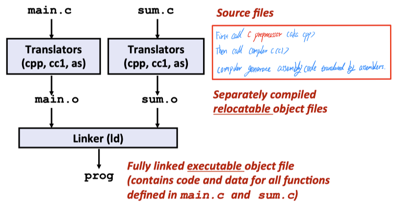

<p align="center">This figure comes from <a href = "https://www.cs.cmu.edu/afs/cs/academic/class/15213-f15/www/lectures/13-linking.pdf">cmu-213 slide</a></p>

### Why Linkers?

1. Modulartity:
   + Program can be written as a collection of smaller source files, rather than one monolithc mass
   + Can build libraries of common functions
2. Efficiency:
   + Time - Separate compilation: when change one source file, we just compile the changed file and no need to recompile other source files.
   + Space - Libraries
     + Common functions can be aggregated into a single file
     + Yet executable files and running memory images **contain only code for the functions they actually use**.

## What Do Linkers Do?

Static linkers such as LD program in Linux takes as input a collection of **relocatable obejct files** and **command-line arguements** to generate as output a fully linked executable object file that can be loaded and run.

+ The input **relocatable object files** consist of **various code** and **data sections**, where each section is a contiguous sequence of bytes. 

The linker performs two main tasks:

1. ***Symbol resolution***:  

   Object files define and reference symbols, where each symbol corresponds to a function, a global variable or static variable. In other words, in this step, the linker has to decide which definitions to use for all subsequent reference. **The purpose of symbol resolution is to associate each symbol reference with exactly one symbol definition.** 

   For symbol defition, it stored in object file(by assembler) in symbol table:

   + Symble table is an array of structs
   + Each entry includes name, size, and location of symbol.

   ```c
   void swap {...} 	// define symbol swap
   swap();						// reference symbol swap
   int *xp = &x			// define symbol xp, reference x
   ```

2. **Relocation:**

   The linker decides on where each symbol is going to be ulmimately located in memory, when the program executes. And binds that those absolute memory locations to the symbol. Then it goes and looks at all the reference to those symbols, points to the right spot in the final.

   + Compilers and assemblers generate code and data sections that start at address 0 and meges separate code and data sections into single sections.

   + The linker relocates these sections by associating at memory location with symbol definition(from their relative locations in the `.o` files to their final absolute memory location in the executable)
   + Then modifing all of the references to those symbols so that they point to this memory location. The linker blindly performs these relocations using detailed instructions, generated by the assemler, called relocation entires.

   Note that: Functions are just stored at some offset in their object module, because the linker doesn't know where those functions are actually going to be eventually a loaded into memory. Before relocation the address of, a function in the object module is just its offset in the module and similarly for data

## The type of object files

+ **Relocatable object file(`.o` file):** contain binary code and data in a form that can be combined with other relocatable object files to form executable object file, where the relocatable object file is the **output by assembler** and **it cannot be directly access by memory**.
  + Each` .o` file is produced from exactly one source `.c` file

+ **Executable object file(`.out` file)**: contains binary code and data in a form that can be copied directly into memory and then executed.
+ **Shared object file(`.so` file)**: a special type of relocatable object file that can be **loaded into memory and linked dynamically,** at either load time or run-time
  + Called ***Dynamic Link Libraries(DLLs)*** by Windows

Technically, an **object module** is a sequence of bytes and an **object file** is an object module stored on disk in a file. Object files are organized according to specific object file formats, which vary from system to sytem:

+ In first Unix systems from Bell labs used `a.out` format
+ Windows uses the **Portable Executable(PE)** format.
+ Mac OS uses **Mach-O** format
+ Modern x86-64 Linux and Unix systems use **Executable and Linkable Format(ELF)**.

The basic concepts are similar, regardless of the particular format.

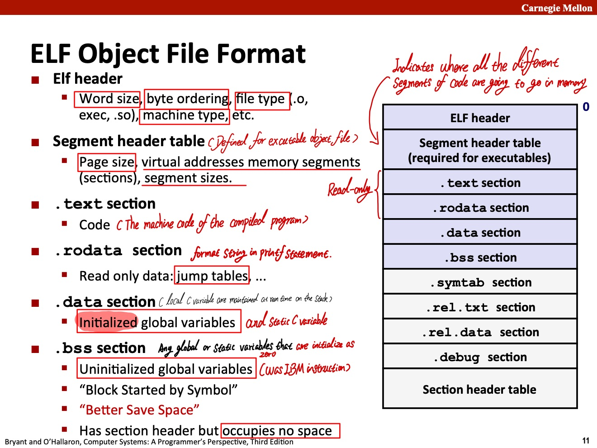

<p align="center">This figure comes from <a href = "https://www.cs.cmu.edu/afs/cs/academic/class/15213-f15/www/lectures/13-linking.pdf">cmu-213 slide</a></p>

+ `.text` The machine code of the compiled program, where the address part of the function environment mapping(`function name -> address`) stored at the `.text` section.
+ `.data` normally maintain the ***Initialized* global and static C variables**. Local C variabls are maitained at run time on the stack and do not appear either  the `.data` and `.bss` sections.
+ `.bss`: Uninitialized global and static C variables, along with any global or static variables that are initialized to zero. **This section occupies no actual space in the object file;** it is merely a placeholder. Object file formats distinguish between initialized and uninitialized variable for space efficiency: uninitialized variable do not have to occupy any actual disk space in the object file. **At run time, these variable are allocated in memory with an initial value of zero.**

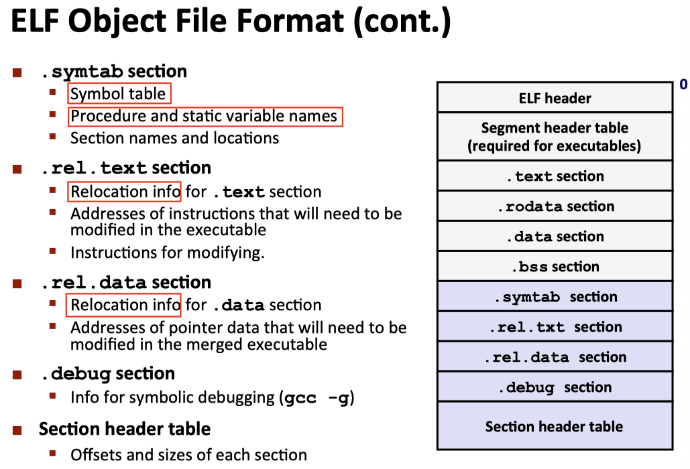

<p align="center">This figure comes from <a href = "https://www.cs.cmu.edu/afs/cs/academic/class/15213-f15/www/lectures/13-linking.pdf">cmu-213 slide</a></p>

+ `.symtab`: A symbol table with information about functions and global variables that are defined and referenced in that program. Some programmers mistakenly believe that a program must be compiled with `-g` option to get symbol table information. In fact, **every relocatable object file has a symbol table in `.symtab`**(unless the programmer has specifcally removed it with `STRIP` command). However, unlike the symbol table inside a compiler, **the `.symtab` symbol table does not  contain entries for local variable.**

+ `.rel.text`: **A list of locations** in the `.text` section that will need to be modified when the linker combines this object file with others. In general, any instruction that calls an `external function` or `references a global variable` will need to be modified. On the other hand, **instructions that call local function do not need to be modified.**

  In summary `.rel.text` mainly saved : 

  1. Referencing relocation
  2. Referenced symbol number
  3. Reference type

   Note that **relocation infomation is not needed in executable object files**, and is usually omitted unless the user explicitly instructs the linker to include it.

  ```c
  typedef struct
  {
  	// Equals to the offset of the current section
    Elf64_Addr	r_offset;		/* The location of the relocation reference */
    Elf64_Xword	r_info;			/* Relocation type and symbol index */
    Elf64_Sxword	r_addend;		/* Addend : The offset of reolocation */
  } Elf64_Rela;
  ```

  ```txt
  r_info : 
  Symbol Index  Relocation Type
       /\             /\
   /‾‾‾  ‾‾‾‾\   /‾‾‾‾  ‾‾‾\
   __ __ __ __ | __ __ __ __ 
   High bit          low bit
   
  For example:
                                   r_info
                                     /\
                                /‾‾‾‾  ‾‾‾‾\
         r_offset             Type    Symbol index       r_append
            /\                 /\         /\                /\
  /‾‾‾‾‾‾‾‾‾  ‾‾‾‾‾‾‾‾‾‾\  /‾‾‾  ‾‾‾\  /‾‾‾  ‾‾‾\  /‾‾‾‾‾‾‾‾‾  ‾‾‾‾‾‾‾‾‾‾\
  0a 00 00 00 00 00 00 00 04 00 00 00 01 00 00 00 fc ff ff ff ff ff ff ff
  ```

  

+ `.rel.data`: Relocations information for any global variables that are referenced or defined by the module. In general, any initialized global variable whose initial value is the address of a global variable or externally defined function will need to be modified.

+ `.debug`: A debugging symbol table with entries for **local variables** and **typedefs defined** in the program, **global variable defined and referenced** in the program, and the original C source file. It is only present if the compiler driver is invoked with the `-g` flag.

+ `.line` : A **mapping** between **line numbers in the original C source program** and **machine code instructions** in the `.text` section. It is only present if the compiler driver is invoked with the `-g` flag.

+ `.strt ab`: A **string table for the symbol tables** in the `.symtab` and `.debug` section and for the section names in the section headersm, where the variable name and function name stored at this section(end by `00` in hex  or `\0` in string). A string table is a sequence of null-terminated character strings.

## Linker Symbols

Symbol table are **built by assembler**, using symbols exported by the compiler in the assembly-language `.s` file. 

### 1. Global symbols

Global symbols **defined** by module `m `and that **can be referenced by other modules**. Global linker symbols correspond to ***nostatic*** C functions and global variables.

### 2. External symbols

Global symbols **referenced** by module `m`, but **defined by some other modules**, where it also corresponds to nostatic and that global variables that are defined in other modules.

### 3. Local symbols

Local symbols that are defined and referenced exclusively by module `m`. There correspond to ***static C function*** and global variables that are defined with **the static attribute**. These symbols are visible anywhere within the module `m`, but **cannot be referenced by other modules**.

**Note that:**

+ **Local linker symbols are not local program variables**, where the symbol table in `.symtab` **does not contain any symbols that correspond to local nostatic program variable**. The **local C variable are managed by compiler *on the stack***, and thus linker has no idea about local C variable.
+ Similarly, local procedure variables that are defined with C static attribute are not managed on the stack. Instead, **the compiler allocates space in `.data` or `.bss` for each definetion and creates a local linker symbol** in the symbol table with a unique name.

All ELF symbol table is contained in the `.symtab` section, where it contains an array of entries:

```c
typedef struct{
  int	name;	    	// String table offset
  char	type:4,	    	// Function or Data(4 bits)
  	binding: 4;	// Local or global(4 bits)
  char 	reserved; 	// Unused
  short section;	// Section header index
  long	value;		// Section offset or absolute address
  long 	size;		// Object size in bytes
} Elf64_Symbol;
```

<p align="center">Elf symbol table entry</p>

Note that **these psudosection exist only in relocated object file** and do not exist in the executable object file.

+ The `name `of a byte offset into the string table that points to the null-terminated string name of the symbol. 

+ The `value `is the symbol's address.

+ For **relocatable modules**, the `value `is an **offset from the beginning of the section** where the object is defined.

+ For **executable object files**, the `value `is an **absolute run-time address**.

+ The `size `is the size(in byte) of the object.

+ The `type `is usually either ***data*** or ***function***. The symbol table can also contain entires for the **individual sections** and for **the path name** of the original source file, so there are **distinct types for these object** as well.

+ The `binding field` indicates whether symbol is **local**(static) or **global**(external).

  + The other bind type we should notice is the **weak bind**:

    In C, the weak bind can be defined by add the prefix `__attribute__((weak))`, where **the purpose of weak binding** is to prevent the target function/variable from never being defined by the current/other object during the link/runtime phase, causing the program to refer to an uninitialized function/variable, which can further lead to expected errors or even crashes. The weak-bind function will be overwritten when it defined by the other object.

+ Each symbol is assigned to some sectoin of the object file, denoted by the `section` field, which is an index into the section header table.

  There have 3 special pseudosections that don't have entries in the section header table:

  + `ABS `is for symbols that should not be relocated.

  + `UNDEF `is for undefined symbol -- that is, symbols that are referenced in this object module but defined elsewhere.

    For example:

    + `extern void f(); // (bind, type, section) -> (Global, notype, undef) ` 
    + `extern int var; // (bind, type, section) -> (Global, notype, undef)`

  + `COMMON `is for **uninitialized data objects that are not yet allocated**.  

    For the `COMMON` symbol,

    + the `value `field gives the alignment requirement, 
    + and `size `gives the minimum size.

    For the case of `int a;`, this symbol may defined in the local object file or the external object file. What's more, the compiler cannot decide whether `a` initialized with **0** or **the other integer value**, where the former will get `a `into` .bss` and the latter will  into `.data` in GCC. Therefore, compiler will put `a` into `COMMON` section to indicate it cannot decided.

The distinction between `COMMON `and `.bss` is subtle. For the modern versions of `GCC`:

+ `COMMON `: Uninitialized global variables
+ `.bss` : Uninitialzed static variables, and global or static variables that are initialized to zero.

When the compiler is translating some module and symbols with the same name, say, x, it does not know if other modules also define x, and if so, it cannot predict which of the multiple instances of x the linker might choose. So **the compiler defers the decision to the linker by assigning x to** `COMMON`. On the other hand, if x is initialized to zero, then it is a strong symbol, so the compiler can confidently assign it to `.bss`. Similarly, **static symbols are unique by construction**, so the compiler can confidently assign them to either `.data` or `.bss`.

**Note that `COMMON `only exist in Elf format, not in Eof format. The reason is that there is no such ambiguous at the runtime.**

For example, if see the symbol table entry in 64-bit Linux, we will get:

```c
/**
Elf64_Word is a uint32_t (4 byte or 32 bits)
Elf64_Addr is a uint64_t (8 byte or 64 bits)
Elf64_Section is a uint16_t (2 byte or 16 bits)
Elf64_Xword is a uint64_t (8 byte or 64 bits)
**/
typedef struct
{
  Elf64_Word	st_name;		/* Symbol name (string tbl index) */
  unsigned char	st_info;		/* Symbol type and binding */
  unsigned char st_other;		/* Symbol visibility */
  Elf64_Section	st_shndx;		/* Section index */
  Elf64_Addr	st_value;		/* Symbol value */
  Elf64_Xword	st_size;		/* Symbol size */
} Elf64_Sym;
```

<p align="center">Elf symbol table entry in Linux</p>

Just like what we describe above:

+ `st_name` is a string index, where all the symbol name combined together in `.strtab `. We can use index given by `st_name` to find the symbol name(end at `00` or `\0`)

+ `st_info` is `binding` or `type` in `Elf64_Symbol` above.

+ `st_shndx` : The section offset of the whole section table, where it indicate that the location of this symbol (which section it located).

  + When the `st_shndx` is `UNDEF`, it will be relocated to `SHN_UNDEF`. 

+ `st_value` :  

  + The offset of the section in terms of the whole Elf table.
  + For the `COMMON section`, 

+ `st_size`: The size this symbol takes, where it also indicate the type information

  ​					(**byte**(1 byte), **word**(2 byte), **double word**(4 bytes), **quad word**(8 bytes) ).

+ `st_info`: 

  + The `type `is usually either ***data*** or ***function***. (Symbol Table Type, a.k.a `STT`):

    ```c
    /* Legal values for ST_TYPE subfield of st_info (symbol type).  */
    
    #define STT_NOTYPE	0		/* 0000 Symbol type is unspecified */
    #define STT_OBJECT	1		/* 0001 Symbol is a data object(variable) */
    #define STT_FUNC	2		/* 0010 Symbol is a code object(function) */
    #define STT_SECTION	3		/* 0011 Symbol associated with a section */
    #define STT_FILE	4		/* 0100 Symbol's name is file name */
    #define STT_COMMON	5		/* 0101 Symbol is a common data object */
    #define STT_TLS		6		/* 0110 Symbol is thread-local data object*/
    #define	STT_NUM		7		/* 0111 Number of defined types.  */
    #define STT_LOOS	10		/* 1010 Start of OS-specific */
    #define STT_GNU_IFUNC	10		/* 1010 Symbol is indirect code object */
    #define STT_HIOS	12		/* 1100 End of OS-specific */
    #define STT_LOPROC	13		/* 1101 Start of processor-specific */
    #define STT_HIPROC	15		/* 1111 End of processor-specific */
    ```

    

  + The `binding field` indicates whether symbol is **local** or **global**.(Symbol Table Bind, a.k.a `STB`):

    ```c
    /* Legal values for ST_BIND subfield of st_info (symbol binding).  */
    
    #define STB_LOCAL	0		/* 0000 Local symbol */
    #define STB_GLOBAL	1		/* 0001 Global symbol */
    #define STB_WEAK	2		/* 0010 Weak symbol */
    #define	STB_NUM		3		/* 0011 Number of defined types.  */
    #define STB_LOOS	10		/* 1010 Start of OS-specific */
    #define STB_GNU_UNIQUE	10		/* 1010 Unique symbol.  */
    #define STB_HIOS	12		/* 1100 End of OS-specific */
    #define STB_LOPROC	13		/* 1101 Start of processor-specific */
    #define STB_HIPROC	15		/* 1111 End of processor-specific */
    ```

    

  ```txt
      Bind         Type
       /\           /\
  /‾‾‾‾  ‾‾‾\   /‾‾‾  ‾‾‾‾\
  __ __ __ __ | __ __ __ __ (each "__" represent 1 binary bit)
  
  For example: 
    If Bind == 0001, that means the current symbol is global
    If Type == 0001, that means the current symbol is variable
    If Type == 0010, that means the current symbol is function
  see more detail to macro define in elf.h
  ```

Thus, the 64-bit binary format should be like:

```txt
 st_name    st_info  st_other  st_shndx       st_value                  st_size
    /\        /|\      /|\       /|\              /\                        /\
/‾‾‾  ‾‾‾\     |        |         |     /‾‾‾‾‾‾‾‾‾   ‾‾‾‾‾‾‾‾\    /‾‾‾‾‾‾‾‾‾‾  ‾‾‾‾‾‾‾‾‾\
19 00 00 00   12       00       10 00  07 00 00 00 00 00 00 00    00 00 00 00 00 00 00 00
‾‾‾‾‾‾‾‾‾‾‾   ‾‾       ‾‾        ‾‾‾‾   ‾‾‾‾‾‾‾‾‾‾‾‾‾‾‾‾‾‾‾‾‾‾     ‾‾‾‾‾‾‾‾‾‾‾‾‾‾‾‾‾‾‾‾‾‾
```


**To find the symbol and parse it:**

1. `hexdump -C <executable_file_name>` to display the input offset in hexadecimal.
2. `readelf -S <executable_file_name> ` to display metadata of each section of Elf format(section header).
3. `readelf -s <executable_file_name`  to display the information of each symbol(symbol table).
4. Get the `Num` of the target symbol table and **first address(Offset alignment)** of the `.strtab` section from the section header table.
5. Get each entry size `Type Entsize` from `.strtab` section.
6. Calculate the first address of the `Elf64_Sym` by `first address of .strtab + (symbol_number * Type Entsize)`.
7. Parse the information of `Elf64_Sym` by each variable size.

**Thus, the address of the target symbol should be:**

```assembly
Elf64_Addr _section_begin_position = Elf64_shdr[Elf64_Sym.st_shndx].sh_offset;
Elf64_Addr _section_offset = st_value;

Begin_of_the_target_Symbol:
	_section_begin_position + _section_offset

End_of_the_target_Symbol:
	Begin_of_the_target_Symbol + Elf64_Sym.st_size - 1
	
The_target_symbol_address_range:
	[Begin_of_the_target_Symbol, End_of_the_target_Symbol]
```

## How Linker Resolve Duplicate Symbol Names

When the compiler encounters a symbol(either a variable or function name) that is not defined in the current module, it assumes that it is defined in some other module, generates a linker symbol table entry and leave it for the linker to handle.

For multiple object modules, global symbols can be defined as the same name. Under such circumstances, the linker must either flag an error or somehow chooes one of the definetion and discard the rest.

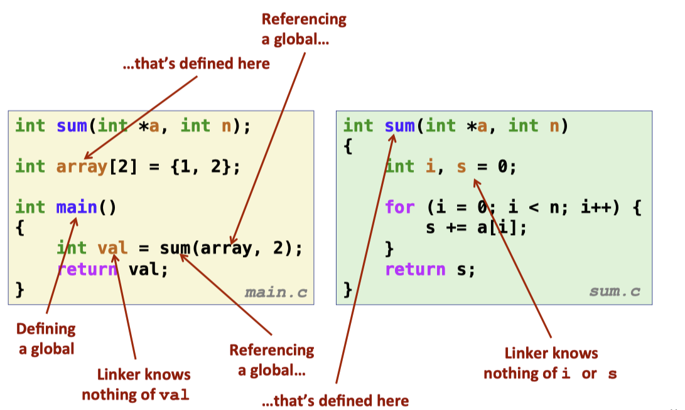

<p align="center">This figure comes from <a href = "https://www.cs.cmu.edu/afs/cs/academic/class/15213-f15/www/lectures/13-linking.pdf">cmu-213 slide</a></p>

If the linker in unable to find a definition for the referenced symbol in any of its input modules, it prints an (often crypic) error message and terminates.

At compile time, the compiler exports each global symbol to the assembler at either `strong `or `weak`, and the assembler encodes this information implicitly in the symbol table of the relocatable object file. **Functions and initialized global variables get strong symbols.** Uninitilized global variables get weak symbols.

Linux linker use the following rules for dealing with duplicate symbol names:

>1. Multiple strong symbols with the same names are not allowed.
>   + Each item can be defined only once
>
>2. Given a strong symbol and multiple weak symbols, choose the strong symbol
>   + References to the weak symbol resolve to the strong symbol
>
>3. Given multiple weak symbols with the same name, pick an arbitrary one.

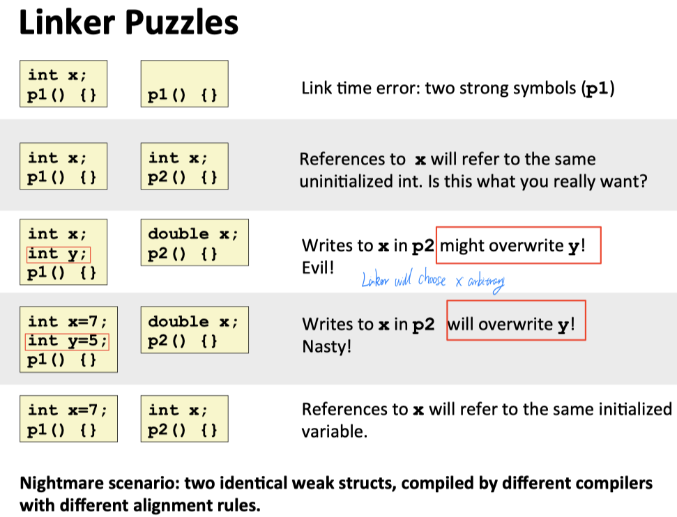

<p align="center">This figure comes from <a href = "https://www.cs.cmu.edu/afs/cs/academic/class/15213-f15/www/lectures/13-linking.pdf">cmu-213 slide</a></p>

## Linking with Static Library

In practice, all compilation systems provides a mechanism for packaging related object modules into a single file called a static library, which can then be supplied as input to the linker. When it builds the ouput executable, the linker copies only the object modules in the library that are referenced by the application program.

Related functions can be compiled into separate object modules and then packaged in a single static library by specifying a single filename on the command line. At the link time, the linker will only copy the object modules that are referenced by the program, which reduces the size of the executable on disk and in memory. On the other hand, the application programmer only needs to include the names of a few library files.

Specifically, on Linux system, static libraries are stored on disk in a particular file format known as an ***archive***. **An archive is a collection of concatenated relocateable object files**, with a header that describes the size of location of each member object file. Archive filenames are denoted with the `.a` suffix.

To enhance the linker, it tries to resolve unresolved external references by looking for the symbols in one or more archives. During the symbol resolution phase, the linker scans the relocatable object files and archives left to right in the same sequential order that they appear on the compiler driver's command line(The driver automatically translates any `.c` files on the command line into `.o` files).

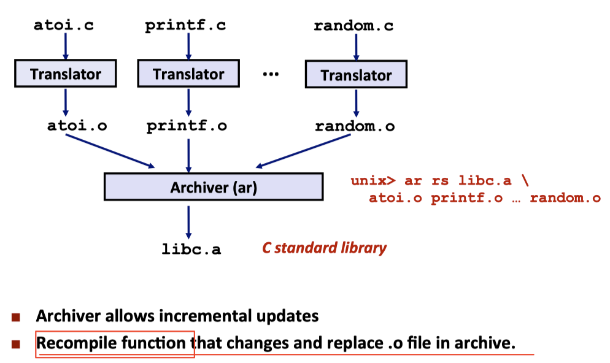

<p align="center">This figure comes from <a href = "https://www.cs.cmu.edu/afs/cs/academic/class/15213-f15/www/lectures/13-linking.pdf">cmu-213 slide</a></p>

During the scan, the linker maintains:

+ A `set E` of the relocatable object file that will be merged to form the executable.

+ A `set U` of unresolved symbols(symbols referred to but not yet defined).
+ A `set D` if symbols that have been defined in previous input files.
+ Initially, E, U and D are empty.

For each input file `f` on the command line, the linker determines if `f` is an object file or an archive. If `f` is an object file, the linker adds `f` to `E`, updates `U` and `D` to reflect the symbol definitions and references in `f`, and proceeds to the next input file;

**If `f` is an archive, the linker attempts to match the unresolved symbols in `U`  againts the symbols defined by the members of the archive.** If some archive member `m `defines a symbol that resolves a reference in `U`, then `m` is added to `E`, and the linker updates `U` and `D` to reflect the symbol definitions and references in `m`. **This process iterates over the member object files in the archive until a fixed point is reached where `U` and `D` no longer change.** At this point, any member object file not contained in `E` are simply discarded and the linker proceeds to the next input file.

If `U` is nonempty when the linker finishes scanning the input files on the command line, it prints on error and termintates. Otherwise, it merges and relocates the object files in `E`  to build the output executable file.

**Note that the ordering of libraries and object files on the command line is significant.** If library that defines a symbol appears on the command line before the object file that references that symbol, then the reference will not resolved and linking will fail.

The general rule for libraries is to place them at the end of the command line of any order when the member of the different libraries are independent. On the other hand, **the libraries are not independent, then they must be ordered** so that for each symbol `s` that is referenced externally by a member of an archive, at least one definetion of `s` follows a reference to `s` on the command line.

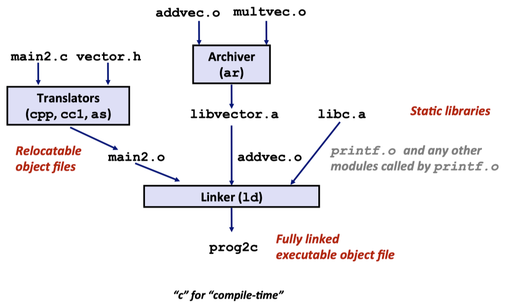

<p align="center">This figure comes from <a href = "https://www.cs.cmu.edu/afs/cs/academic/class/15213-f15/www/lectures/13-linking.pdf">cmu-213 slide</a></p>

## Relocation

Once the linker has completed the symbol  resolutions steps, it has associated each symbol reference in the code with exactly one symbol definition. At this point, the linker knows the exact sizes of the code and data sections in its input object modules.

In the relocation step, the linker merges the input modules and assigns run-time addresses to each symbol.

**Relocation consists of two steps:**

1. **Relocating sections and symbol definitions**:Merge multiply symbol from the same type into one and generate one unique address at run-time

   In this step, the linker **merges all sections of the same type** into a new aggregate section of the same type. For example, `.data` sections from the input modules are all merged into one section that will the `.data` section for the output executable object file. The linker then **assigns run-time memory addresses to the new aggregate sections**, to each section defined by the input modules, and to each symbol defined by the input modules. **When this step is complete, each instruction and global variable in the program has a unique run-tim memory address.**

2. **Relocating symbol references within sections**: point to the correct run-time address

   In this step, the linker **modifies every symbol reference** in the bodies of the code and data sections so that **they point to the correct run-time address.** To perform this, the linker reiles on data structures in the relocatable object modules known as relocation entries.

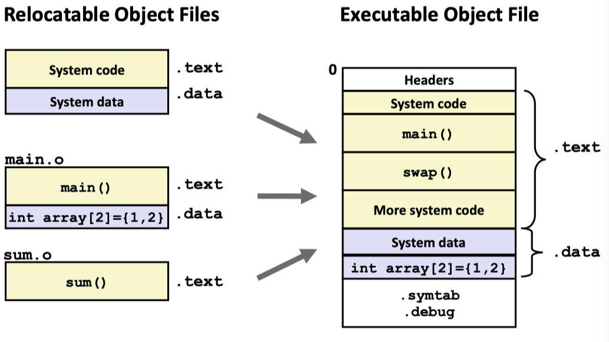

<p align="center">This figure comes from <a href = "https://www.cs.cmu.edu/afs/cs/academic/class/15213-f15/www/lectures/13-linking.pdf">cmu-213 slide</a></p>

### Relocation Entries

When an assember generates an object module, it does not know where the code and data will ultimately be stored in memory. Nor does it know the locations of any externally defined function or global variables that are referenced by the module. So **whenever the assembler encounters a reference to an object whose ultimate location is unknow, it genereate a *relocation entries*** that tells the linker how to modify the reference when it merges the object file into an executable. **Relocation entries for code are places in `.rel.text`. Relocation entries for data are placed in `.rel.data`**.

**The format of ELF relocation entry:**

```c
typedef struct{
  long offset;		// Offset of the reference to relocate
  long	type:4,	    	// Relocation type
  	binding: 4;	// Symbol table index
  long addend;		// Constant part of the relocation expression
} Elf64_Rela;
```

+ The `offset `is the setion offset of the reference that will need to be modified.
+ The `symbol` identifies the symbol that the **modified reference should point to**.
+ The `type `tells the linker **how to modify the new reference**.
+ The `addend `is a signed constant that is used by some types of **relocations to bias the value of the modified reference**.
+ `R_X86_64_PC32`: Relocate a reference that uses a **32-bit PC-relative address**.(Recall that when CPU executes an instruction using PC-relative addressing, it forms the effective address by adding the 32-bit value)
+ `R_X86_64_32`: Relocate a reference that uses a **32-bit absolute address**. With absolute addressing, the CPU directly uses the 32-bit value encoded in the instruction as the effective address, without further modification.

Note that `R_X86_64_PC32` and `R_X86_64_32` supports the X86-64 small code module, which assumes that the total size of the code and data in the executable object ile is smaller than 2GB. **The small code model is the default for GCC.**

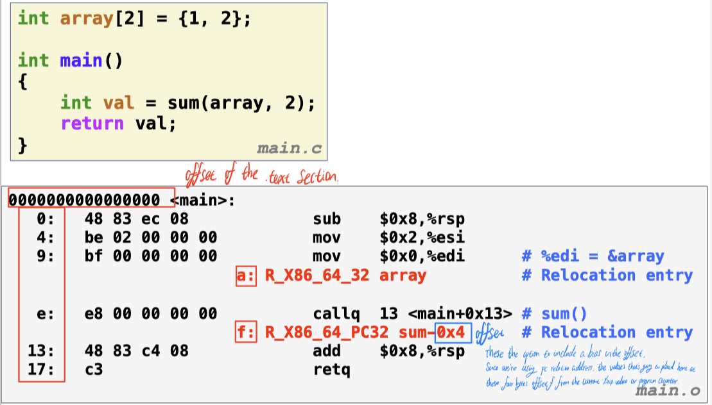

<p align="center">This figure comes from <a href = "https://www.cs.cmu.edu/afs/cs/academic/class/15213-f15/www/lectures/13-linking.pdf">cmu-213 slide</a><br>This is the option to include a bias in the offset. Since we're using the relative address of program counter, the values that going to placed here at these four bytes offset f from the current %rip value or program counter</p>

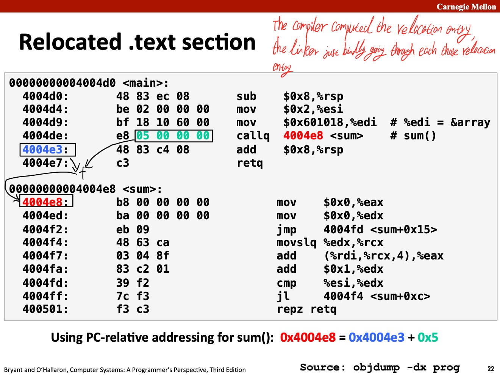

<p align="center">This figure comes from <a href = "https://www.cs.cmu.edu/afs/cs/academic/class/15213-f15/www/lectures/13-linking.pdf">cmu-213 slide</a></p>

## The format of Executable Object Files(EOF) file

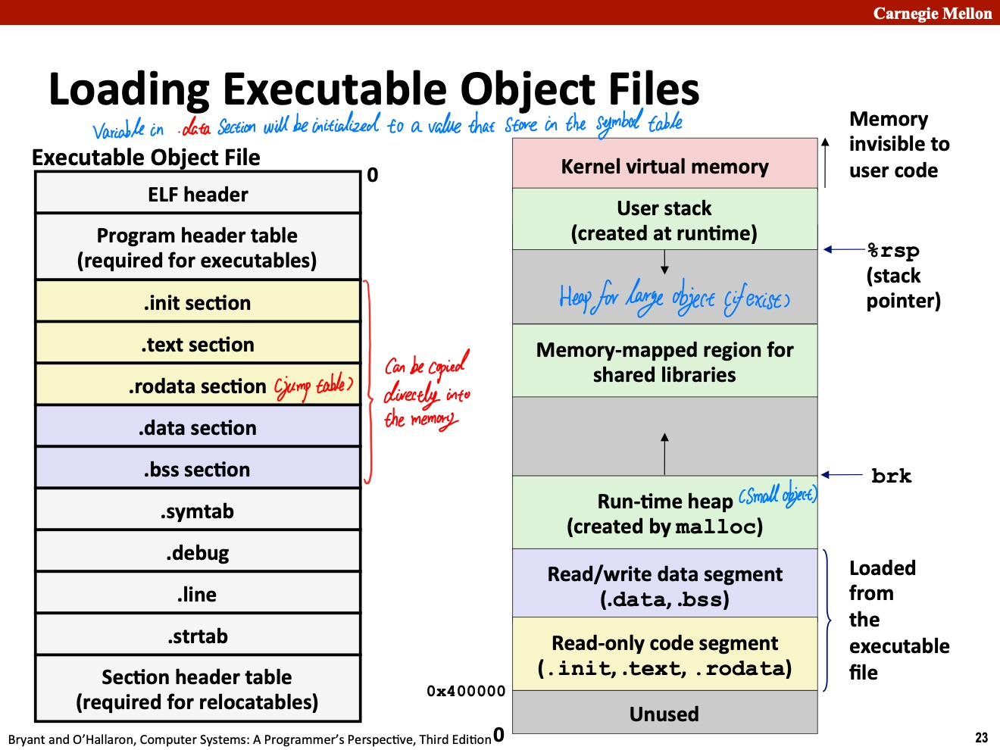

<p align="center">This figure comes from <a href = "https://www.cs.cmu.edu/afs/cs/academic/class/15213-f15/www/lectures/13-linking.pdf">cmu-213 slide</a></p>

+ The `ELF header `describes the overall format of the file. It also includes the program's ***entry point***, which is the address of the first instruction to execute when the program runs.
+ The `.text`, `.rodata` and `.data` section are relocated to eventual run-time memory address
+ The `.init `section defines a small function, called `_init`, that will be called by program's initialization code.

**Note that since the executable is *fully linked*(relocated), it need no `.rel` section. The `.symtab` section will not be loaded into memory, but still on disk. **

To run the executable object file in the shell, it invoke some memory resident operating system code known as the **loader**. The loader copies the code and data in the executable object file from disk into memory and then runs the program by jumping to its first instruction, or ***entry point***.

When the loader runs, it creates a memory image just like the right part of figure above. Guided by the **program header table**, it copies chunks of the executable object file into the code and data segments.

Next, the loader jumps to the program's entry point, which is always the address of the `_start` function. This function is defined in the system object file `crt1.o` and is the same for all C programs. The `_start` function calls the ***system startup function***, `__libc_start_main`, which defined in `libc.so`. It initializes the execution environment, calls the user-level main function, handles its return value, and if necessary returns control to the kernel.

## Dynamic Linking with Shared Libraries

A shared library is an object that, **at either run time or load time**, can be loaded at arbitrary memory address and **linked with a program in memory**. This process is known as ***dynamic linking*** and is performed by a program called a ***dynamic linker***. Shared library are also referred as shared objects, and on Linux system they are indicated by the `.so` suffix. Microsoft operating system make heavy use of shared libraries, which they refer to as `DLLs`(dynamic link libraries).

Linking of references to shared library object is deffered until the program is actually loaded into the memory. But it can also happened at runtime, where the application requests the dynamic linker to load and link shared library without having to link in the applications against at the compile time. In that case, program can arbitrarily decided to load a function(after program has begun) that is decleard in a shared library, where, in Linux, this is done by calls to the `dlopen()` interface.

Shared libraries are **"shared"** in two different ways:

1. In any given file system, there is **exactly one `.so` file for a paricular library**. The code and data in this `.so` file are **shared by all executable object files** that reference the library.
2. A single copy of the `.text` section of a shared library in memory can be **shared by different running processes**.

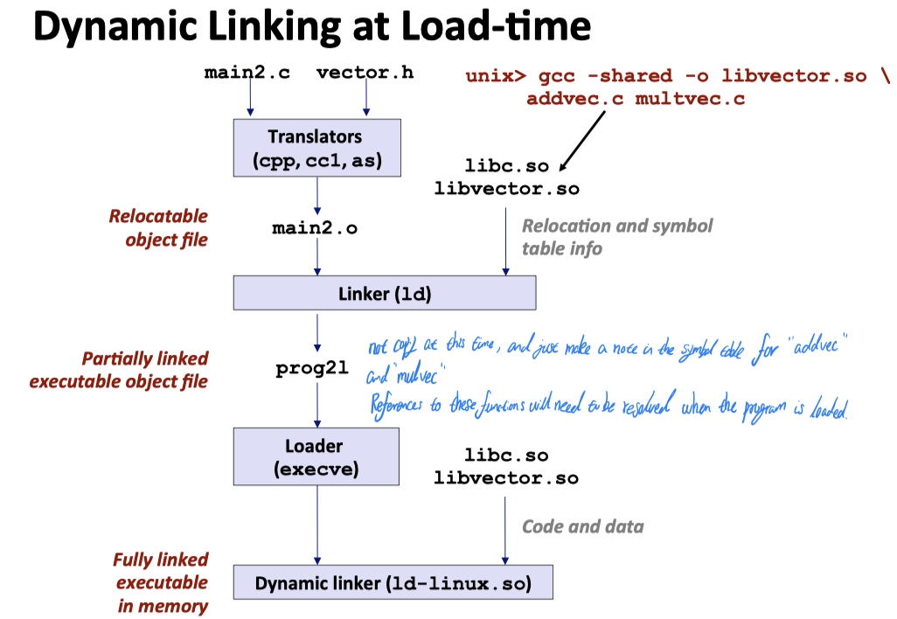

Like the picture above, the basic idea is to do some of **the linking statically** when the executable file is created, and then **complete the linking process dynamically when the program is loaded**. It is important to realize that none of the code or data sections from lib vector.so are actually copied into the executable program at this point. Instead, the linker copies some relocation and symbol table information that will allow references to code and data in lib vector.so to be resolved at load time.

When the loader loads and runs the executable probram, **it loads the partially linked executable programing, using program's entry point**. Next, it notices that program contains a `.interp` section, which contains the path name of the dynamic linker, which is itself a shared object. Instead of passing control to the application, the loader loads and run dynamic linker.

The dynamic linker then finishes the linking tash by performing following relocations:

+ Relocating the text and data of `libc.so` into some memory segment.
+ Relocating the text and data of `.libvector.so` into another memory segment.
+ Relocating any references in program to symbol table by `libc.so` and `libvector.so`.

Finally, the dynamic linker passes control to the application.

## Position-Independent Code(PIC)

Modern systems compile the code segments of shared modules so that they can be **loaded anywhere in memory without having to be modified by the linker**. With this approach, a single copy of a shared module's code segment can be **shared unlimited number of processes**.(Of course, each process will still get its own copy of the read/write data segment). Code that can be loaed without needing any relocations is known as ***position-independent code***(PIC).

On x86-64 systems, **references to symbols in the same executable object module require no special treatment to be PIC**. These references can be compiled using **PC-relative addressing** and **relocated by the static linker** when it builds the object file.

For the global variable, no matter where we load an object module(including shared object module) in memory, the data segment is always the same distance from the code segment. Thus, **the distance between any instruction in the code segment and any variable in the data segment is a run-time constant**, independent of the absolute memory locations of the code and data segments. Comiler that want to **generate PIC references to global variable** exploit this fact by creating a table called the ***global offset table(GOT)*** at the begining of the data segment.

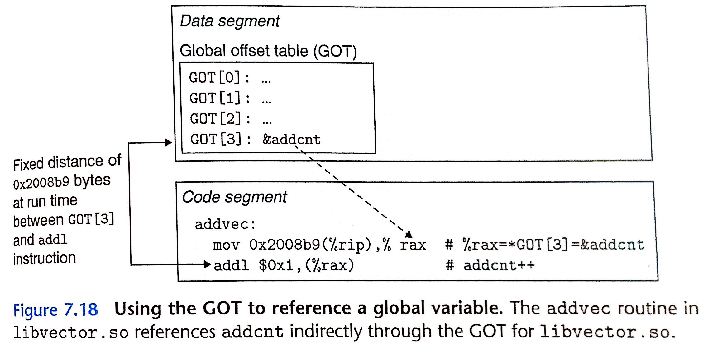

<p align="center">GOT table, this figure is from the book <a href = "http://csapp.cs.cmu.edu/3e/home.html">CS:APP3e</a>  chapter 7</p>

The GOT contains an 8-bytes entry for each global data of the data object(procedural or global variable) that is referenced by the object module. The compiler also generates a relocation record for each entry in the GOT. At load time, the dynamic linker relocates each GOT entry so that it contains the absolute address of the object. Each object module that references global objects has its own GOT.

### PIC Function Call

Suppose that a program calls a function that is defined by a shared library. The normal approach would be to generate a relocation record for the reference, which **the dynamic linker could then resolve when the program was loaded**. GNU compilation systems solve this program using a ***lazy binding***, where it defers the binding of each procedure address until the ***first time*** the procedure is called. 

The motivation for **lazy binding** is that a typical application program will **call only a small part** of the hundreds or thousands of functions exported by a shared library such as `libc.so`. By deferring the resolution of a function's address until it is actually called, the dynamic linker can avoid hundreds or even thousands of unnecessary relocations at load time. There is a nontrival run-time overhead the first time the function is called, but each call thereafter cost only a single instruction and a memory reference for the indirection.

The lazy binding implemented with a compact yet somewhat complext interaction between two data structures: 

+ ***the procedure linkage table(PLT)***: The PLT is an array of `16-byte` code entries. 

  + `PLT[0]` **is a special entry that jumps into the dynamic linker**. Each shared library function called by the executable has its own PLT entry. Each of these entries is responsible for invoking a special function. 
  + `PLT[1]` invokes **the system startup function**(`__libc_start_main`), which 
    1. initializes the execution environment;
    2. calls the main function;
    3. handle its return value.

  + Entries starting at `PLT[2]` invoke functions called by the user code.

+ The GOT: GOT is an array of `8-byte` address entries. When used in conjunction with the **PLT**, 
  + `GOT[0]` and `GOT[1]` contain information that the dynamic linker uses when it resolves function address.
  + `GOT[2]` is the entry point for the dynamic linker in the `ld-linux.so`.
  + Each of the **remaining entries corresponds** to a called function whose **address need to be resolved at run time**, where each has a matching PLT entry. **Initially, each GOT entry points to the second instruction in the corresponding PLT entry.**

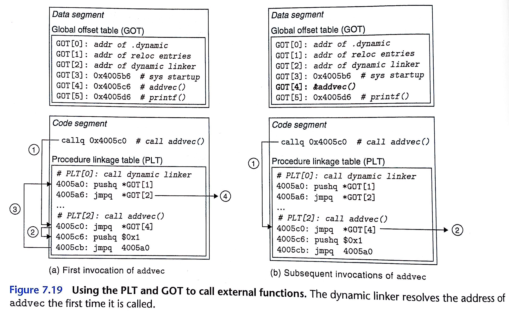

<p align="center">Using the PLT and GOT call external functions, this figure is from the book <a href = "http://csapp.cs.cmu.edu/3e/home.html">CS:APP3e</a>  chapter 7</p>

Figure 7.19(a) shows hot the GOT and PLT work together to lazily resolve the run-tim address of function `addvec` the first fime it is called:

1. Instead of directly calling `addvec`, the program calls into `PTL[2]`, which is the `PLT `entry for `addvec`.

2. The **first PLT instruction** does an indirect jump through `GOT[4]`. Since each GOT entry initially points to the second instruction in its corresponding PLT entry, the indirect jump simply transfer control back to the next instruction `PLT[2]`.

3. After pushing an ID  for `addvec`(0x1) on to the stack, `PLT[2]` jumps to `PLT[0]`.

4. `PLT[0]` pushes an argument for the dynamic linker indirectly through `GOT[1]` and then jumps into the dynamic linker indirectly through `GOT[2]`. 

   The dynamic linker uses the two stack entries to determine the runtime location of `addvec`, overwrite `GOT[4]` with this address, and pass the control to `addvec`.

Figure 7.19(b) shows the control flow for any subsequent invocations of `addvec`:

1. Control passes to `PLT[2]` as before.
2. However, this time the indirect jump through `GOT[4]` transfers control directly to `addvec`.
